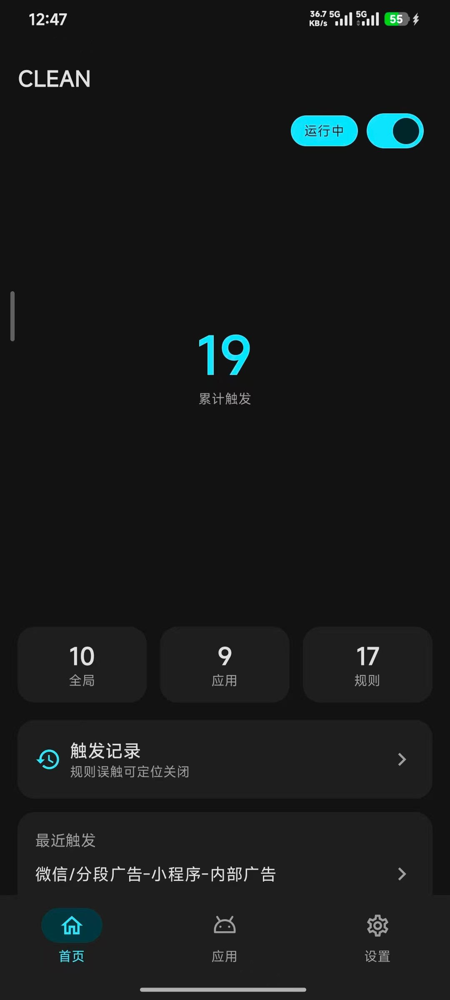
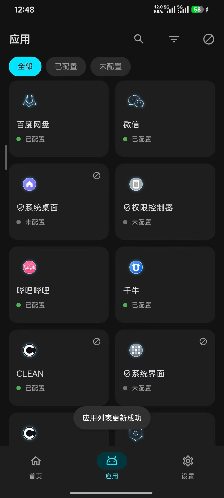
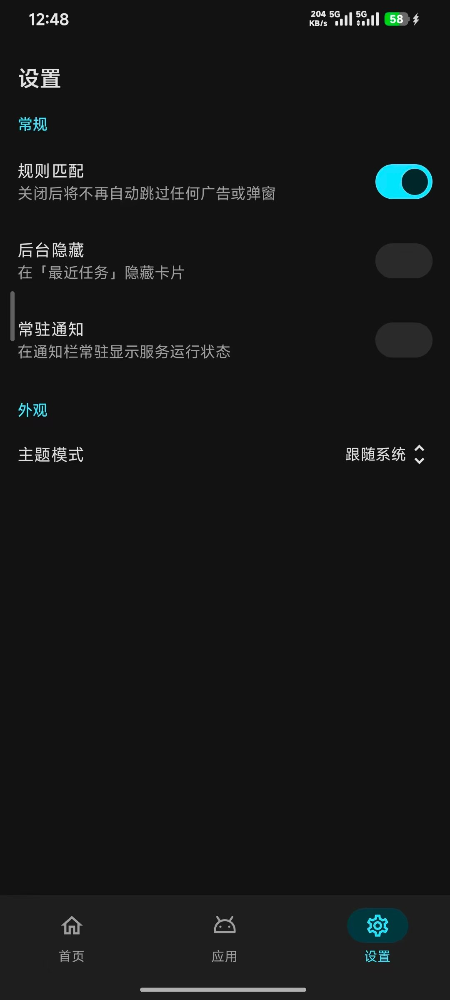
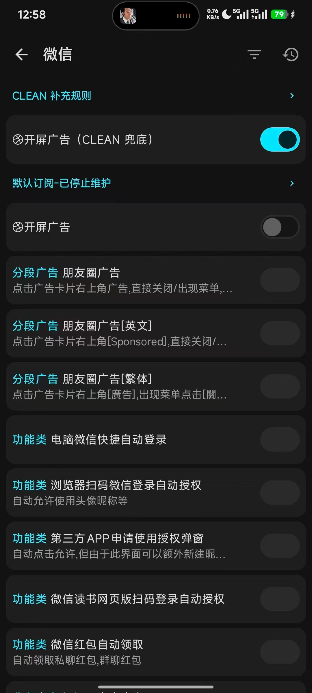

# CLEAN

自动跳过**开屏广告**与**弹窗广告**的 Android 应用。

装上、授权、激活，然后用你的手机就行 —— **不需要配置任何规则**。

## 下载

| 文件 | 说明 |
| --- | --- |
| [`dist/CLEAN-free-1.0.0.apk`](dist/) | **free 版**：由 `-PCLEAN_FREE=true` 构建，激活门禁关闭，装完即可用，无需激活码 |

- 需要激活码的版本仍然是不加参数构建：`./gradlew :clean-app:assembleRelease`（两种包出自同一份代码）。
- 两个包共用包名 `com.clean.click`。**签名不同就无法互相覆盖安装**，切换前需先卸载，会丢本地设置。

## 截图

| 首页 | 应用列表 |
| --- | --- |
|  |  |

| 设置 | 应用规则 |
| --- | --- |
|  |  |

## 功能

- **自动跳过开屏广告**：App 启动时自动点掉「跳过」
- **自动关闭弹窗广告**：弹窗出现时自动点掉关闭按钮
- **首页数据仪表盘**：累计触发次数，以及「全局 / 应用 / 规则」三项统计；一眼看到最近一次触发发生在哪个应用的哪条规则
- **应用列表**：双列网格，绿点表示「已配置」、灰点表示「未配置」，可按状态筛选
- **触发记录**：每次自动点击的记录；顶部还会显示「最近未触发的规则」，直接告诉你某条规则卡在了什么状态（如「超出匹配时间」）
- **节点审查**：查看当前屏幕的无障碍节点树，用于定位「规则为什么没匹配上」
- **设置**：规则匹配总开关、后台隐藏、常驻通知、主题模式

## 使用

1. 安装后，按引导开启**无障碍服务**（这是拦截广告所必需的权限）
2. 输入**激活码**完成激活
3. 无需其它配置。规则随包内置，联网时会自动更新

如果发现某个广告没被跳过，请依次看：

- 首页「触发记录」→ 顶部「最近未触发的规则」，看规则卡在了什么状态
- 触发记录页右上角的「节点审查」，看该界面到底有哪些节点

## 关于规则来源（如实说明）

- CLEAN 的规则主要来自上游开源订阅 `@gkd-kit/subscription`。**该订阅的正文自称「默认订阅-已停止维护」**，即上游已不再更新它。
- 因此 CLEAN 额外内置了两样东西，以降低「规则失效后无人可拦」的风险：
  - **随包兜底规则**：首次安装即使没有网络也有规则可用；上游 CDN 不可用时也不至于完全失效
  - **CLEAN 补充规则**：上游把开屏广告的通用兜底对约 107 个应用显式关闭了（前提是这些应用各有专属规则）。CLEAN 为这些应用补了一条更严格的兜底，且要求节点可点击、文案长度受限，以降低误触风险
- 联网正常时仍以网络订阅为准，随包内容只在「本地没有」或「随包版本更新」时生效

## 隐私

- 无需注册或登录
- **不收集、不上传**任何屏幕内容、应用列表或使用数据
- 无障碍节点数据仅在本机内存中用于规则匹配，不写入文件、不发送到任何服务器
- 唯一会联网的行为是**更新规则订阅**

## 捐赠

如果 CLEAN 对你有用，可以扫码支持：

<p align="center">

</p>

## 开源与致谢

本项目基于 [GKD](https://github.com/gkd-kit/gkd) 二次开发，遵循 **GPL-3.0-only** 许可（见 [LICENSE](/LICENSE)）。

感谢上游作者与社区：

- [gkd-kit/gkd](https://github.com/gkd-kit/gkd) —— 本项目的上游
- [gkd-kit/subscription](https://github.com/gkd-kit/subscription) —— 规则订阅
- [gkd-kit/inspect](https://github.com/gkd-kit/inspect) —— 节点审查工具的思路来源
- [lisonge/kotlin-json5](https://github.com/lisonge/kotlin-json5)、[priv-kit/priv-kit](https://github.com/priv-kit/priv-kit) 等衍生库

## 免责声明

本项目仅供学习交流。请遵守当地法律法规与各应用的服务条款，不得用于任何非法用途。

---

<details>
<summary>开发者：项目结构（点击展开）</summary>

| 目录 | 说明 |
| --- | --- |
| `clean-app/` | Android 主应用（`applicationId = com.clean.click`） |
| `clean-selector/` | 选择器解析与匹配引擎 |
| `clean-db/` | Room 数据库 |
| `clean-hidden-api/` | 隐藏 API 访问 |
| `clean-app/src/main/assets/gkd-fallback.json5` | 随包兜底规则（上游订阅快照） |
| `clean-app/src/main/assets/clean-rules.json5` | CLEAN 自有补充规则（本地订阅内容） |

构建：

```bash
# debug
./gradlew :clean-app:assembleDebug

# release（需要外部提供签名，不会回退到 debug 签名）
GKD_STORE_FILE=/path/to/keystore.jks \
GKD_STORE_PASSWORD=... \
GKD_KEY_ALIAS=... \
GKD_KEY_PASSWORD=... \
./gradlew :clean-app:assembleRelease
```

测试：

```bash
./gradlew :clean-app:testDebugUnitTest :clean-selector:jvmTest
```

> **从仓库直接 clone 无法编译**：激活密钥 `clean-app/src/main/kotlin/com/clean/click/activation/ActivationSecret.kt`
> 是本项目的私有密钥，**刻意不入库**。自行编译前需要补上该文件（内容为 `object ActivationSecret { fun key(): ByteArray }`）。
> free 版同样需要它才能编译——`-PCLEAN_FREE=true` 只关闭运行期的门禁，不改变编译依赖。

</details>
