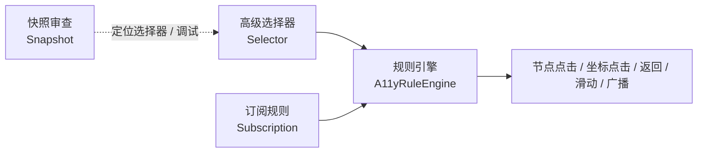

# 项目概览

> 本文档基于仓库快照 `71e57de`（应用版本 `1.12.1` / `versionCode 92`）整理，所有结论均来自仓库内源码与构建脚本。

## 1. 一句话定位

**GKD 是一个基于「高级选择器 + 订阅规则 + 快照审查」的自定义屏幕点击 Android 应用。**

它通过用户导入或订阅的规则，在指定界面满足指定条件（例如屏幕上存在特定文字、某个节点可点击）时，自动点击特定节点或坐标，或执行返回、滑动、广播等操作。



## 2. 它解决什么问题

| 场景 | 说明 | 典型例子 |
| --- | --- | --- |
| 快捷操作 | 简化一些重复的流程 | 某些软件自动确认电脑登录 |
| 跳过流程 | 越过启动时烦人的流程 | 点击跳过启动流程 |

GKD 本身**不内置任何规则**，规则来自：

- 用户本地手动编写 / 导入的本地规则；
- 远程订阅链接（第三方订阅，见 `#gkd-subscription` topics）；
- 通过 [subscription-template](https://github.com/gkd-kit/subscription-template) 构建的自有订阅。

## 3. 三大支柱概念

### 3.1 高级选择器

一个类似 CSS 的选择器语言，能力上超出 CSS：既能按属性匹配单个节点，也能沿节点树的父子、兄弟关系回溯上下文，因此可以表达「在 id 为 `menu_container` 的兄弟节点里找文本以『广告』开头的节点」这类结构化条件。

```text
@[vid="menu"] < [vid="menu_container"] - [vid="dot_text_layout"] > [text^="广告"]
```

选择器被实现为独立的多平台模块 `clean-selector`，同时编译为 Android/JVM 可用的 Kotlin 库和发布到 npm 的 `@gkd-kit/selector` 包。详见 [03-selector-engine.md](03-selector-engine.md)。

### 3.2 订阅规则

规则以订阅为单位分发，订阅内部按「应用组 / 全局组 → 分类 → 规则组 → 规则 → 动作」分层，用户可对任意层级启停、排除。规则来源为 JSON5 格式的远程文件，本地以「文件 + 数据库」双落盘保证一致性。详见 [05-subscription-and-rules.md](05-subscription-and-rules.md)。

### 3.3 快照审查

GKD 可以把当前界面的节点树与截图保存为「快照」，用于离线分析、编写选择器、上报问题。选择器路径视图可以直接在快照上验证匹配结果，这也是 GKD 生态中 `gkd-kit/inspect` 的基础。详见 [04-automation-runtime.md](04-automation-runtime.md) 与 [06-data-layer.md](06-data-layer.md)。

## 4. 运行前提

GKD 的自动化能力依赖以下 Android 能力中的一种或多种，具体取决于使用的功能：

| 能力 | 获取方式 | 作用 |
| --- | --- | --- |
| 无障碍服务 | 系统设置中手动开启 | 读取节点树、事件订阅、执行点击/手势（`a11y_info.xml` 声明 `canRetrieveWindowContent`、`canPerformGestures`、`canTakeScreenshot`） |
| 特权进程 | Shizuku 或 Root 启动嵌入式 `UserService` | 绕过无障碍限制的能力：跨用户查询、窗口/输入/包管理隐藏 API、直接截图等 |
| 媒体投影 | 系统弹窗授权 | 截图快照（`MediaProjection`） |
| 悬浮窗 / 通知 | 系统授权 + 前台服务 | 保活悬浮窗、状态通知、快捷开关 |
| 写入安全设置 | `WRITE_SECURE_SETTINGS`（特权授予） | 读写无障碍服务开关等系统状态 |

详细的特权链路见 [07-privilege-layer.md](07-privilege-layer.md)。

## 5. 平台与分发

| 项 | 值 | 来源 |
| --- | --- | --- |
| 应用 ID | `li.songe.gkd`（debug 变体为 `li.songe.gkd.debug`） | `clean-app/build.gradle.kts` |
| namespace | `li.gkd.app` | 同上 |
| minSdk | 26（Android 8.0） | 根 `build.gradle.kts` `Cfg` |
| compileSdk / targetSdk | 37 | 同上 |
| buildToolsVersion | `37.0.0` | 同上 |
| ABI | `arm64-v8a`、`x86_64` | `clean-app/build.gradle.kts` |
| 渠道 | `gkd`（默认）、`play` | productFlavors |
| 许可 | GPL-3.0-only | `LICENSE` |

`gkd` 与 `play` 渠道的差别由 `resValue("bool", "is_accessibility_tool", ...)` 体现：`gkd` 渠道标记为无障碍工具（`true`），`play` 渠道为 `false`。此外 `play` 渠道不包含更新检查（`AppMeta.updateEnabled` 仅在 `channel == "gkd"` 时为真）。

分发渠道：官网 gkd.li、Google Play、GitHub Releases。

## 6. 仓库结构

```text
gkd-main/
├── clean-app/            Android 应用（Kotlin + Jetpack Compose），379 个 .kt
├── clean-db/             Room 数据库多平台模块，21 个 .kt + 16 份 schema
├── clean-selector/       选择器引擎（Kotlin Multiplatform + npm 包），54 个 .kt
├── clean-hidden-api/     Android 隐藏 API 的 Java 存根（29 个 .java）
├── buildSrc/           Gradle 约定插件与代码生成任务
├── gradle/             libs.versions.toml 版本目录 + wrapper
├── docs/               本套项目文档
├── AGENTS.md           仓库级硬性编码约定（必读）
├── clean-app/ARCHITECTURE.md   clean-app 内部分层与写入边界
├── clean-app/STRINGS.md        UI 文案维护规范
├── clean-selector/README.md    选择器包的公开 API 文档
├── CHANGELOG.md        更新内容（Release body）
└── .github/workflows/  CI：构建 APK、发布 Release、发布 npm 包
```

### 代码规模

| 模块 | Kotlin 文件 | 说明 |
| --- | --- | --- |
| `clean-app/src/main` | 349 | 应用主体 |
| `clean-app/src/test` | 30 | JVM 单元测试（无 `androidTest` 目录） |
| `clean-selector/src` | 54 | 含 12 个测试文件 |
| `clean-db/src` | 21 | 含 2 个 jvmTest |
| `buildSrc/src` | 8 | 构建逻辑 |

`clean-app` 内部包规模（文件数）：

| 包 | 文件 | 职责 |
| --- | --- | --- |
| `ui` | 134 | Compose 页面、组件、样式 |
| `feature` | 47 | 功能页面 + ViewModel |
| `data` | 41 | 持久化、网络、订阅、备份 |
| `util` | 33 | 工具函数 |
| `priv` | 24 | 特权进程与隐藏 API 适配 |
| `service` | 20 | Android 系统组件 |
| `domain` | 9 | 纯业务规则 |
| `a11y` | 7 | 无障碍运行时 |
| `platform` | 7 | 平台能力统一入口 |
| `permission` | 7 | 权限请求协调 |
| `notif` | 5 | 通知 |
| `entry` | 4 | 外部入口 Activity |
| `snapshot` | 4 | 快照文件事务 |
| `store` | 2 | 设置存储 |
| `core` | 1 | 跨层基础类型 |

## 7. 技术栈速览

| 领域 | 选型 | 版本 |
| --- | --- | --- |
| 语言 / 构建 | Kotlin Multiplatform, Gradle + AGP | Kotlin 2.4.20, AGP 9.4.1, Gradle 9.7.1 |
| UI | Jetpack Compose + Material3 + Navigation3 | Compose 1.12.1, Material3 1.4.0, Navigation3 1.1.7 |
| 数据库 | Room3（KMP）+ SQLite | Room 3.0.3, SQLite 2.7.1 |
| 网络 | Ktor（client + 嵌入式 server） | 3.6.0 |
| 序列化 | kotlinx.serialization + JSON5 | 1.11.0 / json5 0.8.0 |
| 特权 | Shizuku API + priv-kit + HiddenApiBypass | 13.1.5 / 0.16.1 / 6.1 |
| 图片 | Coil3 + telephoto | 3.6.3 / 0.19.0 |
| 分页 | Paging3 | 3.5.1 |
| 选择器 Web 端 | Kotlin/JS + regex-wasm | selector 0.6.0 |

完整依赖清单见 [gradle/libs.versions.toml](../gradle/libs.versions.toml)，构建细节见 [09-build-and-release.md](09-build-and-release.md)。

## 8. 文档地图

| 文档 | 内容 |
| --- | --- |
| [01-overview.md](01-overview.md) | 本文：定位、概念、平台、规模 |
| [02-architecture.md](02-architecture.md) | 模块划分、分层依赖、数据流、并发模型 |
| [03-selector-engine.md](03-selector-engine.md) | 选择器语法、解析、匹配、类型校验、npm 发布 |
| [04-automation-runtime.md](04-automation-runtime.md) | 无障碍/自动化运行时、系统组件、通知、快照捕获 |
| [05-subscription-and-rules.md](05-subscription-and-rules.md) | 订阅模型、规则层级、启用策略、持久化 |
| [06-data-layer.md](06-data-layer.md) | Room 表结构、迁移、设置、备份、日志 |
| [07-privilege-layer.md](07-privilege-layer.md) | 特权进程、Shizuku、隐藏 API 适配与异常边界 |
| [08-ui-layer.md](08-ui-layer.md) | Compose 导航、页面地图、组件与状态规范 |
| [09-build-and-release.md](09-build-and-release.md) | 变体、签名、代码生成、CI 与发布流程 |
| [10-conventions.md](10-conventions.md) | 编码约定、测试策略、协作规则 |

## 9. 免责声明

本项目遵循 GPL-3.0-only 开源，**项目仅供学习交流，禁止用于商业或非法用途**。GKD 的规则由第三方订阅作者提供，与 GKD 项目本身无隶属关系；使用前请确认目标应用的服务条款与当地法律法规。
