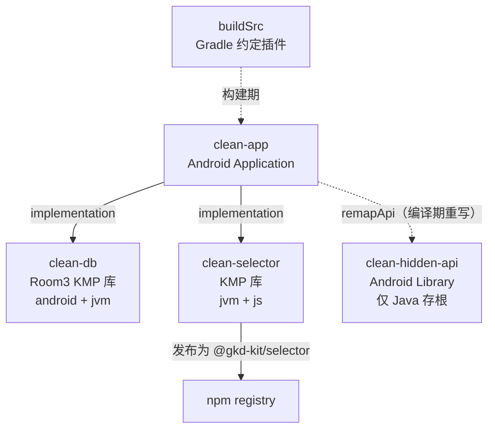
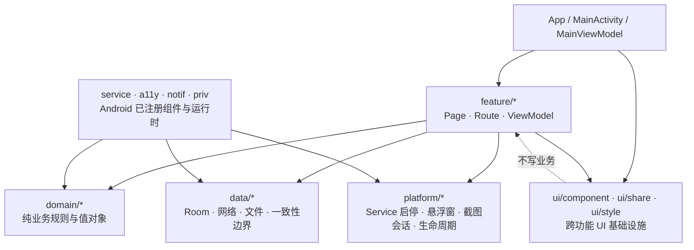
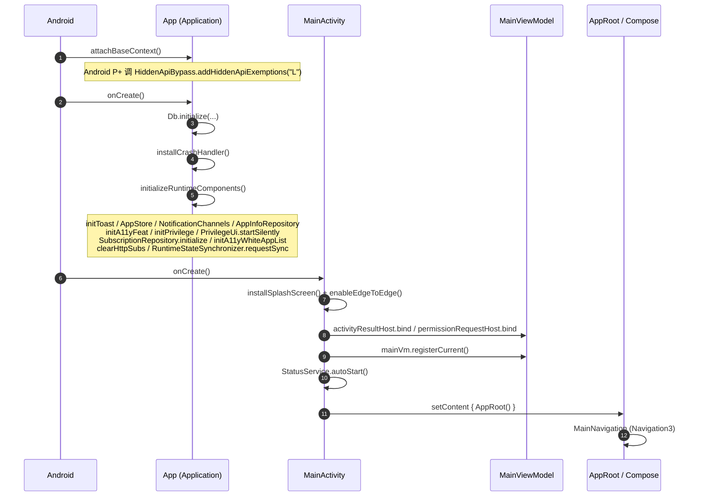
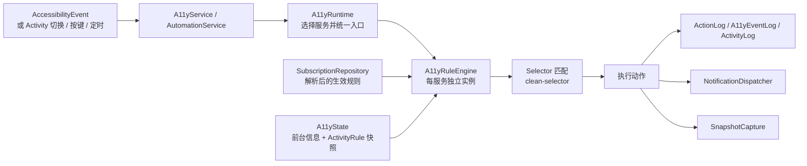
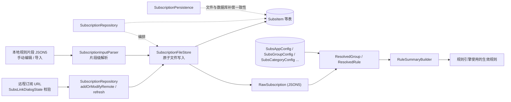

# 整体架构

> 本文档描述模块划分、分层依赖、运行时数据流与并发模型。
> `clean-app/ARCHITECTURE.md` 是 `clean-app` 内部层级的设计基线，本文在其之上补充跨模块视角；两者冲突时以源码为准。

## 1. 模块划分

Gradle 构建包含 4 个业务模块（`settings.gradle.kts`）：

| 模块 | 插件 | 目标 | 职责 | 对外可见性 |
| --- | --- | --- | --- | --- |
| `clean-app` | `com.android.application` + parcelize / serialization / compose / remap / codeorigin | Android only | 应用全部业务与 UI | `li.songe.gkd` |
| `clean-db` | `kotlin.multiplatform` + `com.android.kotlin.multiplatform.library` + `androidx.room3` + KSP | `android`、`jvm` | Room 实体、DAO、`AppDb`、迁移、订阅配置写事务 | `commonMain` 通过 `api` 暴露 Room runtime/paging/serialization |
| `clean-selector` | `kotlin.multiplatform`（`explicitApi()`） | `jvm`、`js(es2015, ESM, nodejs)` | 选择器解析、匹配、类型校验、语法高亮 | 严格显式 API + 生成的 TypeScript 声明 |
| `clean-hidden-api` | `com.android.library` | Android | Android framework 隐藏 API 的 Java 存根（`compileOnly` 语义） | namespace `hidden.api` |
| `buildSrc` | `kotlin-dsl` | JVM | 版本注入、代码生成、构建产物上传 | 仅构建期 |

### 1.1 模块间依赖的关键约定

- `clean-app` 是唯一的应用模块，**没有其他模块引用 `clean-app`**。因此 `clean-app` 内部禁止使用 `internal`（见 [10-conventions.md](10-conventions.md)）。
- `clean-hidden-api` 不是普通 `implementation` 依赖，而是通过 `remapApi(project(":clean-hidden-api"))` 引入：`clean-hidden-api` 用 `li.songe.remap` 注解与 processor 描述隐藏 API 的签名与版本，`clean-app` 在编译期由 remap 插件重写成可跨版本运行的调用代码。
- `clean-db` 的 `commonMain` 用 `api(...)` 暴露 Room 与序列化，`clean-app` 因此可以直接使用 `Db` 暴露的 DAO，而不需要再包一层容器。`Db` 通过 `Db.initialize(this, path)` 在 `App.onCreate` 中初始化。
- `clean-selector` 开启 `explicitApi()`，且被 `clean-app` 以项目依赖方式使用；同一份源码同时产出 npm 包供 Web 侧（快照审查工具）使用。

## 2. clean-app 内部分层

`clean-app` 采用「功能纵向切片 + 明确的数据和平台边界」：

| 包 | 文件数 | 职责 | 禁止依赖 |
| --- | --- | --- | --- |
| `app/`（`App.kt`、`MainActivity.kt`、`MainViewModel.kt`） | 3 | 进程与 Activity 生命周期入口；进程级唯一组件声明为 `object` | — |
| `core/` | 1 | 跨层共享、不依赖 Android UI 的基础状态与值类型（`Loadable`） | Android UI |
| `feature/` | 47 | 按用户功能组织 Page / Route / ViewModel / 功能内组件：`log`、`snapshot`、`subscription`、`settings` | — |
| `domain/` | 9 | 可独立验证的业务规则与值对象（如规则组启用策略） | Compose、Activity、Service、DAO |
| `data/` | 41 | 持久化、网络、文件及跨数据源一致性边界 | Compose |
| `platform/` | 7 | Android 平台能力统一入口（Service 启停、悬浮窗、截图会话、生命周期钩子） | 页面 ViewModel |
| `ui/component`、`ui/share`、`ui/style` | 134 | 跨功能复用的无业务写入 UI 基础设施 | 业务写入 |
| `service/`、`a11y/`、`notif/`、`priv/` | 56 | Android 已注册组件及其运行时实现 | 页面 ViewModel |
| `util/` | 33 | 工具函数与共享工具属性 | — |

> `service` 包名承载 Manifest、无障碍服务和快捷设置组件身份，**重命名会使系统授权或磁贴失效**，因此只迁移调用边界，不修改组件类名。

### 2.1 新代码放置规则

1. 新页面优先放入对应 `feature/<name>`；只有两个以上功能使用的纯 UI 才进入 `ui/component` 或 `ui/share`。
2. 跨页面业务判断进入 `domain`，并优先写纯函数行为测试。
3. 单表查询或写入直接使用对应 DAO，不新增一对一转发层；网络、文件、缓存、并发控制和跨表一致性操作进入 `data/<name>` 下职责明确的 Repository / Manager / Service。
4. Android 权限、Service、通知及系统 API 适配进入 `platform` 或保留在已注册组件包中，通过窄接口向上提供能力。
5. 进程级唯一且依赖固定的组件直接声明为 `object`；需要独立构造的可测实现保留在自己的业务包中。DAO 直接由 `Db` 提供，不通过容器重复暴露。

## 3. 启动流程

要点：

- `MainViewModel` 实例由 `MainActivity` 在**权限及 Activity Result 宿主绑定后、创建 Compose 界面前**注册；`MainViewModel.requireCurrent()` 供主界面调用链获取当前实例，ViewModel 清理时按实例身份清除引用。
- `requireCurrent()` 只用于已初始化的主界面调用链，不得用于 Service、后台任务或悬浮窗；一次操作获取一次实例并贯穿整个操作。
- `App.justStarted` 用 3 秒窗口（`START_WAIT_TIME`）判断「刚启动」，用于抑制启动期的通知/提示。
- 崩溃处理把 `CrashData` 落盘后重启自身（`startLaunchActivity()` + `PrivilegeOwnerLifecycle.prepareAppRestart()`），最后 `killProcess(myPid())`。

## 4. 核心运行时数据流

### 4.1 规则执行链路

- `A11yState` 在私有锁内更新前台信息和规则选择，并通过一个 `ActivityRule` 快照发布；涉及特权进程或 PackageManager 的阻塞查询通过 `A11yState.withTopActivityLock` 把查询、判断和更新放进同一临界区。
- `A11yRuntime` 统一选择自动化服务或无障碍服务，并提供根节点、窗口、截图和动作入口。每个服务保留独立的 `A11yRuleEngine`，事件、缓存和延迟任务跟随服务生命周期。
- 大量细节见 [04-automation-runtime.md](04-automation-runtime.md)。

### 4.2 订阅到生效规则

输入侧有两条独立路径，不要混淆（详见 [05-subscription-and-rules.md](05-subscription-and-rules.md)）：

- **远程订阅**：`SubsLinkDialogState` 用 `URLUtil.isNetworkUrl` 校验并去重链接 → `SubscriptionRepository.addOrModifyRemote` / `refresh` 下载 JSON5 文本。
- **本地规则片段**：`SubscriptionInputParser` 只做**片段级 JSON5 解析**（`parseApp` / `parseAppGroups` / `parseAppGroup` / `parseGlobalGroup`），它不处理 URL、剪贴板或 `gkd://`。
- `gkd://page...` 只用于应用内部导航（`AndroidManifest.xml` 的 `QS_TILE_URI` 等）；`i.gkd.li` 短链（`IMPORT_SHORT_URL`）只用于快照分享。

详见 [05-subscription-and-rules.md](05-subscription-and-rules.md)。

## 5. 状态与写入边界

| 场景 | 读取 | 写入 |
| --- | --- | --- |
| 设置 | `AppStore` 暴露的只读 `StateFlow` | `AppStore.update/replace`，并将自动化开关同步到特权进程生命周期配置 |
| 订阅 | `SubscriptionRepository.snapshotFlow`、`SubscriptionState` 派生状态、`Db.subsItemDao` 冷 `Flow` | `SubscriptionRepository` 编排用例；`SubscriptionPersistence` 保证文件与数据库补偿一致性；`SubscriptionFileStore` 负责原子文件写入；单表字段更新直接用 DAO |
| 规则配置 | Room DAO 冷 `Flow` | 单表写入用 DAO；跨规则业务操作走 `RuleGroupConfigService` |
| 日志 | 对应 Room DAO 的 Flow / PagingSource | 对应 DAO 的插入、删除、裁剪方法 |
| 快照 | `SnapshotRepository.snapshots()` | `SnapshotRepository` 的文件与数据库原子操作 |
| 备份 | `BackupManager` 读取各数据源 | `BackupManager` 编排导入、校验与恢复 |
| Service | Service 自身只维护运行状态 | 页面请求权限后调用 `ServiceController`；前台保活悬浮窗统一由 `KeepAliveOverlayCoordinator` 协调 |

硬性约束：

- **Composable 不得直接访问 `Db`、文件或 Service 生命周期。**
- ViewModel 可以直接使用职责单一的 DAO 并聚合页面一致性所需状态；不要为了形式上的依赖注入把全局唯一 DAO 塞进 ViewModel 构造器。
- 跨数据源写入和带业务规则的操作交给 Repository / Manager / Service。
- Service、Receiver 和无障碍运行时**不得引用页面 ViewModel**。

## 6. 协程、线程与并发

| 规则 | 说明 |
| --- | --- |
| 调度器归属 | 页面操作由 ViewModel 作用域管理，默认从 Main 发起；阻塞文件操作在函数**内部**切 IO，大量解析计算内部切 Default；调用方不为已负责线程切换的函数重复指定调度器 |
| Room | 挂起 DAO 使用数据库配置的协程上下文 |
| 一致性 ≠ 调度 | `debounce`、`conflate`、`collectLatest`、互斥锁只能控制调度/并发，不能替代多状态源的原子更新 |
| 规则配置 | 基于旧值的修改由 `RuleGroupConfigService` 接收目标和变更，通过 `SubscriptionConfigStore` 在**同一写事务**中读取最新值并更新 |
| 无障碍状态 | `A11yState` 私有锁 + `withTopActivityLock` 临界区；`currentTopActivity` 无锁读已发布快照 |
| 设置持久化 | `update/replace` 返回「内存更新与持久化请求已被接受」；`awaitPersistence` 才表示调用时已接受的请求完成落盘 |
| 备份 | 读取与解析阶段可取消；获得订阅写锁后，恢复提交与必要补偿完成后才释放锁；数据库导入由一个写事务回滚 |
| 作用域 | 普通操作跟随调用方生命周期；应用级作用域只承接明确需要跨页面存活的工作；`NonCancellable` 只覆盖已接受的提交和补偿区间 |

## 7. 关键跨模块契约

| 契约 | 位置 | 说明 |
| --- | --- | --- |
| `NodeAdapter.getNodeKey` | `clean-selector` | 相等 key 必须标识同一逻辑节点；匹配器用它做回溯 memoization |
| 快照一致性 | `clean-selector` | 一次匹配操作内，adapter 必须对相同参数返回确定的名字/属性/关系/遍历顺序；状态变化只在下一次匹配可见 |
| `Loadable` | `clean-app/core/state/Loadable.kt` | `Loading` 表示尚未收到完整首发；`Ready(emptyList())` 表示已加载但结果为空；禁止用空集合伪装初始值 |
| `UiStrings` | `build/generated/source/uiStrings` | 由 `generateUiStrings` 从 `strings.xml` 生成，Compose / 通知 / ViewModel / 纯 Kotlin 规则逻辑共用，无需 Android Context |
| 数据库 schema | `clean-db/schemas/li.gkd.db.AppDb/*.json` | 16 个版本的 schema 快照，用于迁移测试与版本校验 |
| 隐藏 API 签名 | `clean-hidden-api` + remap | 存根在编译期被 remap 重写为跨版本调用 |

## 8. 构建期架构

`buildSrc` 提供 4 类构建期能力（详见 [09-build-and-release.md](09-build-and-release.md)）：

| 任务 / 类型 | 作用 |
| --- | --- |
| `GenerateUiStringsTask` | `strings.xml` → `li.gkd.app.text.UiStrings` |
| `GenerateSourcePathsTask` | 由 git 提交内容生成 `assets/source-paths.txt`（被裁剪后的源码清单） |
| `BuildAsset` / `UploadBuildAssetTask` | 生成 `buildKey`、打包源码与 mapping、上传构建产物 |
| `Git` / `GitInfoService` | 提供 `commitId` / `commitTime` / `tagName` / `versionNameSuffix` 与脏工作区指纹 |

构建期会把 `channel`、`buildKey`、`commitId`、`commitTime`、`tagName` 写入 `AndroidManifest` 的 `meta-data`，运行时由 `AppMeta` 读出。

## 9. 关键文件索引

| 文件 | 职责 |
| --- | --- |
| `settings.gradle.kts` | 模块清单与仓库配置 |
| `build.gradle.kts` | `Cfg`（SDK 版本、Java 版本、Kotlin 编译参数）与子项目统一配置 |
| `gradle/libs.versions.toml` | 全部依赖与插件版本 |
| `clean-app/ARCHITECTURE.md` | clean-app 分层与写入边界基线 |
| `clean-app/src/main/kotlin/li/gkd/app/App.kt` | 进程入口、运行时组件初始化、崩溃处理 |
| `clean-app/src/main/kotlin/li/gkd/app/MainActivity.kt` | Activity 生命周期、宿主绑定、Compose 挂载 |
| `clean-app/src/main/kotlin/li/gkd/app/MainViewModel.kt` | 应用级状态与导航、`requireCurrent()` |
| `clean-app/src/main/kotlin/li/gkd/app/ui/app/AppRoot.kt` | Compose 根与全局覆盖层 |
| `clean-app/src/main/kotlin/li/gkd/app/ui/app/MainNavigation.kt` | Navigation3 导航图 |
| `clean-app/src/main/kotlin/li/gkd/app/a11y/A11yRuntime.kt` | 运行时服务选择与统一能力入口 |
| `clean-app/src/main/kotlin/li/gkd/app/a11y/A11yRuleEngine.kt` | 规则匹配与动作执行 |
| `clean-app/src/main/kotlin/li/gkd/app/a11y/A11yState.kt` | 前台信息与规则快照的并发边界 |
| `clean-app/src/main/kotlin/li/gkd/app/domain/rule/RuleSummaryBuilder.kt` | 规则汇总 |
| `clean-app/src/main/kotlin/li/gkd/app/data/subscription/SubscriptionRepository.kt` | 订阅用例编排 |
| `clean-db/src/commonMain/kotlin/li/gkd/db/AppDb.kt` | Room 数据库定义与迁移 |
| `clean-selector/src/commonMain/kotlin/li/gkd/selector/Selector.kt` | 选择器公开入口 |
| `buildSrc/src/main/kotlin/li/gkd/gradle/BuildAsset.kt` | 构建产物与 buildKey 生成 |
