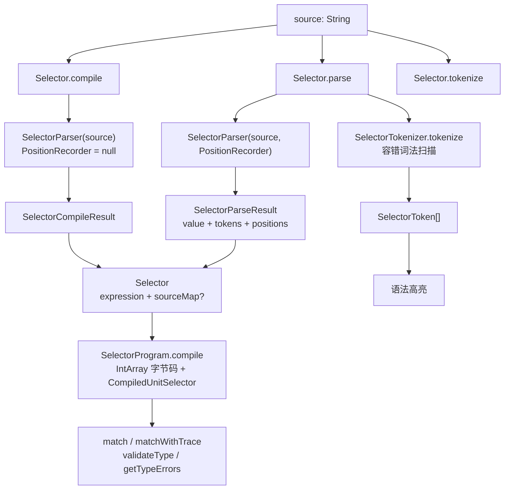
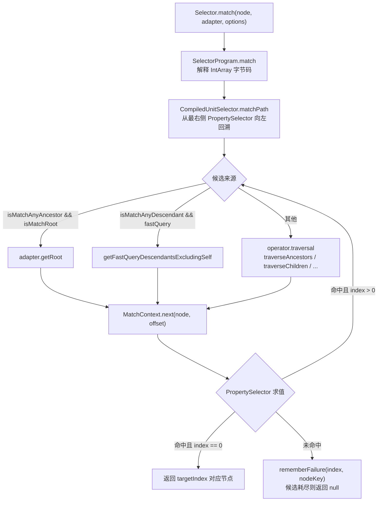
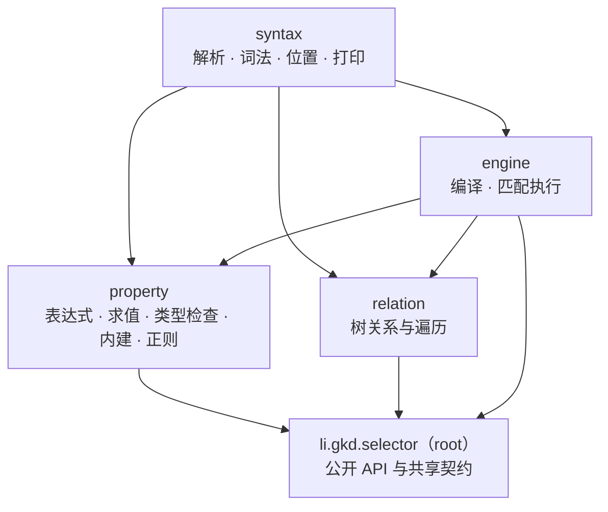

# GKD 选择器引擎（clean-selector）

`clean-selector` 是 GKD 的**高级选择器**实现：一份 Kotlin Multiplatform 源码同时作为 Android 侧 Gradle 模块参与设备上的规则匹配，并作为 npm 包 `@gkd-kit/selector` 供仓库外的 JavaScript/Web 消费者使用。它提供三条边界互不重叠的入口——`compile`（语义编译，只关心能否匹配）、`parse`（语义解析 + 源码位置 + 高亮 token）、`tokenize`（容错词法扫描）；三者共享同一 AST 与同一匹配引擎。本文以当前源码为准，描述产物形态、公开 API、真实语法、匹配与类型校验语义、构建发布链路与测试契约。

## 模块定位与产物

**构建目标。** `clean-selector/build.gradle.kts` 的 `kotlin {}` 只声明两个 target；**没有 `wasmJs` target**，代码里的 "wasm" 只指 JS 依赖 `regex-wasm`（一个编译为 WebAssembly 的正则引擎），与 Kotlin 的 wasm 平台无关。

| target | 关键配置 | 产物 |
| --- | --- | --- |
| `jvm` | 默认 | JVM 库，随 `clean-app` 打进 APK |
| `js` | `outputModuleName = project.name`、`target = es2015`、`binaries.executable()`、`useEsModules()`、`generateTypeScriptDefinitions()`、`nodejs()` | Kotlin/JS 输出 + 自动生成的 TypeScript 声明 |

插件开启了 `explicitApi()`，并对全部源集 `optIn` 了 `ExperimentalJsExport`、`ExperimentalJsStatic`、`ExperimentalJsCollectionsApi`。`commonMain` 只依赖 `kotlin.stdlib`；`jsMain` 的 npm 依赖由 `buildSrc` 的 `readNpmDependencies()` 从 `clean-selector/package.json` 的 `dependencies` 注入（当前即 `regex-wasm`）。

**npm 包（`clean-selector/package.json`）。**

| 字段 | 值 |
| --- | --- |
| `name` / `version` | `@gkd-kit/selector` / `0.6.0` |
| `main` / `types` | `./dist/clean-selector.mjs` / `./dist/clean-selector.d.mts`（纯 ESM，`type: module`） |
| `files` | `dist`、`src/commonMain`、`src/jsMain` |
| `engines` / `engineStrict` | `node >= 22` / `true` |
| `publishConfig` | `access: public`、`registry: https://registry.npmjs.org/`、`provenance: true` |
| 运行时依赖 | `regex-wasm: ^0.1.1` |

`files` 里带上两个源码目录不是笔误：`scripts/build.ts` 会把 source map 的 `sources` 重写为这两个目录下的相对路径，发布包必须含对应 `.kt` 才能让调试回到真实源码。

**为什么两种形态并存。**

| 形态 | 消费者 | 接入方式 | 目的 |
| --- | --- | --- | --- |
| Gradle 模块 `:clean-selector` | `clean-app`（无障碍节点匹配、规则预编译、类型校验） | `implementation(project(":clean-selector"))`（`clean-app/build.gradle.kts`） | 设备端选择器语义的唯一实现 |
| npm 包 `@gkd-kit/selector` | 仓库外的 JS/Web 消费者 | `workspace:*` 或 npm 安装 | 让 Web 侧（快照审查等）复用**同一份**选择器语义 |

关键在于"同一份源码"：`commonMain` 与 `jsMain` 既编译进 APK 也编译成 npm 包，避免两端各写一套解析器导致语义漂移。[01-overview.md](01-overview.md) 提到快照审查是生态中 `gkd-kit/inspect` 的基础；本 checkout 不含该 Web 应用，故这里只描述 npm 包的对外契约。

**`pnpm fetch-selector-dist`（根 `package.json` → `clean-selector/scripts/fetch-dist.ts`）。** 让没有 Java / Gradle / Kotlin 的机器也能拿到可用 `dist`：(1) 读本地 `package.json` 的 `name`、`version`、`publishConfig.registry`；(2) 在临时目录写入只声明该精确版本的 `package.json` 并 `pnpm install --ignore-scripts --registry=<registry>`；(3) 校验下载包的 `name`/`version` 一致，且 `main`/`types` 必须在 `./dist/` 下且真实存在；(4) 在 `clean-selector/build/` 建 staging，先 `rename` 走旧 `dist` 再换入新 `dist`，失败时回滚旧目录，回滚也失败则抛 `AggregateError` 并保留 staging。

`pnpm-workspace.yaml` 只把 `clean-selector` 列为 workspace 包，并把 `regex-wasm@0.1.1` 放进 `minimumReleaseAgeExclude`。三条限制需要明确：**只认精确版本**——版本取自 `clean-selector/package.json`，永不回退，该版本未发布即失败（提示改用本地构建）；**不自动执行**——安装依赖不触发，改了选择器 Kotlin 代码必须用 `pnpm --dir clean-selector build` 覆盖 `dist`；**不改源码**——不触碰 Kotlin 源码，且阶段 2 用 `--ignore-scripts`，不会递归执行 `prepack`。

## 公开 API：compile / parse / tokenize

| 维度 | `Selector.compile` | `Selector.parse` | `Selector.tokenize` |
| --- | --- | --- | --- |
| 词法 / 语义 | 只解析，不扫描 token | 两者都做 | 只扫描，不解析 |
| 源码位置 | 无（`sourceMap = null`） | 有（`PositionRecorder`） | 仅词法范围 `start` / `end` |
| 返回类型 | `SelectorCompileResult` | `SelectorParseResult` | `Array<out SelectorToken>` |
| 失败形态 | `Failure(error)` | `Failure(error, tokens, positions)` | 不失败（非法内容产出 `Invalid` token） |
| 失败时能否拿到 token | 否 | **能**（`tokens` 与已记录的部分 `positions` 仍可用） | — |
| 失败错误类型 | `SelectorSyntaxException` | 同左 | — |
| `value` 为 `Failure` 时读取 | 抛出 `error` 本身（`assertSame` 成立） | 同左 | — |
| 类型错误 / trace 的 `range` | `null` | 精确 `SourceRange` | — |
| 典型用途 | 匹配、规则预编译 | 编辑器、高亮、诊断、trace 解释 | 纯高亮 |

- `Selector` 构造函数是 `internal`；`toString()` 是 `SelectorPrinter.render(expression)`，输出**规范化**形式（`[x='a']` → `[x="a"]`，`[x=(y)]` → `[x=y]`，隐式祖先关系不打印操作符），测试对大量语法做了 `compile → toString → compile` 往返校验。
- `parse` 只捕获 `SelectorSyntaxException`。**非法正则也在语法阶段报错**：`PropertySyntaxParser.readBinaryExpression` 在 `~=`/`!~=` 右侧编译失败时以 `expected = "valid regular expression string"`、`range = SourceRange(正则字面量起止)`、`detail = 引擎诊断` 调用 `errorExpected`，因此 `detail` 携带 JVM 或 `regex-wasm` 的原始文本，`range` 覆盖**整个字符串字面量**。
- `tokenize` 是**容错**扫描：保证每个字符都被某 token 覆盖、token 首尾相接且整体拼回原串，非法内容只体现为 `SelectorTokenKind.Invalid`。
- 匹配入口在两端形状不同：Kotlin 为 `selector.match(node, adapter, options)` / `matchWithTrace(...)`（带 `@JsExport.Ignore`）；JS 为 `JsNodeAdapter.match(node, selector, options)` / `matchWithTrace(...)` 及同名查询辅助方法。

## 语法总览

语法由 `SelectorParser` + `PropertySyntaxParser` + `RelationSyntaxParser` + `ParserCursor` 的字符常量定义。以下内容逐条对照代码，并包含所有已知的"看着合法但不被接受"的边界。

**结构性规则。**

- 单元选择器（unit）是"属性选择器 + 若干（关系 + 属性选择器）"的链；两个属性选择器之间只用空白分隔时表示**隐式"任意祖先"**（`A B`）。
- 选择器级逻辑操作符（`SelectorParser.readExpression`）两侧的项**必须是括号分组**：`(A) || (B)`、`(A) || (B) && !(C)` 合法，`A || (B)`、`(A) || B`、`(A) ||` 均非法。属性级（`PropertySyntaxParser.readExpression`）**不需要**分组：`A[a=1||b=2&&c=3]` 合法。
- 取反写作 `!(...)`，`!` 必须紧跟 `(`：`!A`、`! (A)`、`[!!(a=true)]`、`[! (x=true)]` 全部非法。
- `null`/`true`/`false` 是保留字，不能作属性名或成员名（`[a.null=true]`、`[a.true=true]` 非法），但作值合法且可在任一侧（`[null=parent]` 与 `[parent=null]` 都合法）。
- 关系操作符**前后都必须有空白**：`A>B`、`A >B`、`A> B` 都是语法错误（`A> B` 报 "end of selector"）。
- 整数为十进制、无前导零、32 位有符号范围：`[x=01]`、`[x=-01]`、`[x=2147483648]`、`A[x=+1]` 非法。
- 值表达式里的括号是**透明**的（`View[text=(desc)]` 等价于 `View[text=desc]`）；解析与求值全用显式栈，5000 层嵌套仍可工作。

**属性选择器。** `propertySelector := "@"? name? "[" propertyExpression "]" ("[" propertyExpression "]")*`

- `@` 是**目标标记**：`CompiledUnitSelector.targetIndex = propertySelectors.indexOfLast { it.at }`，无 `@` 时回退为 `propertySelectors.lastIndex`；所以 `@Root > Button` 命中的是 `Root` 而不是 `Button`。
- `name` 可为空（下一个字符直接是 `[`）、可为 `*`、可为点分标识符（`android.widget.TextView`）。名称匹配：`*`/空匹配任意名；完全相等；或节点名更长时要求**分隔符是 `.`** 且以 `name` 结尾，因此 `TextView` 能匹配 `android.widget.TextView`。`adapter.getName(node)` 返回 `null` 时只有 `*`/空名能命中。多个 `[filter]` 之间是与关系。

**关系操作符（以 `relation/RelationOperator.kt` 为准）。** `parseOrder` 按 `key` 长度**降序**以保证最长匹配。

| key | `RelationOperator` | `SelectorRelationKind` | 遍历实现 | 语义（按书写顺序 `A op B`） |
| --- | --- | --- | --- | --- |
| `+` | `BeforeSibling` | `BeforeSibling` | `adapter.traversePreviousSiblings` | A 是 B 的前一个兄弟 |
| `-` | `AfterSibling` | `AfterSibling` | `adapter.traverseFollowingSiblings` | A 是 B 的后一个兄弟 |
| `>` | `Ancestor` | `Ancestor` | `adapter.traverseAncestors` | A 是 B 的祖先 |
| `<` | `Child` | `Child` | `adapter.traverseChildren` | A 是 B 的子节点 |
| `<<` | `Descendant` | `Descendant` | `adapter.traverseDescendants` | A 是 B 的后代 |
| `->` | `Previous` | `Previous` | `MatchContext.getPrev` 链 | A 是 **B 的路径上下文前驱**，不是树关系 |
| 空白（隐式） | 无操作符对象 | —— | 同 `>` 的候选枚举 | 由 `PolynomialExpression(a = 1, b = 0)` 表示"任意祖先" |

`->` 值得单独强调：`RelationOperator.Previous.traversal` 走 `MatchContext` 链（`context.getPrev(offset)`），源码注释写明 `A -> B + C, A==C`、`A ->2 B + C + D, A==D`，即它引用路径上已匹配过的节点，用来表达"和前面那个节点是同一个"。

**偏移表达式。**

| 写法 | 解析结果 | 说明 |
| --- | --- | --- |
| 省略 | `PolynomialExpression()`（`a=0, b=1`） | 第 1 个（`minOffset = 0`） |
| `+3` / `+(3)` | `PolynomialExpression(0, 3)` | 第 3 个 |
| `+n` / `>n` | `PolynomialExpression(1, 0)` | 全部（`matchesAllOffsets = a == 1 && b == 0`） |
| `+2n`、`+(n+1)`、`+(2n-1)`、`+(7+9n)`、`+(-n+4)`、`+(99-n)`、`+(-3n+10)` | `PolynomialExpression(a, b)` | 单项式最多两个（"at most two monomials"）、幂必须互不相同（"distinct monomial powers"），且须满足 `PolynomialExpression.isValid` |
| `+(1,2,10)` | `TupleExpression` | 严格递增正整数列表；`+(1,1)`、`+(2,1)`、`+(0,1)`、`+(1,)`、`+(0)`、`+(-1)` 非法 |

`minOffset`/`maxOffset` 支持负系数（如 `-2n+9` 只匹配第 1、3、5、7 位），`checkOffset` 用 `(offset + 1 - b) % a == 0` 判定。

**逻辑操作符（以 `LogicalOperator.kt` 为准）。**

| key | 枚举 | `precedence` |
| --- | --- | --- |
| `&&` | `LogicalOperator.And` | 2 |
| `\|\|` | `LogicalOperator.Or` | 1 |

归约用"栈顶优先级 `>=` 待入优先级"的经典写法（`reduceOperators`），即 `&&` 结合更紧、同级左结合；`logicalPrecedenceMatchesDocumentation` 断言 `[a>1||b>1&&c>1||d>1]` 与 `[a>1||(b>1&&c>1)||d>1]` 等价。

**值与字面量。** `null`/`true`/`false` → `NullLiteral`/`BooleanLiteral`；十进制整数 → `IntLiteral`（可带前导 `-`）；`'...'`、`"..."`、`` `...` `` 三种引号等价 → `StringLiteral`；标识符 → `Identifier`，按名字挂钩 `adapter.getAttr(current, name)`；成员访问 → `MemberExpression`（`text.length`、`parent.current`）；调用 → `CallExpression`（`text.substring(0,2)`、`equal(a,b)`、`a.b(c,d).e(f)`）。三个保留标识符：`prev`（`IdentifierRole.Previous` → `context.prev`）、`current`（`Current`）、`equal`/`notEqual`（`NullTolerantFunction`，实参为 `null` 时不短路）。

字符串转义白名单（`syntax/StringScanner.kt`）：`` \\ ``、`\'`、`\"`、`` \` ``、`\n`、`\r`、`\t`、`\b`、`\xHH`、`\uHHHH`。裸控制字符（含 `\r`、`\t`、`\u0000`）与未知转义（`\q`）在字面量内非法，错误会精确到期望的引号或十六进制位。规范化输出用 `"` 包裹并保留成对代理项（emoji），孤立代理项写成 `\uXXXX`。

**真实可用的选择器示例**（全部取自 `commonTest` 中通过编译的用例）。

| 选择器 | 说明 |
| --- | --- |
| `@LinearLayout > TextView[id=\`com.byted.pangle:id/tt_item_tv\`][text=\`不感兴趣\`]` | `@` 把命中节点定为外层 `LinearLayout`；`>` 表示它是 `TextView` 的祖先；反引号字符串 |
| `@TextView[a=1][b^='2'][c*='a'\|\|d.length>7&&e=false][!(f=true)][g.plus(1)>0]` | 连续过滤器（与）、属性级 `\|\|`/`&&`/`!`、成员调用 |
| `TextView[text='Beta7'] <<n FrameLayout[vid='content']` | `<<n` 任意后代关系（`matchesAllOffsets`） |
| `(A + B) \|\| !(M > N)` | 选择器级逻辑操作符要求两侧括号；`!(...)` 取反 |
| `View[width.toString()='1'][clickable.ifElse(text,desc)='x']` | 内建 `toString`、惰性 `ifElse`（只求值被选中的分支） |
| `[parent=null]` / `[null=parent]` | 空名属性选择器；`isMatchRoot` 语义即"匹配树根" |
| `N ->1 B > A` | `->` 路径上下文前驱引用 |

## 属性与值表达式

**内建成员（`property/BuiltinMembers.kt`）。** 接收者归入 5 个 `BuiltinScope`：`Boolean`、`Int`、`String`、`Context`（`MatchContext`）、`Global`（`Global` 不是值类型，`BuiltinTypeSet.get` 对它直接 `error`）。

| 接收者 | 成员 | 签名 | 备注 |
| --- | --- | --- | --- |
| `Boolean` | `toInt()` | `-> Int` | `true → 1`，`false → 0` |
| `Boolean` | `or(Boolean)` / `and(Boolean)` / `not()` | `-> Boolean` | `or`/`and` 短路：`true.or(x)` 与 `false.and(x)` 不求值右侧 |
| `Boolean` | `ifElse(T, T)` | 同构参数 2 个，返回该类型 | 只求值被选中的分支 |
| `Int` | `toString()` / `toString(Int)` | `-> String` | 单参形式是进制，仅 `2..36` 有效，否则 `null` |
| `Int` | `plus` / `minus` / `times` / `div` / `rem` | `(Int) -> Int` | `div`/`rem` 除数为 0 时返回 `null` |
| `Int` | `more` / `moreEqual` / `less` / `lessEqual` | `(Int) -> Boolean` | |
| `String`（`CharSequence`） | `length` 属性 | `Int` | 唯一的内建"属性" |
| `String` | `get(Int)` / `at(Int)` | `-> String` | `get` 越界返回 `null`；`at` 支持负索引 |
| `String` | `substring(Int)` / `substring(Int, Int)` | `-> String` | 起点越界返回空串，起点为负或终点小于起点返回 `null` |
| `String` | `toInt()` / `toInt(Int)` / `indexOf(String)` / `indexOf(String, Int)` | `-> Int` | `toInt` 进制仅 `2..36`，解析失败返回 `null` |
| `Context` | `getPrev(Int)` | `-> Context` | 路径上更早的匹配上下文 |
| `Global` | `equal(a, b)` / `notEqual(a, b)` | 同构参数 2 个 → `Boolean` | 对 5 个同构类型（boolean/int/string/node/context）各展开一份签名 |

求值规则（`property/ValueEvaluator.kt`）：`null` 会向上传播——调用内建方法或 `adapter.getInvoke` 前若出现 `null` 实参即整体返回 `null`，除非被调方是 `equal`/`notEqual`；内建方法优先于宿主方法，"存在同名方法但实参不匹配"返回 `null` 而不回落到 `adapter.getInvoke`（`BuiltinInvocation.Value(null)` 与 `Unsupported` 的区别）；只有全部实参非空时才把调用转给 `adapter.getInvoke(target, name, args)`，其中 `target` 在接收者是 `MatchContext` 时取其 `current`。

**比较操作符（`property/CompareOperator.kt`）。**

| key | 枚举 | 类别 | 类型约束（`allowType`） |
| --- | --- | --- | --- |
| `=` | `Equal` | `ValueOperator` + `FastQueryOperator` | 无（恒 `true`） |
| `!=` | `NotEqual` | `ValueOperator` | 无 |
| `^=` | `Start` | `ValueOperator` + `FastQueryOperator` | 两侧字符串 |
| `!^=` | `NotStart` | `ValueOperator` | 两侧字符串 |
| `*=` | `Include` | `ValueOperator` + `FastQueryOperator` | 两侧字符串 |
| `!*=` | `NotInclude` | `ValueOperator` | 两侧字符串 |
| `$=` | `End` | `ValueOperator` + `FastQueryOperator` | 两侧字符串 |
| `!$=` | `NotEnd` | `ValueOperator` | 两侧字符串 |
| `<` | `Less` | `ValueOperator` | 两侧 `Int` |
| `<=` | `LessEqual` | `ValueOperator` | 两侧 `Int` |
| `>` | `More` | `ValueOperator` | 两侧 `Int` |
| `>=` | `MoreEqual` | `ValueOperator` | 两侧 `Int` |
| `~=` | `Matches` | `RegexOperator`（`expectedMatch = true`） | 左侧必须是 `ValueExpression.Variable`，右侧必须是 `StringLiteral` |
| `!~=` | `NotMatches` | `RegexOperator`（`expectedMatch = false`） | 同上 |

`=`/`!=` 走 `comparePrimitiveValue`：两侧都是 `CharSequence` 时按**内容逐字符倒序比较**（不做 `toString` 分配），否则用 `==`。`~=`/`!~=` 在解析期就把正则编译成 `(CharSequence) -> Boolean` 并固化进 `ComparisonExpression.RegexComparison`。

**正则编译（`property/RegexCompiler.kt` + 平台 actual）。** `String.compileRegex()` = **简单正则快速路径** + 平台正则：

- 平台实现是 `internal expect fun String.compilePlatformRegex()`：`jvmMain/property/RegexCompiler.jvm.kt` 用 `Regex(this)`（java.util.regex），把 `IllegalArgumentException` 的类名与 message 拼成 `detail`；`jsMain/property/RegexCompiler.js.kt` 调用 npm 模块 `regex-wasm` 的 `toMatches(pattern)`（`jsMain/kotlin/npm/regex_wasm/RegexWasmExternal.js.kt` 声明 `@file:JsModule("regex-wasm")`），异常时取 `error.name` 与 `error.message` 拼成 `detail`。`compileWasmRegex(factory)` 是可单测的注入点。
- 快速路径只识别三类"纯文本 + 大小写不敏感"形态：`(?is)X.*`（前缀）、`(?is).*X.*`（包含）、`(?is).*X`（后缀），且 `X` 不得含 `\^$.?*|+()[]{}`、不得含非 ASCII 大小写字符或代理项；包含判定用 KMP 失败表线性扫描，判定为"无法确定"时**回落平台正则**。
- 语义差异因此被**显式保留**：JVM 支持 `\p{javaLowerCase}`、`(?U)` 等而 `regex-wasm` 不支持；`(?U)\w+` 在 JS 侧不匹配 `"中文"`、在 JVM 侧匹配。两个平台各有测试固化这一差异。
- `regex-wasm` 与 WebAssembly GC：`clean-selector/README.md` 要求运行环境具备 **WebAssembly GC 支持**，且 `regex-wasm` **在包被 import 时即完成初始化**，所以即使调用方只用 `Selector.tokenize` 也受此前提约束；推荐 Node.js ≥ 22（与 `package.json` 的 `engines` 对齐）或开启 WebAssembly GC 的现代浏览器。本 checkout 未安装 `node_modules`，`regex-wasm` 自身源码不在仓库内，"import 时初始化"一条来自 README 的陈述而非对模块代码的核验。

## 匹配引擎

**匹配方向与程序结构。** `SelectorProgram` 把 `SelectorExpression` 编译成 3 Int 一条指令的字节码（`MATCH_UNIT`/`NOT`/`AND_ENTER`/`AND_EXIT`/`OR_ENTER`/`OR_EXIT`）和一组 `CompiledUnitSelector`；`AND_ENTER`/`OR_ENTER` 记录跳转地址，`NOT` 只翻转 `null` 与非 `null`，逻辑短路不依赖递归。单元选择器**从右向左**匹配：`propertySelectors.lastIndex` 先对传入节点求值，再按 `relations[propertySelectorIndex - 1]` 向左枚举候选——所以书写 `A > B` 表示"B 命中候选节点，再向上找 A"。`match` 返回 `@` 标记节点（无 `@` 时是最右属性选择器命中的节点），失败返回 `null`。

**`MatchOptions`。** `public data class MatchOptions(val fastQuery: Boolean = false)`，伴随 `MatchOptions.default = MatchOptions()`；只有 `fastQuery` 一个开关，默认关闭，并且是所有查询辅助方法的默认值。

**FastQuery 快速查询语义。** 产生途径是 `PropertySelector.fastQueryList`，它只看 `filters.firstOrNull()`：

- 该过滤器是 `ComparisonExpression` 时走 `expToFastQuery`：左侧必须是 `Identifier`、右侧必须是**非空** `StringLiteral`；`id` 且操作符为 `=` → `FastQuery.Id`；`vid` 且 `=` → `FastQuery.Vid`；`text` 且操作符实现 `FastQueryOperator`（`=`、`^=`、`*=`、`$=`）→ `FastQuery.Text`；其余形态（如 `!=`、`!*=`、`!$=`、`!~=` 这类无法枚举全集的写法）返回 `null`。
- 该过滤器是 `LogicalExpression` 时要求整棵树**只由 `||` 组成**（`collectOrFastQueryExpressions`）且每个叶子都能转换；其它形态（含任何 `!`）返回 `null`。

`SelectorProgram.analyzeSelector` 只取 `propertySelectors.last()` 的列表并按逻辑操作符合并：

| 组合 | `fastQueryList` |
| --- | --- |
| `And(left, right)` | 一侧为 `null` 则取另一侧，否则两侧求并（`distinct()`） |
| `Or(left, right)` | 任一侧为 `null` 则整体为 `null`；否则求并 |
| `Not(...)` | 恒为 `null` |
| `UnitSelectorExpression` | 取最后一个属性选择器的结果 |

`null` 的语义是"**无法给出完整候选集**"：此时查询退回全量 `adapter.getDescendants(node)`，绝不会少找。快速路径只在 `options.fastQuery == true` 且 `selector.fastQueryList` 非空时启用，且仅出现在两处：`NodeAdapter.queryDescendants`（`querySelector`/`querySelectorAll`/`*WithTrace` 系列）与 `CompiledUnitSelector.candidates`（关系为 `isMatchAnyDescendant` 即 `<<n` 时）。另外 `isMatchAnyAncestor && isMatchRoot`（形如 `@[parent=null] >n View`）走 `adapter.getRoot(context.current)` 的单点快速路径，不再枚举祖先。

`NodeAdapter.getFastQueryDescendants` 的契约（文档与实现共同定义）：

- **允许误报，不得漏报**：必须返回所有命中至少一个 `fastQueryList` 条目的后代；匹配器会对每个候选**再次完整验证**。
- 每个逻辑节点最多返回一次（按 `getNodeKey` 去重），**不得返回源节点自身**（默认实现用 `getFastQueryDescendantsExcludingSelf` 再过滤）。
- **顺序不保证**：覆盖实现可用实现相关顺序，因此开启后查询结果顺序（甚至"第一个命中节点"）都可能不同于常规深度优先；需要深度优先顺序时必须关闭快速查询。
- 应当**惰性**产出：Kotlin 返回 `Sequence`，JS 返回 `JsIterable`（可用同步 generator 方法），这样 `querySelector` 这类取首的调用可在后续快速查询执行前提前终止；一次性 JS iterable 必须每次钩子调用都重建，且 generator 不得持有需显式关闭的资源。
- 默认实现 = `getDescendants(node).filter { fastQueryList.any { it.acceptValue(getAttr(candidate, it.attributeName)) } }`；`FastQuery.acceptValue` 对 `Id`/`Vid` 用 `comparePrimitiveValue`，对 `Text` 用其 `FastQueryOperator.compareFastQueryValue`。

**回溯与记忆化。** `CompiledUnitSelector.matchPath` 是显式栈回溯而非递归；`cacheablePropertySelectorCount` 从索引 0 起扫描，遇到 `usesPreviousContext`（表达式树里出现 `prev` 标识符或名为 `getPrev` 的调用）或前一个关系是 `RelationOperator.Previous` 即停止——这个前缀内的属性选择器其匹配结果**与到达路径无关**，失败状态可全局记忆。`failedStateKeysByPropertySelector[index]` 是 `MutableSet<Any>`，键就是 `adapter.getNodeKey(node)`；`isKnownFailure` 命中即跳过求值，`rememberFailure` 在属性选择器求值失败与搜索帧候选耗尽时记录。源码注释划定了边界：`// Snapshot stability comes from NodeAdapter. This only excludes states whose result also depends on the path used to reach the current node.` 即**快照稳定性由适配器保证**，记忆化只排除"结果依赖到达路径"的状态。

`getNodeKey` 因此是硬契约：相等的键必须指向同一逻辑节点，不同逻辑节点必须有不同键，且一次匹配操作期间相等性与哈希码必须稳定。`JsNodeAdapter.checkedNodeKey` 直接拒绝 `null`/`undefined` 键（错误信息含 "getNodeKey must return a non-null value"），而不是把不同节点当成同一个。`SelectorOptimizationTest` 把这条钉死：使用 `prev`/`->` 的选择器只能让**受影响的那一段**失去缓存，前面无关的属性选择器必须继续命中缓存（用 `TestNodeAdapter.parentCallCount < 10_000` 度量）。

**`MatchContext`。** `internal`，字段 `current`/`prev`/`incomingOffset`，方法 `getPrev(index)`/`get(index)`/`toContextList()`/`next(value, offset)`；建模"本次单元匹配的路径"。选择器表达式只能通过保留标识符 `prev`/`current` 与 `getPrev(n)` 间接观察它（`[prev!=null]`、`N ->1 B > A`）。`incomingOffset < 0` 表示该跳偏移不来自树遍历（快速查询或根快速路径），此时 `resolveTraceOffset` 会重新遍历一次求真偏移。

**快照一致性契约（Query snapshot contract）。** `NodeAdapter`/`JsNodeAdapter` 的类文档规定：每次匹配操作只观察**一个稳定的节点树快照**；在一次 `Selector.match`、`Selector.matchWithTrace` 或适配器上任意查询辅助方法的调用期间，所有适配器方法对相同实参必须返回确定的名字、属性、调用结果、关系与遍历顺序，状态变化（含无障碍节点刷新）只能对**下一次**匹配操作可见。配套约束：节点类型在 Kotlin 与 JS 上都必须非空，`null` 只保留给"没有父/子节点"与"匹配或查询失败"；关系遍历的覆盖实现**必须保留候选原始的零基偏移**，哪怕更早的允许位置没有节点（`traverse*` 都是先算 `offset` 再 `checkOffset`，只有当选才 `yield`，`tracePreservesOffsetsWhenAnEarlierAllowedChildIsMissing` 校验此点）；`getRoot` 默认实现按 `getNodeKey` 检测环（父链重复键即返回 `null`），`getDescendants`/`traverseAncestors` 同样按 key 去重，故环形节点树不会死循环；适配器抛出的运行时异常**不会被包装成选择器错误**。

**查询辅助方法。**

| 方法（Kotlin `NodeAdapter` / JS `JsNodeAdapter` 同名） | 返回 |
| --- | --- |
| `querySelector` / `querySelectorWithTrace` | 第一个命中的 `T?` / `SelectorMatch<T>?` |
| `querySelectorAll` / `querySelectorAllWithTrace` | 去重（`distinctBy(::getNodeKey)`）的全部命中；JS 侧返回 `JsArray<T>` / `JsArray<SelectorMatch<T>>` |

所有查询只遍历**后代**（`getDescendants` 语义，不含传入节点自身），关闭快速查询时是深度优先顺序。

## 类型校验

**类型模型。**

| API | 位置 | 说明 |
| --- | --- | --- |
| `createDefaultSelectorTypeModel(webField: Boolean = false)` | `commonMain` | 内建 GKD 模型；两个 `by lazy` 单例（standard / web） |
| `SelectorTypeModelBuilder` / `SelectorTypeKind` | `commonMain` | 公开构建器：`type(kind)`、`property(owner, name, type)`、`method(owner, name, returnType, params)`、`build(globalType)`；类型种类为 `BooleanType("boolean")`、`IntType("int")`、`StringType("string")`、`ObjectType(name)` |
| `JsSelectorTypeModelBuilder` | `jsMain` | JS 专用不可变模型构建器；`JsSelectorTypeKind` 为 `Boolean`/`Int`/`String`/`Object`，`Object` 必须有非空 `objectName` |

`SelectorTypeModelBuilder` 的所有变更方法都以 `check(!built)` 保护，`build` 后禁止再改，且 `property`/`method` 会校验涉及的 `SelectorType` 属于本 builder。`SelectorType` 在 `build` 时才 `initialize(props, methods)`，未初始化读取 `props`/`methods` 会 `check` 失败；它不重写 `equals`/`hashCode`，用**同一性**作键，天然支持 `parent` 这类自引用模型而不触发递归相等。`global` 是类型校验的**入口作用域**：`ValueExpression.Identifier` 先在 `globalType.props` 中查找，未找到即报 `UnknownIdentifier`。

**内建模型（`DefaultSelectorTypeModel.kt`）。** 节点 `string` 属性 `id`/`vid`/`name`/`text`/`desc`（`webField = true` 时另有 `_id`/`_pid`，皆 `int`）；`boolean` 属性 `clickable`/`focusable`/`checkable`/`checked`/`editable`/`longClickable`/`visibleToUser`；`int` 属性 `left`/`top`/`right`/`bottom`/`width`/`height`/`childCount`/`index`/`depth`；`node` 属性 `parent`；节点方法 `getChild(int) -> node`；`string` 属性 `length`。`context` 在节点属性之外增加 `prev: context`、`current: node`；`global` 拥有节点全部属性，方法为 `getChild` + `Context` 内建 + `Global` 内建（`equal`/`notEqual`）。

**校验入口。**

| API | 语义 |
| --- | --- |
| `selector.validateType(typeModel)` | 快路径：`SelectorProgram.validateType` 用 `TypeCheckCollector(globalType, 1)`，第 1 个错误即停；返回 `SelectorTypeResult.Success(selector)` 或 `Failure(SelectorTypeException)`，无需 `catch`；`Failure.value` 抛出**同一个** `error` 实例 |
| `selector.getTypeErrors(typeModel)` | 全量：`TypeCheckCollector(globalType, Int.MAX_VALUE)` 收集所有**相互独立**的错误，按 `index` 排序后返回 `Array<out SelectorTypeException>` |

`SelectorTypeErrorKind` 共 7 种：`UnknownIdentifier`、`UnknownMember`、`UnknownMethod`、`ArgumentCountMismatch`、`ArgumentTypeMismatch`、`OperandTypeMismatch`、`OperatorTypeMismatch`。`SelectorTypeException` 暴露 `kind`、`expression`（`SelectorPrinter.render` 产出的**规范化**文本）、`expected`、`actual`、`range`，`index = range?.start`。

**`range` 的差异来自入口而非校验逻辑**：`Selector.parse(source).value` 的 `range` 为精确 `SourceRange`（`source.substring(range.start, range.end)` 是底层表达式的**源码**片段，其引号写法可能与规范化后的 `expression` 不同，例如 `expression == "\"x\""` 而源码是 `'x'`）；`Selector.compile(source).value` 的 `sourceMap` 为 `null`，故 `range` 与 `index` 皆 `null`。

其它已固化的行为：`null` 操作数不产生类型错误；依赖失败的成员访问被抑制而非级联刷屏；调用实参失配时全量模式报告**每一个**失配实参；类型推断与校验全程使用显式栈，3000 层成员链或嵌套调用不会栈溢出。

## 匹配轨迹

| 入口 | 位置 |
| --- | --- |
| `Selector.matchWithTrace(node, adapter, options)` | `commonMain`（`@JsExport.Ignore`） |
| `NodeAdapter.querySelectorWithTrace` / `querySelectorAllWithTrace` | `commonMain` |
| `JsNodeAdapter.matchWithTrace` / `querySelectorWithTrace` / `querySelectorAllWithTrace` | `jsMain` |

返回结构（`SelectorMatch.kt`）：`SelectorMatch<T>(target, units)` → `SelectorMatchUnit<T>(target, steps, range)` → `SelectorMatchStep<T>(source, target, kind, offset, formattedRelation, sourceRange, relationRange, targetRange)`。

- 轨迹**只保留成功的那条逻辑分支**与**扁平的关系步骤列表**：`SelectorProgram.matchWithTrace` 拼接 `AND` 两侧的 `units`、`OR` 只留命中一侧、`NOT` 命中时产出空 `units`；它不重放遍历，也不保留任何失败搜索分支。
- `steps` 按路径顺序排列：`source` 是跳转起点（较右侧那个属性选择器命中的节点），`target` 是跳转终点；`relationRange` 覆盖关系操作符源码（测试断言 `source.slice(relationRange) == ">"`），`sourceRange` 对应起点侧属性选择器，`targetRange` 对应终点侧。
- `formattedRelation = RelationOperator.formatOffset(offset)`：`offset == 0` 时只输出操作符 key，否则输出 `key + (offset + 1)`（如 `>2`）。`resolveTraceOffset` 优先用 `MatchContext.incomingOffset`，在快速查询/根快速路径（`incomingOffset < 0`）下按 `getNodeKey` 重新遍历求偏移，找不到则 `checkNotNull` 失败。
- **parse vs compile 的 range**：`Selector.parse` 产出的选择器把源码范围挂到 trace 单元与步骤上；`Selector.compile` 产出的选择器 `sourceMap` 为 `null`，故 `range`/`sourceRange`/`relationRange`/`targetRange` 全为 `null`。
- `querySelectorAllWithTrace` 用 `distinctBy { getNodeKey(result.target) }` 去重，与 `querySelectorAll` 语义一致。

## 语法高亮

`Selector.tokenize(source)` 返回 `Array<out SelectorToken>`；每个 token 为 `SelectorToken(kind, scope, start, end)`，`start` 含、`end` 不含。`kind.name` 与 `scope.name` 是**稳定的枚举名**，可直接用作 `data-*` 属性值。

| `SelectorTokenKind`（15 项） | 判定依据 |
| --- | --- |
| `Whitespace` | `" \t\r\n"` 连续段 |
| `Selector` | 括号外的标识符（`[A-Za-z_]` 起始） |
| `Identifier` | 括号内的标识符（非 `null`/`true`/`false`） |
| `Keyword` | 括号内的 `null`/`true`/`false` |
| `Integer` | 数字；括号内 `-` 紧跟数字时与前导负号合并 |
| `String` | 完整合法的字符串字面量（三种引号与全部转义） |
| `Invalid` | 未闭合/非法转义的字符串整体、无法识别的字符 |
| `CompareOperator` | 括号内的 `=`、`!=`、`^=`、`!^=`、`*=`、`!*=`、`$=`、`!$=`、`<`、`<=`、`>`、`>=`、`~=`、`!~=` |
| `LogicalOperator` | `&&`、`\|\|`，以及任何位置单独的 `!` |
| `RelationOperator` | 括号外的 `+`、`-`、`>`、`<`、`<<`、`->` |
| `ArithmeticOperator` | 关系括号内的 `+`/`-`（如 `(2n-1)` 的 `-`） |
| `PolynomialVariable` | 关系表达式中的 `n` |
| `Punctuation` | `[`、`]`、`(`、`)`、`,`、`.` |
| `Target` | `@` |
| `Wildcard` | `*`，且下一个字符不是 `=` |

| `SelectorTokenScope`（3 项） | 条件 |
| --- | --- |
| `Property` | `bracketDepth > 0`（`[` 到 `]` 之间，**含** `[` 与 `]` 本身） |
| `Relation` | 括号深度为 0 且处于"关系表达式活动"状态（读到关系操作符之后、遇到关系括号外的空白之前） |
| `Selector` | 其余情况；单独的 `!` 逻辑操作符也归入 `Selector` |

两个可用于高亮器的额外保证：容错扫描**覆盖全部字符**，token 首尾相接、无空洞且拼回原串，`Selector.parse` 的 `positions` 边界与 token 边界对齐，可安全地把 token kind 与所有包含它的 position kind 组合使用（`semanticPositionBoundariesNeverSplitHighlightTokens` 校验此点）；索引单位在 JVM 与 JS 上都是 **UTF-16 码元**（`indexesUseUtf16CodeUnitsOnJvmAndJs`），代理对（emoji）占 2 个位置。

## 内部包职责

| 包 | 文件数 | 职责 |
| --- | --- | --- |
| `li.gkd.selector.syntax` | 9 | `SelectorTokenizer`（容错词法）、`SelectorParser`（选择器级逻辑与单元链）、`PropertySyntaxParser`（`[...]` 内表达式与值）、`RelationSyntaxParser`（关系操作符与 `an+b`/元组）、`SelectorPrinter`（规范化输出）、`ParserCursor`（字符常量、整数/字符串读取、`SelectorSyntaxException` 抛出点）、`ParserContext` + `PositionRecorder`（positions 与 `SelectorSourceMap`）、`StringScanner`（字符串字面量扫描/解码） |
| `li.gkd.selector.property` | 9 | `PropertySelector`（名称匹配 + 过滤器 + `fastQueryList`/`isMatchRoot`/`usesPreviousContext`）、`PropertyExpression`（`ComparisonExpression`/`LogicalExpression`/`NotExpression`）、`ValueExpression`（标识符/成员/调用/字面量）、`ExpressionEvaluator`（属性表达式求值与短路）、`ValueEvaluator`（值求值、null 传播、内建调用、`getInvoke` 回落）、`ExpressionTypeChecker`（类型推断与错误收集）、`BuiltinMembers`、`CompareOperator`、`RegexCompiler`（`expect` 声明 + 简单正则优化） |
| `li.gkd.selector.relation` | 3 | `RelationOperator`（6 个操作符及各自遍历）、`RelationExpression`（`PolynomialExpression`/`TupleExpression` 与 `minOffset`/`maxOffset`/`checkOffset`）、`RelationSelector`（组合与 `isMatchAnyAncestor`/`isMatchAnyDescendant`） |
| `li.gkd.selector.engine` | 3 | `SelectorExpression`（`UnitSelectorExpression`/`LogicalSelectorExpression`/`NotSelectorExpression`）、`SelectorProgram`（字节码编译 + 匹配解释器 + `analyzeSelector` 元数据 + 类型失败收集）、`CompiledUnitSelector`（单元匹配、回溯与记忆化、trace 构造） |
| `li.gkd.selector`（root） | 13 | 全部公开 API 与共享契约：`Selector`、三个 `*Result`、`SelectorException`、`SelectorToken`、`SelectorPosition`、`SelectorMatch`、`MatchOptions`、`FastQuery`、`SelectorTypeModel`、`DefaultSelectorTypeModel`、`NodeAdapter`、`MatchContext`、`LogicalOperator` |

计数口径：`clean-selector/src/commonMain/kotlin/li/gkd/selector/` 下共 37 个 `.kt`（root 13 + syntax 9 + property 9 + relation 3 + engine 3）。平台专属代码另计：`jsMain` 4 个（`JsNodeAdapter.kt`、`JsSelectorTypeModel.kt`、`property/RegexCompiler.js.kt`、`npm/regex_wasm/RegexWasmExternal.js.kt`），`jvmMain` 1 个（`property/RegexCompiler.jvm.kt`）。

## 构建与发布流程

**本地构建：`pnpm --dir clean-selector build`（`scripts/build.ts`）。** (1) `runGradle([":clean-selector:jsProductionExecutableCompileSync"])`——`scripts/gradle.ts` 在 Windows 上经 `ComSpec` 调用 `gradlew.bat`，其它平台直接执行 `gradlew`，工作目录为仓库根；(2) 删除并重建 `clean-selector/dist`（先断言目标目录的父目录就是包目录，拒绝越界删除），把 `build/js/packages/clean-selector/kotlin` 递归复制进去；(3) 对每个 `.d.mts` 执行**恰好 9 处**文本重写——8 处 `SelectorMatch`/`SelectorMatchUnit`/`SelectorMatchStep`/`JsNodeAdapter` 的泛型与构造函数签名 `extends any` → `extends {}`，加上 `abstract getNodeKey(node: T): any;` → `NonNullable<unknown>`；每处出现次数不为 1 即报错，最后断言总数为 `9 × outputs`；(4) 改写每个 `.map` 的 `sources`：含 `/clean-selector/src/` 的重写为 `clean-selector/src/...` 相对路径，含 `/clean-selector/build/` 的重写为 `clean-selector/build/...`；若一条项目源码路径都没改到则报错。

`clean-selector/README.md` 的 "Source maps" 一节解释了为何 `sources` 会出现指向 `../build/...` 的路径：Kotlin/JS 还会为编译器自有逻辑源码（标准库、`js(...)` 块合成的源码）发映射，这些文件不会被生成或发布，调试时回落到生成的 JavaScript 是预期行为。

**校验链路与 `prepack`。**

| 命令 | 内容 |
| --- | --- |
| `pnpm test:kotlin` | `scripts/kotlin-test.ts` → `:clean-selector:jvmTest` + `:clean-selector:jsNodeTest` |
| `pnpm build` | 见上 |
| `pnpm type-check` | `tsc`；`tsconfig.json` 的 `include` 只有 `scripts`（`strict`、`noEmit`、`verbatimModuleSyntax`、`erasableSyntaxOnly`、`allowImportingTsExtensions`） |
| `pnpm test:node` | `node --test scripts/**/*.test.ts`，目前只有 `scripts/selector.test.ts` |
| `pnpm test` | 上述四步按序执行；`pnpm prepack` 即等于 `pnpm test` |

`scripts/selector.test.ts` 是**发布前的 JS 契约测试**：直接 `import` 构建产物，校验 token 覆盖、`Selector.compile` 的成功/失败分支、`SelectorSyntaxException` 的 `expected`/`actual`/`index`/`range`/`message` 与 `value` 抛同一实例、非法正则的 `detail` 与字面量范围、`JsNodeAdapter` 的匹配/查询/`getInvoke` 数组实参/`getNodeKey` 非空断言、`matchWithTrace` 的 `formattedRelation` 与 `relationRange`、快速查询的惰性与顺序无关性、`createDefaultSelectorTypeModel` 与 `JsSelectorTypeModelBuilder` 的类型校验；并用 `// @ts-expect-error` 保护两条 TypeScript 契约——`FastQuery.Text` 只接受可搜索操作符、`JsNodeAdapter<T>` 的 `T` 必须排除 `null`。

**发布（Trusted Publishing）。** `.github/workflows/Publish-Selector.yml` 的触发条件是 tag glob `@gkd-kit/selector@*.*.*`，权限为 `contents: read` + `id-token: write`，`concurrency.group = publish-selector` 且 `cancel-in-progress: false`。步骤：(1) `actions/checkout`（`persist-credentials: false`）→ `actions/setup-java`（temurin 21）→ `gradle/actions/setup-gradle` → `pnpm/setup`；(2) `node ./clean-selector/scripts/validate-release-tag.ts "$GITHUB_REF_NAME"`——要求 `package.json` 的 `version` 匹配 `/^(0|[1-9]\d*)\.(0|[1-9]\d*)\.(0|[1-9]\d*)$/`（纯数字 `x.y.z`，拒绝预发布后缀），且 tag 严格等于 `${name}@${version}`，**版本号只以 `package.json` 为准**；(3) `pnpm -F @gkd-kit/selector publish --no-git-checks --fail-if-no-match`，触发 `prepack`，即 JVM + JS 测试、生产构建、`tsc` 类型检查、Node.js 测试全绿才会上传。

npm 侧一次性配置（`clean-selector/README.md` 记录）：在 `@gkd-kit/selector` 上信任 GitHub `gkd-kit/gkd`、workflow 文件名 `Publish-Selector.yml`、允许动作 `npm publish`。`publishConfig.provenance = true` 会随包上传构建来源证明。

## 测试

| 源集 | 文件与覆盖点 |
| --- | --- |
| `commonTest` | `SelectorSyntaxTest.kt`：合法/非法语法矩阵、规范化往返、错误 `index` 与 `range`、字符串与转义错误、分隔符与数值错误、逻辑优先级、5000 层嵌套与 500 项逻辑链的栈安全。`SelectorQueryTest.kt`（最大）：每个比较操作符与关系方向/范围、`@` 目标标记、`prev`/`current` 语义、null 传播与惰性布尔方法、回溯只报成功扁平路径、trace 的 range 与 fresh-wrapper 键稳定性、快速查询的全部候选语义（不漏报、可乱序、去重、不返回自身、惰性提前停止）、`[parent=null]` 根匹配、环状树、缺位时偏移不被压缩、深度优先顺序、适配器运行时异常不被包装 |
| `commonTest` | `SelectorTokenizerTest.kt`：容错扫描覆盖全部字符、`kind`/`scope` 稳定约定、最长匹配与作用域切换。`SelectorPositionTest.kt`：position 精确范围、失败时保留 tokens 与已有 positions、UTF-16 索引、语义边界不切分 token。`SelectorTypeTest.kt`：内建模型可校验、7 种 `SelectorTypeErrorKind` 的完整字段、`parse` 带 range 而 `compile` 为 `null`、全量错误顺序与去重、依赖失败抑制、深度不栈溢出、builder 冻结。`RegexOptimizationTest.kt`：简单正则优化与平台正则**行为等价**（含 `K`/`ſ`/`ß`/`ä` 等 Unicode 大小写陷阱）与 `~=`/`!~=` 双向。`SelectorOptimizationTest.kt`：`prev`/`->` 只让受影响的属性选择器失去失败状态缓存。夹具：`TestNode.kt`（JSON5 反序列化节点树 + `TestNodeAdapter`，含 `parentCallCount` 与 `getFastQueryDescendants` 覆盖）、`SelectorTestFixture.kt`（`testTree()` 与 `compileSelector`） |
| `jvmTest` | `JvmRegexContractTest.kt`：JVM 专有正则能力（`(?U)`、`\p{javaLowerCase}`）可见、6 万字符包含判定的线性时间上界（< 1s）。`SelectorColdStartTest.kt`：冷启动进程语义（见下） |
| `jsTest` | `WasmRegexTest.kt`：`regex-wasm` 真被用于匹配、整体匹配语义（`\d+` 不匹配 `"123a"`）、平台差异显式（`(?U)\w+` 不匹配中文、`\p{javaLowerCase}` 构造失败）、构造异常保留 `name` 与 message 拼成的 `detail` |

三个源集由 `kotlin-test.ts` 分别执行 `jvmTest` 与 `jsNodeTest`（`jsTest` 是 Kotlin/JS 的测试源集名，Gradle 任务名带 `Node` 后缀）。

**`SelectorColdStartTest` 的意义。** 该文件既含 `class SelectorColdStartTest` 也含同文件顶层 `fun main(args)`。`implicitAncestorCompilesInFreshJvmProcesses` 对 `compile` 与 `parse` 各做一次探针：从 `java.home` 定位 `java`/`java.exe`，用 `SelectorColdStartTest`、`Selector`、`SelectorTokenizer`、`Unit` 四者的 `codeSource` 组装 classpath，再以 `ProcessBuilder(java, "-cp", classpath, "li.gkd.selector.SelectorColdStartTestKt", api)` 启动一个**全新的 JVM**，30 秒超时，要求退出码为 0 且 stdout 恰好是 `A B`。它验证的是最小用例 `Selector.compile("A B")` / `Selector.parse("A B")`（隐式祖先关系——语法里最容易被静态初始化顺序影响的一条路径）在**冷启动进程**里同样成立，而不是只在被其它测试预热过的测试 JVM 里成立。这与本模块大量使用 `by lazy` 的事实相呼应：`RelationOperator.parseOrder`、`CompareOperator.parseOrder`、`LogicalOperator.parseOrder`、`DefaultSelectorTypeModels.standard/web`、`BuiltinMembers.methods`、`PropertySelector.comparisonExpressions`/`fastQueryList` 都是惰性初始化，热进程里它们早已被触发。（源码没有为该测试写动机注释，"与惰性初始化顺序相关"是基于测试名、探针内容与 `by lazy` 分布的推断，不是代码中明示的设计意图。）

## 关键文件索引

路径相对仓库根，使用正斜杠。

| 文件 | 职责 |
| --- | --- |
| `clean-selector/README.md` | 权威公开说明：运行时前提（WebAssembly GC / Node ≥ 22）、workspace 开发、发布流程、source map、FastQuery 覆盖契约、快照契约、类型校验与 trace 用法 |
| `clean-selector/package.json` | npm 元数据：`@gkd-kit/selector@0.6.0`、ESM 入口与类型声明、`files`、`engines`、scripts、`publishConfig` |
| `clean-selector/build.gradle.kts` | KMP 配置：`explicitApi()`、`jvm` + `js(es2015, ESM, nodejs, generateTypeScriptDefinitions)`、源集依赖与 npm 依赖注入 |
| `clean-selector/tsconfig.json` | `tsc` 检查范围与严格度（只 include `scripts`） |
| `clean-selector/scripts/build.ts` | 本地构建：跑 Gradle JS 生产任务、重建 `dist`、改写 TS 声明与 source map 路径并做数量断言 |
| `clean-selector/scripts/fetch-dist.ts` | `pnpm fetch-selector-dist`：下载已发布版本、校验、原子替换本地 `dist` |
| `clean-selector/scripts/kotlin-test.ts`、`gradle.ts`、`validate-release-tag.ts` | 分别负责执行 `jvmTest`/`jsNodeTest`、跨平台 `gradlew` 调用封装、发布前 `x.y.z` 与 `tag === name@version` 校验 |
| `clean-selector/scripts/selector.test.ts` | 构建产物的 Node.js 契约测试（含两条 `@ts-expect-error` 类型契约） |
| `clean-selector/src/commonMain/kotlin/li/gkd/selector/Selector.kt` | 公开门面：`compile`/`parse`/`tokenize`、`match`/`matchWithTrace`、`validateType`/`getTypeErrors`、`isMatchRoot`、`toString` |
| `clean-selector/src/commonMain/kotlin/li/gkd/selector/SelectorResults.kt` | `SelectorCompileResult`/`SelectorParseResult`/`SelectorTypeResult` 与 `value` 抛错行为；同包 `SelectorException.kt` 定义 `SelectorSyntaxException`（`expected`/`actual`/`range`/`detail`/`index`）、`SelectorTypeErrorKind`（7 种）、`SelectorTypeException` 与内部 `TypeCheckFailure` |
| `clean-selector/src/commonMain/kotlin/li/gkd/selector/SelectorToken.kt` | `SelectorTokenKind`（15）、`SelectorTokenScope`（3）、`SelectorToken`；同包 `SelectorPosition.kt` 定义 `SelectorPositionKind`（19）、`SourceRange`、`SelectorPosition` 与内部 `SelectorSourceMap` |
| `clean-selector/src/commonMain/kotlin/li/gkd/selector/SelectorMatch.kt` | `SelectorRelationKind`、`SelectorMatch`、`SelectorMatchUnit`、`SelectorMatchStep` |
| `clean-selector/src/commonMain/kotlin/li/gkd/selector/MatchOptions.kt` | `MatchOptions(fastQuery)` 与 `MatchOptions.default`；同包 `MatchContext.kt` 是内部路径上下文（`current`/`prev`/`incomingOffset`/`getPrev`/`get`/`toContextList`/`next`） |
| `clean-selector/src/commonMain/kotlin/li/gkd/selector/NodeAdapter.kt` | 抽象适配器与快照契约、`TraversalCandidate`、`getRoot`/`getChildren`/`getDescendants`、6 个 `traverse*` 默认遍历、`getFastQueryDescendants`、查询辅助方法与 `getFastQueryDescendantsExcludingSelf` |
| `clean-selector/src/commonMain/kotlin/li/gkd/selector/FastQuery.kt` | `FastQuery` 与 `Id`/`Vid`/`Text` 子类、`attributeName`、`acceptValue` |
| `clean-selector/src/commonMain/kotlin/li/gkd/selector/LogicalOperator.kt` | 内部 `LogicalOperator.And("&&", 2)`/`Or("\|\|", 1)` 与 `parseOrder` |
| `clean-selector/src/commonMain/kotlin/li/gkd/selector/SelectorTypeModel.kt` | `SelectorTypeKind`、`SelectorMethod`、`SelectorProperty`、`SelectorType`、公开的 `SelectorTypeModelBuilder`、`SelectorTypeModel`；同包 `DefaultSelectorTypeModel.kt` 提供 `createDefaultSelectorTypeModel(webField)` 与内建 GKD 类型模型（节点属性/方法、`context`、`global`） |
| `clean-selector/src/commonMain/kotlin/li/gkd/selector/syntax/SelectorParser.kt` | 选择器级解析：表达式帧、括号分组、`!(...)`、逻辑优先级归约、单元链与隐式祖先关系 |
| `clean-selector/src/commonMain/kotlin/li/gkd/selector/syntax/PropertySyntaxParser.kt` | `[` 内解析：属性名（点分与 `*`）、过滤器、比较表达式、正则编译与失败定位、值表达式 |
| `clean-selector/src/commonMain/kotlin/li/gkd/selector/syntax/RelationSyntaxParser.kt` | 关系操作符、元组 `(1,2,3)` 与多项式 `an+b` 的解析与合法性校验 |
| `clean-selector/src/commonMain/kotlin/li/gkd/selector/syntax/SelectorTokenizer.kt` | 容错词法扫描：由括号深度与关系活动状态驱动的 `kind`/`scope` 判定 |
| `clean-selector/src/commonMain/kotlin/li/gkd/selector/syntax/SelectorPrinter.kt` | 规范化打印：选择器/属性/值三层渲染、`escapeString`、关系与多项式格式化 |
| `clean-selector/src/commonMain/kotlin/li/gkd/selector/syntax/ParserCursor.kt` | 字符常量（`WHITESPACE_CHARS`、`PROPERTY_START_CHARS`、`CONNECT_START_CHARS` 等）、`readWhitespace`/`readInt`/`readString`、`errorExpected`；同包 `StringScanner.kt` 负责字符串字面量扫描与转义解码 |
| `clean-selector/src/commonMain/kotlin/li/gkd/selector/syntax/ParserContext.kt` | `positioned { }` 与 `record`/`recordPosition` 的位置记录入口；同包 `PositionRecorder.kt` 提供 `freeze()`/`freezePositions()` 与值→`SourceRange` 映射 |
| `clean-selector/src/commonMain/kotlin/li/gkd/selector/property/PropertySelector.kt` | 名称匹配（点分后缀）、过滤器求值、`fastQueryList` 推导、`usesPreviousContext`、`isMatchRoot` |
| `clean-selector/src/commonMain/kotlin/li/gkd/selector/property/PropertyExpression.kt` | `ComparisonExpression`（`ValueComparison`／已绑定匹配函数的 `RegexComparison`）、`LogicalExpression`、`NotExpression` |
| `clean-selector/src/commonMain/kotlin/li/gkd/selector/property/ValueExpression.kt` | 值 AST：`Identifier`（含 `IdentifierRole`）、`MemberExpression`、`CallExpression`、四种 `LiteralExpression` 与 `isStringOperand`/`isIntOperand` |
| `clean-selector/src/commonMain/kotlin/li/gkd/selector/property/ExpressionEvaluator.kt` | 属性表达式求值与 `&&`/`\|\|` 短路；`collectBinaryExpressions`、`collectOrFastQueryExpressions`、`usesPreviousContext` |
| `clean-selector/src/commonMain/kotlin/li/gkd/selector/property/ValueEvaluator.kt` | 值求值：显式栈、null 传播、保留标识符解析、`readProperty`、内建优先与 `adapter.getInvoke` 回落 |
| `clean-selector/src/commonMain/kotlin/li/gkd/selector/property/ExpressionTypeChecker.kt` | 类型推断与错误收集（`TypeCheckCollector`、`TypeInferenceResult`、`inferType`、调用签名匹配） |
| `clean-selector/src/commonMain/kotlin/li/gkd/selector/property/BuiltinMembers.kt` | `BuiltinScope`/`BuiltinMethodId`/`BuiltinTypeSet`/`BuiltinInvocation` 与内建方法表、求值实现、短路判定 |
| `clean-selector/src/commonMain/kotlin/li/gkd/selector/property/CompareOperator.kt` | `FastQueryOperator`、14 个比较操作符（`ValueOperator`/`RegexOperator`）、`comparePrimitiveValue` |
| `clean-selector/src/commonMain/kotlin/li/gkd/selector/property/RegexCompiler.kt` | `RegexCompileResult`、`compileRegex()` 的简单正则快速路径、`expect fun String.compilePlatformRegex()` |
| `clean-selector/src/commonMain/kotlin/li/gkd/selector/relation/RelationOperator.kt` | 6 个关系操作符、`formatOffset`、`parseOrder`、各自的 `traversal` 实现 |
| `clean-selector/src/commonMain/kotlin/li/gkd/selector/relation/RelationExpression.kt` | `RelationExpression` 接口、`TupleExpression`、`PolynomialExpression`（`isValid`、`minOffset`/`maxOffset`/`checkOffset`）；同包 `RelationSelector.kt` 组合操作符与偏移表达式并暴露 `isMatchAnyAncestor`/`isMatchAnyDescendant` |
| `clean-selector/src/commonMain/kotlin/li/gkd/selector/engine/SelectorProgram.kt` | 字节码指令集与解释器、`ProgramCompiler`、`analyzeSelector`（`fastQueryList` 与 `isMatchRoot` 合并）、类型失败收集入口；同包 `SelectorExpression.kt` 是 `UnitSelectorExpression`/`LogicalSelectorExpression`/`NotSelectorExpression` |
| `clean-selector/src/commonMain/kotlin/li/gkd/selector/engine/CompiledUnitSelector.kt` | 单元匹配主循环、`cacheablePropertySelectorCount` 缓存边界、失败状态记忆化、候选来源三分支、trace 构造与 `resolveTraceOffset` |
| `clean-selector/src/jsMain/kotlin/li/gkd/selector/JsNodeAdapter.kt` | JS 适配器：`JsIterable`/`JsArray` 互转、`checkedNodeKey` 非空断言、内部 `core: NodeAdapter` 桥接、`match*`/`query*` 辅助方法；同目录 `JsSelectorTypeModel.kt` 提供 `JsSelectorTypeKind`、`JsSelectorType`、`JsSelectorTypeModelBuilder` |
| `clean-selector/src/jsMain/kotlin/li/gkd/selector/property/RegexCompiler.js.kt` | JS `actual`：`regex-wasm` 编译、`compileWasmRegex` 诊断拼装、整体匹配适配；同模块 `npm/regex_wasm/RegexWasmExternal.js.kt` 是 `@file:JsModule("regex-wasm")` 的 `toMatches` 外部声明 |
| `clean-selector/src/jvmMain/kotlin/li/gkd/selector/property/RegexCompiler.jvm.kt` | JVM `actual`：`Regex(this)` 与 `IllegalArgumentException` 诊断 |
| `clean-selector/src/commonTest/kotlin/li/gkd/selector/` | 7 个测试类 + 2 个夹具：`SelectorSyntaxTest.kt`、`SelectorQueryTest.kt`、`SelectorTokenizerTest.kt`、`SelectorPositionTest.kt`、`SelectorTypeTest.kt`、`RegexOptimizationTest.kt`、`SelectorOptimizationTest.kt`、`TestNode.kt`、`SelectorTestFixture.kt` |
| `clean-selector/src/jvmTest/kotlin/li/gkd/selector/` | `JvmRegexContractTest.kt`（JVM 正则差异与线性时间上界）、`SelectorColdStartTest.kt`（冷启动 JVM 探针） |
| `clean-selector/src/jsTest/kotlin/li/gkd/selector/WasmRegexTest.kt` | `regex-wasm` 匹配语义、平台差异与构造失败诊断 |
| `.github/workflows/Publish-Selector.yml` | tag 触发的 npm Trusted Publishing 流程（校验 tag → `pnpm -F @gkd-kit/selector publish`） |
| `package.json`（仓库根）、`pnpm-workspace.yaml` | `fetch-selector-dist` 脚本入口；workspace 包列表与 `minimumReleaseAgeExclude` |
