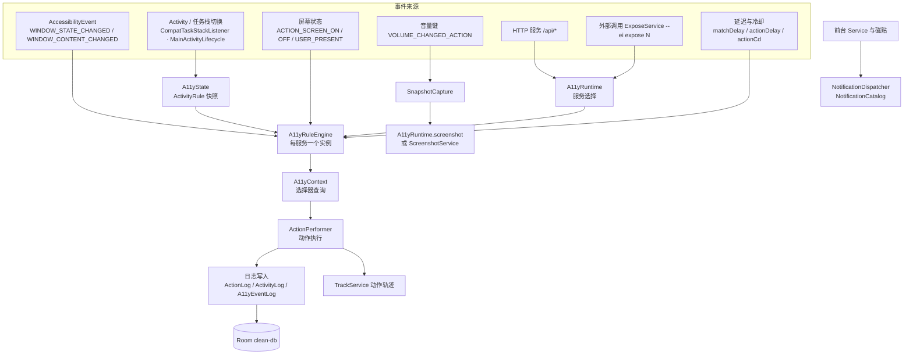
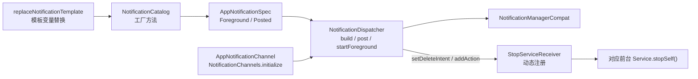

# 无障碍与自动化运行时

> 本文档描述 `clean-app` 中「把规则变成屏幕动作」的那一层：无障碍/自动化服务的接入与选择、前台状态与规则快照、一次事件的完整匹配流程、动作执行、Android 系统组件、通知、保活悬浮窗、截图与快照、日志。
> `clean-app/ARCHITECTURE.md` 是这一层分层与写入边界的**设计基线**，本文在其之上给出代码级细节；两者冲突时**以源码为准**。文中路径均为仓库相对路径（正斜杠），所有类名、函数名、字段名均取自仓库源码。

## 1. 定位与边界

这一层的职责是把「订阅里的一条规则」翻译成「对某个节点的一次动作」，并保证在屏幕状态、应用切换、服务重启等场景下状态不错乱。

| 代码域 | 路径 | 职责 |
| --- | --- | --- |
| 运行时门面与前台状态 | `clean-app/src/main/kotlin/li/gkd/app/a11y/A11yRuntime.kt`、`…/A11yState.kt` | 在无障碍服务与自动化服务之间选择并提供根节点/窗口/截图/动作入口；前台信息与规则选择的加锁更新、`ActivityRule` 快照发布、日志写入 |
| 引擎与节点查询 | `clean-app/src/main/kotlin/li/gkd/app/a11y/A11yRuleEngine.kt`、`…/A11yContext.kt` | 事件消费、查询调度、规则匹配、动作执行；把 `AccessibilityNodeInfo` 树适配给选择器并做缓存与中断 |
| 契约、事件扩展与运行期特性 | `clean-app/src/main/kotlin/li/gkd/app/a11y/A11yCommonImpl.kt`、`…/A11yExt.kt`、`…/A11yFeat.kt` | 两种运行时的公共接口；事件常量与封装、节点时间戳、选择器类型模型；屏幕状态监听、音量键截图、订阅自动更新、规则变更日志 |
| Android 组件 | `clean-app/src/main/kotlin/li/gkd/app/service/` | 无障碍服务、前台服务、磁贴、`OverlayWindowService` 基类 |
| 平台能力 | `clean-app/src/main/kotlin/li/gkd/app/platform/` | Service 启停、保活悬浮窗协调、`MediaProjection` 截屏会话、生命周期钩子 |

运行期组件在 `clean-app/src/main/kotlin/li/gkd/app/App.kt` 的 `initializeRuntimeComponents()` 中装配，其中与本层直接相关的是 `NotificationChannels.initialize()`、`initA11yFeat()`、`initPrivilege()`、`initA11yWhiteAppList()`、`clearHttpSubs()`。

## 2. 运行时拓扑



要点：

- `A11yRuleEngine` 是**每个服务实例一个**（`A11yCommonImpl.ruleEngine`），因此事件队列、节点缓存、延迟任务都跟随该服务的生命周期。
- 事件进入引擎后由单线程调度器 `eventDispatcher` 串行消费，查询与动作各自有独立的单线程调度器（`queryDispatcher` / `actionDispatcher`，模块级 `Executors.newSingleThreadExecutor()`）；状态（前台信息）与规则执行状态（计数、延迟）是两套东西——前者由 `A11yState` 发布快照，后者由规则对象自身持有。

## 3. 服务选择：`A11yRuntime`

`A11yRuntime` 是一个 `object`，它维护两个原子值 `latestServiceMode` / `latestServiceTime`，并以此为唯一依据在两种运行时之间选择。

| 模式 | 枚举 | 实现类 | 事件来源 | 根节点来源 | 截图来源 | 动作执行来源 |
| --- | --- | --- | --- | --- | --- | --- |
| 无障碍模式 | `AutomatorModeOption.A11yMode`（值 1） | `li.gkd.app.service.A11yService` | `onAccessibilityEvent` | `rootInActiveWindow` | `takeScreenshot(Display.DEFAULT_DISPLAY, …)`（API 30+） | `performAction` / `dispatchGesture` |
| 自动化模式 | `AutomatorModeOption.AutomationMode`（值 2） | `li.gkd.app.priv.AutomationService` | `UiAutomation.OnAccessibilityEventListener` | `uiAutomation.rootInActiveWindow` | `privilegeContextFlow.value?.screenshot()` | 特权进程 `tap` / `swipe`，回退到 `dispatchGesture` |

模式名与值来自 `clean-app/src/main/kotlin/li/gkd/app/util/Option.kt` 的 `AutomatorModeOption`；当前模式持久化在 `SettingsStore.automatorMode`，并派生 `useA11y` / `useAutomation` 两个只读属性。用户界面见 `clean-app/src/main/kotlin/li/gkd/app/feature/settings/WorkModePage.kt`（两个 `RadioButton`，标题取 `AutomatorModeOption.*.label`）。

### 3.1 选择规则

```kotlin
val service: A11yCommonImpl?
    get() = uiAutomationFlow.value?.takeIf(::isEffective) ?: A11yService.instance
```

- `isEffective(service)`：`latestServiceMode.value == service.mode.value`，即**最后连接成功的那种模式**胜出；`latestServiceMode` 初值为 `0`，与 `A11yMode`(1)/`AutomationMode`(2) 都不相等，因此两个服务都未连接时 `isEffective` 一律为 `false`，`service` 退化为 `A11yService.instance`（通常为 `null`）。
- 两种服务的连接入口都会调用 `A11yRuntime.onA11yConnected(this)`（`A11yService.onServiceConnected`、`AutomationService.connect`），其中会先取 `service.ruleEngine`、记录 `latestServiceMode` 与 `latestServiceTime`、调用 `engine.onA11yConnected()`，然后 `runMainPost(1000L)` 做**共存 1000ms 后关闭另一个服务**的处理，且只有当 `latestServiceTime` 未被更新的连接覆盖时才执行。
- `hasOtherService(service)`：无障碍模式看 `uiAutomationFlow.value != null`，自动化模式看 `A11yService.instance != null`。`A11yRuleEngine` 在构造时把它的结果存进 `private val hasOthersService`，用于判断「刚启动时是否还有其他服务可以立刻拿到根节点」。
- `A11yCommonImpl` 的成员即两种模式必须提供的最小面：`screenshot()`、`windowNodeInfo`、`windowInfos`、`scope`、`justStarted`、`mode`、`ruleEngine`、`shutdown(temp)`。顶层 `activityRuleFlow` / `topActivityFlow` / `currentTopActivity` 三个投影见 §4。

### 3.2 根节点 / 窗口 / 截图 / 动作入口

| 入口 | 行为 |
| --- | --- |
| `A11yRuntime.getRoot(service = this.service)` | 委托 `service.ruleEngine.safeActiveWindow`；`safeActiveWindow` 读取 `service.windowNodeInfo`、打上 `setGeneratedTime()` 时间戳，并**回写 `a11yContext.rootCache`**。读取可能抛异常，统一吞掉返回 `null` |
| `A11yRuntime.compatWindows()` / `onScreenForcedActive()` | 前者返回 `service.windowInfos`，异常时返回 `emptyList()`（`BarUtils` 用它判断状态栏可见性）；后者转发到 `service.ruleEngine.onScreenForcedActive()` |
| `A11yRuntime.screenshot()` | `service?.screenshot()` |
| `A11yRuntime.performActionBack()` | 先试特权 `privilegeContextFlow.value?.keyevent(KeyEvent.KEYCODE_BACK)`，失败再试 `A11yService.instance?.performGlobalAction(GLOBAL_ACTION_BACK)`。注意这里**直接使用 `A11yService.instance`**，不经过 `service` 选择 |
| `A11yRuntime.execAction(gkdAction)` | 一次性动作入口：`Selector.compile` → `selector.validateType(selectorTypeModel)` → 取 `service` 与 `root` → `A11yContext(getRoot = { getRoot(service) }, interruptable = false).querySelfOrSelector(root, selector, MatchOptions(fastQuery = gkdAction.fastQuery))` → 在 `Dispatchers.IO` 上 `ActionPerformer.getAction(...).perform(target, gkdAction)` |

`execAction` 的默认动作与规则路径不同：它使用 `gkdAction.action ?: ActionPerformer.None.action`，即**未指定动作时执行 `none`（空动作，直接返回成功）**。

## 4. `A11yState`：前台信息与规则选择

`A11yState` 用一个私有对象 `lock` 保护「前台信息 + 规则选择快照」的全部写入。

| 成员 | 语义 |
| --- | --- |
| `withTopActivityLock(block)` | `synchronized(lock, block)`。设计约束：涉及特权进程或 `PackageManager` 的**阻塞查询、判断、更新必须整体放进同一个临界区** |
| `activityRuleFlow: StateFlow<ActivityRule>` | 唯一的发布点。`ActivityRule` 是**不可变快照**，在锁内整体替换 |
| `currentRule: ActivityRule` | 加锁读取当前快照（`synchronized(lock) { activityRuleFlow.value }`）。需要「等更新临界区跑完」时用它 |
| `updateTopActivity(appId, activityId, scene, loc)` | 唯一的写入函数；文件私有成员 `lastValidActivity`、`lastActivityUpdateTime`、`lastActivityForceUpdateTime`、`tempActivityLogList`、`lastAppId` 都在锁内 |
| `onScreenForcedActive()` | 锁内以当前 `topActivity` 的 appId/activityId 重新调用 `updateTopActivity(..., ActivityScene.ScreenOn)` |

顶层还有三个投影/别名：

- `activityRuleFlow`：`A11yState.activityRuleFlow` 的同名只读转发。
- `topActivityFlow = activityRuleFlow.map { it.topActivity }.distinctUntilChanged()`：**只是展示投影**，供 UI/悬浮窗收集，不承担一致性职责。
- `currentTopActivity: TopActivity get() = activityRuleFlow.value.topActivity`：**无锁读取已发布快照**（`StateFlow.value`），是引擎热路径上读前台的默认方式。

### 4.1 `TopActivity` 与 `ActivityScene`

`TopActivity(appId, activityId, number)`，其中 `number` 表示同一 Activity 在去重窗口内被重复上报的次数（`isSame` 时为 `oldActivity.number + 1`，否则为 `0`）；`shortActivityId` 去掉 appId 前缀，`format()` 产出 `appId/短activityId/number`（`ActivityService` 与通知都用它展示）。

`ActivityScene` 有三个成员，决定去重与时间戳策略：`ActivityScene.A11y`（无障碍事件，与 `lastActivityForceUpdateTime` 比较：id 变化后 1000ms 内忽略、activityId 非空时 3000ms 内忽略，相同上报 1000ms 内忽略）、`ActivityScene.TaskStack`（`CompatTaskStackListener` 的 `ITaskStackListener` 回调，调用 `updateTopTaskAppId` 并把 `lastActivityForceUpdateTime` 置为当前时间，因为任务栈通常快于无障碍）、`ActivityScene.ScreenOn`（屏幕点亮，强制 `idChanged = true` 且不做相同上报去重）。

### 4.2 加锁更新的完整副作用

`updateTopActivity` 在锁内按顺序完成：

1. `scene == TaskStack` 时调用 `updateTopTaskAppId(appId)`（用于黑名单/白名单应用范围切换）。
2. 去重判断，计算新的 `number`，构造新的 `TopActivity`（`activityId` 为 `null` 时回退到 `lastValidActivity` 中同 appId 的 activityId）。
3. 累积 `ActivityLog` 到 `tempActivityLogList`，达到 **16 条或 `appId == META.appId`** 时一次性 `Db.activityLogDao.insert(*logs)`（`appScope.launchLogged`）。
4. 每 **100** 次调用触发一次 `Db.activityLogDao.deleteKeepLatest()`。
5. 读取 `SubscriptionState.ruleSummaryFlow.value`，当 **前台变化或规则汇总对象换引用**（`ruleChanged = oldActivityRule.ruleSummary !== ruleSummary`）时构造新的 `ActivityRule` 并发布。
6. appId 变化时：`Db.appLastVisitDao.insert(oldAppId, appId, t)`、更新全局 `appChangeTime`、对 `ruleSummary.globalRules`、旧 app 的规则、新前台的 `appRules` 调用 `resetState(t)`；否则按 `resetMatchType` 分别处理 `ResetMatchType.App`（`isFirstMatchApp` 时重置）、`Activity`（总是重置）、`Match`（新出现在 `currentRules` 中的规则才重置）。

### 4.3 `ActivityRule` 快照

`ActivityRule` 在**构造时**就把分组过滤算完，因此后续读取全部无锁、无副作用：

| 字段 | 计算方式 |
| --- | --- |
| `blockMatch` | `AppStore.checkAppBlockMatch(topActivity.appId)`（屏蔽列表命中即整块跳过匹配） |
| `appRules` | `ruleSummary.appIdToRules[topActivity.appId] ?: emptyList()` |
| `activityRules` | `blockMatch` 时为空，否则 `appRules.filter { it.matchActivity(appId, activityId) }` |
| `globalRules` | `blockMatch` 时为空，否则 `ruleSummary.globalRules.filter { it.matchActivity(...) }` |
| `currentRules` | `(activityRules + globalRules).sortedBy { it.order }` |
| `hasPriorityRule` / `activePriority` / `priorityRules` | 基于 `priorityTime`/`priorityActionMaximum` 的优先规则组：`isPriority()` 为真时参与插队排序 |
| `skipMatch` | `currentRules.all { !it.status.ok }`，为真时查询直接返回，避免无谓的节点读取 |
| `skipConsumeEvent` | `currentRules.all { !it.status.alive }`（`Status1`/`Status2`/`Status4` 视为不存活） |
| `hasFeatureAction` | 存在 `checkForced()` 且状态为 `StatusOk`/`Status5` 的规则，用于空转时的兜底轮询 |

`isActivity(appId, activityId)` 结合 `currentTopActivity.sameAs(...)` 与 `ActivityCache`（`LruCache<Pair<String,String>, Boolean>(256)`，通过 `packageManager.getActivityInfo` 校验该 Activity 是否真实存在）。

`withTopActivityLock` 的调用点共 6 处（`grep` 可复现）：`A11yRuleEngine.consumeEvent`（两次）、`A11yRuleEngine.fixAppId`、`A11yService.onDestroyed`、`ActivityService.onCreated`、`priv/CompatTaskStackListener`（三处重载）。新增写入路径时必须走这个锁，不能在调用方自建锁，也不能只锁最后的赋值。

## 5. `A11yRuleEngine`：一次事件的完整匹配流程

```mermaid
sequenceDiagram
    autonumber
    participant OS as 系统 / UiAutomation
    participant E as A11yRuleEngine
    participant S as A11yState
    participant C as A11yContext
    participant R as ResolvedRule
    participant P as ActionPerformer

    OS->>E: onA11yEvent(event)
    E->>E: isUseful / 副屏 / 输入法 / 自身事件过滤
    E->>E: toA11yEvent() + CONTENT_CHANGED 节流
    E->>E: EventService.logEvent(event)
    E->>E: eventDeque.addLast + scope.launch(eventDispatcher)
    E->>E: consumeEvent(headEvent) 合并同源事件
    E->>E: getTimeoutAppId() 判定前台
    E->>S: withTopActivityLock { isActivity / updateTopActivity }
    E->>E: skipConsumeEvent / enableMatch 门禁
    E->>E: interruptKey++ ; startQueryJob(byEvent)
    E->>E: queryAction() 读取 A11yState.currentRule
    E->>C: clearOldAppNodeCache / clearNodeCache
    loop priorityRules
        E->>E: checkOutDate / status / checkForced 过滤
        E->>C: queryRule(rule, node)
        E->>R: checkDelay() / performAction(node)
        R->>P: perform(node, rule)
        P-->>E: ActionResult
        E->>R: trigger()
        E->>S: addActionLog(...)
    end
```

### 5.1 事件接入（`onA11yEvent`）

门禁顺序（任一不满足即 `return`）：

1. `effective`（`A11yRuntime.isEffective(service)`）。
2. `event.isUseful()`：`packageName`、`className` 非空，且 `eventType and (STATE_CHANGED or CONTENT_CHANGED) != 0`（常量在 `A11yExt.kt`）。
3. `AndroidTarget.TIRAMISU` 及以上拒绝 `event.displayId != Display.DEFAULT_DISPLAY` 的副屏事件。
4. `onA11yFeatEvent(event)`：`STATE_CHANGED` 时走 `watchCaptureScreenshot()`；`packageName == launcherAppId` 时走 `watchAutoUpdateSubs()`。
5. `CONTENT_CHANGED` 要求 `isInteractive`（`A11yFeat.kt` 的屏幕状态广播维护），并丢弃「systemUi 但不是当前前台」的事件；输入法事件在 `packageName == imeAppId && currentTopActivity.appId != imeAppId` 且 `recordCount == 0 && action == 0 && !isFullScreen` 时丢弃；自身事件在 `(CONTENT_CHANGED || !MainActivityVisibility.isVisible) && packageName == META.appId` 时丢弃（GKD 自己更新 topActivity）。
6. `toA11yEvent()`（`className`/`packageName` 为 `null` 时返回 `null`）；`CONTENT_CHANGED` 限速：距 `lastContentEventTime` 不足 100ms、且距 `appChangeTime` 超过 5000ms、且距 `lastTriggerTime` 超过 3000ms 时丢弃。
7. `EventService.logEvent(event)` 落日志；`event.eventTime < lastEventTime` 的负时间事件丢弃；`STATE_CHANGED` 时记录 `latestStateEvent`；入 `eventDeque`；`scope.launch(eventDispatcher) { consumeEvent(a11yEvent) }`。

### 5.2 消费与前台校正（`consumeEvent`）

- 用 `sameAs`（`type`/`appId`/`name` 三者相同）把队首连续同源事件合并成 `consumedEvents`，并以最后一个作为 `latestEvent`。
- `getTimeoutAppId()`：先用 `withTimeoutOrNull(100.milliseconds)` 在 `Dispatchers.IO` 上读 `safeActiveWindowAppId`，超时则回退 `privilegeContextFlow.value?.topCpn()?.packageName`；结果缓存 100ms（`lastAppId`/`lastGetAppIdTime`）。
- `STATE_CHANGED` 且 `isActivity(evAppId, evActivityId)` 时，在 `A11yState.withTopActivityLock` 内 `updateTopActivity(evAppId, evActivityId)`。
- 当前前台与 `rightAppId` 不一致时，在锁内用特权 `topCpn()` 校正；拿不到就 `updateTopActivity(rightAppId, null)`。
- 门禁：`evAppId != rightAppId || activityRule.skipConsumeEvent || !storeFlow.value.enableMatch` 时返回。
- 事件转存到 `queryEvents`，`a11yContext.interruptKey++`，然后 `startQueryJob(byEvent = latestEvent)`。

### 5.3 查询调度（`startQueryJob` / `checkFutureStartJob`）

`startQueryJob(byEvent, byForced, byDelayRule)` 是 `@Synchronized` 的，门禁为：`effective`、`storeFlow.value.enableMatch`、`activityRuleFlow.value.currentRules` 非空、`querying == false`，以及 **`byEvent == null && service.justStarted && !hasOthersService` 时先走 `checkFutureStartJob()`**（无障碍从零启动时读取 `safeActiveWindow` 非常慢）。真正执行体是 `queryAction`，跑在 `queryDispatcher` 上，`finally` 中再次 `checkFutureStartJob()` 并复位 `querying`。

`checkFutureStartJob()`：3 秒内刚触发过动作或刚切换过应用（`lastTriggerTime` / `appChangeTime`）→ 300ms 后补一次普通查询；否则若 `hasFeatureAction` 为真 → 300ms 后补一次 `byForced = true` 的查询。

### 5.4 匹配与执行（`queryAction`）

顺序与真实分支：

1. 记录 `tempStateEvent = latestStateEvent`（后续 `checkOutDate` 用它判断「期间是否又有新状态事件」）。
2. 生成 `newEvents`：`delayRule != null`（延迟任务触发）时**不消耗事件**（`null`）；否则从 `queryEvents` 里取出。若存在类型/appId/className 不同的多事件则整体丢弃（用 root 查询）；若全部一致则取最后两个，在锁外比较节点身份。
3. 读取 `A11yState.currentRule`。
4. 为处于 `RuleStatus.Status3`（匹配延迟中）且 `matchDelayJob` 为空的规则调度 `startQueryJob(byDelayRule = rule)`。
5. `activityRule.skipMatch` 为真则返回。
6. 选择查询起点 `lastNode`：单事件用其 `safeSource`；两个事件时要求最后两个节点相同才使用；`lastNodeUsed` 保证节点只 `refresh()` 一次，刷新失败置 `null`。
7. `a11yContext.clearOldAppNodeCache()` 为假且 `byEvent != null` 时调用 `clearNodeCache(lastNode)`。
8. 遍历 `activityRule.priorityRules`：
   - `!effective` 直接 `return`；`checkOutDate(activityRule, tempStateEvent)` 为真就 `break`；`delayRule != null && delayRule !== rule`、`rule.status != RuleStatus.StatusOk`、`byForced && !rule.checkForced()` 三种情况跳过。
   - 取节点：`lastNode ?: getTimeoutActiveWindow()`（后者用 `suspendCancellableCoroutine` 在 500ms 后或读到 `safeActiveWindow` 时先到先得）。
   - `rightAppId = nodeVal.packageName`；`rule.matchActivity(rightAppId)` 为假且规则是 `AppRule` 时，`eventDispatcher` 上调用 `fixAppId(rightAppId)` 并 `return`；非 `AppRule` 则 `continue`。
   - `a11yContext.queryRule(rule, nodeVal)` 得到目标节点；`rule.checkDelay()` 为真（`actionDelay > 0` 且尚未开始延迟）→ 调度 `actionDelayJob` 后 `continue`；期间 `rule.status` 变化则 `break`；再次 `checkOutDate` 后 `break`。
   - `rule.performAction(target)`；成功时记录 `currentTopActivity`、`rule.trigger()`、300ms 后 `startQueryJob()` 复查、非 `none` 动作弹 `showActionToast(rule)`、`addActionLog(rule, topActivity, target, actionResult)`。

### 5.5 规则状态机（`ResolvedRule.status`）

`rule.status` 是**每次读取时现算**的，不是缓存状态：

| 状态 | 触发条件 | `alive` |
| --- | --- | --- |
| `RuleStatus.Status1` | `actionCount >= actionMaximum`（达到最大执行次数） | 否 |
| `RuleStatus.Status2` | 存在 `preKeys` 前置规则且都不等于 `lastTriggerRule` | 否 |
| `RuleStatus.Status3` | `matchDelay > 0` 且距 `matchChangedTime` 不足 `matchDelay` | 是 |
| `RuleStatus.Status4` | `matchTime != null` 且超过 `matchTime + matchDelay` | 否 |
| `RuleStatus.Status5` | 距 `actionTriggerTime` 不足 `actionCd`（冷却中） | 是 |
| `RuleStatus.Status6` | `actionDelayTriggerTime > 0` 且距其不足 `actionDelay` | 是 |
| `RuleStatus.StatusOk` | 以上都不满足 | 是 |

`status.ok`（仅 `StatusOk`）决定是否参与匹配；`status.alive`（非 1/2/4）决定 `skipConsumeEvent`。运行状态字段全部由 `atomic` 或 `@Volatile` 承载：`actionCount`、`actionTriggerTime`、`actionDelayTriggerTime`、`matchChangedTime`、`matchDelayJob`、`actionDelayJob`；`resetState(t)` 会取消两个延迟 Job 并把 `matchChangedTime` 置为 `t`。

其余调度细节：`fixAppId` 用 `withTopActivityLock` 校正前台后，在 `actionDispatcher` 上延迟 300ms 再 `startQueryJob()`；`checkOutDate(activityRule, stateEvent)` 的判据是「状态事件引用变了」或「`ActivityRule` 不再是 `A11yState.currentRule`」，用于让一次长查询在应用切换后尽快中止。

## 6. `A11yContext` / `A11yCommonImpl` / `A11yExt` / `A11yFeat`

| 类型 | 职责 | 关键成员 |
| --- | --- | --- |
| `A11yContext` | 把 `AccessibilityNodeInfo` 适配成 `li.gkd.selector.NodeAdapter`，并提供节点缓存的遍历、索引、关系遍历 | `queryRule(rule, node)`、`querySelfOrSelector(node, selector, options)`、`clearNodeCache(eventNode)`、`clearOldAppNodeCache()`、`interruptKey`、`currentRule`、`rootCache` |
| `A11yCommonImpl` | 两种运行时的公共接口，隔离 `AccessibilityService` 与 `UiAutomation` 的差异 | `screenshot()`、`windowNodeInfo`、`windowInfos`、`scope`、`justStarted`、`mode`、`ruleEngine`、`shutdown(temp)` |
| `A11yExt` | 事件与节点层面的通用扩展与常量 | `STATE_CHANGED`/`CONTENT_CHANGED`、`A11yEvent`、`AccessibilityEvent.toA11yEvent()`、`isUseful()`、`safeSource`、`setGeneratedTime()`/`isExpired()`、`getVid()`、`compatChecked`、`MAX_CHILD_SIZE = 512`、`MAX_DESCENDANTS_SIZE = 4096`、`selectorTypeModel`、`useEnabledA11yServicesFlow` / `useA11yServiceEnabledFlow` |
| `A11yFeat` | 与匹配无关的运行期特性，由 `initA11yFeat()` 装配 | `onA11yFeatEvent`、`watchCaptureScreenshot`、`watchAutoUpdateSubs`、`initRuleChangedLog`、`initCaptureVolume`、`initScreenStateReceiver`、`isInteractive` |

**`A11yContext` 只接收根节点读取回调**这一约束体现在它的唯一构造签名上：

```kotlin
class A11yContext(
    private val getRoot: () -> AccessibilityNodeInfo?,
    private val interruptable: Boolean = true,
)
```

它**不持有引擎、服务或 `A11yState` 的引用**，根节点完全由回调注入；`A11yRuleEngine` 传入 `{ safeActiveWindow }`，`A11yRuntime.execAction` 传入 `{ getRoot(service) }` 并置 `interruptable = false`（一次性动作不做优先规则插队中断）。这样既保证「一次查询固定使用被选中的服务」，又让根节点读取继续更新对应引擎的缓存（`safeActiveWindow` 会写 `a11yContext.rootCache`）。

`A11yNodeAdapter` 把选择器需要的属性映射为真实节点读取：`id` ← `viewIdResourceName`、`vid` ← `getVid()`（带单节点记忆 `tempVid`/`tempVidNode`）、`name`/`text`/`desc`、`clickable`/`focusable`/`checkable`/`checked`（`compatChecked`）/`editable`/`longClickable`/`visibleToUser`、`left`/`top`/`right`/`bottom`/`width`/`height`（`toHidden.boundsInScreen`）、`index`/`depth`/`childCount`/`parent`（走缓存）。缓存为三个 `LruCache`（`childCache`/`indexCache`/`parentCache`，容量 `MAX_DESCENDANTS_SIZE`）；`getCacheDepth` 用 `visitedNodes` 防止坏掉的父链成环。

`guardInterrupt()` 是中断机制：当 `interruptKey != interruptInnerKey`、当前规则存在、`activityRuleFlow.value.activePriority` 为真且当前规则不是优先规则时，抛出私有 `RuleMatchInterrupted : CancellationException()`，从而让旧规则的长查询让位给优先规则。

## 7. 动作类型

动作名与实现位于 `clean-app/src/main/kotlin/li/gkd/app/data/GkdAction.kt` 的 `ActionPerformer` 密封类；`ActionPerformer.getAction(action)` 在 `allSubObjects` 中按 `action` 字符串查找，**未匹配时回退到 `Click`**。参数模型是 `RawSubscription.LocationProps`（`position: Position?`、`swipeArg: SwipeArg?`），`Position.calc(rect)` 支持 `left/top/right/bottom/x/y` 六个表达式的组合，`SwipeArg(start, end, duration)`。

| `action` 值 | 实现 | 参数 | 行为 |
| --- | --- | --- | --- |
| `clickNode` / `click` | `ClickNode` / `Click` | `position`（`click` 可选） | `clickNode` 直接 `node.performAction(ACTION_CLICK)`；`click` 在 `node.isClickable` 时先试节点点击，否则走坐标点击。两者执行前都会 `TrackService.addA11yNodePosition(node)` |
| `clickCenter` | `ClickCenter` | `position`（可选） | 取节点 `boundsInScreen`，按 `position.calc(rect)` 或默认中心点；越界返回失败；先试特权 `tap`，否则 `dispatchGesture`（时长 `ViewConfiguration.getTapTimeout()`） |
| `longClickNode` / `longClickCenter` / `longClick` | `LongClickNode` / `LongClickCenter` / `LongClick` | `position`（`longClick*` 可选） | 节点版用 `ACTION_LONG_CLICK` 并在成功后 `delay(500)`；坐标版时长固定 `LongClickCenter.LONG_DURATION = 500L`（注释说明某些 ROM 的 `getLongPressTimeout()` 返回 300 会退化成普通点击）；`longClick` 在 `node.isLongClickable` 时先试节点版 |
| `back` | `Back` | 无（仍需要一个节点） | `A11yRuntime.performActionBack()` |
| `none` | `None` | 无 | 不做任何动作，直接返回 `result = true` |
| `swipe` | `Swipe` | `swipeArg.start/end/duration` | 先试特权 `swipe`（成功时 `ActionResult.shell = true`），否则用 `GestureDescription` 画线并 `delay(duration)` |

规则侧的动作选择在 `ResolvedRule` 的初始化中：

```kotlin
private val performer = ActionPerformer.getAction(rule.action
    ?: rule.position?.let { ActionPerformer.ClickCenter.action }
    ?: rule.swipeArg?.let { ActionPerformer.Swipe.action })
```

即：显式 `action` 优先；只给了 `position` → `clickCenter`；只给了 `swipeArg` → `swipe`；都没有 → `getAction(null)` 回退 `Click`。`ActionResult(action, result, shell, position)` 中 `shell` 标记该次动作由特权进程完成，`position` 记录实际落点。

## 8. Service 清单

以下表格与 `clean-app/src/main/AndroidManifest.xml` 逐条对应；`clean-app/src/gkd/AndroidManifest.xml` 只额外声明了 `REQUEST_INSTALL_PACKAGES`，不涉及本层组件。

| 类名（`li.gkd.app.service` 等） | 类型 | 触发方式 | 作用 | Manifest 关键属性 |
| --- | --- | --- | --- | --- |
| `com.google.android.accessibility.selecttospeak.SelectToSpeakService` | AccessibilityService | 系统按 `Settings.Secure.ENABLED_ACCESSIBILITY_SERVICES` 绑定 | 无障碍模式运行时；`A11yService` 的唯一子类（类名伪装见注释链接） | `exported="false"`、`permission=BIND_ACCESSIBILITY_SERVICE`、`meta-data android.accessibilityservice → @xml/a11y_info` |
| `A11yService`（抽象，未在 Manifest 注册） | AccessibilityService 基类 + `A11yCommonImpl` | 由子类被系统绑定 | 事件入口 `onAccessibilityEvent` → `ruleEngine.onA11yEvent`；连接时挂保活悬浮窗、通知 `A11yRuntime` | 无 |
| `StatusService` | 前台 Service（`specialUse`） | `StatusService.autoStart()`（`A11yService.onCreated`、`BaseTileService.onClick`、`ExposeService` expose=-1、`MainActivity`）与 `StatusService.start()`（特权 Binder 连接后 `needRestart` 成立时） | 常驻通知展示运行状态；按无障碍服务运行情况协调保活悬浮窗 | `exported="false"`、`PROPERTY_SPECIAL_USE_FGS_SUBTYPE` |
| `ScreenshotService` | 前台 Service（`mediaProjection`） | `ScreenshotService.start(intent)`，intent 来自 `MediaProjection` 授权结果（`SnapshotSettingsPage`） | 持有 `MediaProjectionScreenshotSession`，提供 `screenshot()` | `exported="false"`、`foregroundServiceType="mediaProjection"` |
| `HttpService` | 前台 Service（`specialUse`） | `HttpService.start()` / `HttpTileService` / `ServiceController.setHttpEnabled` | Ktor CIO 内嵌 HTTP 服务（端口随设置热重启） | `exported="false"` |
| `ButtonService` | 前台 Service（`specialUse`），继承 `OverlayWindowService` | `ButtonService.start()` / `ButtonTileService` | 悬浮截图按钮：点击 `SnapshotCapture.capture()`，长按 `stopSelf()` | `exported="false"` |
| `ActivityService` | 前台 Service（`specialUse`），继承 `OverlayWindowService` | `ActivityService.start()` / `ActivityTileService` | 悬浮显示当前前台 appId/activityId/number | `exported="false"` |
| `EventService` | 前台 Service（`specialUse`），继承 `OverlayWindowService` | `EventService.start()` / `EventTileService` | 悬浮展示无障碍事件日志；作为 `A11yEventLog` 的唯一写入点 | `exported="false"` |
| `TrackService` | 前台 Service（`specialUse`） | `TrackService.start()`（设置页 `AdvancedVm`） | 动作轨迹悬浮层（点击点/滑动线），`addA11yNodePosition` / `addXyPosition` / `addSwipePosition` | `exported="false"` |
| `ExposeService` | 普通 `Service` | 外部 `am start-foreground-service -n <组件> --ei expose N [--es data S]` | 外部调用入口（见 §12） | `exported="true"`（`tools:ignore="ExportedService"`） |
| `GkdTileService`、`SnapshotTileService` | TileService | 用户点击磁贴；`GkdTileService.onStartListening` 时按设置尝试修复/重启自动化服务 | 前者开关无障碍/自动化服务（`switchAutomatorService()`）；后者先 `back` 等前台 appId 变化，再 `SnapshotCapture.capture(forcedCropStatusBar = true)` | 均 `exported="true"` + `BIND_QUICK_SETTINGS_TILE`；`QS_TILE_URI` 分别为 `gkd://page`、`gkd://page/2`（`SnapshotTileService` 无 `TOGGLEABLE_TILE`） |
| `HttpTileService`、`ButtonTileService`、`MatchTileService`、`ActivityTileService`、`EventTileService` | TileService | 用户点击磁贴 | 依次开关 `HttpService`、`ButtonService`、`AppStore.toggleEnableMatch()`、`ActivityService`、`EventService` | 均 `exported="true"` + `BIND_QUICK_SETTINGS_TILE` + `TOGGLEABLE_TILE=true`；`QS_TILE_URI` 依次为 `gkd://page/1`、`gkd://page/1`、`gkd://page?tab=1`、`gkd://page/1`、`gkd://page/1` |
| `StopServiceReceiver`（`li.gkd.app.notif`） | BroadcastReceiver（**运行时注册**） | 通知的删除意图与「停止」按钮 | 按类名匹配并 `stopSelf()` 发起通知的 Service | **无**（不写入 Manifest） |
| `BaseTileService` / `OverlayWindowService` / `LifecycleHookService` / `ServiceEffects.kt` | 抽象基类与扩展 | — | 磁贴活跃态订阅、悬浮窗窗口与拖动、生命周期回调分发、`useServicePresence` / `useStopServiceReceiver` | **无**（不注册组件） |

`BaseTileService` 的统一行为：`onStartListening` 里若距 `lastA11yFixTime` 超过 3 秒就调用 `fixRestartAutomatorService()`（定义在 `clean-app/src/main/kotlin/li/gkd/app/service/GkdTileService.kt`），并用 `activeFlow` 驱动 `qsTile.state`；`onClick` 先 `StatusService.autoStart()` 再执行 `onTileClick()`。

### 8.1 `service` 包名为什么不能改

`clean-app/src/main/kotlin/li/gkd/app/service/` 承载的是**系统侧身份**，而不是普通代码组织：

- 无障碍服务在 `Settings.Secure.ENABLED_ACCESSIBILITY_SERVICES` 中按 `ComponentName` 保存；`A11yService.a11yCn` 就是 `SelectToSpeakService::class.componentName`，`GkdTileService.switchA11yService()` / `fixA11yService()` 直接用它增删该集合。磁贴组件同样由系统设置按 `ComponentName` 记住用户添加的磁贴，`QS_TILE_URI` 与 `QS_TILE_PREFERENCES` 也绑定在这些组件上。
- `ExposeService.initCommandFile()` 把 `ExposeService::class.componentName.flattenToShortString()` 写进 `expose.sh`，改名等于破坏既有脚本；`StopServiceReceiver` 用 `service::class.jvmName` 作为停止目标标识。

`clean-app/ARCHITECTURE.md` 与 `docs/02-architecture.md` 都明确：**只迁移调用边界（经 `platform/` 与 UI 解耦），不修改组件类名与包名**。需要改行为时新增 `platform/` 或 `data/` 层的薄封装，不要动这里的类名。

## 9. 通知体系



四个类型的职责边界：

| 类型 | 文件 | 职责 |
| --- | --- | --- |
| `AppNotificationChannel` / `NotificationChannels` | `clean-app/src/main/kotlin/li/gkd/app/notif/NotificationChannels.kt` | 定义两个渠道：`Service`（id `"0"`）与 `Snapshot`（id `"1"`，标签 `UiStrings.snapshot_notification_channel`），默认 `IMPORTANCE_LOW`；`initialize()` 会**删除不在枚举内**的旧渠道后重建 |
| `ForegroundNotificationKey` / `PostedNotificationKey` / `AppNotificationSpec` / `ForegroundNotification` / `PostedNotification` / `NotificationCatalog` | `clean-app/src/main/kotlin/li/gkd/app/notif/NotificationCatalog.kt` | 通知的**身份与规格**（固定 id、渠道、图标、标题、正文、跳转 uri、是否常驻、是否自动取消、可停止的 Service 类）与规格工厂：`status` / `screenshot` / `button` / `http(port, ips)` / `expose` / `snapshotSaved(...)` / `activity(text)` / `event` / `track` |
| `NotificationDispatcher` | `clean-app/src/main/kotlin/li/gkd/app/notif/NotificationDispatcher.kt` | 真正构建与投递：`PendingIntent.getActivity`（`MainActivity`，`FLAG_ACTIVITY_NEW_TASK`，`data = uri.toString().toUri()`）、`post()`、`startForeground()`；`stopService` 存在时挂 `setDeleteIntent` 与「停止」动作 |
| `StopServiceReceiver` | `clean-app/src/main/kotlin/li/gkd/app/notif/StopServiceReceiver.kt` | 动态注册 `RECEIVER_NOT_EXPORTED`，action 为 `${META.appId}.STOP_SERVICE`，额外信息是目标类的 `jvmName` |

固定 id：`Status=100`、`Screenshot=101`、`Button=102`、`Http=103`、`Expose=104`、`Activity=106`、`Event=107`、`Track=108`，已发布（非前台）通知 `SnapshotSaved=105`。

模板变量机制：`NotificationTemplate.kt` 的 `String.replaceNotificationTemplate(ruleSummary, count)` 做四次字面替换——`${i}` → `ruleSummary.globalGroups.size`、`${k}` → `ruleSummary.appSize`、`${u}` → `ruleSummary.appGroupSize`、`${n}` → `actionCountFlow` 的累计触发次数。默认模板由字符串资源提供，其字面值经 `clean-app/src/test/kotlin/li/gkd/app/text/UiStringsFormattingTest.kt` 断言为 `${i}全局/${k}应用/${u}规则/${n}触发`（`UiStrings` 由 `buildSrc` 的 `GenerateUiStringsTask` 生成，源码中不存在该文件）。**注意**：动作 Toast 用的是另一套机制，`clean-app/src/main/kotlin/li/gkd/app/util/ActionToastTemplate.kt` 只替换 `${1}`/`${2}`/`${3}`（规则名/组名/计数）。

`NotificationDispatcher.startForeground` 的两道防御：Android 14+ 若服务声明了 `specialUse` 类型则先检查 `PermissionStates.foregroundServiceSpecialUse`，不满足就 `stopSelf()` 并返回 `false`；系统自动重启的服务仍可能抛 `SecurityException`，因此捕获后再 `stopSelf()`。`StatusService` 的 `statusTriple()` 就是「通知文案的决策树」：权限受限 → 特权服务断连 → 两种服务都未运行 → `enableMatch` 关闭 → 自定义模板或 `ruleSummary.statusText(count)`。

## 10. 保活与悬浮窗

### 10.1 保活悬浮窗协调：`KeepAliveOverlayCoordinator`

`clean-app/src/main/kotlin/li/gkd/app/platform/overlay/KeepAliveOverlayCoordinator.kt` 是**唯一**的保活悬浮窗管理者，两个来源互斥但可交接：

| 成员 | 说明 |
| --- | --- |
| `Source.Status` / `Source.Accessibility` | 两个来源，各自对应一个 `KeepAliveOverlay`（1×1 像素、`FLAG_NOT_TOUCHABLE or FLAG_NOT_FOCUSABLE`、`Gravity.START or TOP`） |
| `acquire(source, owner, context, windowType)` / `release(source, owner)` | 前者 `@Synchronized`：同 owner 重复获取直接返回 `true`，否则创建新悬浮窗并关闭旧的，创建失败（`runCatching`）返回 `false`；后者只有 owner 匹配才释放，避免误关他人的悬浮窗 |
| `releaseAfterHandoff(source, owner, replacement)` | 若给了 `replacement`，先最多等 `HANDOFF_DELAY_MILLIS = 1_000L` 等它挂上，再延迟 1 秒释放自己 |
| `statusAttached` / `accessibilityAttached` | 供 `StatusService` 观察的 `StateFlow<Boolean>` |

窗口类型按来源区分：`A11yService.attachKeepAliveOverlay()` 用 `WindowManager.LayoutParams.TYPE_ACCESSIBILITY_OVERLAY`；`StatusService` 用 `TYPE_APPLICATION_OVERLAY`（需要悬浮窗权限）。交接逻辑：无障碍服务在 `onDestroyed` 中调 `releaseAfterHandoff(replacement = Source.Status.takeIf { StatusService.isRunning.value })`；`StatusService` 在 `onCreated` 中 `combine(A11yService.isRunning, accessibilityAttached)`——两者都就绪时把自己的悬浮窗交接出去，否则由它自己 `acquire`。

### 10.2 `OverlayWindowService`：可拖动悬浮窗基类

`clean-app/src/main/kotlin/li/gkd/app/service/OverlayWindowService.kt` 是抽象基类（`LifecycleHookService` + `SavedStateRegistryOwner`），`ActivityService` / `EventService` / `ButtonService` 继承它，各自传入 `positionKey`：

- 位置持久化在 `ShareContext.positionMapFlow`（`FileStateStore.createJsonFlow("overlay_position")`），键即 `positionKey`；拖动结束后 `debounce(300ms)` 写回；所有实例共享一个 `ShareContext` 引用计数（`acquireShareContext()` / `ShareContextLease`），计数归零才取消 scope。
- 窗口类型固定为 `WindowManager.LayoutParams.TYPE_APPLICATION_OVERLAY`，flag 为 `FLAG_NOT_FOCUSABLE or FLAG_LAYOUT_NO_LIMITS or FLAG_LAYOUT_IN_SCREEN`；`ShareContext` 还会监听 `topActivityFlow`，连续 6×500ms 轮询悬浮窗权限，从有到无时提示 `UiStrings.overlay_screen_denied`。
- 拖动/点击/长按在同一 `setOnTouchListener` 中实现：超过 `scaledTouchSlop` 记为拖动，`ACTION_UP` 且时长不超过 `ViewConfiguration.getTapTimeout()` 才触发 `onClickView()`，长按 500ms 触发 `onLongClickView()`；越界由 `fixLimitXy` 用 300ms `ValueAnimator` 回弹。
- `withAllOverlaysHidden { ... }` 通过 `overlayContentHidden` + 一帧回调让截图/快照不拍到悬浮窗自身，`ButtonService.onClickView()` 就是「隐藏全部悬浮窗 → `SnapshotCapture.capture()`」；`ClosableTitle(title, onMinimizeRequest, ...)` 提供统一的拖拽图标、最小化与关闭按钮（关闭直接 `stopSelf()`）；静态成员 `isAnyAlive` 用 `aliveSize` 计数，`onDestroyed` 里 `runMainPost(1000) { aliveSize-- }` 故意延迟递减。

### 10.3 工作模式

`clean-app/src/main/kotlin/li/gkd/app/feature/settings/WorkModePage.kt`（配套 `WorkModeVm.kt`，仅每秒 `PermissionStates.refreshAll()`）用两张 `Card` + `RadioButton` 呈现模式选择：

| 卡片 | 选择的模式 | 前置条件 | 相关文案常量 |
| --- | --- | --- | --- |
| 第一张 | `AutomatorModeOption.A11yMode`（无障碍模式） | 无障碍服务已启用或无 `WRITE_SECURE_SETTINGS` 时可用 `IntentUtils.openA11ySettings()` 引导授权；已就绪时显示「已就绪」 | `work_mode_basic`、`work_mode_enhanced`、`a11y_permission_grant`、`secure_settings_permission_*`、`keep_alive_*` |
| 第二张 | `AutomatorModeOption.AutomationMode`（自动化模式） | `privilegeContextFlow.value != null`，否则引导到 `PrivilegeServiceRoute` | `automation_a11y_description`、`automation_no_display_issues`、`automation_undetectable_a11y`、`automation_scope_compatibility_hint`、`privilege_service_connected` |

模式切换本身由 `MainViewModel.updateAutomatorMode(...)` 落到 `AppStore.updateAutomatorMode`，它会把 `enableAutomator` 置为 `false`；真正启停服务的仍是 `fixRestartAutomatorService()` 与 `initA11yWhiteAppList()` 的白名单/黑名单联动（`topAppIdFlow` 变化 → 前台应用是否需要无障碍）。

## 11. 截图与快照

三条截图路径按优先级合并（`SnapshotCapture.captureScreen`）：先 `A11yRuntime.screenshot()`（`A11yService.takeScreenshot` 或 `AutomationService` 的特权 `screenshot()`）；失败时回退 `ScreenshotService.screenshot()`（`MediaProjection`，带 `withTimeoutOrNull(5000.milliseconds)`）；两者都拿不到时按 `FLAG_SECURE` 判定的结果生成**占位图**（`createBlankScreenshotBitmap()` 全黑 / `createMissingScreenshotBitmap()` 画提示文字）。

| 组件 | 文件 | 职责 |
| --- | --- | --- |
| `ScreenshotService` | `clean-app/src/main/kotlin/li/gkd/app/service/ScreenshotService.kt` | 前台服务；`onStartCommand` 用 `ResourceSlot<MediaProjectionScreenshotSession>` 原子替换会话，会话失效回调经 `runMainPost` 判定后 `stopSelf()` |
| `MediaProjectionScreenshotSession` | `clean-app/src/main/kotlin/li/gkd/app/platform/screenshot/MediaProjectionScreenshotSession.kt` | 独占 `HandlerThread("gkd-screenshot")`；`ImageReader` + `VirtualDisplay` 抓帧，按 `rowStride/pixelStride` 还原宽度；`TerminationReason`（`ProjectionStopped`/`Closed`/`InitializationFailed`）统一收尾并回调 `onInvalidated`；全透明帧被丢弃 |
| `SnapshotCapture` | `clean-app/src/main/kotlin/li/gkd/app/snapshot/SnapshotCapture.kt` | `object`；`captureMutex.tryLock()` 保证串行（`isCapturing` 暴露给 `A11yFeat.watchCaptureScreenshot`）；并发取根节点节点列表、`resolveActivityId`、截图，落盘后按设置 `autoSaveSnapshotToDownloads` 另存下载目录，最后发 `PostedNotificationKey.SnapshotSaved` |
| `SnapshotFileLayout`、`SnapshotDirectoryTransaction`、`SnapshotScreenshotStatus` | `clean-app/src/main/kotlin/li/gkd/app/snapshot/` | 目录布局（已提交 `<id>/`、暂存 `.<id>.tmp/`，文件 `<id>.json`/`<id>.min.json`/`<id>.webp`/旧版 `<id>.png`）与 `hasSupportedImageHeader()` 魔数校验；`commitSnapshotDirectory(layout, id, write, publish)` 写暂存 → `ensureActive()` → `withContext(NonCancellable)` 内 `renameTo` + `publish()`，失败分别回滚；`Captured`/`Unavailable`/`LikelyProtected` 三态与 `detailText()` |

判定细节：自动化模式 + Android 14+ 会**先**检查前台窗口 `FLAG_SECURE`（`privilegeContext.isFocusedWindowSecure(appId)`）再决定是否调用特权截图，避免 `IWindowManager.captureDisplay` 在保护窗口上等到系统超时；截图「看起来全黑」时（`looksLikeBlankScreenshot()`：缩到 64×64、忽略 8% 边缘、方差 < 15、近黑比例 > 0.85、均值 < 15）会再查一次 `FLAG_SECURE` 以决定是 `LikelyProtected` 还是 `Captured`。`hideSnapshotStatusBar` 且状态栏可见（或 `forcedCropStatusBar`）时 `cropStatusBar()` 会把状态栏区域涂成透明。

快照落盘由 `clean-app/src/main/kotlin/li/gkd/app/data/snapshot/SnapshotRepository.kt` 的 `save(snapshot, bitmap)` 驱动：写 `<id>.webp`（`webpLossyCompressFormat`，质量 85）、`<id>.json`、`<id>.min.json`，提交阶段再 `snapshotDao.insert(snapshot.toSnapshot())`。同一 `mutationMutex` 也保护 `delete` / `replaceScreenshot` / `createArchive` / `markUploaded`。

磁贴侧的差异：本快照中**不存在 `ScreenshotTileService`**；截图由 `SnapshotTileService` 与 `ButtonTileService`（只开关 `ButtonService`，实际截图靠悬浮按钮）触发，且**只有 `SnapshotTileService` 会先返回桌面**——它在 `appScope.launchUi(Dispatchers.IO)` 中循环读取 `A11yRuntime.getRoot(service)?.packageName`，若前台未变则 `A11yRuntime.performActionBack()`，3 秒超时则提示并回退，appId 变化后 `SnapshotCapture.capture(forcedCropStatusBar = true)`；它的 `activeFlow = flowOf(false)`，因此磁贴永远显示未激活。

## 12. HTTP 服务与外部调用

### 12.1 `HttpService`

`clean-app/src/main/kotlin/li/gkd/app/service/HttpService.kt`，Ktor `embeddedServer(CIO, port)`：

- 端口与监听：端口来自 `storeFlow.value.httpServerPort`，**默认 `8888`**（`clean-app/src/main/kotlin/li/gkd/app/data/settings/SettingsStore.kt`）；`httpServerPortFlow` 变化会 `collectLatest` 重启服务器，重启前用 `NetworkUtils.isPortAvailable(port)` 检查占用，占用或启动失败即 `stopSelf()`。代码中**没有显式指定 host**，监听地址取决于 Ktor CIO 默认值（本文未在设备上验证具体绑定地址，不做断言）；通知里展示的是 `NetworkUtils.getIpAddressInLocalNetwork()`（空则 `127.0.0.1`）。
- 全局 CORS 插件（`KtorCorsPlugin`）对每个响应写入 `Access-Control-Allow-Origin/Methods/Headers/Expose-Headers: *` 与 `Access-Control-Allow-Private-Network: true`，并对 `OPTIONS` 直接返回 `all-cors-ok`。
- 错误插件（`KtorErrorPlugin`）把 `RpcError` 原样返回，其他异常包成 `RpcError(unknown = true)`。

路由表（含请求/响应类型）：

| 方法 | 路径 | 请求 | 响应 |
| --- | --- | --- | --- |
| GET | `/` | — | HTML：`<script type='module' src='$SERVER_SCRIPT_URL'></script>`（`SERVER_SCRIPT_URL` 定义在 `clean-app/src/main/kotlin/li/gkd/app/util/Constants.kt`） |
| POST | `/api/getServerInfo` | — | `ServerInfo(device: DeviceInfo, gkdAppInfo: AppInfo)` |
| POST | `/api/getSnapshot` | `ReqId(id: Long)` | 快照 JSON 文件（`SnapshotRepository.snapshotFile`），不存在抛 `RpcError` |
| POST | `/api/getScreenshot` | `ReqId` | 截图文件（`SnapshotRepository.screenshotFile`） |
| POST | `/api/captureSnapshot` | — | `SnapshotCapture.capture()` 得到的 `ComplexSnapshot` |
| POST | `/api/getSnapshots` | — | 最近快照列表（`SnapshotRepository.snapshots().first()` + `getMinSnapshot`，单个失败即忽略） |
| POST | `/api/deleteSnapshot` | `ReqId` | `RpcOk` 或 `RpcError` |
| POST | `/api/updateSubscription` | `RawSubscription.parse(文本, json5 = false)` | 以 `LOCAL_HTTP_SUBS_ID` 保存为「内存订阅」（`SubscriptionRepository.saveWithItem`），返回 `RpcOk` |
| POST | `/api/execSelector` | `GkdAction` | `A11yRuntime.execAction(gkdAction)` 的 `ActionResult` |

服务销毁时若 `storeFlow.value.autoClearMemorySubs` 为真，删除 `LOCAL_HTTP_SUBS_ID`；`clearHttpSubs()` 在应用启动时兜底清理（进程被划掉时不会走 `onDestroyed`）。

### 12.2 `ExposeService`

`exported="true"` 的普通 `Service`，`onBind` 返回 `null`，`onStartCommand` 中 `appScope.launchUi { handleIntent(intent) }`，`finally` 里 `runMainPost(1000) { stopSelf() }`；`onCreate` 会先 `NotificationCatalog.expose().startForeground()`（该通知**没有** `stopService`）。

| `expose` 值 | 行为 |
| --- | --- |
| `-1` | `StatusService.autoStart()` |
| `0` | `SnapshotCapture.capture()` |
| `1` | 提示 `UiStrings.execution_success` 并 `RuntimeStateSynchronizer.requestSync()` |
| 其他 | 提示 `UiStrings.external_call_unknown(expose, data)` |

`initCommandFile()` 会在 `FolderUtils.shFolder/expose.sh` 写一段脚本，用 `am start-foreground-service -n <ExposeService 短组件名> --ei expose $1 [--es data $2]` 调起。

### 12.3 `TrackService`

**不提供任何跨进程接口**，只以 `companion object` 的进程内函数被动作实现调用：`addA11yNodePosition(node)`、`addXyPosition(x, y)`、`addSwipePosition(startX, startY, endX, endY, duration)`。每次调用创建 `TYPE_APPLICATION_OVERLAY` 的 `ComposeView` 图层（`PointFloatLayer` / `SwipePointFloatLayer`），`tapDelay = 100L` 后挂上、`missDelay = 7500L` 后移除（滑动再加 `duration`）；Android 12+ 用 `app.inputManager.maximumObscuringOpacityForTouch` 与重叠计数（`recalcOverlappingAlpha()`）压低 alpha，避免遮挡触摸。旋转时通过 `TrackPoint.getCurCenter()` 在屏幕坐标与物理坐标之间换算。

### 12.4 端口与路由的确定性说明

- **确定**：端口来自 `SettingsStore.httpServerPort`（默认 `8888`）；路由为上表九条（`GET /` 与八个 `/api/*`）。
- **不确定 / 无**：代码未传 host 参数，监听地址取决于 Ktor CIO 默认值（未在设备上验证）；全链路**没有任何鉴权或令牌逻辑**，安全性取决于监听地址与 CORS 配置，本文不给出安全性结论。

## 13. 日志与事件

三张日志表 + 一张访问记录表，写入点与裁剪策略如下。

| 数据 | 实体 / DAO | 写入点 | 裁剪策略 |
| --- | --- | --- | --- |
| 无障碍事件日志 | `clean-db/src/commonMain/kotlin/li/gkd/db/A11yEventLog.kt`（表 `a11y_event_log`，主键 `id: Int`，**非 autoGenerate**，由 `EventService` 的 `logAutoId` 递增分配） | `A11yRuleEngine.onA11yEvent` 调用 `EventService.logEvent(event)`；`EventService` 用 `tempEventListFlow` 缓冲，`lifecycleScope` 每 **1000ms** `flushEventLogs()`（`withContext(NonCancellable)`）批量 `Db.a11yEventLogDao.insert(list)`；`logAutoId` 初值取 `maxId()` | 内存列表 `eventLogs` 超过 256 条时 `removeRange(0, 64)`；`eventLog.id % 100 == 0` 时 `Db.a11yEventLogDao.deleteKeepLatest()`；DAO 的 SQL 保留**最新 1000 条** |
| 动作日志 | `clean-db/src/commonMain/kotlin/li/gkd/db/ActionLog.kt`（表 `action_log`，自增主键） | `A11yState.addActionLog(rule, topActivity, target, actionResult)`（同文件的顶层函数），在 `appScope.launchLogged(Dispatchers.IO)` 内由 `actionLogMutex` 串行执行 `Db.actionLogDao.insert(actionLog)` | 插入后若 `actionCountFlow.value % 100 == 0L` 则 `deleteKeepLatest()`；DAO 的 SQL 保留**最新 500 条**。字段含 `subsId`/`subsVersion`/`groupKey`/`groupType`/`ruleIndex`/`ruleKey` |
| 前台变化日志 | `clean-db/src/commonMain/kotlin/li/gkd/db/ActivityLog.kt`（表 `activity_log`，自增主键） | `A11yState.updateTopActivity` 累积到 `tempActivityLogList`，达到 **16 条或 `appId == META.appId`** 时 `Db.activityLogDao.insert(*logs)` | 每 **100** 次 `updateTopActivity` 调一次 `deleteKeepLatest()`；DAO 的 SQL 按 `ctime` 保留**最新 500 条** |
| 应用访问记录 | `clean-db/src/commonMain/kotlin/li/gkd/db/AppLastVisit.kt`（表 `app_last_visit`） | `clean-app/src/main/kotlin/li/gkd/app/data/AppLastVisitExt.kt` 的 `AppLastVisitDao.insert(oldAppId, newAppId, lastVisitTime)`，在同一 `Db.withTransaction` 内同时写新旧两个 appId | 每 **100** 次调用 `deleteKeepLatest()`（DAO 保留最新 500 条）。`fixAppVisitTime` 会对 `META.appId` 减 120 秒、对 `launcherAppId`/`systemUiAppId` 减 60 秒，避免自身与桌面抢排序 |

事件日志的写入前置条件由 `EventService.logEvent` 把关：`instance != null`、`logAutoId != 0`、且 `event.packageName != META.appId`。

`clean-app/src/main/kotlin/li/gkd/app/data/` 下的三个 `*LogExt.kt` 只提供展示用扩展，不写库：`A11yEventLogExt.kt`（`AccessibilityEvent.toA11yEventLog(id)`、`isStateChanged`、`fixedName`、`viewSuffixes`）、`ActionLogExt.kt`（`showActivityId`、`date`）、`ActivityLogExt.kt`（`showActivityId`、`date`）。`AppLastVisitExt.kt` 则同时提供写入函数与时间修正。

其他与本层相关的日志：`A11yRuleEngine.onA11yEvent` 在 `META.debuggable` 时用 tag `onNewA11yEvent` 打印事件类型/时间差/包名/类名；`startQueryJob` 用 tag `A11yRuleEngine` 打印耗时；`A11yState.updateTopActivity` 用 tag `updateTopActivity` 打印前台迁移；`A11yFeat.initRuleChangedLog()` 对 `activityRuleFlow` 做 `debounce(300).drop(1)` 并在 `enableMatch` 且规则非空时打印每条规则的 `statusText()`。

## 14. 关键文件索引

| 仓库相对路径 | 职责 |
| --- | --- |
| `clean-app/src/main/kotlin/li/gkd/app/a11y/A11yRuntime.kt`、`…/A11yState.kt`、`…/A11yRuleEngine.kt`、`…/A11yContext.kt` | 服务选择与统一入口；加锁前台状态与 `ActivityRule` 快照；事件消费与规则匹配；节点适配、缓存与中断 |
| `clean-app/src/main/kotlin/li/gkd/app/a11y/A11yCommonImpl.kt`、`…/A11yExt.kt`、`…/A11yFeat.kt` | 两种运行时的公共接口；事件常量与节点扩展；屏幕状态、音量键截图、订阅自动更新、规则变更日志 |
| `clean-app/src/main/kotlin/li/gkd/app/service/A11yService.kt`、`…/BaseTileService.kt`、`…/OverlayWindowService.kt`、`…/LifecycleHookService.kt`、`…/ServiceEffects.kt` | 无障碍服务实现与 `a11yCn`；磁贴基类；悬浮窗基类（拖动、位置持久化、`withAllOverlaysHidden`）；生命周期分发与 `useServicePresence` / `useStopServiceReceiver` |
| `clean-app/src/main/kotlin/li/gkd/app/service/GkdTileService.kt` | 自动化服务开关、白/黑名单联动、`topAppIdFlow`、`fixRestartAutomatorService` |
| `clean-app/src/main/kotlin/li/gkd/app/service/HttpService.kt`、`…/ExposeService.kt` | Ktor 服务与全部 HTTP 路由；外部调用入口与 `expose.sh` 生成 |
| `clean-app/src/main/kotlin/li/gkd/app/service/ScreenshotService.kt`、`…/StatusService.kt`、`…/TrackService.kt` | `MediaProjection` 前台服务与会话托管；常驻状态通知与保活悬浮窗协调；动作轨迹悬浮层 |
| `clean-app/src/main/kotlin/li/gkd/app/service/ActivityService.kt`、`…/EventService.kt`、`…/ButtonService.kt` | 三个 `OverlayWindowService` 子类；`EventService` 同时是 `A11yEventLog` 的唯一写入点 |
| `clean-app/src/main/kotlin/li/gkd/app/service/*TileService.kt` | 七个磁贴：`GkdTileService`、`SnapshotTileService`、`HttpTileService`、`ButtonTileService`、`MatchTileService`、`ActivityTileService`、`EventTileService` |
| `clean-app/src/main/kotlin/li/gkd/app/snapshot/SnapshotCapture.kt`、`…/SnapshotFileLayout.kt`、`…/SnapshotDirectoryTransaction.kt`、`…/SnapshotScreenshotStatus.kt` | 快照捕获编排；目录布局与图片魔数校验；原子目录事务；截图状态枚举 |
| `clean-app/src/main/kotlin/li/gkd/app/platform/screenshot/MediaProjectionScreenshotSession.kt`、`…/platform/overlay/KeepAliveOverlayCoordinator.kt`、`…/platform/service/ServiceController.kt` | `VirtualDisplay` + `ImageReader` 抓帧会话；保活悬浮窗来源协调与交接；页面侧统一的 Service 启停入口 |
| `clean-app/src/main/kotlin/li/gkd/app/platform/lifecycle/LifecycleHooks.kt`、`…/MainActivityLifecycle.kt`、`…/ResourceSlot.kt`、`…/RuntimeStateSynchronizer.kt` | 生命周期钩子实现；`MainActivityVisibility` 与自身前台上报；可替换资源的原子槽位；合并后的运行时状态同步 |
| `clean-app/src/main/kotlin/li/gkd/app/notif/NotificationCatalog.kt`、`…/NotificationChannels.kt`、`…/NotificationDispatcher.kt`、`…/NotificationTemplate.kt`、`…/StopServiceReceiver.kt` | 通知规格与固定 id；渠道定义与初始化；构建/投递/`startForeground`；`${i}`/`${k}`/`${u}`/`${n}` 模板替换；停止按钮的广播接收器 |
| `clean-app/src/main/kotlin/li/gkd/app/data/GkdAction.kt`、`…/ResolvedRule.kt`、`…/AppRule.kt`、`…/domain/rule/RuleSummary.kt` | `GkdAction` / `ActionResult` / 全部 `ActionPerformer`；规则解析结果与 `status` 状态机；`AppRule.matchActivity`；`RuleSummary` |
| `clean-app/src/main/kotlin/li/gkd/app/data/A11yEventLogExt.kt`、`…/ActionLogExt.kt`、`…/ActivityLogExt.kt`、`…/AppLastVisitExt.kt` | 三张日志的展示扩展与访问记录写入 |
| `clean-app/src/main/kotlin/com/google/android/accessibility/selecttospeak/SelectToSpeakService.kt` | 无障碍服务注册用的类名 |
| `clean-app/src/main/AndroidManifest.xml`、`clean-app/src/main/res/xml/a11y_info.xml` | 组件、权限、前台服务类型、磁贴元数据；无障碍服务配置（事件类型、flag、手势、截图、超时） |
| `clean-app/src/main/kotlin/li/gkd/app/priv/AutomationService.kt`、`…/priv/CompatTaskStackListener.kt` | 自动化模式运行时与任务栈事件源（详见 `07-privilege-layer.md`） |

`clean-app/src/main/res/xml/a11y_info.xml` 声明：`accessibilityEventTypes = typeWindowContentChanged|typeWindowStateChanged`、`accessibilityFeedbackType = feedbackAllMask`、`accessibilityFlags = flagReportViewIds|flagIncludeNotImportantViews|flagDefault|flagRetrieveInteractiveWindows`、`canPerformGestures = true`、`canRetrieveWindowContent = true`、`canTakeScreenshot = true`、`isAccessibilityTool = @bool/is_accessibility_tool`、`notificationTimeout = 100`、`settingsActivity = li.gkd.app.MainActivity`。这正是引擎只处理 `STATE_CHANGED` / `CONTENT_CHANGED` 两类事件的来源。

## 15. 阅读与修改建议

- 改「匹配行为」时同时看三处：`ActivityRule`（候选集合与门槛）→ `queryAction`（调度与过滤）→ `ResolvedRule.status`（状态机）。
- 改「前台判定」时不要绕过 `A11yState.withTopActivityLock`，也不要在锁外读特权 `topCpn()` 后再进锁赋值（`ARCHITECTURE.md` 明确禁止）；新增长期日志写入时必须同时给出裁剪策略。
- 新增系统组件只能在 `service/` 与 `clean-app/src/main/AndroidManifest.xml` 中登记，且**不得改名**既有类；跨层调用经 `platform/service/ServiceController.kt`。本文未验证项已在 §12.4 标注，其余结论均可由表中路径的源码直接核对。
