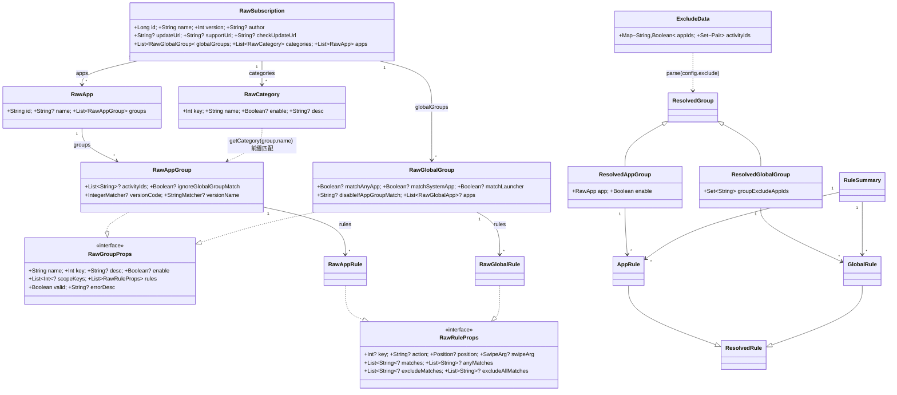
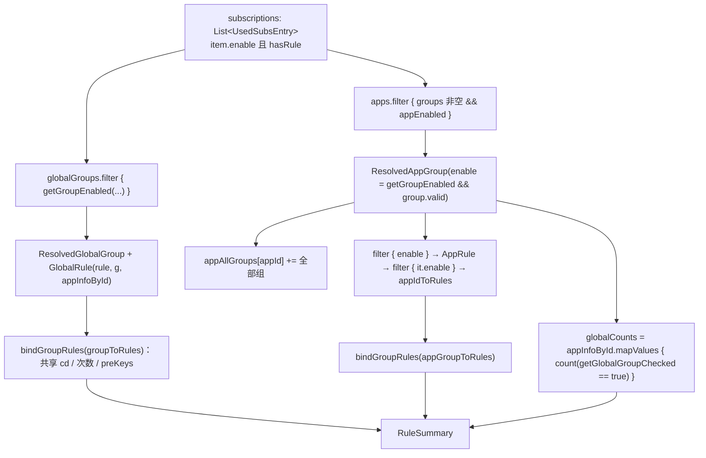
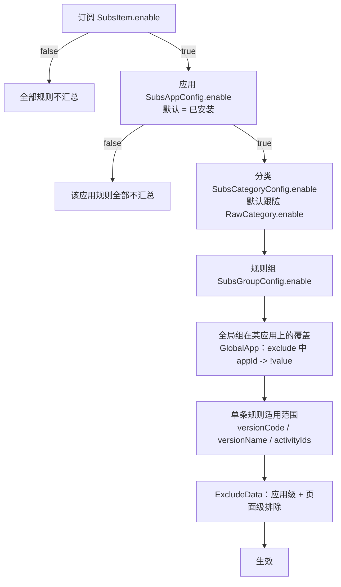

# 订阅与规则体系

## 定位

GKD 自身**不内置任何点击规则**。刚安装的 GKD 没有任何自动化行为，全部规则来自：

- **本地规则**：内置订阅 `LOCAL_SUBS_ID = -2`（以及内存订阅 `LOCAL_HTTP_SUBS_ID = -1`），由用户在规则编辑页粘贴 JSON5 文本生成；
- **远程订阅**：通过 URL 拉取的 `RawSubscription`，由订阅作者维护并带 `version` 递增。

规则文本是唯一事实来源，落盘为 `<filesDir>/subscription/<id>.json`；数据库只存**订阅元数据**（启用、排序、更新地址）与**用户对规则的个性化覆盖**（开关、排除、分类）。整个领域因此可概括为：

```text
规则文件（RawSubscription，作者产物） + 用户配置（数据库表） = ResolvedGroup / ResolvedRule（运行时生效规则）
```

`gkd-app/ARCHITECTURE.md` 的「状态与写入边界」表把链路固化为：读取走 `SubscriptionRepository.snapshotFlow`、`SubscriptionState` 派生状态与 DAO 冷 `Flow`；订阅写入由 `SubscriptionRepository` 编排、`SubscriptionPersistence` 保证文件与数据库补偿一致、`SubscriptionFileStore` 负责原子文件写入；规则配置的跨表操作统一走 `RuleGroupConfigService`。本文逐条对照代码验证了该表。

## 概念模型

层级自外向内为：订阅 → 全局组 / 应用 → 分类 → 规则组 → 规则 → 动作。排除项（`ExcludeData`）不是一层，而是**挂在规则组配置上的横向覆盖层**。




三点由代码决定的层级细节：

1. **分类是投影而非容器。** `RawSubscription.getCategory(groupName)` 用 `groupName.startsWith(c.name)` 判定归属，`categoryAppsMap` 在 `apps` 上 groupBy 出「分类 → 应用 → 规则组」，同一规则组可同时出现在应用列表与分类列表，无需迁移。
2. **全局组没有应用归属。** `ResolvedGlobalGroup.appId` 恒为 `null`，靠 `RawGlobalGroup.apps` / `RawGlobalRule.apps`（`RawGlobalApp`）与 `matchAnyApp` / `matchSystemApp` / `matchLauncher` 决定生效范围，并用 `disableIfAppGroupMatch` 表达「同名应用组存在时排除该应用」（`globalGroupAppGroupNameDisableMap`）。
3. **排除项分两处存储。** 规则组的排除文本存在 `SubsGroupConfig.exclude`（`SubsAppGroupConfig` / `SubsGlobalGroupConfig` 共用 `sealed interface`）；全局组配置行的 `exclude` 同时承载「某应用对本全局组的开关」，见 `RuleSwitchPolicy.updateGroup` 的 `RuleSwitchTarget.GlobalApp` 分支。

## 订阅来源与输入解析

| 入口 | 输入形式 |
| --- | --- |
| `SubscriptionRepository.refresh()`（订阅页下拉刷新） | 对 `subs_item.update_url` 非空且非本地的项逐个拉取 |
| `SubsLinkDialogState` → `SubscriptionRepository.addOrModifyRemote(url)` | 单个网络 URL（`URLUtil.isNetworkUrl` 校验，局域网地址额外申请权限） |
| `service/HttpService.kt`（`id = LOCAL_HTTP_SUBS_ID`） | 推送的订阅正文，落在内存订阅 |
| `UpsertRuleGroupVm` → `SubscriptionInputParser.parse(text, groupKey)` | 粘贴的 JSON5 片段（应用对象 / 应用组 / 全局组） |
| `SubsAppGroupListVm.buildSelectedGroupsText` | 选中规则组转为 JSON5 文本复制走 |

短链常量 `IMPORT_SHORT_URL = "https://i.gkd.li/i/"`（`gkd-app/src/main/kotlin/li/gkd/app/util/Constants.kt`）**只用于快照分享链接**（`feature/snapshot/**`）；`gkd://` scheme 只用于应用内页面跳转（`AndroidManifest.xml` 的 `android:value="gkd://page"` 家族）。两者都不经过订阅解析路径，也不存在剪贴板自动导入——订阅输入解析只有「网络 URL」与「JSON5 文本」两种真实形式。

**`SubscriptionInputParser`** 是规则片段级解析器（非订阅级），把 JSON5 归一化为 `RawSubscription.RawApp` / `RawAppGroup` / `RawGlobalGroup`：

- `parse(source, defaultGroupKey)`：JSON5 解析失败抛 `format_invalid_detail`；根节点须为 `JsonObject`，否则 `rule_object_required`；
- `fillGroupKeys(defaultGroupKey)` 自动补 `key`：根节点含 `groups` 数组时，为每个「有 `name` 无 `key`」的组分配未占用的递增 key（`usedKeys` 先收集显式声明的 key，含被引号包裹的数字字符串，见测试 `quotedNumericKeyIsReservedWhenFillingMissingKeys`）；根节点是单组时直接给 `defaultGroupKey`；
- `isAppObject()` 以「根节点 `groups` 是否为 `JsonArray`」区分应用对象与规则组对象；`parseAppGroups(expectedAppId)` 校验 `id` 匹配（`rule_app_id_mismatch`），`parseApp()` 要求 `groups` 非空；
- 所有产出都过 `requireValid`（即 `group.errorDesc == null`，含选择器编译与类型校验），异常统一由 `parseRule` 包装成 `rule_invalid_detail(e.message)`。

**`SubscriptionEditor`** 是订阅级不可变编辑器，入口为 `RawSubscription.edit { }`，解决两件事：**一次快照内多处修改**（构造时持有 `subscriptionId`，`setCurrent` 校验 id 不可变 `subscription_id_immutable`；测试 `updatesArbitrarySubscriptionAndNestedFieldsInOneSnapshot` 验证名称、作者、应用名、分类名一次生效）；**把「找不到」与「只读冲突」表达为可见结果**（`updateApp` / `updateCategory` 目标不存在时返回 `false` 而不抛异常，测试 `missingStrictNodeIsNotCreated` 断言此时 `assertSame(source, edited)`；`replaceAppGroup` / `replaceGlobalGroup` 接收 `expectedGroup`，当前值与编辑开始时不一致则抛 `rule_edit_conflict`，即并发编辑的乐观锁）。其余职责：`mergeApp` / `appendAppGroups` 做名称去重（`rule_name_duplicate`）与 key 重编号（`normalizeAppGroupKeys`、`normalizeGlobalGroupKey`）；`removeAppGroups(appId, removeAppIfEmpty, predicate)` 支持删除最后一个规则组时顺带删除应用；`removeApp` 为私有，只能被 `removeAppGroups` 间接触发。

## 订阅数据模型

`RawSubscription` 是 `@Serializable` data class，字段与 JSON5 键一一对应：

| 字段 | 类型 | 必填 | 说明 |
| --- | --- | --- | --- |
| `id` / `name` / `version` | `Long` / `String` / `Int` | 是 | 唯一标识（`miss subscription.id`，负值表示本地 / 内存订阅）/ 展示名 / 版本号（用于更新比较） |
| `author` / `supportUri` | `String?` | 否 | 作者 / 反馈渠道 |
| `updateUrl` / `checkUpdateUrl` | `String?` | 否 | 规则正文地址 / 轻量版本探测地址（相对 `updateUrl` 解析） |
| `globalGroups` / `categories` / `apps` | `List<...>` | 否 | 分别对应 `RawGlobalGroup` / `RawCategory` / `RawApp`，默认空 |

两个刻意的实现选择：

- **`equals` 被重写为引用相等**（`other === this`），`hashCode` 只由 `id/name/version` 组成。注释说明是为了 Compose 重组比较；副作用是 `RuleGroupPolicyTest`、`SubscriptionRepository.withSubscriptionSnapshots` 中的 `check(current == subscription)` 实为**引用级内容冲突检测**，不是深比较。
- **解析即校验。** `parse(source, json5 = true)` 先经 `Json5.parseToJsonElement`（依赖 `li.songe:json5:0.8.0`，见 `gradle/libs.versions.toml`），再交给 `jsonToSubscriptionRaw`：`apps` 用 `filterIfNotAll { it.groups.isNotEmpty() }` 丢弃无规则组的应用并 `distinctByIfAny { it.id }` 去重，`categories` 同理，`globalGroups` 按 `key` 去重；规则与规则组的 key 由 `distinctNotNullBy` 处理（`key == null` 全保留，非 null 按首次出现去重）。

辅助视图都是 `by lazy`：`isEmpty`、`isLocal`（`LOCAL_SUBS_IDS.contains(id)`）、`hasRule`、`appGroups`、`groupsSize`、`numText`、`categoryAppsMap`、`categoryGroupsMap`、`globalGroupAppGroupNameDisableMap`。规则组可用性靠 `RawGroupProps.valid` / `errorDesc`：`getErrorDesc()` 编译全部选择器（`Selector.compile` + `validateType(selectorTypeModel)`）并缓存进 `cacheMap`，同时校验 `position` 表达式，任一失败即整组不可用；`cacheStr` / `cacheJsonObject` 是编辑页判断「内容是否变化」的规范化表示。公共属性收敛在 `RawCommonProps` / `RawRuleProps` / `RawGroupProps` / `RawAppRuleProps` / `RawGlobalRuleProps` 等接口；`Position` 用 `exp4j` 表达式支持 `left/top/right/bottom/x/y` 与 `width/height/random/screenWidth/screenHeight` 变量。

**JSON5 解析路径**：订阅文件读取用 `RawSubscription.parse(text, json5 = false)`（落盘是 `kotlinx.serialization` 输出），网络下载与粘贴文本用 `json5 = true`（允许无引号键、单引号、尾逗号）；`addOrModifyRemote` 解析失败归类为 `FailureReason.Parse`；编辑页比较用 `toJson5String(this)` 与 `SubscriptionInputParser.parse(...).jsonObject`，并注册 `clearJson5TransformationCache()` 作为可关闭资源。

**`SubsVersion`**（`data class SubsVersion(val id: Long, val version: Int)`）是 `checkUpdateUrl` 的响应体，版本比较在 `fetchUpdate`：先 `GET checkUpdateUrl`，若 `version.id == current.id && version.version <= current.version` 则跳过、不下载正文；随后 `GET updateUrl`，若 `subscription.id != item.id` 报 id 不匹配，若 `subscription.version <= current.version` 判定无更新并返回 `null`。即**单调递增整数比较**，无语义化版本；探测失败会被吞掉并降级为完整下载。本地订阅（`id < 0`）在 `prepareSubscription` 中于「id 相同且 version 相同」时自增 `version`，使本地编辑也参与同一套版本流转。

## 解析与汇总

**从 `RawSubscription` 到 `ResolvedGroup`**：`ResolvedGroup(group, subscription, subsItem, config)` 是规则组与 `SubsGroupConfig` 的配对，`excludeData` 由 `ExcludeData.parse(config?.exclude)` 惰性求得。子类 `ResolvedAppGroup` 额外携带 `app` 与**预计算的 `enable`**；`ResolvedGlobalGroup` 的 `appId` 返回 `null` 并提供 `groupExcludeAppIds`。

**从 `ResolvedGroup` 到 `ResolvedRule`**，`ResolvedRule(rule, g)` 做三件事：

1. **选择器编译**：`matches` / `anyMatches` / `excludeMatches` / `excludeAllMatches` 优先取 `group.cacheMap`，否则 `Selector.compile`。
2. **属性继承**：一律 `rule 值 ?: group 值 ?: 默认值`，例如 `matchDelay = rule.matchDelay ?: group.matchDelay ?: 0L`、`actionCd = rule.actionCd ?: (actionCdKey 指向规则的 actionCd) ?: group.actionCd ?: 1000L`，`matchRoot` 默认 `false`、`order` 默认 `0`。
3. **跨规则组绑定**：`bindGroupRules(groupToRules)` 依 `group.scopeKeys` 收集其它规则组，按 `preKeys` 建立前置集合，并让 `actionCdKey` / `actionMaximumKey` 指向的规则**共享 `actionCd` / `actionCount`**（注释「共享次数」「共享 cd」）。

`ResolvedRule` 还持有全部运行状态（`actionCount`、`actionTriggerTime`、`matchChangedTime`、`matchDelayJob` / `actionDelayJob`，基于 `atomicfu`）。`status: RuleStatus` 按固定顺序判定：`Status1` 达到最大执行次数 → `Status2` 前置未触发 → `Status3` 匹配延迟中 → `Status4` 超出匹配时间 → `Status5` 冷却中 → `Status6` 触发延迟中 → `StatusOk`；`alive` 明确排除 `Status1/2/4`。`resetMatchType` 由 `ResetMatchType`（`Activity` / `Match` / `App`）匹配，未知值回落 `Activity`。

子类 `AppRule` / `GlobalRule` 实现 `matchActivity`：`AppRule.enable = RuleScopePolicy.appVersionMatches(group, rule, appInfo)`，`activityIds` 经 `RuleScopePolicy.fixActivities` 把 `.Foo` 补成 `appId + ".Foo"`；`GlobalRule` 把 `rawRule.apps ?: group.apps` 转成 `Map<String, GlobalAppScope>`（**只保留已安装应用**，注释指向 issue #619），`defaultEnabled = matchAnyApp && (matchLauncher || appId != launcherAppId) && (matchSystemApp || appId !in systemApps)`。

**`RuleSummary`** 是只读汇总投影：

| 字段 | 含义 |
| --- | --- |
| `globalRules` / `globalGroups` | 生效的全局规则 / 启用的全局组 |
| `appIdToGlobalGroupCount` | 每个已安装应用命中的全局组数 |
| `appIdToRules` | 每个应用最终可执行的应用规则 |
| `appIdToGroups` / `appIdToAllGroups` | 每个应用已启用的规则组 / 全部规则组（含禁用，供 UI 展示） |

**`RuleSummaryBuilder.build(...)`** 的输入是 `UsedSubsEntry`、`appInfoById`、三类配置列表与 `launcherAppId`：



`UsedSubsEntry` 由 `SubscriptionState.buildUsedSubsEntries` 产生：只有 `item.enable && subscription.hasRule` 的订阅进入汇总，所以**订阅总开关是最外层短路**。

**为什么汇总下沉到 domain**：`ARCHITECTURE.md` 明确要求「规则汇总已经下沉到 `domain/rule/RuleSummaryBuilder`，新逻辑不要再回填到应用级状态容器」。实证是 `domain/` 被定义为不得依赖 Compose、Activity、Service 或 DAO 的纯业务层，而 `RuleSummaryBuilder` 的入参全是普通值类型，没有 Flow、没有 `Db`；`RuleSummaryBuilderTest`、`RuleScopePolicyTest`、`RuleGroupPolicyTest`、`RuleSwitchPolicyTest`、`CategoryPolicyTest` 都是纯 JVM 单测。副作用由 `SubscriptionState.ruleSummaryFlow` 用 `combine` + `flowOn(Dispatchers.Default)` + `stateIn` 承担。这样执行期与设置界面（`RuleControlEnvironment.resolve` 同样调用 `RuleGroupPolicy.controlState`）共用一套判定，不会出现「界面显示可用但执行时不匹配」的分叉。

## 启用 / 禁用策略

开关有四层（订阅 → 应用 → 分类 → 规则组）加一条横向排除层，再加单条规则自身的适用范围。



### `RuleGroupTarget` 与 `RuleSwitchTarget`

两者都是 sealed interface，把「要改哪一行配置」表达为值对象。

| `RuleGroupTarget` | 主键 | 对应表 | `pageAppId` |
| --- | --- | --- | --- |
| `App(subsId, appId, groupKey)` | `(subsId, appId, groupKey)` | `SubsAppGroupConfig` | `appId` |
| `Global(subsId, groupKey, pageAppId)` | `(subsId, groupKey)` | `SubsGlobalGroupConfig` | 可空，表示正在以某应用视角查看全局组 |

`RuleGroupTarget.groupType` 由子类给出（`RuleGroupType.App = 2` / `RuleGroupType.Global = 3`，注释说明这两个值是持久化协议值，不可更改）。`RawGroupProps.toRuleGroupTarget(subsId, appId)` 负责派发：应用组必须提供 `appId`（否则 `error("require appId")`），全局组把 `appId` 当作 `pageAppId`。

`RuleSwitchTarget` 是**开关的写入坐标**，比 `RuleGroupTarget` 多出 `App`（应用总开关）与 `GlobalApp`（全局组在某应用上的覆盖）。`RuleGroupTarget.toSwitchTarget()` 负责映射：`RuleGroupTarget.App` → `RuleSwitchTarget.AppGroup(subsId, appId, groupKey)`；`RuleGroupTarget.Global` → 若 `pageAppId` 非空则 `RuleSwitchTarget.GlobalApp(subsId, groupKey, it)`，否则 `RuleSwitchTarget.GlobalGroup(subsId, groupKey)`。源码注释点明设计意图：「全局组的开关和它在某个应用上的覆盖是两个独立字段，即使它们共用同一数据行」。

### `RuleSetting` 与 `GkTriStateSwitch`

`RuleSetting(value: Boolean?, label: String)` 只有三个常量：`FollowDefault(null)`、`Enabled(true)`、`Disabled(false)`，即**三态**；`RuleSetting.from(value: Boolean?)` 做映射，`null` 一律解释为「跟随默认值」而非「关闭」。

`GkTriStateSwitch(checked: Boolean?, onCheckedChange: ((Boolean?) -> Unit)?, ...)` 的语义（源码 KDoc 与实现一致）：

| `checked` | 语义 | 视觉 | 无障碍 `stateDescription` | 点击后下一状态 |
| --- | --- | --- | --- | --- |
| `true` | 手动开启（`RuleSetting.Enabled` / `CategorySetting.Enabled`） | ON，滑块在右端 | `action_turn_on` | `false` |
| `null` | 跟随默认（`RuleSetting.FollowDefault` / `CategorySetting.GroupDefault`） | Indeterminate，滑块**居中** | `setting_follow` | `true` |
| `false` | 手动关闭（`RuleSetting.Disabled` / `CategorySetting.Disabled`） | OFF，滑块在左端 | `action_close` | `null` |

循环为 `false → null → true → false`；`onCheckedChange` 收到的是**下一个**逻辑状态而非当前状态；传 `onCheckedChange = null` 时组件不可交互。注意 `CategoryPolicy` 有四个选项（`FollowSubscription` / `Enabled` / `Disabled` / `GroupDefault`），其中 `FollowSubscription` 通过删除配置行表达，不是三态开关的一个状态。

### `RuleGroupPolicy.controlState`：唯一判定入口

输入 `subscription`、`group`、`appId`、`SubscriptionConfigSnapshot`、`appInfo`、`launcherAppId`、`systemAppIds`、`blockedApp`，内部流程为：`groupTarget = group.toRuleGroupTarget(subscription.id, appId)`；`config = configIndex.groupConfig(groupTarget)`；`category = subscription.getCategory(group.name)`；`categoryConfig = configIndex.categoryConfig(subscription.id, category?.key)`；`inApp = group is RawGlobalGroup && appId != null`（以应用视角查看全局组）；`limitations = RuleLimitationPolicy.resolve(subscription, group, appId, ExcludeData.parse(config?.exclude), appInfo)`；`defaultDecision = explainGroupEnabled(group, null, category, categoryConfig)`；`globalDefault` 仅在 `inApp` 时由 `getGlobalGroupChecked(..., ExcludeData(emptyMap(), emptySet()), ...)` 求得，否则为 `null`；`defaultEnabled = if (inApp) globalDefault == true else defaultDecision.enabled`；`canEnable = group.valid && !limitations.fullyBlocked && (!inApp || globalDefault != null)`。

`restrictions` 按固定顺序累积（顺序即 UI 展示顺序）：`!group.valid` → `group.errorDesc ?: rule_invalid_cannot_enable`；`limitations.fullyBlocked || (group.valid && !canEnable)` → `blockedReasons.ifEmpty { listOf(rule_app_not_applicable) }`；`configIndex.subscriptionEnabled(...) == false` → `subscription_disabled`；应用组且应用未启用 → `subscription_app_disabled`；`inApp && !getGroupEnabled(group, config)` → `global_rule_group_disabled`。

产出的 `RuleControlState` 是 UI 的全部依据：

| 字段 | 计算方式 |
| --- | --- |
| `setting` | `configIndex.setting(groupTarget.toSwitchTarget())`，三态开关当前值 |
| `defaultEnabled` / `defaultSource` | 见上；`defaultSource` 在 `inApp` 时固定 `rule_builtin_app_scope` |
| `scope` | `inApp` 时 `rule_current_app_scope`，否则 `rule_group_scope` |
| `configuredEnabled` | `setting.value ?: defaultEnabled` |
| `available` | `configuredEnabled && canEnable && !blockedApp && restrictions.isEmpty()` |
| `hasCustomSetting` | `setting != RuleSetting.FollowDefault`（决定是否画「自定义设置」图标） |
| `label` | 跟随默认时渲染为「跟随默认（开 / 关）」 |

### `RuleGroupPolicy` 的默认值与来源

`getGroupEnabled(group, subsConfig, category, categoryConfig)` 是纯函数，返回 `Boolean`：`group.valid && when (group) { is RawAppGroup -> subsConfig?.enable ?: getCategoryEnabled(category, categoryConfig) ?: group.enable ?: true; is RawGlobalGroup -> subsConfig?.enable ?: group.enable ?: true }`。

**优先级与边界**：

- 应用组：**规则组自定义 > 分类（配置行 > 订阅默认）> 规则组自身 `enable` > 默认 `true`**；全局组**不参与分类**，链路为 **规则组自定义 > 规则组自身 `enable` > 默认 `true`**；
- `group.valid == false` 时整条链短路为 `false`，任何用户开关都无力回天；
- `getCategoryEnabled(category, categoryConfig)` 有一个反直觉但被测试锁定的行为：**配置行存在时，即使 `enable == null` 也返回 `null`（不使用分类默认值）**，源码注释为「已保存的 null 表示使用各规则组默认值，而不是类别默认值」，`RuleGroupPolicyTest.explicitFollowStateUsesGroupDefaultWhenCategoryDefaultsTo{Disabled,Enabled}` 覆盖两个方向；
- `subsConfig == null` 表示该规则组从未被单独设置，此时才继续向下继承。

`explainGroupEnabled(...)` 返回 `RuleEnableDecision(enabled, source)`，`source` 的判定顺序即「谁赢了」的显式表达：

| 条件 | `RuleEnableSource` |
| --- | --- |
| `!group.valid` | `Invalid` |
| `subsConfig?.enable != null` | `Manual` |
| `group is RawGlobalGroup` | `GroupDefault` |
| `categoryConfig?.enable != null` | `Category` |
| `categoryConfig == null && category?.enable != null` | `SubscriptionCategory` |
| 其它 | `GroupDefault` |

`getGlobalGroupChecked(subscription, excludeData, group, appId, launcherAppId, systemAppIds, appInfo)` 判定「全局组在某个具体应用上会不会执行」，返回 `Boolean?`。它先取 `rules = group.rules.ifEmpty { listOf(null) }`（空规则组也要给出结论）、`groupExcluded = appId in subscription.globalGroupAppGroupNameDisableMap[group.key]`，再 `allowed = rules.filter { RuleScopePolicy.globalRuleAllowed(group, it, appId, appInfo, groupExcluded) }`；`allowed.isEmpty()` 时返回 `null`（不适用，而不是「关」）；否则 `excludeData.appIds[appId]?.let { return !it }`（个人排除表优先，直接决定结果）；最后 `return allowed.any { RuleScopePolicy.globalDefault(group, it, appId, launcherAppId, systemAppIds) }`。`null` 与 `false`（适用但关闭）语义不同：`controlState` 中只有 `globalDefault == true` 才把 `defaultEnabled` 置真，但必须 `globalDefault != null` 才允许 `canEnable`。

### `RuleSwitchPolicy`：真正落库的写法

| `target` | 写入 | 说明 |
| --- | --- | --- |
| `RuleSwitchTarget.App` | `error("应用总开关不属于规则组配置")` | 应用总开关走 `SubscriptionConfigStore.setAppEnabled` |
| `AppGroup` / `GlobalGroup` | `current.withEnable(setting.value)` | 直接写 `enable`，`null` 即恢复「跟随默认」 |
| `GlobalApp` | 读 `ExcludeData.parse(current.exclude)`；`value == null` 时 `remove(appId)`，否则 `set(appId, !value)`，再 `withExclude(...stringify())` | **取反存储**：用户看到「开」对应 `exclude` 中 `appId -> false` |

取反存储是这条链最容易读错之处：`ExcludeData.parse` 约定无前缀行表示 `appIds[appId] = true`（排除），`!appId` 表示 `false`（显式包含）；全局组配置行复用这张表表达「应用对本组的开关」，所以 `RuleConfigIndex.setting(RuleSwitchTarget.GlobalApp)` 写成 `ExcludeData.parse(...).appIds[appId]?.not()` 才能把存储值翻译回开关语义。

### `RuleScopePolicy`：纯适用范围判定

无状态、无 IO，被执行期与设置界面共同调用：`fixActivities(appId, values)` 把 `.Foo` 补全为 `appId + ".Foo"`；`versionMatches(props, info)` 在 `info == null`（应用信息未知）时返回 `true`，否则要求 `versionCode` / `versionName` 都不为 `false`；`globalAppEnabled(app, info) = app.enable ?: versionMatches(app, info)`（显式布尔覆盖版本匹配）；`globalScope(app, info)` 打包为 `GlobalAppScope(enabled, included, excluded)`；`appVersionMatches(group, rule, info)` 规则字段优先、其次规则组字段，再 `match`；`globalApp(group, rule, appId) = (rule?.apps ?: group.apps).orEmpty().lastOrNull { it.id == appId }`；`globalDefault(group, rule, appId, launcherAppId, systemAppIds)` 有显式 `apps` 条目即 `true`，桌面按 `matchLauncher`、系统应用按 `matchSystemApp` 排除，最后回落 `matchAnyApp ?: true`；`globalRuleAllowed(group, rule, appId, info, groupExcluded) = !groupExcluded && globalApp(...)?.let { globalAppEnabled(it, info) } != false`。

`matchGlobalActivity(app, defaultEnabled, appId, activityId, groupExcluded, exclude)` 的判定顺序：`groupExcluded || app?.enabled == false` → `false`；`exclude.appIds[appId] == true`（个人排除）→ `false`；`activityId != null && (appId to activityId) in exclude.activityIds`（个人精确页面排除）→ `false`；`activityId != null && app.excluded.any(activityId::startsWith)`（订阅声明排除前缀）→ `false`；`exclude.appIds[appId] == false`（个人显式包含，短路后续）→ `true`；`app != null` → `activityId == null || app.included.isEmpty() || app.included.any(activityId::startsWith)`；否则 → `defaultEnabled`。

个人排除优先于个人包含，二者都优先于订阅声明前缀；注释特别说明「个人全局页面条目一直是精确 activity ID 匹配」，因此页面级排除用精确相等，订阅声明用前缀匹配。

### `CategoryPolicy`

`CategorySetting` 是四态枚举，`CategoryPolicy.setting(config)` 映射：

| `SubsCategoryConfig?` | `enable` | `CategorySetting` |
| --- | --- | --- |
| `null` | — | `FollowSubscription`（跟随订阅默认，即 `RawCategory.enable`） |
| 存在 | `true` / `false` | `Enabled` / `Disabled` |
| 存在 | `null` | `GroupDefault`（使用各规则组自身默认） |

`validateEdit(subscription, categoryKey, name)` 的约束：**仅本地订阅可编辑**（`remote_category_edit_unsupported`）；名称去空格后非空且在订阅内唯一（`category_name_required` / `category_name_duplicate`）；新增要求 `maxOfOrNull { it.key } ?: -1 < Int.MAX_VALUE`（`category_key_exhausted`）；编辑要求目标存在（`category_missing`）。`previewEdit` 先 `validateEdit` 再返回新 `RawSubscription`（新 key = 现有最大 key + 1），供 `SubscriptionRepository.saveCategory` 在锁内校验 `current == expected` 后应用。

### `RuleLimitations` 与 `RuleLimitationPolicy`

| `RuleLimitations` 字段 | 含义 |
| --- | --- |
| `builtIn` / `personal` | 订阅声明的限制 / 用户个人配置带来的限制 |
| `blockedRules` / `ruleCount` | 被版本或应用排除挡住的规则数 / 规则总数 |
| `blockedReasons` | 去重后的阻断原因文本 |
| `fullyBlocked` | `ruleCount > 0 && blockedRules == ruleCount` |
| `hasBuiltInProperties` / `hasPersonalProperties` | `builtIn.any { !it.implicit }` / `personal.isNotEmpty()` |

`RuleLimitation(source, kind, value, appliesTo, implicit)` 中 `appliesTo` 是 **1-based 规则序号集合**，用于合并展示同一条限制。`RuleLimitationKind` 共 11 种：`AllowedPagePrefix`、`ExcludedPagePrefix`、`ExcludedPageExact`、`ExcludedApp`、`VersionCode`、`VersionName`、`AnyCondition`、`AllConditions`、`DefaultScope`、`EnabledApp`、`DisabledApp`。

`RuleLimitationPolicy.resolve(...)` 的要点：遍历 `group.rules` 时，应用组的 `activityIds` / `excludeActivityIds` / 版本字段按**「子字段覆盖，包括空列表」**标注来源（`add(if (rule.activityIds != null) source else groupSource, ...)`）；全局组的 `matchLauncher` / `matchSystemApp` / `matchAnyApp` 未显式声明时产生 `implicit = true` 的 `DefaultScope` 条目；`blocked` 与 `blockedReasons` 只在版本不匹配或应用被排除时增加，`groupExcluded` 时加 `global_rule_shadowed_by_app_rule`；规则组**没有规则**时仍解析 `group.apps`，保证空规则组也能解释限制；最后按 `(source, kind, value)` 分组去重，把同组条目的 `appliesTo` 合并为并集。

### 单条规则开关的边界

**GKD 没有「单条规则」的持久化开关字段**，粒度止于规则组（`SubsGroupConfig.enable`）。对单条规则生效范围的控制只能通过：订阅侧字段（`versionCode` / `versionName` / `activityIds` / `excludeActivityIds` / `excludeMatches` / `excludeAllMatches` / `matchAnyApp` / `matchSystemApp` / `matchLauncher`）、个人侧 `ExcludeData`（应用级与页面级排除）、运行期 `RuleStatus`。因此 UI 上不存在「规则组内每条规则的开关」，存在的只有 `GkRuleEnableControl`（规则组开关）与 `RuleLimitations` 的解释列表。

### 排除项如何叠加

`ExcludeData` 只有两个字段：`appIds: Map<String, Boolean>`（`true` = 排除该应用，`false` = 显式包含，可覆盖订阅声明）与 `activityIds: Set<Pair<String, String>>`（`(appId, activityId)` 精确页面排除）；派生视图 `excludeAppIds` / `includeAppIds` 由 `appIds` 过滤得到。`parse(exclude)` 按行切分：`!appId` → `appIds[appId] = false`；`appId/activityId` → `activityIds`；纯 `appId` → `appIds[appId] = true`；`appId` 与 `activityId` 都要通过 `isValidAppId()` / `isValidActivityId()`，非法行静默丢弃。重载 `parse(exclude, appId)` 把某应用的页面文本前缀成 `appId/line` 后复用同一解析器。

叠加顺序：规则组自带 `excludeActivityIds`（应用组）或 `GlobalApp.excludeActivityIds`（全局组，前缀匹配）→ 个人页面排除（应用组按 `startsWith`，全局组按精确相等）→ 个人应用排除（`true` 直接否决，`false` 直接通过）→ 应用组白名单 `activityIds`（为空表示全部页面，否则任一前缀命中即可）。

## 写入一致性

### 读最新值 + 同一写事务更新

`SubscriptionConfigStore` 是规则配置的唯一写入口，把「读—改—写」压在**同一个 Room 写事务**内：

```kotlin
suspend fun updateAppGroupConfig(subsId, appId, groupKey, transform) = database.withWriteTransaction {
    val current = dao.getConfig(subsId, appId, groupKey)
    val next = transform(current ?: SubsAppGroupConfig(subsId, appId, groupKey))
    require(next.subsId == subsId && next.appId == appId && next.groupKey == groupKey)  // 主键不可变
    if (next.enable == null && next.exclude.isEmpty()) current?.let { dao.delete(it) }   // 空配置即删行
    else if (next != current) dao.upsert(next)
    next
}
```

`updateGlobalGroupConfig` 结构相同。**「`enable == null` 且 `exclude` 为空则删行」是重要不变量**：数据库不保留无意义的空配置行，因此 `subsConfig == null` 能准确表示「从未自定义」；`setAppEnabled` 把 `null` 映射为删除，其余按需 `upsert`。`observe()` 通过 `invalidationTracker.createFlow("subs_item", "subs_app_config", "subs_category_config", "subs_app_group_config", "subs_global_group_config")` + `capture()` 产出 `SubscriptionConfigSnapshot`，再 `distinctUntilChanged()`；`capture()` 在 `withReadTransaction` 内一次性读全 5 张表，**快照内各表是同一时刻的一致视图**。

### 冲突检测

| 场景 | 检测点 | 冲突文案 |
| --- | --- | --- |
| 文本编辑开始时的排除配置 | `RuleGroupConfigService.replaceExclude` 内 `check(ExcludeData.parse(current.exclude) == expected)` | `exclusion_config_conflict` |
| 页面级排除单点切换 | `setActivityExclusion` 校验 `(key in value.activityIds) == expectedExcluded` | `page_exclusion_conflict` |
| 批量清除页面排除 | `clearActivityExclusions` 比较按 `pageAppId` 过滤后的集合 | `page_exclusion_conflict` |
| 分类批量设置 | `setCategorySettings` 校验 `CategoryPolicy.setting(configs[key]) == expectedSetting` | `category_config_conflict` |
| 批量开关 | `RuleSwitchRequest.checkCurrent(configIndex)` 校验每个 target 当前 `setting` 等于预期 | `rule_switch_conflict` |
| 订阅内容 | `SubscriptionRepository.withSubscriptionSnapshots` 校验 `current == subscription` | `subscription_content_conflict` |
| 规则组内容编辑 | `SubscriptionEditor.replaceAppGroup` / `replaceGlobalGroup` 的 `expectedGroup` | `rule_edit_conflict` |

`ARCHITECTURE.md` 的表述是：「文本编辑以开始编辑时的排除配置检测冲突，同时保留其他字段的新值」——冲突只否决**正在编辑的那部分**，其它并发修改不会丢。

### 哪些操作走 DAO 单表、哪些走 Service

| 操作 | 路径 | 理由 |
| --- | --- | --- |
| 切换订阅启用 / 调整顺序 | `Db.subsItemDao.updateEnable(id, enable)` / `batchUpdateOrder(items)`（`@Transaction`） | 单表，DAO 自带事务 |
| 应用总开关 | `SubscriptionConfigStore.setAppEnabled` | 需要「空则删行」语义 |
| 规则组开关（单 / 批量） | `RuleGroupConfigService.prepare(...)` + `apply(...)` | 需 `checkCurrent` 冲突检测 + 跨表 + 跳过不可用项 |
| 规则组排除文本 | `RuleGroupConfigService.replaceExclude` | 需要期望值比较 |
| 页面级排除增删清 | `RuleGroupConfigService.setActivityExclusion` / `clearActivityExclusions` | 需要键级冲突检测 |
| 分类开关 | `RuleGroupConfigService.setCategorySetting(s)` | 需要 `CategorySetting` → `enable` / 删行映射 |
| 规则组增删改 | `SubscriptionRepository.update(id) { subscription.edit { ... } }` | 落在 `.json` 文件，须走订阅编排 |
| 分类增删 | `SubscriptionRepository.saveCategory` / `deleteCategories` | 同上，且需 `isLocal` 校验 |
| 订阅删除 / 刷新 / 添加 | `SubscriptionRepository.delete` / `refresh` / `addOrModifyRemote` | 需要文件与数据库协调 |

`RuleGroupConfigService.apply` 返回 `RuleSwitchResult(changed, unchanged, invalid, restricted)`：`invalid`（`setting == Enabled` 但 `state.canEnable == false`）**被完全跳过、不写库**；`restricted`（`restrictions` 非空、订阅未启用或被 `blockAppList` 屏蔽）**照常写入**，只提示用户；`failureMessage` 仅在 `invalid > 0` 时非空，`description` 汇总成一句可 toast 的话。`apply` 整体包在 `SubscriptionRepository.withSubscriptionSnapshots(...)` + `Db.withTransaction { }` 内，「冲突检测 → 逐项写入」对外原子。

## 订阅持久化

**`SubscriptionFileStore`** 管理 `<filesDir>/subscription/<id>.json`（`FolderUtils.subsFolder`）：

| 方法 | 行为 |
| --- | --- |
| `load(id)` | 文件不存在时按 id 返回空 `RawSubscription`（`LOCAL_SUBS_ID` → `subscription_local`，`LOCAL_HTTP_SUBS_ID` → `subscription_memory`），其它 id 抛 `subscription_file_missing`；解析用 `json5 = false`，失败包装成 `subscription_file_parse_failed`；解析后校验 `subscription.id == id`，否则 `subscription_file_id_mismatch` |
| `readBytes(id)` / `write(subscription)` | 存在则读字节否则 `null`（供补偿用） / `kotlinx.serialization` 编码后原子写 |
| `restore(id, bytes)` / `delete(id)` | `bytes == null` 时删除，否则原子写回 / `AtomicFile(file).delete()`，删除后仍存在则抛 `file_delete_failed` |

原子性来自 `android.util.AtomicFile` 的标准三步式：`startWrite()` → `output.write(bytes)` → `finishWrite(output)`，异常路径走 `failWrite(output)`，保证磁盘上的文件要么是旧内容、要么是新内容，不会出现半截 JSON。

**`SubscriptionPersistence`** 保证文件与数据库的补偿一致性。`save(subscription, newItem, insertItem)` 先 `SubscriptionFileStore.readBytes(id)` 备份，再 `SubscriptionFileStore.write(subscription)`，随后在 `Db.withTransaction { }` 内按需 `upsert` / `update` 订阅行、`Db.subsItemDao.updateMtime(id, now)` 并调用 `cleanupConfigs(subscription)`，事务抛错则 `restoreFile(id, previousBytes, e)` 回滚文件后重抛。

`cleanupConfigs` 是关键一步：订阅更新后规则组 / 分类可能被作者删除，对应覆盖必须一起清掉。它以 `globalGroups` 的 key 集合、每个应用的 `app.id -> 规则组 key 集合`、`categories` 的 key 集合为白名单，删除 `subs_app_group_config`、`subs_global_group_config`、`subs_category_config` 中的孤儿行并打日志；该步与文件写入同事务，因此「文件已更新但覆盖未清理」不可能发生。

`delete(requestedIds)` 补偿方向相反（先删文件再删库），带两级阶段标注：`queryAll` 取 `existingIds`（失败 → `DeleteException(Database)`）→ 求交集 `targetIds`，空则返回 `DeleteResult(emptySet(), 0)` → `previousFiles = targetIds.associateWith(readBytes)`（失败 → `DeleteException(File)`）→ 逐 id 删文件（失败则 `restoreFiles` 后抛 `DeleteException(File)`）→ `Db.withTransaction { deleteById(*ids); if (size > 0) actionLogDao.deleteBySubsId(*ids) }`（失败含 `CancellationException` 则 `restoreFiles` 后抛出）→ 若 `deleteSize == 0` 再 `restoreFiles`，把恢复失败升级为 `DeleteException(File)`。

`DeleteException(stage, cause)` 的 `DeleteStage` 只有 `File` / `Database`，`SubscriptionRepository.delete` 据此翻译成 `FailureReason.DeleteFile` / `FailureReason.DeleteData`。`SubscriptionRepository.withBackupTransaction` 的注释强调备份恢复与普通订阅更新**互相排斥**（共用 `updateMutex`），且恢复提交阶段用 `NonCancellable` 覆盖。

**`SubscriptionRepository`** 是 `object`，用私有 `MutexState updateMutex` 串行化所有写路径（`withStateLock` 阻塞等待，`tryWithStateLock` 立即返回布尔用于「忙碌」语义）：

| 用例 | 方法 | 要点 |
| --- | --- | --- |
| 初始化 | `initialize()` | 加载 `subsItemDao.queryAll()`，随后 `ensureLocalSubscription()` 确保本地订阅行与文件存在 |
| 等待就绪 | `awaitSnapshot()` | 跳过 `Loadable.Loading`，`Failure` 抛 cause |
| 写入单订阅 | `update(id, transform)` | 取快照内当前值 → `transform` → 校验 id 不变 → `next == current` 则返回 `false` → `saveLocked` |
| 带默认行写入 | `saveWithItem(subscription, defaultItem)` | 校验 id 一致；库中已有行则 `update`，否则 `insert` |
| 远程添加 / 修改 | `addOrModifyRemote(url, oldItem)` | 见下表 |
| 刷新全部 | `refresh()` | 见下 |
| 删除 | `delete(vararg ids)` | 委托 `SubscriptionPersistence.delete`，成功后原地裁剪 `snapshotFlow` |
| 分类保存 / 删除 | `saveCategory` / `deleteCategories` | 走 `update`，内含 `current == expected` 校验与 `isLocal` 限制 |
| 配置命令互斥 | `withSubscriptionSnapshot(s)` | 在订阅锁内校验引用相等后执行 action，使判定与写入之间不插入订阅变更 |
| 备份恢复互斥 | `withBackupTransaction` | 规范化入参 → `NonCancellable` 内执行 block → 重新全量刷新；异常时先尽力刷新再抛出 |
| 查询已用地址 | `existingUpdateUrls()` | 供链接对话框查重 |

`addOrModifyRemote` 的失败分类完整映射到 `SubscriptionResult.FailureReason`：

| 条件 | Reason |
| --- | --- |
| 同 URL 已存在且 id 不同 | `DuplicateUrl` |
| HTTP 请求失败 | `Download` |
| `RawSubscription.parse` 失败 | `Parse` |
| 新增时 id 已存在 | `AlreadyExists` |
| 修改时新旧 id 不一致 | `IdMismatch` |
| `subscription.id < 0` | `InvalidId` |
| 落盘异常 | `Save` |

失败时 `setUpdateError(id, cause)` 把错误写入快照供 UI 展示；成功时新 `SubsItem` 的 `order = items.maxOf { it.order } + 1`（空列表时为 `1`）。`refresh()` 在 `Loadable.Loading` 或抢不到锁时返回 `Busy`，只对快照中缺失的 item 做增量加载；若存在非本地订阅且 `NetworkUtils.isAvailable()` 为假则返回 `NetworkUnavailable`；逐项 `fetchUpdate`，返回非 null 才 `saveLocked` 并计数，异常写 `updateError` 但不中断其它项，最终 `Success(Refreshed, successCount)`。`fetchUpdate` 的请求失败包装成 `subscription_update_url_request_failed`，解析失败包装成 `text_parse_failed`。

### `SubscriptionState` / `SubscriptionSnapshot` / `SubscriptionResult`

`SubscriptionSnapshot` 是内存里的三张以订阅 id 为键的表：

| 字段 | 语义 |
| --- | --- |
| `subscriptions: Map<Long, RawSubscription>` | 成功加载的订阅正文 |
| `loadErrors: Map<Long, Exception>` | 读取 / 解析失败（文件损坏、id 不匹配） |
| `updateErrors: Map<Long, Exception>` | 最近一次更新 / 保存失败（网络、解析、落盘） |

UI 据此区分状态：`subscriptions` 有值 → 正常；否则看 `loadErrors` / `updateErrors` → 报错；都没有且正在刷新 → 加载中（`SubsSheetState.Render` 的 `missing` 计算即此逻辑）。

`SubscriptionState` 是派生状态容器：`subsItemsFlow` ← `Db.subsItemDao.query()`（按 `order` 排序）；`subsMapFlow` ← 快照的 `subscriptions`；`latestRecordFlow` / `latestRecordDescFlow` ← 最近一条动作日志并用 `subsMapFlow` + `appInfoMapFlow` 拼出可读名称（规则组名以应用名开头时不再重复拼接）；`buildUsedSubsEntries(items, subscriptions)` 过滤 `item.enable && it.hasRule`；`ruleSummaryFlow` ← `combine(subsMapFlow, appInfoMapFlow, subscriptionConfigStore.observe(), launcherAppIdFlow)` → `RuleSummaryBuilder.build(...)`，`flowOn(Dispatchers.Default)`，初值 `RuleSummary()`。

`SubscriptionResult` 是订阅用例的统一返回类型：`Busy` / `Success(kind: SuccessKind = None, count: Int = 0)` / `Failure(reason: FailureReason, detail: String?, cause: Throwable?)`。`SuccessKind`：`None`、`Deleted`、`Added`、`Modified`、`Refreshed`；`FailureReason`：`DeleteData`、`DeleteFile`、`DuplicateUrl`、`Download`、`Parse`、`AlreadyExists`、`IdMismatch`、`InvalidId`、`Save`、`NetworkUnavailable`。UI 通过 `.message` 扩展渲染成 toast，调用方无需自行 switch。

`SubscriptionEntry` 用 sealed class 区分「可能有正文」与「一定有正文」：`SubsEntry`（`subscription: RawSubscription?`，列表用）与 `UsedSubsEntry`（非空，汇总用），共享 `checkUpdateUrl` 的惰性解析 `URI(updateUrl).resolve(checkUpdateUrl)`，把相对地址补全为绝对地址。

## 数据库表结构

字段与主键取自 Kotlin 实体，并与 `gkd-db/schemas/li.gkd.db.AppDb/16.json` 的 `createSql` 交叉验证。

| 表 | 实体文件（`gkd-db/src/commonMain/kotlin/li/gkd/db/`） | 主键 | schema 16 |
| --- | --- | --- | --- |
| `subs_item` | `SubsItem.kt` | `id` | ``(`id` INTEGER NOT NULL, `ctime` INTEGER NOT NULL, `mtime` INTEGER NOT NULL, `enable` INTEGER NOT NULL, `enable_update` INTEGER NOT NULL, `order` INTEGER NOT NULL, `update_url` TEXT, PRIMARY KEY(`id`))`` |
| `subs_app_config` | `SubsAppConfig.kt` | `(subs_id, app_id)` | ``(`enable` INTEGER NOT NULL, `subs_id` INTEGER NOT NULL, `app_id` TEXT NOT NULL, PRIMARY KEY(`subs_id`, `app_id`), FOREIGN KEY(`subs_id`) REFERENCES `subs_item`(`id`) ON DELETE CASCADE)`` |
| `subs_app_group_config` | `SubsAppGroupConfig.kt` | `(subs_id, app_id, group_key)` | ``(`subs_id` INTEGER NOT NULL, `app_id` TEXT NOT NULL, `group_key` INTEGER NOT NULL, `enable` INTEGER, `exclude` TEXT NOT NULL DEFAULT '', PRIMARY KEY(...), FOREIGN KEY(...) ON DELETE CASCADE)`` |
| `subs_global_group_config` | `SubsGlobalGroupConfig.kt` | `(subs_id, group_key)` | ``(`subs_id` INTEGER NOT NULL, `group_key` INTEGER NOT NULL, `enable` INTEGER, `exclude` TEXT NOT NULL DEFAULT '', PRIMARY KEY(...), FOREIGN KEY(...) ON DELETE CASCADE)`` |
| `subs_category_config` | `SubsCategoryConfig.kt` | `(subs_id, category_key)` | ``(`enable` INTEGER, `subs_id` INTEGER NOT NULL, `category_key` INTEGER NOT NULL, PRIMARY KEY(`subs_id`, `category_key`), FOREIGN KEY(...) ON DELETE CASCADE)`` |

| 表 | 字段 | 类型 / 默认 | 说明 |
| --- | --- | --- | --- |
| `subs_item` | `id` | `Long` | 主键；`-2` 本地、`-1` 内存（常量 `LOCAL_SUBS_ID` / `LOCAL_HTTP_SUBS_ID` / `LOCAL_SUBS_IDS`） |
| `subs_item` | `ctime` / `mtime` | `Long`，`System.currentTimeMillis()` | 创建 / 更新时间（`updateMtime` 维护） |
| `subs_item` | `enable` / `enableUpdate` | `Boolean`，`false` / `true` | **订阅总开关** / 是否参与自动更新 |
| `subs_item` | `order` / `updateUrl` | `Int` 无默认 / `String?` `null` | 列表排序（`query()` 按此排序） / 远程订阅地址 |
| `subs_app_config` | `enable` | `Boolean`（非空） | 应用总开关；无行时默认按「已安装」判定 |
| `subs_app_config` | `subsId` / `appId` | `Long` / `String` | 联合主键，`subs_id` 兼外键 |
| `subs_app_group_config` | `subsId` / `appId` / `groupKey` | `Long` / `String` / `Int` | 联合主键，`group_key` 对应 `RawAppGroup.key` |
| `subs_app_group_config` | `enable` / `exclude` | `Boolean?` `null` / `String` `""` | `null` = 跟随分类 / 规则组默认；`exclude` 为 `ExcludeData.stringify()` 结果（行以 `\n\n` 分隔） |
| `subs_global_group_config` | `subsId` / `groupKey` | `Long` / `Int` | 联合主键，`group_key` 对应 `RawGlobalGroup.key` |
| `subs_global_group_config` | `enable` / `exclude` | `Boolean?` `null` / `String` `""` | 全局组自身开关；`exclude` **双语义**：页面级排除 + 各应用对本组的开关（`appId -> !enabled`） |
| `subs_category_config` | `enable` | `Boolean?` `null` | `null` = `CategorySetting.GroupDefault`；无行 = `FollowSubscription` |
| `subs_category_config` | `subsId` / `categoryKey` | `Long` / `Int` | 联合主键，`category_key` 对应 `RawCategory.key` |

`SubsAppGroupConfig` 与 `SubsGlobalGroupConfig` 实现 `SubsGroupConfig`（`subsId` / `groupKey` / `enable` / `exclude`），并配合 `withEnable` / `withExclude` 扩展做不可变更新。

`RuleGroupType` 不是表而是协议常量（`gkd-db/src/commonMain/kotlin/li/gkd/db/RuleGroupType.kt`）：`const val App = 2`、`const val Global = 3`，注释要求保持稳定；`RuleGroupTarget.groupType`、`RawGroupProps.groupType` 与动作日志的 `group_type` 列都使用这组值。

`SubscriptionConfigStore` 也不是表，而是上述 5 张表的事务化访问层：`SubscriptionConfigSnapshot` 承载一次性读取结果，`observe()` 提供失效追踪流，`capture()` 提供只读事务快照，`setAppEnabled` / `updateAppGroupConfig` / `updateGlobalGroupConfig` 提供写事务，`merge(snapshot)` 用于备份合并（`insertOrIgnore` + 过滤孤儿，返回跳过的孤儿数），`restore(snapshot)` 用于备份恢复（先删不在快照中的行，再 `upsert` 全部行）。

## UI 页面地图

导航注册见 `gkd-app/src/main/kotlin/li/gkd/app/ui/app/MainNavigation.kt`（第 104–117 行）。

| 页面 / 组件 | 路由类型 | 导航入口 | 作用 |
| --- | --- | --- | --- |
| `SubsManagePage` / `SubsManageVm` | `BottomNavItem.SubsManage`（`ui/home/HomePage.kt`） | 底部导航「订阅」 | 订阅列表：启用、排序、多选删除、下拉刷新、更新间隔 / 低电量警告设置、添加远程链接 |
| `SubsSheetState` / `SubsLinkDialogState` | 底部 sheet / 对话框 | 订阅卡片点击、订阅页「添加」 | 订阅详情（作者 / 版本 / 更新时间、进入全局组 / 应用 / 分类、编辑链接、历史、删除）/ URL 输入与校验（`URLUtil.isNetworkUrl`、查重、局域网权限） |
| `SubsAppListPage` / `SubsAppListVm` | `SubsAppListRoute(subsItemId)` | 订阅详情「应用规则」 | 应用维度列表，批量开关、排序、按动作日志排序、跳转应用规则组页 |
| `SubsAppGroupListPage` / `SubsAppGroupListVm` | `SubsAppGroupListRoute(subsItemId, appId, …)` | 应用列表项、分类组页、`AppConfigPage` | 某应用的规则组列表；应用总开关、批量开关、导出选中规则为 JSON5、新增 / 删除规则组 |
| `RuleControlDialogState` → `GkRuleControlDialog` | 对话框 | 应用规则组页的规则组控制入口 | 单规则组控制台：开关、限制、排除入口 |
| `SubsGlobalGroupListPage` / `SubsGlobalGroupListVm` | `SubsGlobalGroupListRoute(subsItemId, focusGroupKey)` | 订阅详情「全局规则」、动作日志页 | 全局组列表；批量开关、删除（仅本地订阅）、新增 |
| `SubsGlobalGroupExcludePage` / `SubsGlobalGroupExcludeVm` | `SubsGlobalGroupExcludeRoute(subsItemId, groupKey)` | 规则组对话框「编辑排除」、全局组页 | 全局组在**各应用**上的开关表格（`RuleSwitchTarget.GlobalApp`），排序 / 过滤设置 |
| `RuleExcludeEditorPage` / `RuleExcludeEditorVm` | `RuleExcludeEditorRoute(subsId, groupKey, appId)` | 同上（应用组场景） | 应用组排除文本编辑（`ExcludeData` 文本），保存前比较期望值 |
| `SubsCategoryPage` / `SubsCategoryVm` | `SubsCategoryRoute(subsItemId)` | 订阅详情「规则分类」 | 分类列表：分类级开关（四态）、已启用规则组计数、新增 / 删除分类 |
| `SubsCategoryGroupPage` / `SubsCategoryGroupVm` | `SubsCategoryGroupRoute(subsId, categoryKey)` | 分类列表项 | 某分类下的应用与规则组 |
| `CategoryEditorPage` / `CategoryEditorVm` | `CategoryEditorRoute(subsId, categoryKey?)` | 分类页「新增」、分类动作面板「编辑」 | 新增 / 编辑分类（名称唯一、本地订阅限定） |
| `UpsertRuleGroupPage` / `UpsertRuleGroupVm` | `UpsertRuleGroupRoute(subsId, groupKey?, appId?)` | 应用组 / 全局组页的新增与编辑 | JSON5 文本编辑器；`SubscriptionInputParser` 解析后经 `SubscriptionEditor` 落库 |
| `RuleGroupState` / `RuleGroupDialog` | 无独立路由，底部 sheet | 规则组卡片点击 | 规则组详情对话框：控制开关、编辑、编辑排除、删除 |
| `GkCategoryActionsSheet` / `CategorySettingExt` | 动作面板 / 扩展 | 分类项更多操作 | 分类操作入口（编辑 / 删除 / 打开）/ `CategorySetting` → 图标映射 |

`ui/component` 中与订阅页面配合的共享组件：

| 组件 | 用途 |
| --- | --- |
| `GkSubscriptionPageContent` | 订阅系页面的状态门面：`Loading` / `Failure` / `Ready` 三分支，`retainContent` 可在退出动画期间保留上一帧 |
| `GkSubsItemCard` / `GkSubsAppCard` / `GkRuleGroupCard` | 订阅卡片（名称 / 版本 / 作者 / 规则计数 / 开关） / 应用卡片 / 规则组卡片 |
| `GkRuleListItem` | 单条规则展示（选择器、动作、示例） |
| `GkRuleEnableControl` | 开关控件与不可用原因弹窗；`RuleControlEnvironment.resolve` 产出 `RuleControlState` |
| `GkRuleProperty` | `RuleProperty` 枚举（`CustomSetting` / `Personal` / `Restricted`）与图标、指示器文本 |
| `GkRuleSettingsSheet` | 规则设置底部面板（`GkRuleSettingsContent` / `GkRuleExclusionsCard`） |
| `GkTriStateSwitch` | 三态开关（`true` / `null` / `false`，循环 `false → null → true`） |

## 关键文件索引

| 路径 | 职责 |
| --- | --- |
| `gkd-app/src/main/kotlin/li/gkd/app/data/RawSubscription.kt` | 订阅与规则数据模型、JSON5 解析、选择器校验、分类与全局组投影 |
| `gkd-app/src/main/kotlin/li/gkd/app/data/SubscriptionInputParser.kt` | 规则片段级 JSON5 解析，补 `key`、校验 `appId`、产出 `RawApp` / `RawAppGroup` / `RawGlobalGroup` |
| `gkd-app/src/main/kotlin/li/gkd/app/data/SubscriptionEditor.kt` | 订阅级不可变编辑器：一次快照多处修改、key 重编号、名称去重、编辑冲突检测 |
| `gkd-app/src/main/kotlin/li/gkd/app/data/SubsVersion.kt` / `SubsItemExt.kt` | `checkUpdateUrl` 响应体 `SubsVersion(id, version)` / `SubsItem.mtimeStr` 格式化扩展 |
| `gkd-app/src/main/kotlin/li/gkd/app/data/ResolvedGroup.kt` / `ResolvedRule.kt` | 规则组与订阅 / 配置的配对；属性继承、选择器编译、跨组共享、运行状态与 `RuleStatus` |
| `gkd-app/src/main/kotlin/li/gkd/app/data/AppRule.kt` / `GlobalRule.kt` | 应用规则与全局规则的 `matchActivity`、版本匹配、应用范围映射 |
| `gkd-app/src/main/kotlin/li/gkd/app/data/ExcludeData.kt` | 排除数据模型、文本双向转换、应用级 / 页面级开关 |
| `gkd-app/src/main/kotlin/li/gkd/app/data/GkdAction.kt` / `NodeInfo.kt` / `ComplexSnapshot.kt` | 动作执行体、节点信息、复杂快照模型 |
| `gkd-app/src/main/kotlin/li/gkd/app/data/subscription/SubscriptionEntry.kt` | `SubsEntry` / `UsedSubsEntry` 与 `checkUpdateUrl` 相对地址解析 |
| `gkd-app/src/main/kotlin/li/gkd/app/data/subscription/SubscriptionFileStore.kt` | `<filesDir>/subscription/<id>.json` 的加载、`AtomicFile` 原子写、删除与还原 |
| `gkd-app/src/main/kotlin/li/gkd/app/data/subscription/SubscriptionPersistence.kt` | 文件与数据库补偿一致性：`save` 回滚、`delete` 分阶段还原、孤儿配置清理 |
| `gkd-app/src/main/kotlin/li/gkd/app/data/subscription/SubscriptionRepository.kt` | 订阅用例编排：初始化、增删改、刷新、版本探测、互斥锁与快照维护 |
| `gkd-app/src/main/kotlin/li/gkd/app/data/subscription/SubscriptionSnapshot.kt` / `SubscriptionResult.kt` / `SubscriptionState.kt` | 三表快照 / 统一返回值与枚举 / 派生状态流与 `ruleSummaryFlow` |
| `gkd-app/src/main/kotlin/li/gkd/app/data/ruleconfig/RuleGroupConfigService.kt` | 规则配置服务：单组配置流、分类批量设置、排除写入、批量开关 `prepare` / `apply` |
| `gkd-app/src/main/kotlin/li/gkd/app/domain/rule/RuleGroupPolicy.kt` | 默认值与来源解释、`controlState`、全局组 × 应用判定 |
| `gkd-app/src/main/kotlin/li/gkd/app/domain/rule/RuleSwitchPolicy.kt` | 开关写入策略：规则组直接写 `enable`，全局组按应用写入取反排除表 |
| `gkd-app/src/main/kotlin/li/gkd/app/domain/rule/RuleScopePolicy.kt` | 纯适用范围判定：activity 前缀、版本匹配、全局组默认与 `matchGlobalActivity` |
| `gkd-app/src/main/kotlin/li/gkd/app/domain/rule/CategoryPolicy.kt` | 分类四态设置映射与新增 / 编辑校验 |
| `gkd-app/src/main/kotlin/li/gkd/app/domain/rule/RuleSetting.kt` / `RuleGroupTarget.kt` | `RuleSetting` 三态、`RuleSwitchTarget`、`RuleConfigIndex`、`RuleControlState` / `RuleGroupTarget` 派发 |
| `gkd-app/src/main/kotlin/li/gkd/app/domain/rule/RuleLimitations.kt` | 限制条目解析、`appliesTo` 合并、阻断计数与原因 |
| `gkd-app/src/main/kotlin/li/gkd/app/domain/rule/RuleSummary.kt` / `RuleSummaryBuilder.kt` | 规则汇总只读结构与纯函数构建 |
| `gkd-app/src/main/kotlin/li/gkd/app/feature/subscription/SubsAppListPage.kt` / `SubsAppListVm.kt` | 应用维度规则列表页与状态 |
| `gkd-app/src/main/kotlin/li/gkd/app/feature/subscription/SubsAppGroupListPage.kt` / `SubsAppGroupListVm.kt` | 单应用规则组页；应用开关、批量开关、导出文本 |
| `gkd-app/src/main/kotlin/li/gkd/app/feature/subscription/SubsGlobalGroupListPage.kt` / `SubsGlobalGroupListVm.kt` | 全局组列表页与批量操作 |
| `gkd-app/src/main/kotlin/li/gkd/app/feature/subscription/SubsGlobalGroupExcludePage.kt` / `SubsGlobalGroupExcludeVm.kt` | 全局组 × 应用开关页 |
| `gkd-app/src/main/kotlin/li/gkd/app/feature/subscription/SubsCategoryPage.kt` / `SubsCategoryVm.kt` | 分类列表页与分类级开关 |
| `gkd-app/src/main/kotlin/li/gkd/app/feature/subscription/SubsCategoryGroupPage.kt` / `SubsCategoryGroupVm.kt` | 分类下的应用与规则组页 |
| `gkd-app/src/main/kotlin/li/gkd/app/feature/subscription/CategoryEditorPage.kt` / `CategoryEditorVm.kt` | 分类新增 / 编辑页 |
| `gkd-app/src/main/kotlin/li/gkd/app/feature/subscription/RuleExcludeEditorPage.kt` / `RuleExcludeEditorVm.kt` | 规则组排除文本编辑页 |
| `gkd-app/src/main/kotlin/li/gkd/app/feature/subscription/UpsertRuleGroupPage.kt` / `UpsertRuleGroupVm.kt` | 规则组新增 / 编辑页（JSON5 文本） |
| `gkd-app/src/main/kotlin/li/gkd/app/feature/subscription/RuleGroupState.kt` / `RuleGroupDialog.kt` | 规则组详情 sheet 与内容；`RuleControlDialogState.kt` / `GkRuleControlDialog.kt` 为单组控制台 |
| `gkd-app/src/main/kotlin/li/gkd/app/feature/subscription/`（其余） | `GkCategoryActionsSheet.kt` / `SubsLinkDialogState.kt` / `SubsSheetState.kt` / `CategorySettingExt.kt`：分类动作面板 / 链接对话框 / 订阅详情 sheet / 分类图标映射 |
| `gkd-app/src/main/kotlin/li/gkd/app/ui/home/SubsManagePage.kt` / `SubsManageVm.kt` | 订阅管理主页与状态 |
| `gkd-app/src/main/kotlin/li/gkd/app/ui/component/`（订阅相关） | `GkSubscriptionPageContent.kt` 状态门面；`GkSubsItemCard.kt` / `GkSubsAppCard.kt` / `GkRuleGroupCard.kt` / `GkRuleListItem.kt` 卡片；`GkRuleEnableControl.kt` / `GkRuleProperty.kt` / `GkRuleSettingsSheet.kt` / `GkTriStateSwitch.kt` 开关与属性组件 |
| `gkd-db/src/commonMain/kotlin/li/gkd/db/SubsItem.kt` | `subs_item` 实体、本地订阅常量、`SubsItemDao` |
| `gkd-db/src/commonMain/kotlin/li/gkd/db/SubsAppConfig.kt` | `subs_app_config` 实体与应用总开关 DAO |
| `gkd-db/src/commonMain/kotlin/li/gkd/db/SubsAppGroupConfig.kt` / `SubsGlobalGroupConfig.kt` / `SubsCategoryConfig.kt` | 三类规则配置实体、主键与外键定义及其 DAO |
| `gkd-db/src/commonMain/kotlin/li/gkd/db/SubsGroupConfig.kt` | 规则组配置公共接口与 `withEnable` / `withExclude` |
| `gkd-db/src/commonMain/kotlin/li/gkd/db/RuleGroupType.kt` | 规则组类型协议常量（`App = 2` / `Global = 3`） |
| `gkd-db/src/commonMain/kotlin/li/gkd/db/SubscriptionConfigStore.kt` | 5 张配置表的事务化读写、快照捕获、备份合并与恢复 |
| `gkd-db/schemas/li.gkd.db.AppDb/16.json` | 当前数据库 schema，用于交叉验证表结构与主键 |
| `gkd-app/src/test/kotlin/li/gkd/app/data/SubscriptionEditorTest.kt` | 编辑器行为测试（一次快照多处修改、缺失节点不创建、删除最后一个规则组） |
| `gkd-app/src/test/kotlin/li/gkd/app/data/SubscriptionInputParserTest.kt` | 输入解析测试（默认 key、唯一 key 分配、引号数字 key 保留） |
| `gkd-app/src/test/kotlin/li/gkd/app/domain/rule/`（6 个测试） | `RuleGroupPolicyTest` 优先级与来源、`RuleSwitchPolicyTest` 开关写入、`CategoryPolicyTest` 分类映射、`RuleScopePolicyTest` 适用范围、`RuleSummaryBuilderTest` 汇总构建、`RulePropertyStateTest` 属性状态 |
| `gkd-app/ARCHITECTURE.md` | 模块分层、状态与写入边界、并发约定；本文第 7 节的对照依据 |
