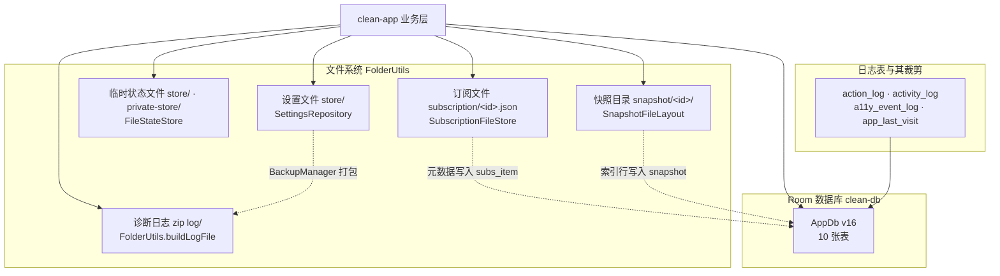
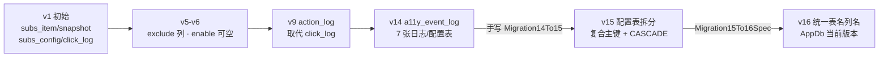
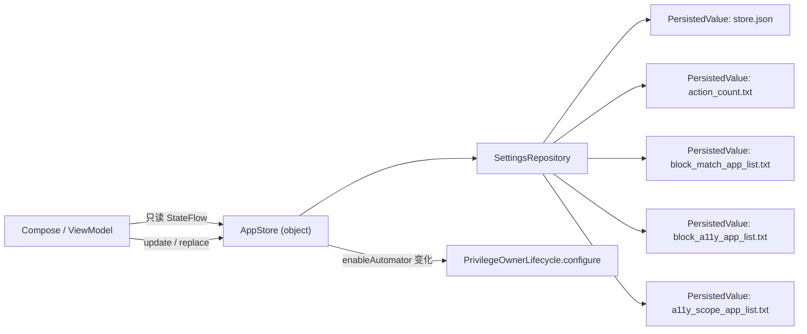
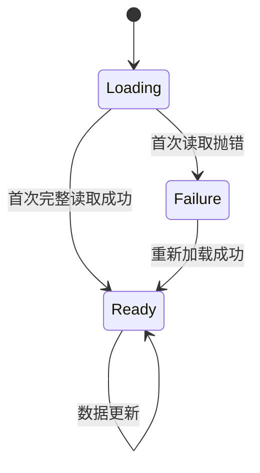
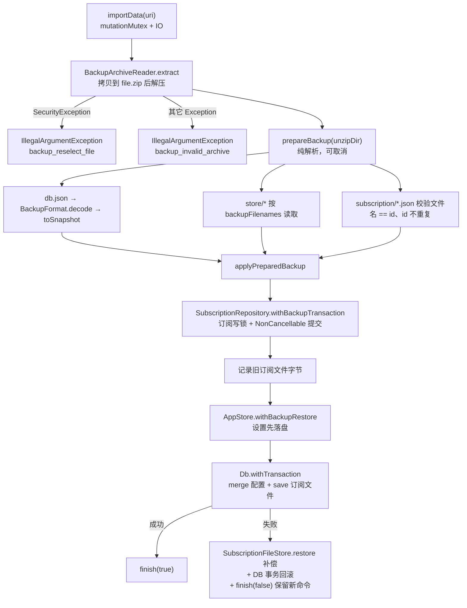

# 数据与持久化层

> 本文档描述 GKD 的持久化与设置层：`clean-db`（Room3 数据库、实体、DAO、迁移）、`clean-app` 的设置文件、订阅文件、快照文件、日志与备份。
> 设计基线见 [clean-app/ARCHITECTURE.md](../clean-app/ARCHITECTURE.md) 的「状态与写入边界」「协程、线程与并发」两节，跨模块视角见 [02-architecture.md](02-architecture.md)。三者冲突时以源码为准。
> 本文只描述代码中确实存在的表、列、DAO 方法与迁移语句；无法从代码或 schema 快照确认的历史信息会显式标注。

## 1. 存储总览

GKD 把状态分成 5 类存储。它们的事实源不同，原子性策略也不同：数据库用 SQLite 事务，设置与订阅文件用「临时文件 + 原子重命名」，快照用「暂存目录 + 重命名 + 数据库发布」，日志用单条插入加计数触发的裁剪。



| 存储 | 事实源 | 原子性策略 |
| --- | --- | --- |
| Room 数据库（`clean-db`） | SQLite 文件 `FolderUtils.dbFolder/gkd.db`，路径由 `App.onCreate` 传给 `Db.initialize` | 单条 DAO 语句即一次事务；跨表写入统一走 `Db.withTransaction`（`withWriteTransaction`） |
| 设置文件（`SettingsRepository`） | `FolderUtils.storeFolder` 下 5 个文件：`store.json`、`action_count.txt`、`block_match_app_list.txt`、`block_a11y_app_list.txt`、`a11y_scope_app_list.txt` | 临时文件 `*.tmp` 写入 + `fd.sync()` + `Files.move(ATOMIC_MOVE, REPLACE_EXISTING)`；`Channel.CONFLATED` 写队列 + 版本号，`awaitPersistence` 以版本号判定落盘 |
| 非备份临时状态文件（`FileStateStore`） | 同样位于 `storeFolder`（`private=true` 时为 `privateStoreFolder`） | 与设置相同的临时文件 + 原子重命名；只用 `drop(1).conflate()` 持久化，不参与备份 |
| 订阅文件 | `FolderUtils.subsFolder/<id>.json`；数据库 `subs_item` 只保存订阅元数据 | `android.util.AtomicFile` 的 `startWrite/finishWrite/failWrite`；`SubscriptionPersistence` 在数据库失败时用 `SubscriptionFileStore.restore` 补偿 |
| 快照文件 | `FolderUtils.snapshotFolder/<id>/` 目录；数据库 `snapshot` 行只是可查询索引 | 暂存目录 `.<id>.tmp` 写完后 `renameTo` 正式目录，再发布数据库行；失败删除正式目录或暂存目录 |
| 日志与裁剪 | `action_log`、`activity_log`、`a11y_event_log`、`app_last_visit` 4 张表 | 单条/批量插入；裁剪由各自 DAO 的 `deleteKeepLatest()` 完成，由业务侧每约 100 次操作触发 |

## 2. 数据库（`clean-db`）

### 2.1 版本与生成方式

`clean-db/src/commonMain/kotlin/li/gkd/db/AppDb.kt` 定义 `@Database(version = 16, entities = [...10 个实体...], autoMigrations = [...14 条...])`，并用 `@ColumnTypeConverters(DbConverters::class)`、`@ConstructedBy(AppDbConstructor::class)` 声明转换器与构造函数。

- `AppDbConstructor` 是 `commonMain` 中的 `internal expect object ... : RoomDatabaseConstructor<AppDb>`（带 `@Suppress("KotlinNoActualForExpect")`），actual 由 Room3 的 KSP 处理器生成，因此 `commonMain` 不需要 `Context`。
- schema 快照由 `room3 { schemaDirectory("$projectDir/schemas") }` 输出到 `clean-db/schemas/li.gkd.db.AppDb/1.json` ~ `16.json`；`clean-db/build.gradle.kts` 还把 `room.schemaDirectory` 作为系统属性传给测试 JVM，供 `MigrationTestHelper` 定位 schema。
- 构建：`kotlin.multiplatform` + `com.android.kotlin.multiplatform.library`（`namespace = "li.gkd.db"`）+ `androidx.room3` + KSP；KSP 处理器分别注册到 `kspAndroid` 与 `kspJvm`。

### 2.2 实体清单

| 表名 | 实体类 | 主键 | 用途与关键列 |
| --- | --- | --- | --- |
| `subs_item` | `SubsItem` | `id`（非自增） | 订阅元数据；`ctime`/`mtime`/`enable`/`enable_update`/`order`/`update_url`；`LOCAL_SUBS_ID = -2`、`LOCAL_HTTP_SUBS_ID = -1` 为本地订阅保留 id |
| `snapshot` | `Snapshot` | `id` | 快照索引行，实现 `BaseSnapshot`；`app_id`(NOT NULL)/`activity_id`/`screen_height`/`screen_width`/`is_landscape`/`github_asset_id` |
| `subs_app_group_config` | `SubsAppGroupConfig` | `subs_id` + `app_id` + `group_key` | 应用内规则组覆盖；`enable: Boolean?`（null 表示未覆盖）、`exclude`；外键 `subs_id → subs_item.id ON DELETE CASCADE` |
| `subs_global_group_config` | `SubsGlobalGroupConfig` | `subs_id` + `group_key` | 全局规则组覆盖；字段同上（同一 `SubsGroupConfig` sealed interface） |
| `subs_category_config` | `SubsCategoryConfig` | `subs_id` + `category_key` | 分类级开关；`enable: Boolean?` |
| `subs_app_config` | `SubsAppConfig` | `subs_id` + `app_id` | 应用级总开关；`enable: Boolean`（非空） |
| `action_log` | `ActionLog` | `id`（AUTOINCREMENT） | 规则命中日志；`ctime`/`app_id`/`activity_id`/`subs_id`/`subs_version`/`group_key`/`group_type`/`rule_index`/`rule_key` |
| `activity_log` | `ActivityLog` | `id`（AUTOINCREMENT） | 前台 Activity 变更日志；`ctime`/`app_id`/`activity_id` |
| `app_last_visit` | `AppLastVisit` | `app_id` | 应用最后使用时间；`last_visit_time` |
| `a11y_event_log` | `A11yEventLog` | `id`（调用方传入） | 无障碍事件日志；`ctime`/`type`/`app_id`/`name`/`desc`/`text: List<String>`；`equals/hashCode` 只按 `id` |

`A11yEventLog.text` 是唯一的类型转换列：`DbConverters` 用 `kotlinx.serialization.json.Json`（`ignoreUnknownKeys = true`、`explicitNulls = false`、`encodeDefaults = true`）在 `List<String>` 与 TEXT 之间互转，解码失败时返回 `emptyList()`。

`RuleGroupType` 只用两个协议常量：`App = 2`、`Global = 3`，源码注释明确它们「持久化在 action_log 与历史备份中，必须保持稳定」。

### 2.3 DAO 清单

| DAO | 关键查询 | 关键写入 |
| --- | --- | --- |
| `SubsItem.SubsItemDao` | `query(): Flow<List<SubsItem>>`、`queryAll()`（均按 `` `order` `` 排序） | `update`、`updateEnable`、`updateOrder`、`@Transaction batchUpdateOrder`、`upsert`、`insertOrIgnore`、`delete`、`updateMtime`、`deleteById` |
| `Snapshot.SnapshotDao` | `query(): Flow<List<Snapshot>>`（`ORDER BY id DESC`）、`count()` | `insert`、`delete`、`deleteGithubAssetId`、`markUploadedIfPending`（仅当 `github_asset_id IS NULL` 时写入） |
| `SubsAppGroupConfig.SubsAppGroupConfigDao` | `queryAll`、`queryBySubsId`、`queryConfig`、`getConfig`、`queryBySubsIds`、`queryUsedList`（只取 `enable = 1` 的订阅）、`queryByAppId`、`queryAppConfig` | `upsert`、`update`、`insertOrIgnore`、`delete`、`deleteAppConfig`、`deleteGroups` |
| `SubsGlobalGroupConfig.SubsGlobalGroupConfigDao` | `queryAll`、`queryBySubsId`、`queryConfig`、`getConfig`、`queryBySubsIds`、`queryUsedList`、`queryGlobalConfig` | `upsert`、`update`、`insertOrIgnore`、`delete`、`deleteGroups` |
| `SubsCategoryConfig.SubsCategoryConfigDao` | `queryAll`、`queryUsedList`、`queryConfig`、`queryCategoryConfig`、`querySubsItemConfig`、`queryBySubsIds` | `update`、`upsert`、`insertOrIgnore`、`delete`、`deleteBySubsItemId`、`deleteBySubsId`、`deleteByCategoryKey` |
| `SubsAppConfig.SubsAppConfigDao` | `queryAll`、`queryAppTypeConfig`、`queryAppUsedList`、`queryUsedList`、`querySubsItemConfig` | `update`、`upsert`、`insertOrIgnore`、`delete` |
| `ActionLog.ActionLogDao` | `query()`（`LIMIT 1000`）、`pagingSource`、`pagingSubsSource`、`pagingAppSource`、`count`、`queryLatest`、`queryLatestByAppId`、`queryLatestUniqueAppIds` 三个重载 | `insert`、`deleteBySubsId`、`deleteKeepLatest`（保留最新 500 条） |
| `ActivityLog.ActivityLogDao` | `pagingSource`（按 `ctime DESC`）、`count` | `insert`、`deleteKeepLatest`（保留最新 500 条） |
| `A11yEventLog.A11yEventLogDao` | `count`、`pagingSource`、`maxId` | `insert(List)`、`deleteKeepLatest`（保留最新 1000 条） |
| `AppLastVisit.AppLastVisitDao` | `query(): Flow<List<String>>`（按 `last_visit_time DESC` 取 DISTINCT `app_id`） | `insert`（`OnConflictStrategy.REPLACE`）、`deleteKeepLatest`（保留最新 500 行） |

`ActionLogDao`、`ActivityLogDao`、`A11yEventLogDao` 都带 `@DaoReturnTypeConverters(PagingSourceDaoReturnTypeConverter::class)`，把 `PagingSource` 返回类型接入 Room3 的 paging 适配。

### 2.4 `Db` 对象的暴露方式

`Db` 是 `commonMain` 中的 `object`，是应用唯一的数据库门面（`clean-db/src/commonMain/kotlin/li/gkd/db/Db.kt`）：

- `internal fun initialize(createDatabase: () -> AppDb)`：二次初始化会 `check` 失败抛出「Db is already initialized」。
- `private val database by lazy { ... }`：首次访问任何 DAO 时才真正建库；未初始化时抛「Db is not initialized」。
- 对外暴露 `subscriptionConfigStore`（`by lazy { SubscriptionConfigStore(database) }`）以及 10 个 DAO getter：`subsItemDao`、`subsAppGroupConfigDao`、`subsGlobalGroupConfigDao`、`snapshotDao`、`actionLogDao`、`subsCategoryConfigDao`、`activityLogDao`、`subsAppConfigDao`、`appLastVisitDao`、`a11yEventLogDao`。
- `suspend fun <T> withTransaction(block: suspend () -> T): T = database.withWriteTransaction { block() }`。
- Android 侧扩展函数在 `androidMain`：`fun Db.initialize(context: Context, databasePath: String)`。`clean-app/App.kt` 在 `onCreate` 中调用 `Db.initialize(this, FolderUtils.dbFolder.resolve("gkd.db").absolutePath)`，且在所有运行时组件之前。

### 2.5 `commonMain` / `androidMain` 差异，以及 Room3 与 SQLite 驱动的选择

`clean-db/src/androidMain/kotlin/li/gkd/db/Db.android.kt` 只有 21 行，承担全部平台绑定：

```kotlin
Room.databaseBuilder(applicationContext, AppDb::class.java, databasePath)
    .addMigrations(Migration14To15)
    .setDriver(AndroidSQLiteDriver())
    .setQueryCoroutineContext(Dispatchers.IO)
    .build()
```

- 使用 `applicationContext`，避免持有 Activity。
- `setDriver(AndroidSQLiteDriver())`：生产环境用平台 SQLite（`androidMain` 只依赖 `androidx.sqlite:sqlite-framework`）。
- `setQueryCoroutineContext(Dispatchers.IO)`：Room 挂起 DAO 的上下文是 IO，这也是「调用方不再重复指定调度器」的依据。
- `.addMigrations(Migration14To15)`：手写迁移的注册点（见第 3 节）。
- `commonMain` 不含任何 Android 类型：实体/DAO/`Db`/`SubscriptionConfigStore` 全是纯 Kotlin，因此可以在 `jvmTest` 里用 `BundledSQLiteDriver` 跑同一份 schema 与迁移。

为什么用 Room3（`androidx.room3` 3.0.3）：它是支持 KMP 的 Room 版本，`commonMain` 可以直接写 `@Entity`/`@Dao`/`@Database`，并提供本仓库依赖的关键 API —— `RoomDatabaseConstructor` + `@ConstructedBy`（无 Context 构造）、`withWriteTransaction`/`withReadTransaction` 扩展、`invalidationTracker.createFlow`、`@RenameTable`/`@RenameColumn`/`@DeleteColumn`/`@DeleteTable.Entries` 形式的 `AutoMigrationSpec`。为什么测试用 bundled SQLite（`androidx.sqlite:sqlite-bundled` 2.7.1）：`jvmTest` 需要在不依赖 Android 设备的情况下用 `BundledSQLiteDriver` 建库、执行迁移并校验外键，`androidx.room3:room3-testing` 的 `MigrationTestHelper` 也需要一个具体驱动。生产 App 不使用 bundled 驱动。

## 3. 迁移

### 3.1 `Migration14To15`（手写，唯一非自动迁移）

`clean-db/src/commonMain/kotlin/li/gkd/db/Migration14To15.kt` 是 `object Migration14To15 : Migration(14, 15)`，逐条语句如下（源码注释：保留每个业务键中 id 最小的整条记录；被删除订阅遗留的孤儿覆盖在新 schema 中已无归属）：

1. `CREATE TABLE app_group_config(subs_id, app_id, group_key, enable, exclude DEFAULT '', PK(subs_id, app_id, group_key), FK subs_id → subs_item(id) ON DELETE CASCADE)`。
2. `INSERT INTO app_group_config SELECT ... FROM subs_config WHERE id IN (SELECT MIN(id) FROM subs_config WHERE type = 2 AND subs_id IN (SELECT id FROM subs_item) GROUP BY subs_id, app_id, group_key)` —— 只搬 `type = 2`（应用内规则组）、只保留同一业务键中 id 最小的一条、并过滤掉孤儿订阅。
3. `CREATE TABLE global_group_config(subs_id, group_key, enable, exclude DEFAULT '', PK(subs_id, group_key), FK subs_id → subs_item(id) ON DELETE CASCADE)`。
4. `INSERT INTO global_group_config SELECT ... FROM subs_config WHERE type = 3 AND subs_id IN (SELECT id FROM subs_item) GROUP BY subs_id, group_key`（同样按 `MIN(id)` 去重）。
5. 重建 `app_config`：先建 `app_config_new(subs_id, app_id, enable NOT NULL, PK(subs_id, app_id), FK CASCADE)`，从旧表按 `MIN(id)` 去重搬入，`DROP TABLE app_config`，`ALTER TABLE app_config_new RENAME TO app_config`。
6. 重建 `category_config`：同样先建 `category_config_new(subs_id, category_key, enable, PK(subs_id, category_key), FK CASCADE)`，按 `MIN(id)` 去重搬入，`DROP TABLE category_config`，再 `RENAME`。
7. `DROP TABLE subs_config` —— 旧的三类配置合一表在此彻底消失。

注意 `AutoMigration` 列表中 **没有** `AutoMigration(from = 14, to = 15)`；`clean-db` 的 `androidMain`（生产库）与 `jvmTest`（`AppDbMigrationTest.openDatabase`、`runMigrationsAndValidate`）都通过 `addMigrations(Migration14To15)` 注册它。schema 14→15 的差异（`subs_config` 消失、`app_config`/`category_config` 换主键、`app_group_config`/`global_group_config` 新增）与上述语句完全对应。

### 3.2 `Migration15To16Spec`（自动迁移 spec）

`clean-db/src/commonMain/kotlin/li/gkd/db/Migration15To16Spec.kt` 是 `class Migration15To16Spec : AutoMigrationSpec`，通过注解声明重命名，由 Room 生成实际 SQL：

| 注解 | 内容 |
| --- | --- |
| `@RenameTable` × 6 | `app_config → subs_app_config`、`category_config → subs_category_config`、`app_group_config → subs_app_group_config`、`global_group_config → subs_global_group_config`、`activity_log_v2 → activity_log`、`app_visit_log → app_last_visit` |
| `@RenameColumn` × 3 | `app_visit_log.id → app_id`、`app_visit_log.mtime → last_visit_time`、`a11y_event_log.appId → app_id` |

这些重命名让数据库表名/列名与实体类的命名风格统一，同时不改变备份格式契约（见第 7 节）。

### 3.3 其余自动迁移 spec

| spec | 位置 | 声明内容 | 效果 |
| --- | --- | --- | --- |
| `ActivityLog.ActivityLogV2Spec` | `ActivityLog.kt` | `@DeleteTable.Entries(DeleteTable(tableName = "activity_log"))` | 7→8 时删除旧结构的 `activity_log`，Room 另建 `activity_log_v2`（带 `ctime`） |
| `ActionLog.ActionLogSpec` | `ActionLog.kt` | `@DeleteTable.Entries(DeleteTable(tableName = "click_log"))` | 8→9 时删除旧表 `click_log`，Room 另建 `action_log`（带 `ctime`） |
| `Migration9To10Spec` | `AppDb.kt` | `@RenameColumn(subs_config.subs_item_id → subs_id)`、`@RenameColumn(category_config.subs_item_id → subs_id)` | 9→10 保留外键 id 的取值（测试 `migration9To10PreservesRenamedForeignIds` 固定该契约） |
| `Migration10To11Spec` | `AppDb.kt` | `@DeleteColumn(snapshot.app_name)`、`@DeleteColumn(snapshot.app_version_code)`、`@DeleteColumn(snapshot.app_version_name)` | 10→11 删除 3 个冗余快照列 |

`ActivityLogV2Spec` 与 `ActionLogSpec` 只声明「删除旧表」，代码中**不存在**把旧表行数据搬入新表的语句；也就是说 7→8、8→9 两次迁移会丢弃旧日志行。这符合日志可丢弃的定位，但属于从代码可读出的行为，不应被误读为「历史日志已迁移」。

### 3.4 schema 1..16 演进

下表的每一行都由 `clean-db/schemas/li.gkd.db.AppDb/N.json` 与 `N+1.json` 中实体的 `createSql`/`fields`/`primaryKey`/`foreignKeys` 实际差异得出。

| 迁移 | 变化 | 迁移通道 |
| --- | --- | --- |
| 1 → 2 | `snapshot` 新增 `github_asset_id INTEGER`（可空） | `AutoMigration(1, 2)` |
| 2 → 3 | 新增表 `category_config(id PK, enable, subs_item_id, category_key)` | `AutoMigration(2, 3)` |
| 3 → 4 | `click_log` 新增 `subs_version INTEGER NOT NULL DEFAULT 0`、`group_type INTEGER NOT NULL DEFAULT 2` | `AutoMigration(3, 4)` |
| 4 → 5 | `subs_config` 新增 `exclude TEXT NOT NULL DEFAULT ''` | `AutoMigration(4, 5)` |
| 5 → 6 | `subs_config.enable` 由 NOT NULL 改为可空 | `AutoMigration(5, 6)` |
| 6 → 7 | 新增表 `activity_log(id PK, app_id NOT NULL, activity_id)` | `AutoMigration(6, 7)` |
| 7 → 8 | 旧 `activity_log` 删除；新增 `activity_log_v2(id AUTOINCREMENT PK, ctime, app_id, activity_id)` | `AutoMigration(7, 8, spec = ActivityLogV2Spec)` |
| 8 → 9 | 旧 `click_log` 删除；新增 `action_log(id AUTOINCREMENT PK, ctime, app_id, activity_id, subs_id, subs_version DEFAULT 0, group_key, group_type DEFAULT 2, rule_index, rule_key)` | `AutoMigration(8, 9, spec = ActionLogSpec)` |
| 9 → 10 | `subs_config`、`category_config` 的 `subs_item_id` 改名为 `subs_id`；新增表 `app_config(id PK, enable NOT NULL, subs_id, app_id)` | `AutoMigration(9, 10, spec = Migration9To10Spec)` |
| 10 → 11 | `snapshot` 删除 `app_name`、`app_version_code`、`app_version_name` | `AutoMigration(10, 11, spec = Migration10To11Spec)` |
| 11 → 12 | `snapshot.app_id` 由可空改为 `NOT NULL` | `AutoMigration(11, 12)` |
| 12 → 13 | 新增表 `app_visit_log(id TEXT PK, mtime)` | `AutoMigration(12, 13)` |
| 13 → 14 | 新增表 `a11y_event_log(id PK, ctime, type, appId, name, desc, text)` | `AutoMigration(13, 14)` |
| 14 → 15 | 新增 `app_group_config`、`global_group_config`；`app_config`、`category_config` 重建为复合主键 + CASCADE 外键；删除 `subs_config` | 手写 `Migration14To15`（无 AutoMigration 条目） |
| 15 → 16 | 6 次表重命名 + 3 次列重命名（见 3.2） | `AutoMigration(15, 16, spec = Migration15To16Spec)` |
| 16（当前） | 10 张表：`subs_item`、`snapshot`、`subs_app_group_config`、`subs_global_group_config`、`subs_category_config`、`action_log`、`activity_log`、`subs_app_config`、`app_last_visit`、`a11y_event_log` | — |

代码中的信息缺口（明确列出，避免臆测）：

- 1→7 之间的演进（新增列、改可空、新增日志表）与 `11 → 12` 的收紧只能从 schema 快照差异推断，`AppDb.kt` 与相关实体文件里没有对应说明性注释。
- `11 → 12` 把 `snapshot.app_id` 改成 NOT NULL 属于可能失败的收紧型迁移（旧行若为 NULL 会被 Room 的自动迁移拒掉）；代码中没有针对该情况的数据清洗语句。
- 版本 1..16 的 schema 快照齐全，但仓库内没有任何版本与 App `versionCode` 的映射表，因此无法从代码判断某个 schema 版本对应哪个发布版本。



## 4. 设置

### 4.1 `SettingsStore` / `SettingsRepository` / `AppStore` 的关系

- `SettingsStore`（`clean-app/src/main/kotlin/li/gkd/app/data/settings/SettingsStore.kt`）是 `@Serializable` 的纯数据类，字段默认值即首次安装的默认设置；只提供两个派生属性 `useA11y`、`useAutomation`（由 `automatorMode` 与 `AutomatorModeOption` 比较得到）。
- `SettingsRepository` 持有一个 `SettingsStore` 加 4 个附属值（`actionCount: Long`、`blockMatchAppList`、`blockA11yAppList`、`a11yScopeAppList`），每个都由内部类 `PersistedValue` 承载，并从 `storeFolder` 读取/写入同名文件。它对外只暴露只读 `StateFlow` 与 `update/replace` 系列方法。
- `AppStore` 是 `object` 门面：`private val repository by lazy { SettingsRepository(...) }`，参数为 `FolderUtils.storeFolder`、`appScope`、`defaultSettings = { SettingsStore() }`、`defaultBlockMatchAppList = AppListString::getDefaultBlockList`。它把 DAO/仓库细节挡在 UI 之外，并额外提供 `actualBlockA11yAppList`、`actualA11yScopeAppList`、`checkAppBlockMatch(appId)`、`toggleEnableMatch()`、`updateEnableAutomator(value)`、`updateAutomatorMode(value)` 等派生逻辑，以及备份相关的 `backupFilenames`、`exportBackupEntries()`、`withBackupRestore(...)` 透传。



### 4.2 `update` / `replace` / `awaitPersistence` 的确切语义

`PersistedValue` 内部结构：`MutableStateFlow<T> mutableState`（构造时用 `decode(file.takeIf { it.exists() }?.readText())` 初始化）、`Channel<WriteRequest<T>>(Channel.CONFLATED)` 写队列、`MutableStateFlow<WriteResult> writeResult`、`var currentVersion: Long`、`var rollbackState: RollbackState<T>?`，以及一个 `scope.launch(Dispatchers.IO)` 的写循环。

- **`update(transform)`**：`@Synchronized`。语义逐条为：① 在锁内计算 `value = transform(mutableState.value)`；② 若正处于备份恢复中（`rollbackState != null`），对回滚影子值**再执行一次同一个 transform**；③ 更新 `mutableState.value`；④ `enqueue(value)`。源码注释明确：写锁不跨越磁盘 I/O；且「与 `MutableStateFlow.update` 一样，转换函数必须纯净，可能被计算多次」。
- **`replace(value)`**：等价于 `update { value }`，语义与上面完全一致，只是忽略旧值。
- 二者都是**普通（非挂起）函数，返回 `Unit`**。返回时只保证：内存 `StateFlow` 已是新值，且一个新的写请求已入队。它**不代表已落盘**，也不等待任何 I/O。
- **`enqueue(value)`**：`currentVersion += 1`，然后 `writeRequests.trySend(WriteRequest(currentVersion, value))`；`trySend` 失败会抛「设置写入队列已关闭」。队列是 `CONFLATED`，中间值可能被丢弃，只有最新值一定能写出——这正是下一次判定必须用「版本号 ≥」而不是「等于」的原因。
- **写循环**：从队列取请求，写 `"${file.absolutePath}.tmp"`（`outputStream` + `fd.sync()`），然后 `Files.move(tmp, file, REPLACE_EXISTING, ATOMIC_MOVE)`；成功/失败都记录为 `WriteResult(request.version, error)` 并发布到 `writeResult`；`CancellationException` 原样抛出（写循环随之结束），其他异常只记录日志不中断循环；`finally` 删除临时文件。
- **`awaitPersistence()`**（`PersistedValue` 的挂起方法）：① 在 `synchronized` 内取当时的 `currentVersion` 作为 `targetVersion`；② `writeResult.first { it.version >= targetVersion }`；③ 若该结果带 `error`，抛 `IOException(UiStrings.settings_write_failed(filename), error)`。因此它的准确语义是：**等待「调用时刻已接受的写请求」对应的那次落盘完成；如果那次写失败则抛异常**。它不等待调用之后才入队的请求，也不会因为更新的成功写而掩盖目标版本的失败（版本号是单调的，首次满足条件的那条结果就是判定依据）。初始 `WriteResult(0, null)` 且 `currentVersion == 0` 时它会立即返回——这正是「从未写过任何值」的情况。
- 目前 `SettingsRepository` **没有**把 `awaitPersistence` 作为公开 API 暴露；唯一调用点在 `withBackupRestore` 内部（通过 `PreparedValueRestore.awaitPersistence`）。

### 4.3 备份恢复期间的转换函数约束

`prepareRestore(text)` 会先 `decode(text)`，再返回 `PreparedValueRestore(begin, finish, awaitPersistence)`：

- `begin()`：`synchronized`，若已有恢复在进行则 `check` 失败（「设置恢复已在进行」）；否则把当前值存入 `rollbackState`，置 `started = true`，把内存值切成恢复值，并入队一次写。
- `finish(committed)`：`committed = true` 时只清理回滚影子；`committed = false` 时把影子值（**已经包含了恢复期间收到的所有 `update` 命令**）发布回 `mutableState` 并再次入队。
- 关键约束因此是两条：① **转换函数必须无副作用、可能被计算两次**（一次作用于当前值，一次作用于回滚影子值）；② **回滚必须保留恢复期间新到的命令**——失败时不能回到「恢复开始前」的旧值，而是回到「旧值 + 恢复期间的新命令」。
- `withBackupRestore(entries, block)` 的顺序：`restoreMutex.withLock` → 先对所有命中 `entries` 的值 `prepareRestore`（解码全部完成后再改任何值）→ `begin()` 全部 → `awaitPersistence()` 全部 → 执行 `block()`（数据库导入）→ 成功则 `finish(true)`。异常路径在 `withContext(NonCancellable)` 里对每个值 `finish(false)` 并再次 `awaitPersistence()`，失败只 `addSuppressed`，最后原样抛出原异常。
- 由此得到的顺序保证：**设置文件在数据库导入之前已经落盘**；设置写入失败时 `block()` 根本不会开始（测试 `failedRestoreWriteDoesNotStartDatabaseWorkAndWriterCanRecover`、`writerContinuesAfterOnePersistenceFailure` 固定该契约）。

### 4.4 自动化开关如何同步到特权进程生命周期配置

`AppStore.initialize()` 是唯一的同步点：

1. 读取当前 `storeFlow.value.enableAutomator` 并存为局部变量 `configuredEnableAutomator`，立即调用 `PrivilegeOwnerLifecycle.configure(configuredEnableAutomator)`。
2. 在 `appScope.launchLogged(Dispatchers.IO)` 中持续 `collect` `storeFlow`：只要 `settings.enableAutomator` 与缓存值不同，就先更新缓存再重新 `configure`。

`PrivilegeOwnerLifecycle.configure(enableAutomator)` 把它翻译为 `PrivilegeConfig.configure(followDeathDelayMillis = if (enableAutomator) 10 分钟 else 0L, activeReconnectOnOwnerDeath = enableAutomator)`。因此「自动化开关」是设置层唯一会驱动特权进程生命周期配置的字段。

## 5. `FileStateStore` 与 `Loadable`

### 5.1 `FileStateStore` 的文件格式与原子写入

`clean-app/src/main/kotlin/li/gkd/app/store/FileStateStore.kt` 是一个极简的「文件即状态」工具：

- 文件名规则：`createTextFlow(key, ...)` 中若 `key` 含 `.` 就原样作为文件名，否则追加 `.txt`；`createJsonFlow<T>(key, ...)` 直接以 `"$key.json"` 为文件名。
- 目录：默认 `FolderUtils.storeFolder`，`private = true` 时改用 `FolderUtils.privateStoreFolder`（`app.filesDir/private-store`，与可被外部文件管理器访问的 `storeFolder` 分开）。当前调用点：`terms_accepted`（`MainViewModel`，文本）、`overlay_position`（`OverlayWindowService`，JSON）、`ignore_version_list`（`Upgrade`，JSON）、`github_cookie`（`GithubUploadState`，`private = true`）。
- 初值：`MutableStateFlow(decode(readText(file)))`，即由解码函数决定文件缺失/损坏时的默认值（`createJsonFlow` 会 `runCatching { ... }.getOrNull() ?: default()`，JSON 解析失败静默回退默认值）。
- 持久化：`scope.launch { stateFlow.drop(1).conflate().collect { withContext(Dispatchers.IO) { writeText(file, encode(it)) } } }`。`drop(1)` 保证初始解码结果不会被回写；`conflate` 保证只追最新值。
- 原子写入：写 `"${file.absolutePath}.tmp"`，`outputStream().use { write(bytes); fd.sync() }`，再 `Files.move(tmp, file, REPLACE_EXISTING, ATOMIC_MOVE)`。与 `SettingsRepository` 的 `PersistedValue` 是同一种模式，但 `FileStateStore` 没有版本号、没有 `awaitPersistence`、也不参与备份。
- 边界：`FileStateStore` 的值不在 `AppStore.backupFilenames` 中，因此不会被导出或导入；需要跨设备迁移的状态必须放在 `SettingsRepository` 或数据库中。

### 5.2 `Loadable` 状态机

`clean-app/src/main/kotlin/li/gkd/app/core/state/Loadable.kt`：



- `sealed interface Loadable<out T : Any>`，成员为 `data object Loading`、`data class Ready<T>(override val value: T)`、`data class Failure(val cause: Throwable)`，三者都有 `val value: T?`（`Loading` 与 `Failure` 恒为 `null`）。
- 约定（`AGENTS.md` 与 [02-architecture.md](02-architecture.md) 明确写出，代码中一致遵守）：**`Loading` 表示尚未收到完整首发；`Ready(emptyList())` 表示已加载但结果为空；禁止用空集合伪装初始值**，也禁止用计数器、`attachLoad` 之类的旁路状态去推断多个查询是否加载完成。
- 代码中的对应实现：`SubscriptionRepository.snapshotFlow` 初值为 `Loadable.Loading`，初始化时再次置 `Loading`，只有在真正读完 `SubsItem` 与订阅文件之后才发布 `Loadable.Ready(SubscriptionSnapshot())`（即使订阅数为 0 也发布 `Ready`，因为「读完了且确实为空」与「还没读」是两种状态）；`awaitSnapshot()` / `requireSnapshot()` 在 `Loading` 状态下直接 `error`，而 `Failure` 状态抛出 `cause`，从不把这两种状态降级成空值。

## 6. 快照存储

### 6.1 实体与文件目录布局

- 数据库行：`Snapshot`（实现 `BaseSnapshot`），只保存 `id`、`app_id`、`activity_id`、`screen_height`、`screen_width`、`is_landscape`、`github_asset_id`。
- 文件载荷：`ComplexSnapshot`（`clean-app/src/main/kotlin/li/gkd/app/data/ComplexSnapshot.kt`）是 `@Serializable`，在 `BaseSnapshot` 字段之外还带 `appInfo`、`gkdAppInfo`、`device`、`nodes`，并提供 `toSnapshot()` 投影到数据库行。**用途分工**：数据库行负责列表、排序与上传状态，`ComplexSnapshot` 负责可离线查看与上传的完整信息（含节点树）。
- 目录布局由 `clean-app/src/main/kotlin/li/gkd/app/snapshot/SnapshotFileLayout.kt` 决定，根目录是 `FolderUtils.snapshotFolder`：
  - 正式目录 `rootDirectory/<id>/`，内含 `$id.json`（`ComplexSnapshot`，用 `keepNullJson` 写出，保留 null）、`$id.min.json`（把 `nodes` 置空后的轻量版）、`$id.webp`（截图）、以及历史遗留的 `$id.png`。
  - 暂存目录 `rootDirectory/.<id>.tmp`。
  - `screenshotFile` 会按文件头挑选可用截图：PNG / JPEG / RIFF+WEBP / GIF87a / GIF89a / BMP 之一才算有效；`hasCompleteFiles` 要求 `$id.json` 非空且存在有效截图。
- `SnapshotRepository` 是 `object SnapshotRepository : SnapshotStore(snapshotDao = Db.snapshotDao, snapshotRoot = FolderUtils.snapshotFolder)`。因为 `Db.snapshotDao` 在对象初始化时求值，`SnapshotRepository` 首次使用必须在 `Db.initialize` 之后（即 `App.onCreate` 之后）。测试直接构造 `SnapshotStore(dao, root)`，用 `FakeSnapshotDao` 覆盖各失败分支。

### 6.2 文件与数据库的原子操作

`SnapshotStore` 用 `mutationMutex: Mutex` 串行化所有变更，并把真实工作放在 `Dispatchers.IO`（JSON 解析放 `Dispatchers.Default`）。`save(snapshot, bitmap)` 走 `clean-app/src/main/kotlin/li/gkd/app/snapshot/SnapshotDirectoryTransaction.kt` 的 `commitSnapshotDirectory`：

```mermaid
sequenceDiagram
    participant S as SnapshotStore.save
    participant T as commitSnapshotDirectory
    participant F as 文件系统
    participant D as SnapshotDao

    S->>T: write(webp + json + min.json) / publish(insert)
    T->>T: ensureActive 检查取消
    T->>F: 目标目录已存在则失败
    T->>F: 删除旧暂存目录、mkdirs .&lt;id&gt;.tmp
    T->>F: write(staging) 写 webp/json/min.json
    T->>T: ensureActive 检查取消
    Note over T,D: 进入 NonCancellable 提交区间
    T->>F: renameTo 暂存目录 → 正式目录
    T->>D: publish() 插入 snapshot 行
    alt publish 抛错
        T->>F: 删除正式目录并重抛
    end
    Note over T: 失败时确保删除暂存目录
```

- 只有「重命名 + 数据库发布」这一段在 `NonCancellable` 内；耗时写入仍然响应取消。
- `delete(snapshot)` 的顺序是：`ensureActive` → 在 `NonCancellable + Dispatchers.IO` 内把正式目录 `renameTo` 为 `.<name>.delete-<UUID>`（`stageDeletion`）→ `snapshotDao.delete(snapshot)` → 数据库失败则 `rollbackDeletion` 把目录改回，成功则 `finishDeletion` 递归删除暂存目录。
- `replaceScreenshot(snapshot, newBytes)`：解码新旧位图、要求尺寸一致，写 `.<webp>.{nanoTime}.tmp` 且 `fd.sync()`，`ensureActive`，然后在 `NonCancellable` 内 `stageReplacement` 旧文件、`Os.rename(tmp → webp)`、`snapshotDao.deleteGithubAssetId(id)`（截图变了就必须重新上传），失败回滚，成功清理旧文件与遗留 `$id.png`。
- `markUploaded(snapshotId, githubAssetId, screenshotModifiedAt)`：先确认截图文件存在且 `lastModified()` 与上传时一致，再调用 `markUploadedIfPending`（SQL 里带 `github_asset_id IS NULL` 条件），返回是否真的写入。
- `getMinSnapshot(id)`：优先读 `$id.min.json` 缓存（解码失败则忽略），否则读 `$id.json`、把 `nodes` 置空后写回 min 文件。
- `createUploadArchive` / `createArchive` / `deleteArchive`：先把 `$id.json` 与截图打进 `sharedDir/snapshot-<id>-<UUID>/<name>.zip`，失败时递归删除该目录；`deleteArchive` 只允许删 `sharedDir` 下以 `snapshot-` 开头的目录。

## 7. 备份

### 7.1 `BackupFormat`：格式定义

`clean-app/src/main/kotlin/li/gkd/app/data/backup/BackupFormat.kt` 定义的是**压缩包内 `db.json` 的 JSON 契约**，与 Room schema 版本完全独立（源码注释：`Archive versions are independent of Room schema versions.`）。

- **没有魔数、没有校验和**：备份产物是 `ZipUtils.zipFiles` 生成的普通 zip，内部通过固定条目名识别内容（`store/`、`db.json`、`subscription/`）。`BackupFormat` 里不存在 header、magic、CRC 或签名字段。完整性只由 zip 结构本身与解析时的字段校验保证。
- **版本**：`BackupDatabaseData.formatVersion` 默认 `2`；解码时读 `root["formatVersion"]?.jsonPrimitive?.int ?: 1`——**字段缺失即视为 V1 历史格式**；其他值走 `else -> error(UiStrings.backup_version_unsupported(version))`。
- **JSON 配置**：`ignoreUnknownKeys = true`、`explicitNulls = false`、`encodeDefaults = true`；因此导出的 V2 一定包含 `"formatVersion":2`。
- **V2 字段**：`formatVersion`、`subsItems: List<BackupSubsItem>`、`appConfigs: List<BackupAppConfig>`、`categoryConfigs: List<BackupCategoryConfig>`、`appGroupConfigs: List<BackupAppGroupConfig>`、`globalGroupConfigs: List<BackupGlobalGroupConfig>`。各条目的字段与数据库实体一一对应（`BackupSubsItem` 含 `id/ctime/mtime/enable/enableUpdate/order/updateUrl`；`BackupCategoryConfig.enable` 与两个 group 配置的 `enable`/`exclude` 保持可空/默认），并由 `toEntity()`/`fromEntity()` 双向映射。
- **V1 兼容**（私有 `LegacyBackupV1`）：字段为 `subsItems`、`subsConfigs: List<LegacyGroupConfig>`、`appConfigs: List<LegacyAppConfig>`、`categoryConfigs: List<LegacyCategoryConfig>`，都带 `id`。`convert()` 的规则是：`subsConfigs` 先按 `id` 升序排序，要求所有 `type` ∈ {`RuleGroupType.App`=2, `RuleGroupType.Global`=3}（否则抛 `UiStrings.backup_unknown_rule_config_type`），再按业务键 `distinctBy` 去重（应用组用 `(subsId, appId, groupKey)`，全局组用 `(subsId, groupKey)`），拆成 `appGroupConfigs`/`globalGroupConfigs`；`appConfigs` 与 `categoryConfigs` 同样「先按 id 排序再去重」，即**取 id 最小的那条记录**。
- `BackupDatabaseData.toSnapshot()` / `fromSnapshot(snapshot)` 是 `SubscriptionConfigSnapshot` 与备份载荷之间的唯一转换点。

### 7.2 `BackupArchiveReader`：读取与解析

`clean-app/src/main/kotlin/li/gkd/app/data/backup/BackupArchiveReader.kt` 只做两件事：

1. `copyArchive(uri, archiveFile)`：`app.contentResolver.openInputStream(uri)`（失败抛 `IOException(UiStrings.backup_read_failed)`），8 KiB 缓冲循环拷贝，累计字节数超过 `MAX_ARCHIVE_BYTES = 64 MiB` 时抛 `IOException(UiStrings.backup_archive_too_large)`。
2. `ZipUtils.unzipFile(archiveFile, destination)`：真正解压，附带条目数量/单条目/总量限制与路径逃逸防护（见 7.4）。

注意：`BackupArchiveReader` 是**阻塞式**实现，调用方 `BackupManager.importData` 已经在 `Dispatchers.IO` 上，因此它自身不再切线程。

### 7.3 `BackupManager`：导入导出的完整流程

`clean-app/src/main/kotlin/li/gkd/app/data/backup/BackupManager.kt` 是 `object`，用 `private val mutationMutex = Mutex()` 保证导入与导出互斥，两个入口都在 `withContext(Dispatchers.IO)` 内。

**导出 `exportData(): File`**

1. `mutationMutex.withLock`；`FolderUtils.createGkdTempDir()` 建临时目录。
2. `store/` 子目录：遍历 `AppStore.exportBackupEntries()`（即 `SettingsRepository.exportBackupEntries()` 返回的 5 个文件名 → `encodeCurrent()` 文本），逐个写文件。
3. `db.json`：`BackupFormat.encode(BackupDatabaseData.fromSnapshot(Db.subscriptionConfigStore.capture()))` —— 用 `SubscriptionConfigStore` 的**一次读事务**获取订阅配置一致性快照。
4. `subscription/` 子目录：`SubscriptionRepository.awaitSnapshot()` 的每个订阅写成 `<id>.json`。
5. 用 `ExportFileNames.reserve(FolderUtils.sharedDir, "gkd-backup-<时间戳>", "zip")` 预留文件名，`ZipUtils.zipFiles(tempDir.listFiles(), file)`；压缩失败或抛错时删除该文件并重抛。
6. `finally` 递归删除临时目录。

**导入 `importData(uri)`**



`prepareBackup(unzipDir)`（`withContext(Dispatchers.IO)`，JSON 解码放 `Dispatchers.Default`）：

- `db.json` 不存在或不是普通文件 → `dbData = null`（允许只恢复设置/订阅的包）。
- `store/` 只读取 `AppStore.backupFilenames` 中确实存在的文件，组装为 `Map<String, String>`。
- `subscription/` 只处理文件名以 `.json` 结尾的文件，按文件名排序；文件名主干必须能解析为 `Long` 且等于订阅自身的 `id`（否则 `UiStrings.subscription_file_id_mismatch_detail`），并 `require` id 不重复（`UiStrings.backup_duplicate_subscription_id`）。

`applyPreparedBackup(prepared)` 的嵌套顺序就是回滚策略的层次：

1. `SubscriptionRepository.withBackupTransaction(prepared.subscriptions)`：拿到订阅 `MutexState` 写锁（`NonCancellable` 包住提交区间），先按 `previous` 快照 `prepareSubscription` 得到 `prepared` 列表。
2. 在锁内先读 `SubscriptionFileStore.readBytes(id)` 备份每个订阅文件的旧字节。
3. `AppStore.withBackupRestore(prepared.storeEntries) { ... }`：**设置文件先落盘**，并在失败时回滚（保留恢复期间新命令）。
4. 块内 `Db.withTransaction { merge(dbData) } + subscriptions.forEach { SubscriptionPersistence.save(it) }`：整个数据库导入是**一个写事务**，失败即整体回滚，不用历史整库快照覆盖其他并发写入；`merge` 返回被跳过的孤儿覆盖条数（`subsId` 不在 `subsItems` 中的记录）。
5. 若步骤 4 抛错：先对每个旧订阅文件 `SubscriptionFileStore.restore(id, bytes)` 补偿（补偿异常 `addSuppressed` 到原异常），再让异常冒泡，从而触发第 3 步的设置回滚与第 1 步的锁释放。
6. 成功路径由 `withBackupTransaction` 重新从磁盘读订阅并发布 `Loadable.Ready`；失败路径也会尝试重新读取，只把「实际磁盘状态」发布出去，读取失败同样只 `addSuppressed`。

### 7.4 相关原子性与安全限制

| 机制 | 位置 | 作用 |
| --- | --- | --- |
| 订阅文件原子写 | `SubscriptionFileStore.writeBytes` | `android.util.AtomicFile` 的 `startWrite` / `finishWrite` / `failWrite`；`delete` 后仍存在则报错 |
| 订阅文件补偿 | `SubscriptionPersistence.save` / `delete` | 先备份旧字节再写文件，数据库事务失败时 `restoreFile(s)` 回滚；`delete` 区分 `DeleteStage.File` 与 `DeleteStage.Database` |
| 订阅写锁 | `SubscriptionRepository.updateMutex`（`MutexState`） | 备份的文件保存/补偿与普通订阅修改互斥；`withBackupTransaction` 的提交段 `NonCancellable` |
| 解压防护 | `ZipUtils.unzipFile` | 默认上限 `maxEntryCount = 4096`、`maxEntryBytes = 32 MiB`、`maxTotalBytes = 128 MiB`；拒绝含 `\` 的条目名、`normalize()` 后越出目标目录的路径；同时按「条目声明大小」和「实际读取字节」双重校验 |
| 归档大小上限 | `BackupArchiveReader.MAX_ARCHIVE_BYTES` | 拷贝阶段超过 64 MiB 直接拒绝 |

## 8. 应用信息

`clean-app/src/main/kotlin/li/gkd/app/data/appinfo/` 下的两个组件维护「已安装应用列表 + 图标缓存」，**它们不落盘**：没有对应数据库表或设置文件，全部是内存 `StateFlow`。

`AppInfoRepository`（`object`）：

- 原始缓存：`userAppInfoMapFlow: StateFlow<Map<String, AppInfo>>`、`userAppIconMapFlow: StateFlow<Map<String, Drawable>>`、`otherUserMapFlow: StateFlow<Map<Int, UserInfo>>`、`otherUserAppInfoMapFlow`、`otherUserAppIconMapFlow`（均在声明处用显式 backing field 初始化为空 Map）。
- 派生状态（`by lazy`，`combine`/`mapState` + `stateIn(appScope, SharingStarted.Eagerly, ...)`）：`appInfoMapFlow`（本用户 + 其他用户合并）、`appIconMapFlow`、`systemAppInfoCacheFlow`、`systemAppsFlow`、`visibleAppInfosFlow`（过滤 `hidden`，用 `collator` 按名称排序）。
- `refresh()`：在 `Dispatchers.IO` 内取 `updateAppMutex.withStateLock`，用 `packageManager.getInstalledPackages(MATCH_UNINSTALLED_PACKAGES)` 重建 `AppInfo` 与图标两个 Map；若「非系统应用数 ≤ 4」判定为可能缺少读取应用列表权限，置 `appListAuthAbnormalFlow`，并按优先级回退：`privilegeContextFlow.value?.getInstalledPackagesAsUser(flags, currentUserId)` → `queryIntentActivities(ACTION_MAIN / ACTION_VIEW, MATCH_DISABLED_COMPONENTS)`；最后 `updateOtherUserAppInfo(...)` 并发布两个 Map。若刚启动且疑似权限异常，会在 `App.START_WAIT_TIME` 后再 `requestRefresh()` 一次。
- 多用户：`updateOtherUserAppInfo` 在 `privilegeContextFlow` 为空或本用户列表为空时把三张 other-user 表清空；否则遍历 `privilegeContext.getUsers()`（排除 `currentUserId`，按 id 排序）调 `getInstalledPackagesAsUser`，只保留本用户没有的包，生成 `AppInfo` 与图标。
- 增量更新：`willUpdateAppIds` 经 `debounce(3000ms)`、`filter { it.isNotEmpty() }` 后进入 `updatePartAppInfo(appIds)`，在同一个 `MutexState` 锁内只刷新这些包（`app.getPkgInfo(appId)`，拿不到就从 Map 中移除），并同步刷新 other-user 缓存。
- `initialize()`：注册 `AppChangeMonitor.register(::dispatchAppUpdate)`，`requestRefresh()`，并起两个 `appScope` 收集器——一个跟随 `privilegeContextFlow`（`drop(1)`）刷新 other-user 缓存，一个消费去抖后的 `willUpdateAppIds`。

`AppChangeMonitor`（`object`）用 `@Synchronized fun register(onChanged: (String) -> Unit)`（重复注册直接 `check` 失败）建立两条互补通道：

- 广播接收器：`Intent.ACTION_PACKAGE_ADDED` / `ACTION_PACKAGE_REPLACED` / `ACTION_PACKAGE_REMOVED` + `addDataScheme("package")`，用 `ContextCompat.registerReceiver(..., RECEIVER_EXPORTED)` 注册，回调取 `intent.data?.schemeSpecificPart`（即包名）。
- `app.launcherApps.registerCallback(...)`：实现 `onPackageAdded` / `onPackageChanged` / `onPackageRemoved`（`onPackagesAvailable` / `onPackagesUnavailable` 为空实现），源码注释说明「某些设备 `ACTION_PACKAGE_ADDED` 接收不到，使用 `LauncherApps.Callback` 作为补充」。

图标缓存为什么只存在于内存：`Drawable` 不可序列化且随主题/密度变化，缓存的生命周期与进程一致；唯一落盘的「应用信息」是 `FolderUtils.buildLogFile()` 生成的诊断包里 `apps.json` 的 `AppJsonData`（含 `userId`、`apps`、`otherUsers`、`othersApps` 的文本快照），它属于日志导出而非状态事实源。

## 9. 并发与线程

| 位置 | 线程/调度 | 说明 |
| --- | --- | --- |
| Room 挂起 DAO | `Dispatchers.IO` | 由 `Db.android.kt` 的 `setQueryCoroutineContext(Dispatchers.IO)` 统一配置；调用方不重复指定调度器 |
| `Db.withTransaction` | 数据库配置的上下文 | `database.withWriteTransaction { block() }`；跨表一致性写入的唯一入口 |
| `SettingsRepository.PersistedValue` | 写循环 `scope.launch(Dispatchers.IO)` | `update`/`replace` 在调用方线程同步改内存并入队；磁盘 I/O 只在 IO 上的写循环内发生 |
| `SettingsRepository.withBackupRestore` | 恢复互斥 + `NonCancellable` 仅限失败补偿 | `restoreMutex.withLock` 串行化恢复；`fail` 路径的 `finish(false)` 与 `awaitPersistence()` 在 `withContext(NonCancellable)` 内 |
| `BackupManager` | `withContext(Dispatchers.IO)`；解析用 `Dispatchers.Default` | 导入导出都由 `mutationMutex` 串行；`prepareBackup` 的 JSON 解码放 Default |
| `SnapshotStore` | `mutationMutex` + `Dispatchers.IO`；JSON 解析 `Dispatchers.Default` | `NonCancellable` 只覆盖 `commitSnapshotDirectory` 的重命名/发布、`delete` 的暂存/回滚/清理、`replaceScreenshot` 的替换提交 |
| `SnapshotStore` 取消边界 | `currentCoroutineContext().ensureActive()` | 在写文件前后各检查一次，保证耗时写入仍可取消 |
| `FileStateStore` | `withContext(Dispatchers.IO)` | 持久化收集器内部切换；调用方只提供 `CoroutineScope` |
| `AppInfoRepository` | `withContext(Dispatchers.IO)` + `MutexState` | `refresh()` 整体在 IO；`debounce(3000ms)` 的增量更新通过 `appScope.launchLogged(Dispatchers.IO)` 驱动 |
| `AppChangeMonitor` | 广播/回调线程 | 只做 `willUpdateAppIds.update { it + appId }` 与 `StateFlow` 写入，不做重活 |
| `FolderUtils.deleteSharedFile` / `withTemporaryZip` | `NonCancellable + Dispatchers.IO` | 清理已产生的临时产物属于「已接受的补偿」 |
| `SubscriptionRepository.withBackupTransaction` | `withContext(Dispatchers.IO)` + `MutexState` + `NonCancellable` | 等待在途刷新仍可取消；拿到锁后的提交与补偿不可取消 |

`MutexState`（`clean-app/src/main/kotlin/li/gkd/app/util/MutexState.kt`）是「互斥锁 + 可观察占用状态」的组合：内部一个 `Mutex` 与 `MutableStateFlow<Boolean>`；`withStateLock` 会挂起等待，`tryWithStateLock` 在锁被占用时**立即返回 `false` 且不执行块**；两者都在 `finally` 中先把状态置回 `false` 再解锁。仓库中的使用点：`AppInfoRepository.updateAppMutex`（配合 `val updating = updateAppMutex.state`）、`SubscriptionRepository.updateMutex`（`val updating`、`val isBusy`，并在 `addOrModifyRemote`、`refresh` 中用返回值表达 `SubscriptionResult.Busy`）。

`NonCancellable` 的使用边界在本层可以归纳为一条：**只覆盖「已经接受的提交」与「必须完成的补偿」**。符合该边界的调用点即上表中的 `SettingsRepository.withBackupRestore` 的 catch 分支、`SnapshotStore` 的三处提交/回滚/清理、`SnapshotDirectoryTransaction` 的重命名与发布、`SubscriptionRepository.withBackupTransaction` 的提交段、`FolderUtils` 的清理函数；而不符合边界的耗时行为（生成快照、解析 JSON、写文件、下载）都在 `ensureActive()` 或普通挂起点上保持可取消。

## 10. 测试

| 测试文件 | 保护的行为契约 |
| --- | --- |
| `clean-db/src/jvmTest/kotlin/li/gkd/db/AppDbMigrationTest.kt` | ① `everyExportedSchemaMigratesToVersion16`：对 1..15 每个已导出 schema 建库后都能迁移并校验到 v16；② `migration15To16PreservesConfigurationsLogsAndLastVisitOrdering`：表/列重命名后配置、日志、最后访问时间与排序保持，且 `PRAGMA foreign_key_check` 通过、父表更新与级联删除仍生效；③ `migration14To15DeduplicatesWholeConfigurationsAndPreservesTheirMeaning`：同一业务键按 `MIN(id)` 保留整条记录、孤儿覆盖被丢弃、开关更新只作用于唯一行；④ `migration9To10PreservesRenamedForeignIds`：`subs_item_id → subs_id` 重命名保留取值；⑤ `migration10To11PreservesSnapshotDataOutsideDeletedColumns`：删除 3 个 snapshot 列后其余数据仍在；⑥ `databaseOpensVersion14AndRollsBackFailedTransaction`：v14 库可打开且写事务失败会回滚；⑦ `flowPagingAndListConverterWorkOnJvm`：`Flow`、`PagingSource` 与 `List<String>` 类型转换器在 JVM 上可用 |
| `clean-db/src/jvmTest/kotlin/li/gkd/db/SubscriptionConfigStoreTest.kt` | ① 显式应用/组设置不被默认值覆盖；② 重置开关与排除配置时保留其他作用域与页面级排除；③ 混合作用域写事务失败不留半成品；④ 重复导入保留本地业务键、只补缺失覆盖并返回被跳过的孤儿数；⑤ `SubsItem` upsert 保留覆盖、删除级联到 4 张配置表；⑥ `restore(checkpoint)` 恢复被改/被删的覆盖并移除多出来的行；⑦ `observe()` 发布的快照总是完整事务（跨两张组表）；⑧ 导入事务失败回滚全部配置表；⑨ 40 个并发 `updateGlobalGroupConfig` 不丢任何 `exclude` 追加；⑩ 组开关变更保留最新排除配置、失败的编辑不改变已有值；⑪ 导入失败不会回滚「等待同一事务的普通写入」 |
| `clean-app/src/test/kotlin/li/gkd/app/data/settings/SettingsRepositoryTest.kt` | ① 显式 update 改内存并可跨 Repository 重建读回；② 200 个并发 `incrementActionCount` 最终内存与文件一致；③ 一次落盘失败后写循环仍能继续工作；④ 恢复失败时保留后续编辑与自增、且不保留导入值；⑤ 恢复成功后保留导入值与后续命令，并能再次开始新的恢复；⑥ 恢复被取消时落盘回滚值并保留挂起期间的更新；⑦ 目标路径是目录导致写失败时，数据库工作**根本不会开始**且写循环可恢复 |
| `clean-app/src/test/kotlin/li/gkd/app/data/snapshot/SnapshotRepositoryTest.kt` | ① 截图未变时才记录上传 id；② 截图 `lastModified` 变化后不记录；③ 数据库删除失败时把快照目录改回原位、文件仍在（用 `SnapshotStore` + `FakeSnapshotDao` 注入删除失败）；④ 数据库删除成功后目录被彻底删除 |
| `clean-app/src/test/kotlin/li/gkd/app/data/backup/BackupFormatTest.kt` | ① V1 载荷按 `MIN(id)` 拆分与去重（含 `enable` 为 null 的记录）；② 导入后 UI 策略与运行期汇总得到相同的生效开关；③ 重新导出为 V2（含 `formatVersion":2`、不再有 `subsConfigs`、null 值保留）且往返等价；④ 表重命名前的 V2 导出字段名与取值不变（Room 表名不得改变归档契约）；⑤ V1 缺失集合与可选组字段使用原始默认值；⑥ 不支持的版本抛 `IllegalStateException`、未知 `type` 抛 `IllegalArgumentException`（在导入开始前失败） |
| `clean-app/src/test/kotlin/li/gkd/app/util/ZipUtilsTest.kt` | ① 拒绝越出目标目录的条目（`../escaped.txt`）且不产生文件；② 按**实际**读取字节数执行 `maxEntryBytes` 限制；③ 合法条目能正确解压 |
| `clean-app/src/test/kotlin/li/gkd/app/util/MutexStateTest.kt` | ① 持锁期间 `tryWithStateLock` 原子地跳过（返回 `false` 且块未执行）；② `withStateLock` 在块抛错后仍释放锁并复位 `state` |

## 关键文件索引

| 仓库相对路径 | 职责 |
| --- | --- |
| `clean-db/build.gradle.kts` | `clean-db` KMP 目标（android/jvm）、依赖、`room3 { schemaDirectory }`、KSP 处理器与测试的 `room.schemaDirectory` 系统属性 |
| `clean-db/src/commonMain/kotlin/li/gkd/db/AppDb.kt` | `@Database(version = 16)` 实体与自动迁移清单、`AppDbConstructor`、`Migration9To10Spec`、`Migration10To11Spec`、`DbConverters` |
| `clean-db/src/commonMain/kotlin/li/gkd/db/Db.kt` | `Db` 单例：`initialize`、懒加载 database、10 个 DAO getter、`subscriptionConfigStore`、`withTransaction` |
| `clean-db/src/androidMain/kotlin/li/gkd/db/Db.android.kt` | Android 侧 `Db.initialize(context, databasePath)`：Room3 builder、`AndroidSQLiteDriver`、`Dispatchers.IO`、注册 `Migration14To15` |
| `clean-db/src/commonMain/kotlin/li/gkd/db/SubscriptionConfigStore.kt` | `SubscriptionConfigSnapshot`、订阅配置的写事务方法（`setAppEnabled`、`updateAppGroupConfig`、`updateGlobalGroupConfig`）、`observe`/`capture`/`merge`/`restore` |
| `clean-db/src/commonMain/kotlin/li/gkd/db/SubsItem.kt` | `SubsItem` 实体 + `SubsItemDao` + `LOCAL_SUBS_ID`/`LOCAL_HTTP_SUBS_ID` 常量 |
| `clean-db/src/commonMain/kotlin/li/gkd/db/Snapshot.kt` | `Snapshot` 实体 + `SnapshotDao`（含 `markUploadedIfPending`） |
| `clean-db/src/commonMain/kotlin/li/gkd/db/BaseSnapshot.kt` | 快照的公共字段接口 |
| `clean-db/src/commonMain/kotlin/li/gkd/db/SubsGroupConfig.kt` | `SubsGroupConfig` sealed interface 与 `withEnable`/`withExclude` 扩展 |
| `clean-db/src/commonMain/kotlin/li/gkd/db/SubsAppGroupConfig.kt` | 应用内规则组覆盖实体 + DAO |
| `clean-db/src/commonMain/kotlin/li/gkd/db/SubsGlobalGroupConfig.kt` | 全局规则组覆盖实体 + DAO |
| `clean-db/src/commonMain/kotlin/li/gkd/db/SubsCategoryConfig.kt` | 分类开关实体 + DAO |
| `clean-db/src/commonMain/kotlin/li/gkd/db/SubsAppConfig.kt` | 应用级开关实体 + DAO |
| `clean-db/src/commonMain/kotlin/li/gkd/db/ActionLog.kt` | 规则命中日志实体 + `ActionLogDao` + `ActionLogSpec`（删除 `click_log`） |
| `clean-db/src/commonMain/kotlin/li/gkd/db/ActivityLog.kt` | 前台 Activity 日志实体 + `ActivityLogDao` + `ActivityLogV2Spec` |
| `clean-db/src/commonMain/kotlin/li/gkd/db/A11yEventLog.kt` | 无障碍事件日志实体 + `A11yEventLogDao` |
| `clean-db/src/commonMain/kotlin/li/gkd/db/AppLastVisit.kt` | 应用最后使用时间实体 + `AppLastVisitDao` |
| `clean-db/src/commonMain/kotlin/li/gkd/db/RuleGroupType.kt` | 持久化协议常量 `App = 2` / `Global = 3` |
| `clean-db/src/commonMain/kotlin/li/gkd/db/Migration14To15.kt` | 手写 14→15 迁移：建两张组表、重建两张配置表、删 `subs_config` |
| `clean-db/src/commonMain/kotlin/li/gkd/db/Migration15To16Spec.kt` | 15→16 的 6 次 `@RenameTable` 与 3 次 `@RenameColumn` |
| `clean-db/schemas/li.gkd.db.AppDb/*.json` | v1..v16 schema 快照，迁移测试与版本校验的事实依据 |
| `clean-db/src/jvmTest/kotlin/li/gkd/db/AppDbMigrationTest.kt` | 全版本迁移、重命名/去重语义、事务回滚、JVM 上的 Flow/Paging/转换器契约 |
| `clean-db/src/jvmTest/kotlin/li/gkd/db/SubscriptionConfigStoreTest.kt` | 订阅配置并发、级联、导入/恢复与事务完整性契约 |
| `clean-app/src/main/kotlin/li/gkd/app/store/AppStore.kt` | 设置门面：只读 StateFlow、update/replace 透传、派生列表、自动化开关同步、备份入口 |
| `clean-app/src/main/kotlin/li/gkd/app/store/FileStateStore.kt` | `createTextFlow`/`createJsonFlow`：临时文件 + 原子重命名的轻量文件状态 |
| `clean-app/src/main/kotlin/li/gkd/app/data/settings/SettingsStore.kt` | `@Serializable` 设置数据类与 `useA11y`/`useAutomation` |
| `clean-app/src/main/kotlin/li/gkd/app/data/settings/SettingsRepository.kt` | `PersistedValue` 写队列/版本号/`awaitPersistence`、5 个设置文件、`withBackupRestore` 回滚语义 |
| `clean-app/src/main/kotlin/li/gkd/app/data/backup/BackupFormat.kt` | 备份 JSON 契约：V2 载荷、V1 兼容转换、`encode`/`decode` |
| `clean-app/src/main/kotlin/li/gkd/app/data/backup/BackupArchiveReader.kt` | 从 `Uri` 拷贝归档（64 MiB 上限）并解压到临时目录 |
| `clean-app/src/main/kotlin/li/gkd/app/data/backup/BackupManager.kt` | 导出/导入编排、`prepareBackup` 校验、`applyPreparedBackup` 三层回滚 |
| `clean-app/src/main/kotlin/li/gkd/app/data/snapshot/SnapshotRepository.kt` | `SnapshotRepository`/`SnapshotStore`：快照文件与数据库行的原子操作、上传归档 |
| `clean-app/src/main/kotlin/li/gkd/app/snapshot/SnapshotFileLayout.kt` | 正式目录/暂存目录布局与截图文件有效性判定 |
| `clean-app/src/main/kotlin/li/gkd/app/snapshot/SnapshotDirectoryTransaction.kt` | `commitSnapshotDirectory`：暂存写入 → 重命名 → 数据库发布的不可取消提交区间 |
| `clean-app/src/main/kotlin/li/gkd/app/data/ComplexSnapshot.kt` | 快照文件载荷（含 `nodes`/`device`/`appInfo`）与 `toSnapshot()` 投影 |
| `clean-app/src/main/kotlin/li/gkd/app/data/appinfo/AppInfoRepository.kt` | 已安装应用与图标的内存缓存、多用户回退、增量刷新与去抖 |
| `clean-app/src/main/kotlin/li/gkd/app/data/appinfo/AppChangeMonitor.kt` | 包变更广播 + `LauncherApps.Callback` 双通道监听 |
| `clean-app/src/main/kotlin/li/gkd/app/core/state/Loadable.kt` | `Loading`/`Ready`/`Failure` 状态机，禁止用空集合伪装初始值 |
| `clean-app/src/main/kotlin/li/gkd/app/util/FolderUtils.kt` | 目录布局（db/store/subscription/snapshot/log/private-store/shared）、临时目录、诊断日志包 |
| `clean-app/src/main/kotlin/li/gkd/app/util/FolderExt.kt` | `File.autoMk()` 目录按需创建 |
| `clean-app/src/main/kotlin/li/gkd/app/util/ZipUtils.kt` | `zipFiles`/`unzipFile` 与解压限制、路径逃逸防护 |
| `clean-app/src/main/kotlin/li/gkd/app/util/Option.kt` | 持久化的枚举型设置值（`AppSortOption`、`UpdateTimeOption`、`AutomatorModeOption` 等） |
| `clean-app/src/main/kotlin/li/gkd/app/util/MutexState.kt` | 互斥锁 + 可观察占用状态的 `withStateLock`/`tryWithStateLock` |
| `clean-app/src/main/kotlin/li/gkd/app/util/FlowExt.kt` | `mapState`：`StateFlow` 派生 |
| `clean-app/src/main/kotlin/li/gkd/app/util/Singleton.kt` | `json`/`keepNullJson` 序列化实例（备份、快照、订阅文件共用） |
| `clean-app/src/main/kotlin/li/gkd/app/data/subscription/SubscriptionFileStore.kt` | 订阅文件事实源：`AtomicFile` 写入、`readBytes`/`restore`/`delete` |
| `clean-app/src/main/kotlin/li/gkd/app/data/subscription/SubscriptionPersistence.kt` | 订阅文件与数据库的补偿一致性（`save`/`delete`/`cleanupConfigs`） |
| `clean-app/src/main/kotlin/li/gkd/app/data/subscription/SubscriptionRepository.kt` | 订阅用例编排、写锁、`withBackupTransaction` 提交与补偿边界 |
| `clean-app/src/test/kotlin/li/gkd/app/data/settings/SettingsRepositoryTest.kt` | 设置写入、并发、恢复回滚与取消语义契约 |
| `clean-app/src/test/kotlin/li/gkd/app/data/snapshot/SnapshotRepositoryTest.kt` | 快照上传标记与删除失败回滚契约 |
| `clean-app/src/test/kotlin/li/gkd/app/data/backup/BackupFormatTest.kt` | 备份 V1/V2 兼容与字段名冻结契约 |
| `clean-app/src/test/kotlin/li/gkd/app/util/ZipUtilsTest.kt` | ZIP 路径逃逸与解压大小限制契约 |
| `clean-app/src/test/kotlin/li/gkd/app/util/MutexStateTest.kt` | `MutexState` 的跳过与解锁契约 |
