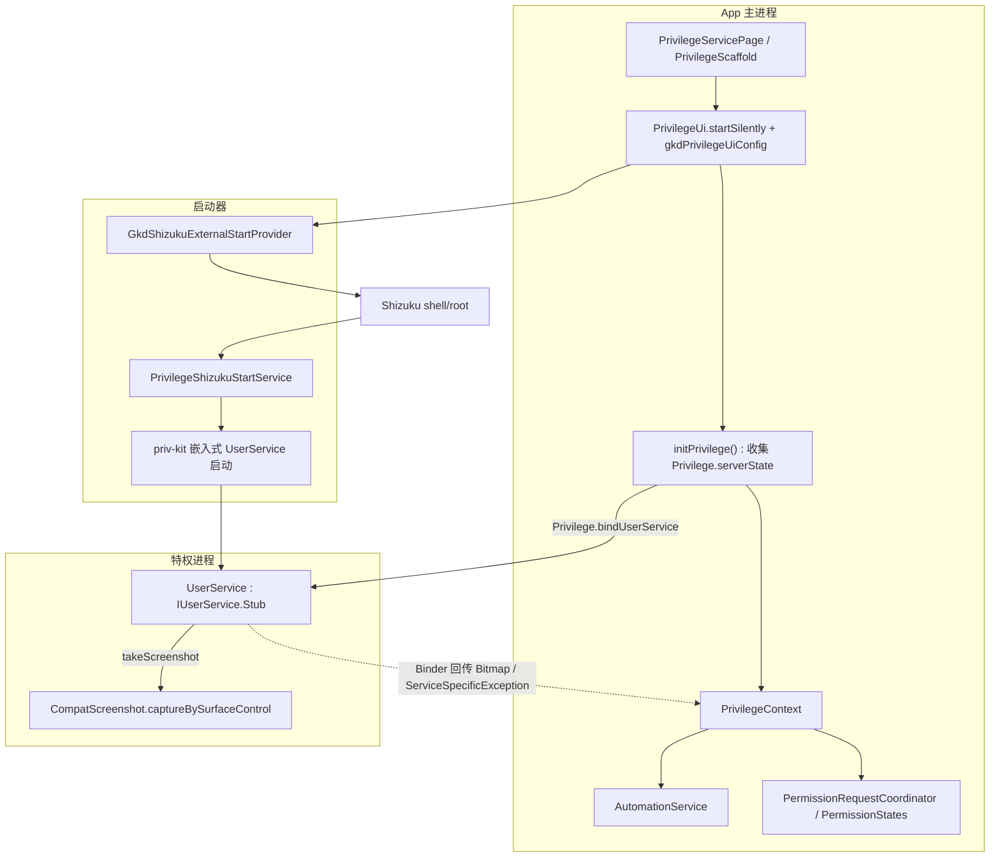
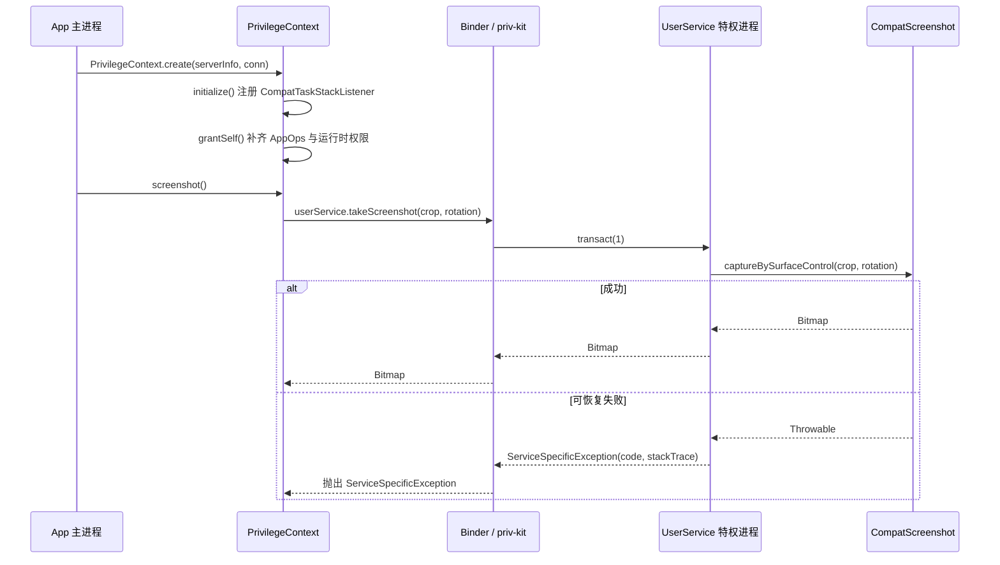
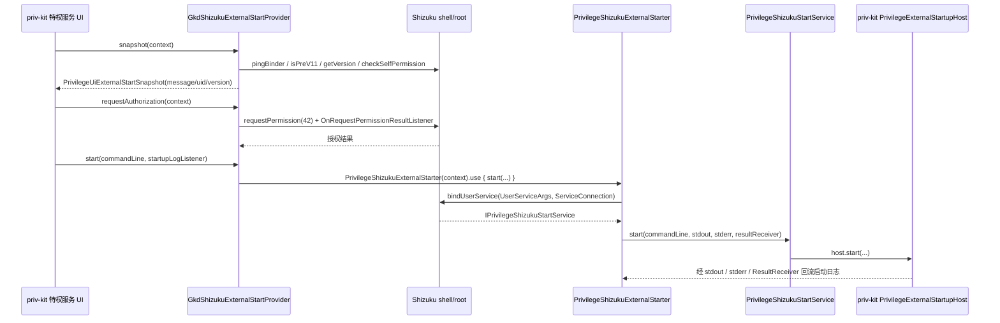
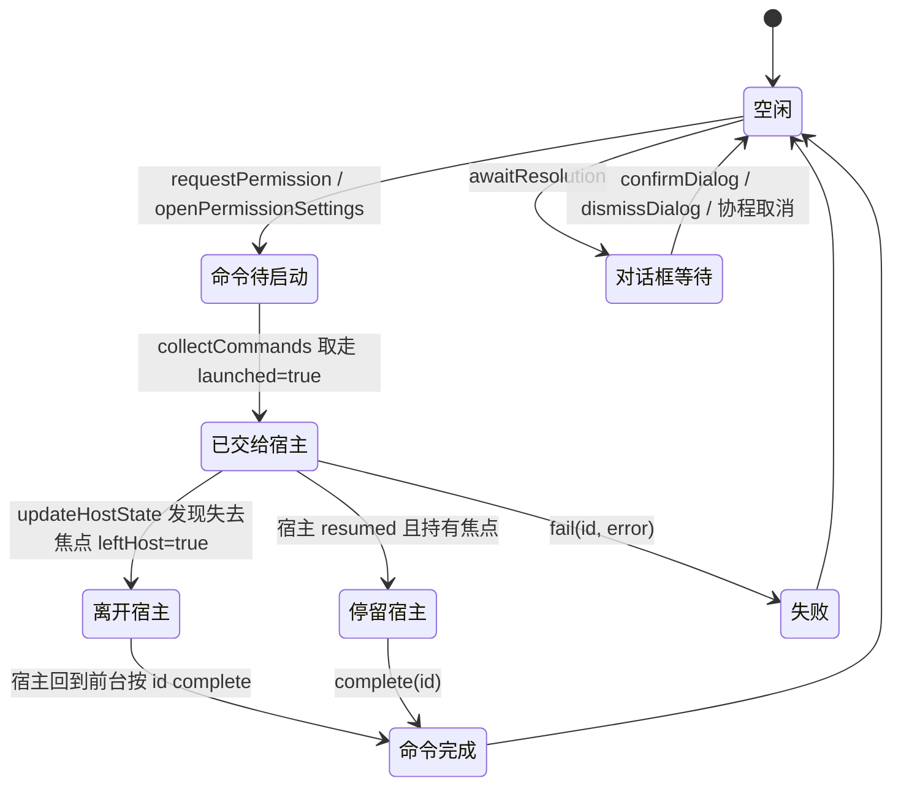

# 特权与隐藏 API 层

## 定位

GKD 的核心能力是「读屏 + 自动操作」，其中相当一部分无法用普通应用权限完成，必须借助 Android 的隐藏 API 或一个以 shell/root 身份运行的**特权进程**：

- **自动化操作**：`tap` / `swipe` / `keyevent` 注入输入事件，或用 `UiAutomation` 直接读取节点树与窗口列表（`CompatInputManager`、`AutomationService`）。
- **包管理查询与窗口状态**：查询其它用户的已安装包（`CompatPackageManager` → `ApplicationPackageManager.getInstalledPackagesAsUser`）；读取前台 Activity（`CompatTaskStackListener`）、冻结/解冻旋转、判断前台窗口是否 `FLAG_SECURE`（`CompatWindowManager`）。
- **截图**：`SurfaceControl` / `ScreenCapture` / `IWindowManager.captureDisplay` 三条不同 API 级别的实现（`CompatScreenshot`）。
- **自我授权**：用 `IAppOpsService.setMode` 与 `Privilege.grantRuntimePermission` 补齐 AppOps 与运行时权限（`PrivilegeContext.grantSelf`）。

这些能力由**三条路径**承载，它们共享同一套特权上下文，只是触发方式不同：

| 路径 | 入口 | 运行进程 | 典型用途 |
| --- | --- | --- | --- |
| 无障碍服务 | `li/gkd/app/service/A11yService.kt`（`AutomatorModeOption.A11yMode`） | App 主进程，普通无障碍框架 | 事件驱动读屏与点击，无需特权 |
| 嵌入式 `UserService` | `PrivilegeApi.kt` 的 `PrivilegeUserServiceSpec(embedded = true)`（`AutomatorModeOption.AutomationMode`） | 由 priv-kit 拉起的特权进程 | 隐藏 API 调用、截图、任务栈监听、跨用户查询 |
| Shizuku 外部启动 | `priv/shizuku/**` + `GkdShizukuExternalStartProvider`（实现 priv-kit 的 `PrivilegeUiStreamingExternalStartProvider`） | Shizuku 以 shell/root 身份拉起的 UserService | 无 root 时借 Shizuku 授权启动特权服务 |

两条特权路径最终汇聚为同一个 `Privilege.serverState` 流：`initPrivilege()` 收集它，`updatePrivilegeContext()` 负责建立/销毁 `PrivilegeContext`；区别只在于「谁来把特权进程拉起来」。



---

## UserService：进程模型与 Binder 接口

### Binder 契约

`gkd-app/src/main/aidl/li/gkd/app/priv/IUserService.aidl` 全文只有两个方法，二者必须逐字对应：

```aidl
interface IUserService {
    void destroy() = 16777114;
    Bitmap takeScreenshot(in Rect crop, int rotation) = 1;
}
```

| 方法 | 事务号 | 方向 | 作用 |
| --- | --- | --- | --- |
| `takeScreenshot(in Rect crop, int rotation)` | `1` | 主进程 → 特权进程，返回 `Bitmap` | 在特权进程内调用隐藏截图 API 并把位图回传 |
| `destroy()` | `16777114`（显式指定，避开普通事务号区间） | 主进程 → 特权进程 | 销毁特权服务侧状态（本仓库实现为 `Unit`） |

### 实现

`gkd-app/src/main/kotlin/li/gkd/app/priv/UserService.kt` 是 `IUserService.Stub()` 的实现，标注 `@Keep` 以便混淆后仍能被 priv-kit 按类名反射加载：

| 声明 | 说明 |
| --- | --- |
| `SCREENSHOT_ERROR_CODE = 1` | 回传异常时使用的错误码 |
| `MAX_SCREENSHOT_ERROR_LENGTH = 16_384` | 回传堆栈的截断长度，避免 Binder 事务超限 |
| `takeScreenshot(crop, rotation)` | 调用 `CompatScreenshot.captureBySurfaceControl(crop, rotation)`，外层包裹异常边界 |
| `destroy()` | 实现为 `= Unit` |

### 上下文生命周期

`PrivilegeContext`（`priv/PrivilegeContext.kt`）是主进程侧特权门面，私有构造，只能由 `PrivilegeContext.create(serverInfo, userServiceConnection)` 获得：

1. 构造期建立各 `Compat*` 门面（`CompatPackageManager`、`CompatUserManager`、`CompatActivityManager`、`CompatAppOpsService`、`CompatInputManager`、`CompatAccessibilityManager`、`CompatWindowManager`），并用 `IUserService.Stub.asInterface(userServiceConnection.binder)` 取得特权服务代理。
2. `initialize()`：注册 `CompatTaskStackListener` 并置 `taskStackListenerRegistered = true`，随后 `grantSelf()`。
3. `create()` 在构造或初始化失败时先 `unbind()`（context 为 null）或 `destroy()`，失败信息用 `addSuppressed` 合并后重新抛出，不留半初始化连接。
4. `destroy()`：`Privilege.pingServer()` 为真时反注册任务栈监听，并在 `finally` 中 `userServiceConnection.unbind()`。

`PrivilegeApi`（`priv/PrivilegeApi.kt`）持有全局唯一读写点 `privilegeContextFlow: StateFlow<PrivilegeContext?>`：`clearPrivilegeContext()` 先用 `compareAndSet` 抢占再关闭 `uiAutomationFlow` 并 `destroy()`；`updatePrivilegeContext()` 用 `serverInfo` 相等性短路重复更新，并在 `storeFlow.value.useAutomation && !currentAppBlocked && !currentAppUseA11y` 时调用 `AutomationService.tryConnect(true)`。

`PrivilegeApi` 的公开成员为：`currentUserId`（`android.os.Process.myUserHandle().hashCode()`）、`privilegeContextFlow`（当前特权上下文）、`initPrivilege()`（收集 `Privilege.serverState` 驱动上下文建立/销毁）与私有 `userServiceSpec`（`PrivilegeUserServiceSpec(UserService::class.java.name, embedded = true)`）。

`PrivilegeContext` 的对外方法即能力集合：`topTask()` / `topCpn()`、`getUsers()`、`getInstalledPackagesAsUser()`、`tap()` / `swipe()` / `keyevent()`、`registerUiTestAutomationService()` / `unregisterUiTestAutomationService()` / `isUiAutomationRunning()`、`isRotationFrozen()` / `getDefaultDisplayRotation()` / `freezeRotation()` / `thawRotation()`、`isFocusedWindowSecure()`、`screenshot()`、`startForegroundService()`、`grantSelf()`。

`PrivilegeOwnerLifecycle`（`priv/PrivilegeOwnerLifecycle.kt`）管理「宿主进程死亡后特权进程的去留」：`FOLLOW_DEATH_DELAY_MILLIS = 10 * 60 * 1000L`（开启自动化时宿主死亡后保留特权进程 10 分钟）、`APP_RESTART_PASSIVE_TIMEOUT_MILLIS = 5_000L`（App 重启时的被动等待上限）、`configure(enableAutomator)`（调 `PrivilegeConfig.configure(followDeathDelayMillis, activeReconnectOnOwnerDeath)`）与 `prepareAppRestart()`（调 `Privilege.prepareOwnerRestart(5000)`，失败只记日志）。

调用点：`store/AppStore.kt` 在自动化开关变化时 `configure(...)`；`App.kt` 在崩溃重启前调用 `prepareAppRestart()`。



---

## 异常边界（硬性架构规则）

`AGENTS.md` 的「嵌入式 UserService 异常边界」章节原文要求：

> 嵌入式 `UserService` 运行在特权进程中。调用隐藏 API 等可能失败的 Binder 方法，必须在方法最外层以末端 `catch (e: Throwable)` 兜住可恢复错误，并通过 Binder 可传输的异常或失败结果将原始类型、消息和堆栈交给主进程；不得只在主进程捕获，也不得让 `NoSuchMethodError` 等 `LinkageError` 逃逸导致特权进程崩溃。
>
> `VirtualMachineError` 和 `ThreadDeath` 等无法可靠恢复的终止错误可以原样抛出；不要把它们伪装成普通业务失败。

`gkd-app/src/main/kotlin/li/gkd/app/priv/UserService.kt` 第 13–26 行是全仓库唯一一处「嵌入式 UserService 方法最外层」的异常边界，结构是**三段式 catch**：

| 顺序 | 捕获类型 | 处理 |
| --- | --- | --- |
| 1 | `VirtualMachineError` | `throw e` 原样上抛 |
| 2 | `ThreadDeath` | `throw e` 原样上抛 |
| 3 | `Throwable` | 转为 `ServiceSpecificException(SCREENSHOT_ERROR_CODE, e.stackTraceToString().take(MAX_SCREENSHOT_ERROR_LENGTH))` |

- **末端 `catch (e: Throwable)` 必须在方法最外层**：前两个分支放行不可恢复错误，其余一切（含 `NoSuchMethodError`、`NoClassDefFoundError`、`ExceptionInInitializerError` 等 `LinkageError` 子类）都落入第三个分支。`LinkageError` 既不是 `VirtualMachineError` 也不是 `ThreadDeath`，因此**一定**会被兜住，不会击穿特权进程。
- **原始信息完整回传**：`ServiceSpecificException` 继承 `RuntimeException`，是 Binder 事务可直接传输的异常类型，其 `message` 承载 `stackTraceToString()` 全文（截断至 16 KiB），主进程拿到的是原始异常类型名、消息与堆栈，而不是含糊的 `RemoteException`。
- **不得只主进程捕获**：`AutomationService.screenshot()`（`catch (e: Throwable)` 后返回 `null`）与 `PrivilegeApi.clearPrivilegeContext()`（记录 `destroy` 失败）都只是**降级与加固**，无法阻止特权进程在抛错前被 `LinkageError` 打死，因此不能替代 `UserService` 内的末端兜底。
- **外部启动服务不在本仓库兜底**：`PrivilegeShizukuStartService` 只把参数转交 priv-kit 的 `PrivilegeExternalStartupHost`，异常封装由该外部组件负责，本仓库不重复实现。

相邻位置的边界加固（配合而非替代）：

| 位置 | 做法 | 目的 |
| --- | --- | --- |
| `priv/CompatTaskStackListener.kt` | 覆写 `onTransact`，`catch (_: Throwable) { true }` | system_server 回调异常时不沿 Binder 回抛导致崩溃 |
| `priv/CompatInputManager.kt` | `LegacyInputInjector.injectInputEvent` 内 `catch (e: Throwable) { e.printStackTrace(); false }` | 旧版注入路径失败降级为返回值 |
| `priv/PrivilegeContext.kt` | `create()` 清理阶段 `addSuppressed` | 保留首个异常为根因且不丢清理信息 |
| `priv/AutomationService.kt` | `tryConnect()` 多处 `catch (e: Exception)` + toast + 日志 | 连接失败不影响其它自动化路径 |

与之互补的另一条通道是 `data/RpcError.kt` 的 `RpcError`（`@Serializable`，`@SerialName("__error")`）：它是数据层的**可序列化**异常，服务 HTTP/RPC 序列化边界（`service/HttpService.kt`、`a11y/A11yRuntime.kt`、`snapshot/SnapshotCapture.kt`），**不**参与 `IUserService` 的 Binder 异常回传。

---

## 跨版本兼容适配

所有 `Compat*` 类都运行在主进程，唯一职责是把「同一语义在不同 API 级别下的不同签名 / 不同可用性」收敛为一个稳定调用面。真正分支判断由 `AndroidTarget`（`util/AndroidTarget.kt` 的 `P/Q/R/S/TIRAMISU/UPSIDE_DOWN_CAKE/BAKLAVA/CINNAMON_BUN`）与 `HiddenApiDetect` 完成，影子模块里的 `@RequiresApi` / `@DeprecatedSinceApi` 只承担文档与静态检查作用。

| 类 | 版本差异 | 适配方式 |
| --- | --- | --- |
| `CompatAccessibilityManager` | `IAccessibilityManager.registerUiTestAutomationService` 在 `UPSIDE_DOWN_CAKE`(34) 起多出 `userId` 形参 | `AndroidTarget.UPSIDE_DOWN_CAKE` 分支选择 5 参 / 4 参重载 |
| 〃（UiAutomation 占用探测） | `dumpsys accessibility` 输出格式随版本变化：新版独立 `Ui Automation[`，Android O/P 版嵌在 `User state[attributes:{...}]` | `isUiAutomationRunning()` 走 `asBinder().dump()`，由 `containsUiAutomation(dump)` 的 4 条正则同时匹配新旧格式，且只认 `currentUser=true` 的块 |
| `CompatActivityManager` | `getTasks(maxNum)` / `getTasks(maxNum, flags)` | `AndroidTarget.P` 分支选择 |
| 〃（服务启动） | `startService` 在 `R`(30) 起多出 `callingFeatureId` 形参 | `AndroidTarget.R` 分支选择；`callingPackage` 传 `"com.android.shell"` 以启动 `exported="true"` 的服务 |
| `CompatAppOpsService` | — | 直接 `IAppOpsService.Stub.asInterface(PrivilegeBinderWrapper.fromSystemService(Context.APP_OPS_SERVICE))` |
| `CompatInputManager` | `S`(31) 起隐藏输入注入不再可靠 | `AndroidTarget.S` 起改走 `IBinder.shellCommand("tap"/"swipe"/"keyevent")`（`BinderExt.kt`）；`S` 之前用 `LegacyInputInjector` |
| 〃（旧版注入） | `Q`(29) 起 `MotionEvent` / `KeyEvent` 需要 `setDisplayId` | `event.toHidden.setDisplayId(...)`：指针类事件用 `DEFAULT_DISPLAY`，其它用 `INVALID_DISPLAY` |
| `CompatPackageManager` | 公开 API 无「按 userId 查包」入口 | 反射 `ApplicationPackageManager(ContextImpl, IPackageManager)` 构造器并持有 `IPackageManager` |
| `CompatScreenshot` | 截图 API 在 O / P / S / U / 36+ 共五代签名 | 见「截图与 UiAutomation」一节 |
| `CompatTaskStackListener` | `onTaskMovedToFront(int)` 与 `onTaskMovedToFront(RunningTaskInfo)` 并存；`Q` 起多屏需过滤非默认显示器 | 两个重载都实现；`RunningTaskInfo` 版本用 `taskInfo.toHidden.displayId != Display.DEFAULT_DISPLAY` 提前返回 |
| `CompatUserManager` | 公开 `UserManager` 不暴露 `getUsers(excludeDying)` | `UserManagerHidden(app, IUserManager.Stub.asInterface(...)).getUsers(excludeDying)` 再映射为 `li.gkd.app.data.UserInfo` |
| `CompatWindowManager` | `freezeRotation` / `thawRotation` 在 `VANILLA_ICE_CREAM`(35) 起新增 `caller` 形参 | `IWindowManager::class.detectHiddenMethod(...)` 运行期探测签名，返回 `ROTATION_WITHOUT_CALLER = 1` / `ROTATION_WITH_CALLER = 2` |
| 〃（安全窗口判定） | 无公开 API 读取前台窗口 flag | `value.asBinder().dump("visible-apps")` + `parseFocusedWindowSecure(dump, appId)` 解析 `mCurrentFocus=Window{...}` 与 `fl=`，同时支持 `SECURE` 名称与十六进制位（对齐 `WindowManager.LayoutParams.FLAG_SECURE`） |

### `HiddenApiDetect` 与 `HiddenApiCast`

`priv/HiddenApiDetect.kt` 是运行期「这个隐藏成员在**这台设备**上存在吗」的探测器：

| 声明 | 语义 |
| --- | --- |
| `detectHiddenClass(className: String): Boolean` | `Class.forName(className, false, ...)`；`ClassNotFoundException` 与 `LinkageError` 都返回 `false` |
| `KClass<*>.detectHiddenMethod(methodName, vararg signatures: Pair<Int, List<KClass<*>>>): Int` | 按「返回码 → 期望形参类型列表」探测；命中返回对应码，全不匹配抛 `NoSuchMethodException` |
| `KClass<*>.detectHiddenField(fieldName): Boolean` | `java.getField(fieldName)` 是否成功 |
| `Method.simpleString()`（private） | 探测失败时打印实际重载便于定位 |

`CompatScreenshot` 用 `detectHiddenClass("android.window.ScreenCaptureInternal")` 判断 36+ 是否走 `ScreenCaptureInternal`；`CompatWindowManager` 用 `detectHiddenMethod` 判断 `freezeRotation` / `thawRotation` 的调用形状。

`priv/HiddenApiCast.kt` 用 `inline` 扩展属性在「隐藏影子类型」与「公开类型」之间零开销互转（同一对象、仅类型视角不同），文件级 `@Suppress("CAST_NEVER_SUCCEEDS")` 是必需的，因为编译期两种类型并无可证明的继承关系：

| 扩展属性 | 使用点 |
| --- | --- |
| `UiAutomationHidden.toPublic` / `UiAutomation.toHidden` | `AutomationService`（构造、`connect`、`disconnect`） |
| `AccessibilityNodeInfo.toHidden` | `a11y/A11yContext.kt`、`data/AttrInfo.kt`、`data/GkdAction.kt`、`service/TrackService.kt` 读取 `boundsInScreen` |
| `AccessibilityServiceInfoHidden.toPublic` / `AccessibilityServiceInfo.toHidden` | `UiAutomationServiceInfo` |
| `KeyEvent.toHidden` / `MotionEvent.toHidden` | `CompatInputManager` 的 `setDisplayId` |
| `PackageInfo.toHidden` | `data/AppInfo.kt` 读取 `overlayTarget` |
| `ActivityManager.RunningTaskInfo.toHidden` | `CompatTaskStackListener` 读取 `displayId` |

### 隐藏 API 绕过与 `remap` 的关系

两条机制解决两个不同问题，缺一不可：

1. **编译期与打包期：`remap` 插件 + 影子模块。** `gkd-hidden-api` 里的 `android.*` / `com.android.internal.*` 类**不是** framework 类，而是普通 Java 源码写的「影子声明」，用 `@RemapType(真实类型.class)` 标注真实目标（如 `@RemapType(UiAutomation.class) public class UiAutomationHidden`）。`gkd-app/build.gradle.kts` 用 `remapApi(project(":gkd-hidden-api"))` 引入，使 `gkd-app` 能编译出对隐藏成员的引用，再由 `remap` 编译期插件把引用重映射到真实类型。影子模块自身依赖为 `compileOnly(libs.androidx.annotation)`、`compileOnly(libs.remap.annotation)`、`annotationProcessor(libs.remap.processor)`，不产生运行期依赖。
2. **运行期：`AndroidHiddenApiBypass`。** Android 9(P) 起框架对非 SDK 接口施加黑/灰名单限制；`App.attachBaseContext` 执行 `if (AndroidTarget.P) HiddenApiBypass.addHiddenApiExemptions("L")`，用前缀 `L` 豁免全部类，使 remap 后的真实隐藏调用在运行期不被拦截。构建侧配合 `dependenciesInfo { includeInApk = false; includeInBundle = false }`。

### `gkd-hidden-api` 模块的隐藏 API 一览

`gkd-hidden-api/build.gradle.kts` 只有 `alias(libs.plugins.android.library)`、`namespace = "hidden.api"` 与上述三条依赖；`gkd-hidden-api/src/main/AndroidManifest.xml` 是空的 `<manifest />`。

| 影子声明（`gkd-hidden-api/src/main/java/`） | 暴露的成员 | 消费位置（`gkd-app`） |
| --- | --- | --- |
| `android/accessibilityservice/AccessibilityServiceInfoHidden.java` | 构造 `(ResolveInfo, Context)`、`setCapabilities(int)`、`setAccessibilityTool(boolean)`、`FLAG_FORCE_DIRECT_BOOT_AWARE` | `priv/UiAutomationServiceInfo.kt` |
| `android/accessibilityservice/IAccessibilityServiceClient.java` | 空接口（仅作类型名） | `priv/PrivilegeContext.kt`、`priv/ProxyUiAutomationConnection.kt` |
| `android/app/ApplicationPackageManager.java` | `getInstalledPackagesAsUser(int, int)` | `priv/CompatPackageManager.kt` |
| `android/app/AppOpsManagerHidden.java` | `OP_POST_NOTIFICATION`、`OP_SYSTEM_ALERT_WINDOW`、`OP_ACCESS_ACCESSIBILITY`、`OPSTR_ACCESS_ACCESSIBILITY`、`OP_ACCESS_RESTRICTED_SETTINGS`、`OPSTR_ACCESS_RESTRICTED_SETTINGS`、`OP_FOREGROUND_SERVICE_SPECIAL_USE`、`OPSTR_FOREGROUND_SERVICE_SPECIAL_USE` | `priv/PrivilegeContext.kt`（`setAllowSelfMode`）、`permission/PermissionState.kt`（`checkAllowedOp`） |
| `android/app/IActivityManager.java` | `getTasks(int,int)`、`getTasks(int)`、`registerTaskStackListener`、`unregisterTaskStackListener`、`startService(...6 参)`、`startService(...7 参)` | `priv/CompatActivityManager.kt` |
| `android/app/IApplicationThread.java` | 空接口（`startService` 的 `null` 形参类型） | `priv/CompatActivityManager.kt` |
| `android/app/ITaskStackListener.java` | `onTaskStackChanged()`、`onTaskMovedToFront(int)`、`onTaskMovedToFront(RunningTaskInfo)` | `priv/CompatTaskStackListener.kt` |
| `android/app/IUiAutomationConnection.java` | `connect(IAccessibilityServiceClient,int)`、`disconnect()`、`shutdown()` | `priv/ProxyUiAutomationConnection.kt` |
| `android/app/TaskInfoHidden.java` | 字段 `displayId` | `priv/CompatTaskStackListener.kt` |
| `android/app/UiAutomationHidden.java` | 构造 `(Looper, IUiAutomationConnection)`、`connect(int)`、`disconnect()` | `priv/AutomationService.kt` |
| `android/content/pm/IPackageManager.java` | `Stub.asInterface(IBinder)` | `priv/CompatPackageManager.kt` |
| `android/content/pm/PackageInfoHidden.java` | 字段 `overlayTarget` | `data/AppInfo.kt` |
| `android/content/pm/UserInfo.java` | 字段 `id`、`name` | `priv/CompatUserManager.kt` |
| `android/hardware/input/IInputManager.java` | `injectInputEvent(InputEvent,int)` | `priv/CompatInputManager.kt` |
| `android/hardware/input/InputManagerHidden.java` | `INJECT_INPUT_EVENT_MODE_WAIT_FOR_FINISH` | `priv/CompatInputManager.kt` |
| `android/os/IUserManager.java` / `android/os/UserManagerHidden.java` | `Stub.asInterface(IBinder)`；构造 `(Context, IUserManager)`、`getUsers(boolean)` | `priv/CompatUserManager.kt` |
| `android/os/ServiceSpecificException.java` | 构造 `(int, String)` | `priv/UserService.kt` |
| `android/os/ShellCallback.java` | 空类（`shellCommand` 的 `shellCallback` 形参类型） | `priv/BinderExt.kt` |
| `android/view/IWindowManager.java` | `isRotationFrozen()`、`getDefaultDisplayRotation()`、`freezeRotation(int)`、`freezeRotation(int,String)`、`thawRotation()`、`thawRotation(String)`、两版 `captureDisplay(...)` | `priv/CompatWindowManager.kt`、`priv/CompatScreenshot.kt`、`priv/PrivilegeContext.kt` |
| `android/view/KeyEventHidden.java` / `android/view/MotionEventHidden.java` | `setDisplayId(int)` | `priv/CompatInputManager.kt` |
| `android/view/SurfaceControlHidden.java` | `screenshot(int,int)`、`screenshot(Rect,int,int,int)`、`getInternalDisplayToken()`、`captureDisplay(DisplayCaptureArgs)`、`DisplayCaptureArgs.Builder`、`ScreenshotHardwareBuffer.asBitmap()` | `priv/CompatScreenshot.kt` |
| `android/view/accessibility/AccessibilityNodeInfoHidden.java` | `getBoundsInScreen()` | `priv/HiddenApiCast.kt` 及全部 `toHidden` 消费点 |
| `android/view/accessibility/IAccessibilityManager.java` | `registerUiTestAutomationService(...4 参)`、`registerUiTestAutomationService(...5 参)`、`unregisterUiTestAutomationService` | `priv/CompatAccessibilityManager.kt` |
| `android/window/ScreenCapture.java` / `ScreenCaptureInternal.java` | `createSyncCaptureListener()`、`CaptureArgs.Builder`、`ScreenCaptureListener`、`ScreenshotHardwareBuffer.asBitmap()` / `hardwareBuffer` | `priv/CompatScreenshot.kt`、`android/view/IWindowManager.java` |
| `com/android/internal/R.java` | `R.string.config_recentsComponentName` | `a11y/A11yState.kt` |
| `com/android/internal/app/IAppOpsService.java` | `checkOperation(int,int,String)`、`setMode(int,int,String,int)` | `priv/CompatAppOpsService.kt`、`priv/PrivilegeContext.kt` |

---

## 截图与 UiAutomation 协作

`CompatScreenshot`（`priv/CompatScreenshot.kt`）的两条路径：

| 入口 | 适用 | 实现 |
| --- | --- | --- |
| `capture(context, windowManager, userService)` | 主进程统一入口 | 取 `DEFAULT_DISPLAY` 与 `getRealSize` 构造 `crop`；`UPSIDE_DOWN_CAKE` 起调 `captureByWindowManager(windowManager, crop)`，否则委托 `userService.takeScreenshot(crop, display.rotation)`；结果统一 `setHasAlpha(false)` |
| `captureBySurfaceControl(crop, rotation)` | 特权进程内 | `S` → `getInternalDisplayToken()` + `DisplayCaptureArgs.Builder` + `captureDisplay(...)`；`P` → `SurfaceControlHidden.screenshot(crop, w, h, rotation)`；更早 → `captureOreo(...)`（按旋转后尺寸截图，再用 `Canvas` 平移/旋转/回填并 `recycle()` 原图） |
| `captureByWindowManager` / `captureByWindowManagerInternal` | `UPSIDE_DOWN_CAKE` / `BAKLAVA` | `ScreenCapture.CaptureArgs` 或 `ScreenCaptureInternal.CaptureArgs` + `createSyncCaptureListener()`；`buffer` 经 `copyToSoftwareBitmap` 转 `ARGB_8888` 软件位图并 `recycle()` 中间位图 |
| `useScreenCaptureInternal` | 运行期探测 | `AndroidTarget.BAKLAVA && hasScreenCaptureInternal`，后者由 `HiddenApiDetect.detectHiddenClass("android.window.ScreenCaptureInternal")` 惰性求值 |

`UiAutomationServiceInfo`（`priv/UiAutomationServiceInfo.kt`）的 `createUiAutomationServiceInfo()` 「伪造」UiAutomation 用的服务信息：从 `A11yService.a11yCn` 取 `ServiceInfo` 包成 `ResolveInfo`，用 `AccessibilityServiceInfoHidden(resolveInfo, app).toPublic` 还原隐藏构造，再逐字段拷贝 `eventTypes`、`feedbackType`、`flags or FLAG_FORCE_DIRECT_BOOT_AWARE`、`setCapabilities(rawInfo.capabilities)`、`notificationTimeout`，并在 `UPSIDE_DOWN_CAKE` 起 `setAccessibilityTool(true)`。

`ProxyUiAutomationConnection`（`priv/ProxyUiAutomationConnection.kt`）是 `IUiAutomationConnection.Stub()`，把 `UiAutomation` 的连接请求代理到特权侧：

| 成员 | 行为 |
| --- | --- |
| `mToken = privilegeContext.serverLifecycleBinder` | 作为 `registerUiTestAutomationService` 的 `owner` |
| `mOwningUid` / `serverInfo.uid` | 校验调用方 UID，非 owner 且非 `SYSTEM_UID`/`0` 时抛 `SecurityException("Calling from not trusted UID!")` |
| `connect(client, flags)` | 空 client 抛 `IllegalArgumentException`；已连接抛 `IllegalStateException`；随后 `registerUiTestAutomationServiceLocked(client, currentUserId, flags)` 与 `storeRotationStateLocked()` |
| `disconnect()` | `Privilege.pingServer()` 为真时反注册并 `restoreRotationStateLocked()` |
| `shutdown()` | 置 `mIsShutdown`，必要时代理一次 `disconnect()` |
| `storeRotationStateLocked` / `restoreRotationStateLocked` | 记录初始 `isRotationFrozen` + `getDefaultDisplayRotation` 并在断开时恢复；`INITIAL_FROZEN_ROTATION_UNSPECIFIED = -1` 表示原本未冻结，走 `thawRotation` |
`AutomationService`（`priv/AutomationService.kt`）是主进程侧 UiAutomation 的生命周期宿主：构造私有，持有 `HandlerThread("UiAutomatorHandlerThread")` 与惰性 `UiAutomationHidden(handlerThread.looper, ProxyUiAutomationConnection(privilegeContext)).toPublic`；`uiAutomationFlow` / `uiAutomationOccupiedFlow` 两个全局 `StateFlow` 提供单例语义。

| 方法 | 行为 |
| --- | --- |
| `tryConnect(silent)` | 在 `connectLock` 内执行「已有实例检查 → `isOtherUiAutomationRunning()` → 创建实例 → `connect()` → CAS 抢位 → 校验 `privilegeContextFlow` 未变且 `serverLifecycleBinder.pingBinder()`」，任一步失败都 `shutdown(true)` |
| `connect()` | `uiAutomation.toHidden.connect(UiAutomation.FLAG_DONT_SUPPRESS_ACCESSIBILITY_SERVICES)`，注册 `OnAccessibilityEventListener`，`updateEnableAutomator(true)`，`A11yRuntime.onA11yConnected(this)` |
| `disconnect()` | 反注册监听、`toHidden.disconnect()`，`finally` 中 `quitRemoteCallbackThread()` |
| `isOtherUiAutomationRunning()` | 本地无实例时回退询问 `PrivilegeContext.isUiAutomationRunning()` |
| `quitRemoteCallbackThread()`（private 顶层函数） | `AndroidTarget.P` 起反射 `UiAutomation.mRemoteCallbackThread` 并 `quit()`，规避 `UiAutomation` 在 CONNECTING 阶段失败时不进入自身 `finally` 的问题 |
| `windowNodeInfo` / `windowInfos` / `screenshot()` / `ruleEngine` | 实现 `A11yCommonImpl`，与 `A11yService` 共用规则引擎接口，仅 `mode` 不同（`AutomatorModeOption.AutomationMode`） |

---

## Shizuku 集成

Shizuku 路径解决「没有 root、也不想手动 adb 起服务」时的特权进程启动。



`gkd-app/src/main/aidl/li/gkd/app/priv/shizuku/IPrivilegeShizukuStartService.aidl`：

```aidl
interface IPrivilegeShizukuStartService {
    void start(String commandLine, in ParcelFileDescriptor stdout,
               in ParcelFileDescriptor stderr, in ResultReceiver resultReceiver) = 1;
    void destroy() = 16777114;
}
```

| 类 | 角色 |
| --- | --- |
| `GkdShizukuExternalStartProvider` | 实现 priv-kit 的 `PrivilegeUiStreamingExternalStartProvider`，`id = "shizuku"`、`label = "Shizuku"`；`snapshot()` 把 Shizuku 状态翻译为 `PrivilegeUiExternalStartSnapshot`（未运行 / v11 以下 / 版本不支持 UserService / 未授权 / 已就绪）；`requestAuthorization()` 用 `suspendCancellableCoroutine` + `atomic` 保证回调只结算一次；`start()` 委托 `PrivilegeShizukuExternalStarter` |
| `PrivilegeShizukuExternalStarter` | `Closeable`；`isAvailable()` 要求 `pingBinder() && !isPreV11() && getVersion() >= 10 && checkSelfPermission() == PERMISSION_GRANTED`；`bindOrGetService()` 用 `CompletableDeferred` + `withTimeoutOrNull(10_000ms)` 绑定，失败抛 `PrivilegeStartupException`；`startAndWait()` 交给 `PrivilegeExternalStartup.runThroughBridge(...)` |
| `PrivilegeShizukuStartService` | `@Keep`，实现 `IPrivilegeShizukuStartService.Stub()`，内部持有 priv-kit 的 `PrivilegeExternalStartupHost`；`destroy()` 执行 `host.close()` + `exitProcess(0)`，确保特权进程真正退出 |

`PrivilegeShizukuExternalStarter` 的常量与 `UserServiceArgs` 配置：

| 名称 | 值 | 说明 |
| --- | --- | --- |
| `SHIZUKU_USER_SERVICE_MIN_VERSION` / `SHIZUKU_BIND_TIMEOUT_MILLIS` | `10` / `10_000L` | 低于该 Shizuku 版本不支持 UserService；绑定超时上限 |
| `SHIZUKU_START_TAG` / `SHIZUKU_START_PROCESS_SUFFIX` | `"priv-kit-external-start"` / `"priv-kit-shizuku-start"` | `UserServiceArgs.tag(...)` 与 `processNameSuffix(...)` |
| `SHIZUKU_START_SERVICE_VERSION` | `6` | `UserServiceArgs.version(...)`，AIDL 或实现变更时必须递增 |
| `SHIZUKU_PERMISSION_REQUEST_CODE`（定义于 `GkdShizukuExternalStartProvider`） | `42` | `Shizuku.requestPermission(42)` 的请求码 |

`UserServiceArgs` 还设置 `.daemon(false)` 与 `.debuggable(applicationInfo 含 FLAG_DEBUGGABLE)`；`removeUserService(connection)` 对同一 connection 先 `unbindUserService(args, connection, false)`（清理 Shizuku 客户端连接缓存）再 `unbindUserService(args, connection, true)`（销毁远端记录），两次都包在 `runCatching` 中。

| 条目 | 声明 |
| --- | --- |
| `gradle/libs.versions.toml` | `shizuku = "13.1.5"`；`rikka-shizuku-api = "dev.rikka.shizuku:api"`；`rikka-shizuku-provider = "dev.rikka.shizuku:provider"` |
| `gkd-app/build.gradle.kts` | `implementation(libs.rikka.shizuku.api)`、`implementation(libs.rikka.shizuku.provider)` |
| `gkd-app/src/main/AndroidManifest.xml` | `<provider android:name="rikka.shizuku.ShizukuProvider" android:authorities="${applicationId}.shizuku" android:exported="true" android:permission="android.permission.INTERACT_ACROSS_USERS_FULL" />` |
| `priv/PrivilegeUiIntegration.kt` | `gkdPrivilegeUiConfig = PrivilegeUiConfig(externalStartProviders = listOf(GkdShizukuExternalStartProvider))`；`App.initializeRuntimeComponents()` 调 `PrivilegeUi.startSilently(gkdPrivilegeUiConfig)` |

两个 Shizuku 类分别运行在**主进程**与 **Shizuku 拉起的 UserService 进程**，靠上面的 AIDL 通信；`rikka.shizuku:api` 提供 `Shizuku.bindUserService` / `unbindUserService` / `UserServiceArgs` / `OnRequestPermissionResultListener`，`rikka.shizuku:provider` 提供被 Shizuku Manager 发现所需的 `ShizukuProvider`。

---

## 权限请求协调

`PermissionRequestCoordinator`（`permission/PermissionRequestCoordinator.kt`）负责「提示条（prompt）」与「说明对话框（dialog）」两套 UI 的可见性仲裁，核心状态是 `activityResumed`、`activityHasWindowFocus`、`activePrompt`（含 `id` / `prompt` / `visible` / `completed`）与单调递增的 `nextId`：

- `beginPrompt(prompt)` 返回 `AutoCloseable`（内部 `PromptSession` 用 `atomic` 保证 `finishPrompt(id)` 只执行一次）；宿主不在前台时**立即**露出提示条，避免用户看不到系统权限弹窗的说明。
- `updateHostState(...)`：宿主离开前台 → `revealPromptLocked()`；回到前台且（重新获得焦点 或 会话已完成）→ `dismissReturnedPromptLocked()` 收起提示条。
- `awaitResolution(permissionState)` 用 `suspendCancellableCoroutine` 挂起等待对话框结果，`confirmDialog(id)` / `dismissDialog(id)` 分别 resume `true` / `false`；协程取消时 `dismissDialog(id)` 兜底清理。
- `showDialog(...)` 设置新对话框前先对旧对话框调用 `onDismiss`，避免悬空协程；`dispose()` 清空全部状态并结算残留对话框。



| 类 | 关键点 |
| --- | --- |
| `PermissionRequestHost(activity)` | `DefaultLifecycleObserver`；`bind(commands, coordinator, onDetachHost, onDispose)` 用 `activity.lifecycleScope` 收集命令；`onDestroy` 按 `activity.isChangingConfigurations` 区分「仅解绑宿主」与「整体 dispose」 |
| `GkdPermissionDescription`（同文件 private） | 实现 `OnPermissionDescription`；`onRequestPermissionStart` / `onRequestPermissionEnd` 开启与关闭提示条会话；`askWhetherRequestPermission` 直接 `continueRequestRunnable.run()` |
| `PermissionHostCommands` | `sealed interface Command`：`RequestPermission(id, permission, prompt)` 与 `OpenPermissionSettings(id, permission)`；内部 `PendingCommand(command, launched, leftHost)`；`awaitCommand` 用 `check(commandFlow.value == null)` 保证同一时刻只有一个平台请求；`updateHostState` 在「已启动、离开宿主后又回到宿主」时自动 `complete` |
| `PermissionState` | 字段 `name`、`check`、`permission`、`purpose`、`resolution`、`onChanged`、`recheckPolicy`；`stateFlow: StateFlow<Boolean>`（Explicit Backing Fields）；`refresh()` 仅在值变化时触发 `onChanged`；`checkOrToast()` 未授权时 toast |
| `PermissionRecheckPolicy` | `awaitGranted(hostInteractive, refresh)` 用 `transformLatest` + `first()`：只在宿主交互时求值，按 `delaysMillis` 依次重试后 emit 首次结果；`Immediate` 为 `emptyList()`（默认），`Settings` 为 `listOf(250L, 750L, 1_500L)`（从系统设置返回后权限状态可能滞后） |

`PermissionStates`（`permission/PermissionState.kt`）注册全部受管权限：`notification`、`localNetwork`、`foregroundServiceSpecialUse`、`appOpsAllowed`、`drawOverlays`、`writeExternalStorage`、`ignoreBatteryOptimizations`（用 `PermissionRecheckPolicy.Settings`）、`writeSecureSettings`、`queryPackages`、`privilegeGranted`，并提供 `refreshAll()`。其中 `privilegeGranted.check` 即 `privilegeContextFlow.value != null && Privilege.pingServer()`；`appOpsRestrictedFlow` 由 `appOpsAllowed` 与 `foregroundServiceSpecialUse` 组合供 UI 提示；`PermissionStates.Manifest_permission_GET_APP_OPS_STATS` 也是 `PrivilegeContext.grantSelfPermission` 的自授权目标之一。

`PermissionRequests`（`permission/PermissionRequest.kt`）是组装门面：`ensurePermissions(vararg permissionStates)` 在 `Dispatchers.Main.immediate` 下持 `requestMutex` 串行执行「refresh → 让宿主请求 → 返回后按 `recheckPolicy` 重检 → 必要时 `openPermissionSettings`」；`Host(activity)` 负责绑定；`Render(modifier)` 渲染 `PermissionRequestContent`（含 `BindHostLifecycle`、`RequestDialog`、`PromptOverlay`）。

| 组件 | 职责 |
| --- | --- |
| `gkd-app/src/main/kotlin/li/gkd/app/ui/PrivilegeServicePage.kt` | 路由 `PrivilegeServiceRoute`；`GkdPrivilegeUiViewModel` 继承 priv-kit 的 `PrivilegeUiViewModel(application, gkdPrivilegeUiConfig)`；`PrivilegeScaffold` + `GkTopAppBar` 提供返回与说明；`PrivilegeServiceInfoDialog` 解释特权服务来源并链接 priv-kit 仓库 |
| `gkd-app/src/main/kotlin/li/gkd/app/ui/component/GkAuthCard.kt` | 通用授权卡片：标题 + 可选副标题 + 右侧 `OutlinedButton`（`UiStrings.action_authorize`），点击经 `throttle` 节流 |
| `gkd-app/src/main/kotlin/li/gkd/app/ui/component/GkAuthButtonGroup.kt` | `FlowRow` 内的多个 `TextButton`（`List<Pair<String, () -> Unit>>`），同样 `throttle` 节流 |
| `gkd-app/src/main/kotlin/li/gkd/app/ui/component/GkQueryPkgAuthCard.kt` | 「查询应用列表」卡片：警告图标 + 说明 + 按钮，点击走 `mainVm.permissionRequests.ensurePermissions(PermissionStates.queryPackages)`，按钮 `enabled` 绑定 `AppInfoRepository.updating` |

---

## 「Android API 调研」约定

`AGENTS.md` 明确要求：

> 涉及 Android framework Java/AIDL API 的源码定位、跨版本签名或可用性比较、API 缺失原因分析，以及 Java hidden-API 访问代码生成时，必须使用项目内的 `android-api-diff` skill：`.agents/skills/android-api-diff/SKILL.md`。
>
> 按该 skill 的路由使用 `android-api-diff` CLI，并保留默认 JSON 输出；**不得自行实现或模拟 Android API 版本检查**。安装或更新项目级 skill 时，在项目根目录运行 `android-api-diff skill install`。

`.agents/skills/android-api-diff/SKILL.md` 给出的实际用法（**唯一**工具接口是 `android-api-diff` CLI，保持默认 JSON 输出以便机器可读）：

| 场景 | 命令 |
| --- | --- |
| 需要 Java hidden-API 访问代码 | `android-api-diff generate "ActivityThread.currentApplication" --min-sdk 28`（`generate` 内部已含版本查询，不要再先 `query`） |
| 需要签名 / 版本范围 / 可用性 / 缺失原因 | `android-api-diff query "IActivityManager.getTasks" --min-sdk 28` |
| 只需定位 frameworks/base 文件与 target kind | `android-api-diff resolve "ContentObserver()"` |
| 需要某个 tag 下已知路径的完整源码 | `android-api-diff source android-17.0.0_r1 core/java/android/accessibilityservice/AccessibilityButtonController.java` |
| 明确要求预热多个 API 的本地缓存 | `android-api-diff preload "ContentObserver()" "IActivityManager.getTasks" --min-sdk 28` |

解释结果时：`exit code 0` 且顶层 `ok: true` 才算成功，业务结果读顶层 `result`；成员查询以 `result.overloads` 为准（`missingReason: "overload-not-found"` 表示该参数签名在该 revision 不存在）；`last-checked` 端点不承诺后续 revision 不存在；非零退出码读 stderr 的结构化 JSON 错误并报告 `error.code` / `error.message`，**不要自动重试**。未安装 CLI 时提示用户执行 `npm install --global android-api-diff@latest` 与 `android-api-diff skill install`，不得自行实现版本检查。

该约定在本层的实际体现：`priv/CompatWindowManager.kt` 引用 `https://diff.songe.li/i/IWindowManager.freezeRotation` 与 `https://diff.songe.li/i/IWindowManager.thawRotation` 作为签名差异依据，`priv/ProxyUiAutomationConnection.kt` 引用 `https://diff.songe.li/i/UiAutomationConnection`，`priv/CompatInputManager.kt` 注明旧版注入路径基于 `cmds/input Input.java`。**新增或修改隐藏 API 调用前应先跑 `query` / `generate`，而不是凭经验写版本判断。**

---

## 安全与风险

### 依赖与豁免

| 条目 | 说明与风险 |
| --- | --- |
| `priv-kit-ui`（`priv-kit = "0.16.1"`，`io.github.priv-kit:priv-ui`） | 提供 `PrivilegeUi`、`PrivilegeUiConfig`、`PrivilegeUiViewModel`、`PrivilegeScaffold`、`PrivilegeUiStreamingExternalStartProvider`、`PrivilegeUiExternalStartSnapshot` 与特权服务状态展示；GKD 只提供 `GkdShizukuExternalStartProvider` 与页面壳，真正的拉起/守护逻辑在 priv-kit 内部，属本仓库之外的可信边界 |
| `lsposed-hiddenapibypass`（`6.1`） | `App.attachBaseContext` 中 `HiddenApiBypass.addHiddenApiExemptions("L")` 一次性豁免**全部**类而非最小集合，是本层最宽的权限面：后续任何反射调用的非 SDK 接口都不再被框架拦截 |
| `remap`（`0.1.5`，插件 + `remap-annotation` / `remap-processor`） | 影子声明重映射发生在编译期，`gkd-hidden-api` 无运行期依赖；风险集中在「影子签名与真实签名不一致」，这正是 `HiddenApiDetect` / `detectHiddenMethod` 存在的原因 |
| `codeorigin`（`0.2.1`）与打包配置 | 仅 `compileOnly(libs.codeorigin)`，提供 `@CallSite` 等调用点信息（`PermissionState.checkOrToast(@CallSite loc)`），不进包；`packaging.jniLibs.useLegacyPackaging = true` 是 priv-kit 原生库要求，并配合 `dependenciesInfo { includeInApk = false; includeInBundle = false }` |

### 清单声明

`gkd-app/src/main/AndroidManifest.xml`：

| 声明 | 关联能力 |
| --- | --- |
| `WRITE_SECURE_SETTINGS` | 修改安全设置（`PrivilegeContext.grantSelfPermission` 会尝试自授权） |
| `GET_APP_OPS_STATS` + `QUERY_ALL_PACKAGES` + `com.android.permission.GET_INSTALLED_APPS` | 读取 AppOps 与包列表：`PermissionState.checkAccessRestrictedSettings()` 依赖前者，`GetInstalledAppsPermission.PERMISSION_NAME` 亦在自授权列表中 |
| `SYSTEM_ALERT_WINDOW`（对应 AppOps `OP_SYSTEM_ALERT_WINDOW`） | 悬浮窗能力 |
| `FOREGROUND_SERVICE` + `FOREGROUND_SERVICE_SPECIAL_USE` + `FOREGROUND_SERVICE_MEDIA_PROJECTION`（`maxSdkVersion="29"`） | 特权进程为主进程启动前台服务（`PrivilegeContext.startForegroundService`，`callingPackage = "com.android.shell"`）；媒体投屏类型与 `WRITE_EXTERNAL_STORAGE`（`maxSdkVersion="28"`）一样只服务旧版本回退路径 |
| `rikka.shizuku.ShizukuProvider`（`android:permission="android.permission.INTERACT_ACROSS_USERS_FULL"`） | Shizuku 集成入口，`exported="true"` 是 Shizuku Manager 发现的必要条件 |
| `.service.ExposeService`（`exported="true"`，`PROPERTY_SPECIAL_USE_FGS_SUBTYPE` 声明为第三方调用快照） | 对外暴露的接口面，本层最需要关注的外部输入来源 |
| `tools:ignore="ProtectedPermissions,PackageVisibilityPolicy,QueryAllPackagesPermission,ForegroundServicesPolicy"` | 明确接受上述受保护权限与包可见性策略的 lint 抑制 |

`gkd-app/src/gkd/AndroidManifest.xml`（仅 `gkd` 渠道）追加 `android.permission.REQUEST_INSTALL_PACKAGES`（`tools:ignore="RequestInstallPackagesPolicy"`），即 `play` 渠道不含「请求安装包」能力，权限面按渠道分流。

### 主要风险点

1. **隐藏 API 的跨版本脆弱性**：`Compat*` 与 `HiddenApiDetect` 已覆盖 O 到 36+ 的已知差异，但框架内部签名随时可能再变；`detectHiddenMethod` 探测失败抛 `NoSuchMethodException`，必须由调用方（或特权进程的末端 `catch`）兜住。
2. **文本解析的稳定性**：`CompatAccessibilityManager.isUiAutomationRunning()` 与 `parseFocusedWindowSecure()` 都依赖 `dumpsys` 文本格式，已用多条正则兼容新旧格式（`gkd-app/src/test/kotlin/li/gkd/app/priv/CompatAccessibilityManagerTest.kt`、`CompatWindowManagerTest.kt` 覆盖旧格式与截断输入），但解析失败只退化为「未知」，调用方必须按可空处理。
3. **反射构造 `ApplicationPackageManager`**：`CompatPackageManager` 依赖 `android.app.ContextImpl` 私有类与私有构造器签名，是最易随版本失效的点之一。
4. **特权进程崩溃的系统级影响**：`UserService` 以 shell/root 身份运行，因此 `AGENTS.md` 的异常边界是硬规则——`VirtualMachineError` / `ThreadDeath` 之外的任何 `Throwable`（尤其 `LinkageError`）都必须在 `UserService.takeScreenshot` 最外层被转成 `ServiceSpecificException` 回传。
5. **自动授权（`grantSelf`）**：`PrivilegeContext.grantSelf()` 改写自身 AppOps 模式并补齐运行时权限，属于「用特权换易用性」，仅在特权上下文可用时生效且受 `Privilege.isPermissionRestricted()` 短路保护。

---

## 关键文件索引

| 仓库相对路径 | 职责 |
| --- | --- |
| `gkd-app/src/main/aidl/li/gkd/app/priv/IUserService.aidl` | UserService 的 Binder 契约：`takeScreenshot(Rect, int)`、`destroy()` |
| `gkd-app/src/main/aidl/li/gkd/app/priv/shizuku/IPrivilegeShizukuStartService.aidl` | Shizuku 启动服务契约：`start(String, PFD, PFD, ResultReceiver)`、`destroy()` |
| `gkd-app/src/main/kotlin/li/gkd/app/priv/UserService.kt` | 嵌入式特权服务实现，承载末端 `catch (e: Throwable)` 异常边界 |
| `gkd-app/src/main/kotlin/li/gkd/app/priv/PrivilegeApi.kt` | `privilegeContextFlow`、`initPrivilege()`、上下文建立/销毁与副作用 |
| `gkd-app/src/main/kotlin/li/gkd/app/priv/PrivilegeContext.kt` | 主进程侧特权门面：能力集合、`grantSelf()`、`create()` / `destroy()` |
| `gkd-app/src/main/kotlin/li/gkd/app/priv/PrivilegeOwnerLifecycle.kt` | 宿主死亡后特权进程去留与 App 重启准备 |
| `gkd-app/src/main/kotlin/li/gkd/app/priv/PrivilegeUiIntegration.kt` | `privilegeServiceStatusFlow`、`gkdPrivilegeUiConfig` |
| `gkd-app/src/main/kotlin/li/gkd/app/priv/AutomationService.kt` | UiAutomation 生命周期宿主，`A11yCommonImpl` 的 Automation 模式实现 |
| `gkd-app/src/main/kotlin/li/gkd/app/priv/ProxyUiAutomationConnection.kt` | `IUiAutomationConnection.Stub()` 代理、UID 校验与旋转状态恢复 |
| `gkd-app/src/main/kotlin/li/gkd/app/priv/UiAutomationServiceInfo.kt` | `createUiAutomationServiceInfo()` 构造 UiAutomation 服务信息 |
| `gkd-app/src/main/kotlin/li/gkd/app/priv/BinderExt.kt` / `ShellCommandResult.kt` | `IBinder.dump` / `IBinder.shellCommand` 管道封装与结果模型 |
| `gkd-app/src/main/kotlin/li/gkd/app/priv/HiddenApiDetect.kt` | `detectHiddenClass` / `detectHiddenMethod` / `detectHiddenField` |
| `gkd-app/src/main/kotlin/li/gkd/app/priv/HiddenApiCast.kt` | 隐藏影子类型与公开类型的零开销互转 |
| `gkd-app/src/main/kotlin/li/gkd/app/priv/CompatAccessibilityManager.kt` | `registerUiTestAutomationService` 重载选择、UiAutomation 占用探测与 `containsUiAutomation` |
| `gkd-app/src/main/kotlin/li/gkd/app/priv/CompatActivityManager.kt` | `getTasks` / `startService` 跨版本重载选择 |
| `gkd-app/src/main/kotlin/li/gkd/app/priv/CompatAppOpsService.kt` | `IAppOpsService` 绑定 |
| `gkd-app/src/main/kotlin/li/gkd/app/priv/CompatInputManager.kt` | shell 注入路径与 `LegacyInputInjector` 旧版注入 |
| `gkd-app/src/main/kotlin/li/gkd/app/priv/CompatPackageManager.kt` | `IPackageManager` 绑定与反射构造 `ApplicationPackageManager` |
| `gkd-app/src/main/kotlin/li/gkd/app/priv/CompatScreenshot.kt` | 五代截图 API 的统一入口与实现 |
| `gkd-app/src/main/kotlin/li/gkd/app/priv/CompatTaskStackListener.kt` | 任务栈回调 → `updateTopActivity`，含 `onTransact` 兜底 |
| `gkd-app/src/main/kotlin/li/gkd/app/priv/CompatUserManager.kt` | `UserManagerHidden.getUsers(excludeDying)` 映射为 `li.gkd.app.data.UserInfo` |
| `gkd-app/src/main/kotlin/li/gkd/app/priv/CompatWindowManager.kt` | 旋转冻结/解冻签名探测、`parseFocusedWindowSecure` |
| `gkd-app/src/main/kotlin/li/gkd/app/priv/shizuku/GkdShizukuExternalStartProvider.kt` | priv-kit 外部启动提供者（快照、授权、启动） |
| `gkd-app/src/main/kotlin/li/gkd/app/priv/shizuku/PrivilegeShizukuExternalStarter.kt` | `Shizuku.bindUserService` 绑定、超时与解绑 |
| `gkd-app/src/main/kotlin/li/gkd/app/priv/shizuku/PrivilegeShizukuStartService.kt` | Shizuku 拉起进程内的服务实现，委托 `PrivilegeExternalStartupHost` |
| `gkd-app/src/main/kotlin/li/gkd/app/data/RpcError.kt` | 可序列化 RPC 异常（HTTP 序列化边界，非 Binder 通道） |
| `gkd-app/src/main/kotlin/li/gkd/app/permission/PermissionState.kt` | `PermissionState` / `PermissionResolution` / `PermissionStates` |
| `gkd-app/src/main/kotlin/li/gkd/app/permission/PermissionRecheckPolicy.kt` | `Immediate` / `Settings` 重检策略与 `awaitGranted` |
| `gkd-app/src/main/kotlin/li/gkd/app/permission/PermissionRequestCoordinator.kt` | 提示条与对话框的可见性仲裁、`awaitResolution` |
| `gkd-app/src/main/kotlin/li/gkd/app/permission/PermissionRequestHost.kt` | Activity 生命周期绑定与 `XXPermissions` 调用 |
| `gkd-app/src/main/kotlin/li/gkd/app/permission/PermissionHostCommands.kt` | `Command` 定义与 `launched` / `leftHost` 状态机 |
| `gkd-app/src/main/kotlin/li/gkd/app/permission/PermissionRequest.kt` | `PermissionRequests.ensurePermissions` 门面与 `Host` |
| `gkd-app/src/main/kotlin/li/gkd/app/permission/PermissionRequestContent.kt` | 提示条 / 对话框的 Compose 渲染 |
| `gkd-app/src/main/kotlin/li/gkd/app/ui/PrivilegeServicePage.kt` | 特权服务页面与 `GkdPrivilegeUiViewModel` |
| `gkd-app/src/main/kotlin/li/gkd/app/ui/component/GkAuthCard.kt` / `GkAuthButtonGroup.kt` / `GkQueryPkgAuthCard.kt` | 授权卡片、授权按钮组、查询包列表授权卡片 |
| `gkd-hidden-api/build.gradle.kts` / `src/main/AndroidManifest.xml` | 影子模块构建配置（`namespace = "hidden.api"`）与空清单 |
| `gkd-hidden-api/src/main/java/**` | 全部隐藏 API 影子声明（见上文一览表） |
| `.agents/skills/android-api-diff/SKILL.md` | Android API 调研的强制工具路由与命令 |
| `AGENTS.md` | 「Android API 调研」「嵌入式 UserService 异常边界」等硬性约定 |
| `gradle/libs.versions.toml` | `shizuku` / `priv-kit` / `remap` / `codeorigin` 版本与库坐标 |
