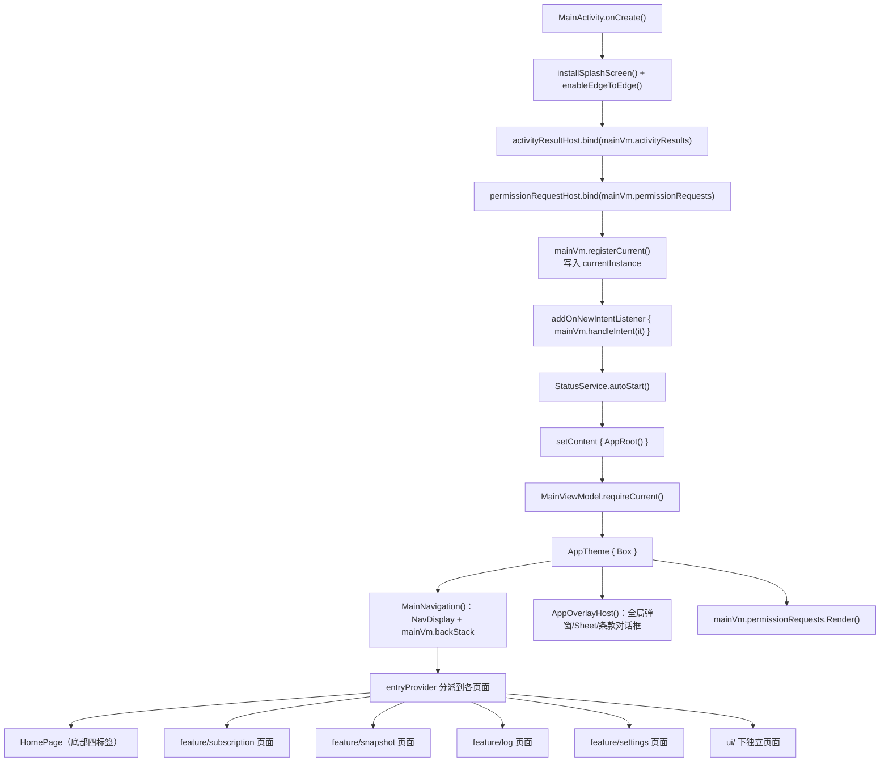
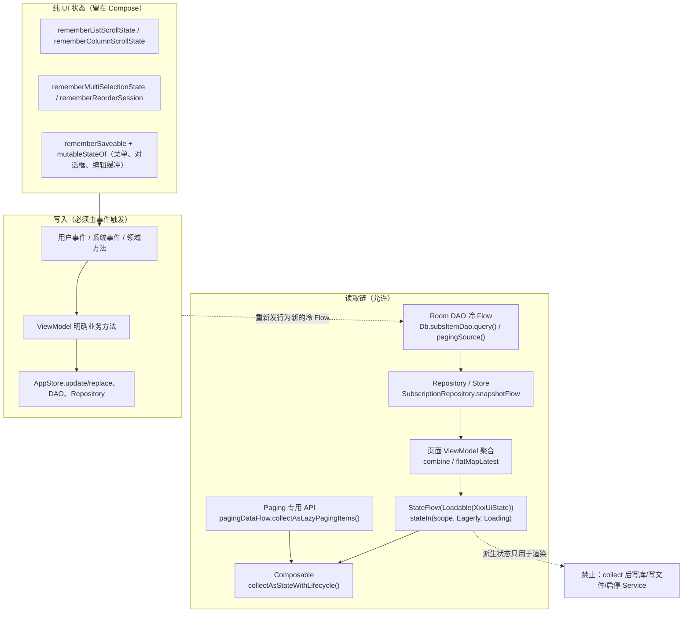
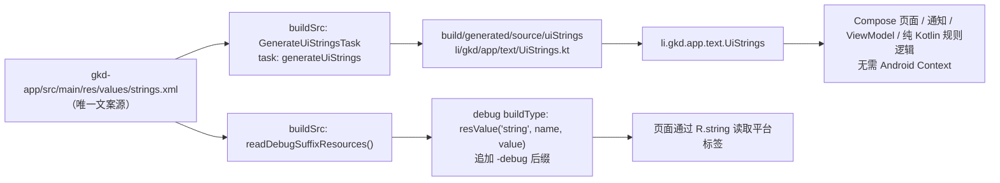

# UI 层（Compose）
`gkd-app` 的 UI 层是一套 **单 Activity + Compose Material3 + Navigation3** 的实现：`MainActivity` 是唯一的 Compose 宿主，`AppRoot` 在其内部搭起主题、导航和全局弹窗三层结构，页面按功能纵向切分在 `feature/<name>` 与 `ui/` 两处。

本层的边界可以概括为三句话：

- **Compose 只负责渲染和纯 UI 状态**（滚动、焦点、菜单、动画、拖拽、多选），不写数据库、文件、网络或 Service。
- **ViewModel 负责页面一致性读取和明确的业务方法**，把 Room 冷 `Flow` 按页面边界聚合为 `StateFlow<Loadable<XxxUiState>>`。
- **`MainViewModel` 是应用级唯一实例**，承载导航栈、全局弹窗、权限与 Activity Result 宿主；页面通过 `MainViewModel.requireCurrent()` 获取，不再使用 `LocalMainViewModel`。

本文只描述 UI 层，写入侧的一致性边界见 `gkd-app/ARCHITECTURE.md`。
## 技术栈
版本取自 `gradle/libs.versions.toml` 与 `gkd-app/build.gradle.kts`（未使用 Compose BOM，全部显式声明）。

| 领域 | 依赖 | 版本 |
| --- | --- | --- |
| 语言 / 构建 | Kotlin | 2.4.20 |
| 语言 / 构建 | Android Gradle Plugin | 9.4.1 |
| Compose 运行时 | `androidx.compose.ui:ui`、`ui-graphics`、`animation`、`ui-tooling-preview` | 1.12.1 |
| Material3 | `androidx.compose.material3:material3` | 1.4.0 |
| 图标 | `androidx.compose.material:material-icons-extended` | 1.7.8 |
| Activity Compose | `androidx.activity:activity-compose` | 1.13.0 |
| 启动画面 | `androidx.core:core-splashscreen` | 1.2.0 |
| 生命周期 | `androidx.lifecycle:lifecycle-runtime-ktx`、`lifecycle-runtime-compose`、`lifecycle-service` | 2.11.0 |
| Navigation3 | `androidx.navigation3:navigation3-runtime`、`navigation3-ui` | 1.1.7 |
| Navigation3 ViewModel 桥接 | `androidx.lifecycle:lifecycle-viewmodel-navigation3` | 2.11.0 |
| Paging | `androidx.paging:paging-runtime`、`paging-compose` | 3.5.1 |
| 图片加载 | `io.coil-kt.coil3:coil-compose`、`coil-network-okhttp`、`coil-gif` | 3.6.3 |
| 图片缩放 | `me.saket.telephoto:zoomable` | 0.19.0 |
| 图标形变 | `li.songe.morph:morph-compose` | 0.4.0 |
| 拖拽排序 | `sh.calvin.reorderable:reorderable` | 3.1.0 |
| WebView | `io.github.kevinnzou:compose-webview` | 0.33.6 |
| Drawable 绘制 | `com.google.accompanist:accompanist-drawablepainter` | 0.37.3 |
| Toast / 权限 / 设备 | `com.github.getActivity:Toaster`、`XXPermissions`、`DeviceCompat` | 15.0 / 28.3 / 2.6 |
| 数据库 | `androidx.room3:room3-runtime` / `-paging` | 3.0.3 |

使用约定：

- `compose-webview` 在 `build.gradle.kts` 中排除了 `com.google.android.material:material`（该库声明但未使用 Material）。
- Paging 页面（日志）通过 `androidx.paging.compose.collectAsLazyPagingItems()` 消费，不使用 `collectAsStateWithLifecycle`。
- 图片列表页（`ImagePreviewPage`、`SnapshotPage`、`GkSnapshotActionsSheet`）使用 Coil3 的 `AsyncImage`；`GkImagePreviewContent` 的手势层切到 Telephoto 的 `zoomable`，加载态仍由 `AsyncImagePainter.State` 驱动。
- 拖拽排序使用 `sh.calvin.reorderable` 的 `rememberReorderableLazyListState` / `ReorderableItem`（见 `SubsManagePage.kt`）。
- 图标形变使用 `li.songe.morph` 的 `AnimatedMorphIcon`，被 `GkIcon(animateMorph = true)` 与 `GkBackCloseIcon` 等封装。
## 应用启动与导航

### 启动顺序
`MainActivity` 的关键点是 **先绑定平台宿主、再注册实例、最后才创建 Compose 界面**：

```kotlin
override fun onCreate(savedInstanceState: Bundle?) {
    installSplashScreen()
    enableEdgeToEdge()
    fixTransparentNavigationBar()
    super.onCreate(savedInstanceState)
    activityResultHost.bind(mainVm.activityResults)
    permissionRequestHost.bind(mainVm.permissionRequests)
    mainVm.registerCurrent()
    addOnNewIntentListener { mainVm.handleIntent(it); intent = null }
    StatusService.autoStart()
    setContent { /* topBarWindowInsets 修正 + AppRoot() + 首次 handleIntent */ }
}
```

- `MainActivity` 持有 `mainVm`、`imeController`（`ActivityImeController`）、`activityResultHost`、`permissionRequestHost`，以及 `topBarWindowInsets`（在 `setContent` 内用 `FixedWindowInsets` 收敛 `TopAppBarDefaults.windowInsets` 的时机差异）。
- `StatusService.autoStart()`、`updateTopTaskAppId(META.appId)` 等启动副作用发生在 `setContent` 之前，不属于 Compose 状态监听。
- `App`（`App.kt`）在 `onCreate` 完成 `Db.initialize`、崩溃处理、`AppStore.initialize`、`AppInfoRepository.initialize`、`NotificationChannels.initialize`、`initA11yFeat/initPrivilege`、`SubscriptionRepository.initialize` 等进程级初始化。UI 层不承担这些职责。
### 导航栈
- 栈由 `MainViewModel.backStack: NavBackStack<NavKey> = NavBackStack(HomeRoute)` 持有，`topRoute` 即 `backStack.last()`。
- `navigatePage(navKey, replaced)` 与 `popPage()` 都通过 `runMainPost { ... }` 切回主线程；`popPage` 用 `ThrottleTimer` 抑制抖动返回，`replaced = true` 时替换栈顶而不是入栈。
- `MainNavigation` 用 `NavDisplay` 绑定该栈，并注册 `rememberSaveableStateHolderNavEntryDecorator()` 与 `rememberViewModelStoreNavEntryDecorator()`；`onBack = mainVm::popPage`。
- 默认过渡是水平滑动（`slideInHorizontally` / `slideOutHorizontally`），编辑器类页面通过 `editorTransitions` 使用带 `tween` 的纵向滑入 + 淡入淡出（`ActionToastRoute`、`NotificationTextRoute`、`BlockA11ySetupRoute`、`EditBlockAppListRoute`、`UpsertRuleGroupRoute`、`CategoryEditorRoute`、`RuleExcludeEditorRoute`）。
- 删除操作（`confirmDelete`）会先按 `DeletionTarget.owns(route)` 找到拥有被删实体的页面，再从该处截断栈，避免停留在已失效数据上。
### `MainViewModel.requireCurrent()` 的适用边界
`MainViewModel.requireCurrent()` 是 `@MainThread` 的 `checkNotNull(currentInstance)`：

```kotlin
companion object {
    private var currentInstance: MainViewModel? = null

    /** Only available to the main UI after its Activity has bound the request hosts. */
    @MainThread
    fun requireCurrent(): MainViewModel = checkNotNull(currentInstance) {
        "MainViewModel is not registered; a bound MainActivity is required"
    }
}
```

实例由 `registerCurrent()` 在权限与 Activity Result 宿主绑定之后写入，并在 ViewModel 清理时按实例身份清除（`addCloseable { if (currentInstance === this) currentInstance = null }`）。

必须遵守的四条硬边界：

1. **不得用于 Service、后台任务或悬浮窗。** 只有主界面 Composable 与页面 ViewModel 的调用链可以使用；`service/`、`a11y/`、`notif/` 等不得引用页面 ViewModel。
2. **不得缓存到静态字段。** 一次操作获取一次实例并贯穿整个操作。
3. **不得在权限等待前后重新获取。** `permissionRequests.ensurePermissions(...)` 前后必须复用同一个 `mainVm`。
4. **`requireCurrent()` 不得自行创建替代实例。** 它只做 `checkNotNull`；没有已绑定的 `MainActivity` 时应当快速失败，而不是退化为一个游离实例。

`LocalMainViewModel` 已废弃：`gkd-app` 中不存在其定义或引用，只有 `AGENTS.md` 等规范文档保留「不再使用」的说明。应用级操作（导航、全局弹窗、打开 URL、权限）统一通过 `requireCurrent()` 获取，不再逐层转发。

可复用组件不得获取页面 ViewModel：`ui/component/**` 只接收状态与事件回调（例如 `GkRuleGroupCard` 接收 `group`、`control`、`onOpen`、`onSettingChange`）。路由页面及其私有 Composable 可以直接 `viewModel<XxxVm>()` 并处理权限与 Activity Result。
## 页面清单
### 首页四标签（`ui/home/**`）
`HomePage` 本身是 `HomeRoute` 的页面，内部再用 `BottomNavItem`（`Dashboard`/`SubsManage`/`AppList`/`Settings`）切换四个标签；每个标签导出一个返回 `ScaffoldExt` 的 `useXxxPage()`，由 `HomePage` 合并进同一个 `Scaffold`（共用 `NavigationBar` 底栏与 `rememberSaveableStateHolder()` 状态保存）。

| BottomNavItem | 文件 | 入口 | 作用 |
| --- | --- | --- | --- |
| `Dashboard`（key=0） | `ui/home/DashboardPage.kt`（`useDashboardPage`）+ `DashboardVm.kt` | `HomePage` 底栏「首页」；`tabFlow` 初值 | 服务状态卡与工作模式入口、常驻通知开关、触发概览、活动/动作日志入口、文档入口 |
| `SubsManage`（key=1） | `ui/home/SubsManagePage.kt`（`useSubsManagePage`）+ `SubsManageVm.kt` | `HomePage` 底栏「订阅」；`HomePage` 预取 `viewModel<SubsManageVm>()` | 订阅列表、拖拽排序（`rememberReorderSession`）、多选删除、订阅设置与新增链接弹窗 |
| `AppList`（key=2） | `ui/home/AppListPage.kt`（`useAppListPage`）+ `AppListVm.kt` | `HomePage` 底栏「应用」 | 应用列表检索/排序/分组、规则统计、白名单编辑、下拉刷新、进入 `AppConfigPage` |
| `Settings`（key=3） | `ui/home/SettingsPage.kt`（`useSettingsPage`）+ `SettingsVm.kt` | `HomePage` 底栏「设置」 | 主题、备份导入导出、动作/通知文案、无障碍白名单、关于与高级设置入口 |

双击底栏回顶由 `ResetPageScrollOnRequest(navItem, resetScroll)`（`ui/home/HomePage.kt`）配合 `MainViewModel.pageScrollResetRequestFlow`、`handleClickTab` 与 `consumePageScrollResetRequest` 实现。
### `feature/subscription/**`
| 路由 | 页面文件 | 入口 | 作用 |
| --- | --- | --- | --- |
| `SubsAppListRoute(subsItemId)` | `feature/subscription/SubsAppListPage.kt` | `SubsSheetState` 订阅详情「应用」 | 订阅内应用列表，支持多选与批量启停 |
| `SubsAppGroupListRoute(subsItemId, appId, focusGroupKey)` | `feature/subscription/SubsAppGroupListPage.kt` | `SubsAppListPage`、`SubsCategoryGroupPage`、`RuleGroupDialog`、`ActionLogPage`、`AppConfigPage`、`UpsertRuleGroupPage` | 单应用下的规则组列表 |
| `SubsCategoryRoute(subsItemId)` | `feature/subscription/SubsCategoryPage.kt` | `SubsSheetState` 订阅详情「分类」 | 订阅分类列表 |
| `SubsCategoryGroupRoute(subsId, categoryKey)` | `feature/subscription/SubsCategoryGroupPage.kt` | `SubsCategoryPage`、`RuleGroupDialog` | 分类下的规则组与应用归属 |
| `SubsGlobalGroupListRoute(subsItemId, focusGroupKey)` | `feature/subscription/SubsGlobalGroupListPage.kt` | `SubsSheetState` 订阅详情「全局」、`RuleGroupDialog`、`ActionLogPage`、`AppConfigPage`、`UpsertRuleGroupPage` | 全局规则组列表 |
| `SubsGlobalGroupExcludeRoute(subsItemId, groupKey)` | `feature/subscription/SubsGlobalGroupExcludePage.kt` | `RuleGroupState`（全局组的排除项入口） | 全局规则组的应用排除/包含范围 |
| `UpsertRuleGroupRoute(subsId, groupKey, appId, forward)` | `feature/subscription/UpsertRuleGroupPage.kt` | 各规则组列表的新增/编辑入口 | 规则组新增与编辑（`editorTransitions`） |
| `CategoryEditorRoute(subsId, categoryKey)` | `feature/subscription/CategoryEditorPage.kt` | `SubsCategoryPage`、`SubsCategoryGroupPage` | 分类新增与编辑（`editorTransitions`） |
| `RuleExcludeEditorRoute(subsId, groupKey, appId)` | `feature/subscription/RuleExcludeEditorPage.kt` | `RuleGroupState`、`SubsGlobalGroupExcludePage` | 规则组排除项编辑（`editorTransitions`） |

非页面文件：`GkCategoryActionsSheet.kt`（分类操作弹窗）、`GkRuleControlDialog.kt` + `RuleControlDialogState.kt`（规则开关原因对话框）、`RuleGroupDialog.kt` + `RuleGroupState.kt`（规则组弹窗与会话状态，含 `GkRetainedSheet`）、`SubsSheetState.kt` + `SubsLinkDialogState.kt`（订阅详情/新增链接状态）、`CategorySettingExt.kt`、各 `XxxVm.kt`。
### `feature/snapshot/**`
| 路由 | 页面文件 | 入口 | 作用 |
| --- | --- | --- | --- |
| `SnapshotPageRoute` | `feature/snapshot/SnapshotPage.kt` | `AdvancedPage`、`gkd://page/2` | 快照网格，按时间/应用分组，多选删除与批量上传 |
| `SnapshotPreviewRoute(snapshotId, snapshotIds)` | `feature/snapshot/SnapshotPreviewPage.kt` | `SnapshotPage` 点击缩略图 | 快照全屏预览（Pager + `GkImagePreviewContent`） |
| `SnapshotSettingsRoute` | `feature/snapshot/SnapshotSettingsPage.kt` | `AdvancedPage` | 截图服务、显示模式与快照相关设置 |

非页面文件：`SnapshotVm.kt`（`SnapshotUiState`、删除与归档分享）、`SnapshotSettingsVm.kt`、`SnapshotGrouping.kt`（`SnapshotGroup`、`buildSnapshotGroups`）、`SnapshotActionHandler.kt`（单项快照的分享/保存/替换/删除动作）、`SnapshotUploadItem.kt`（`createSnapshotUploadItem`）、`GkSnapshotActionsSheet.kt`（单项快照操作底部弹窗）。
### `feature/log/**`
| 路由 | 页面文件 | 入口 | 作用 |
| --- | --- | --- | --- |
| `ActivityLogRoute` | `feature/log/ActivityLogPage.kt` | `DashboardPage` 卡片的「活动日志」、`AdvancedPage` | 前台界面记录时间线（`GkLogTimeline` + Paging） |
| `A11yEventLogRoute` | `feature/log/A11yEventLogPage.kt` | `AdvancedPage` 事件服务入口 | 无障碍事件日志，含 JSON5 高亮详情 |
| `ActionLogRoute(subsId, appId)` | `feature/log/ActionLogPage.kt` | `DashboardPage` 触发概览、`AppConfigPage`、`SubsSheetState` | 规则触发动作用于审计与规则设置回填 |

非页面文件：`A11yEventLogVm.kt`、`ActionLogVm.kt`、`ActivityLogVm.kt`，三者都以 `Pager(PagingConfig(pageSize = 100))` + `cachedIn(scope)` 暴露 `pagingDataFlow`。
### `feature/settings/**`
| 路由 | 页面文件 | 入口 | 作用 |
| --- | --- | --- | --- |
| `WorkModeRoute` | `feature/settings/WorkModePage.kt` | `DashboardPage` 服务卡的模式行 | 无障碍/自动化工作模式选择与保活说明 |
| `AdvancedPageRoute` | `feature/settings/AdvancedPage.kt` | `SettingsPage`、`gkd://page/1` | HTTP 服务、快照入口、各记录服务开关、日志与 Cookie 设置 |
| `AboutRoute` | `feature/settings/AboutPage.kt` | `SettingsPage` | 版本信息、更新渠道、反馈与开源入口 |

非页面文件：`AboutDialogs.kt`（分享/版本等对话框）、`AdvancedVm.kt`、`WorkModeVm.kt`。
### `ui/**` 下的独立页面
| 路由 | 页面文件 | 入口 | 作用 |
| --- | --- | --- | --- |
| `HomeRoute` | `ui/home/HomePage.kt` | 导航栈起点 | 首页容器（四标签 + 底栏） |
| `AppConfigRoute(appId, focusLog)` | `ui/AppConfigPage.kt` | `AppListPage`、日志页、仪表盘最近触发 | 单应用的规则汇总、限制说明与规则配置 |
| `A11YScopeAppListRoute` | `ui/A11yScopeAppListPage.kt` | `WorkModePage` | 局部无障碍生效的应用白名单 |
| `BlockA11yAppListRoute` | `ui/BlockA11yAppListPage.kt` | `SettingsPage` | 屏蔽无障碍的应用名单 |
| `BlockA11ySetupRoute` | `ui/home/BlockA11ySetupPage.kt` | `SettingsPage` | 屏蔽无障碍的引导与权限确认（`editorTransitions`） |
| `EditBlockAppListRoute` | `ui/EditBlockAppListPage.kt` | `AppListPage` 白名单编辑 | 纯文本批量编辑屏蔽名单（`GkEditorScaffold` + `GkMultiTextField`） |
| `CrashReportRoute` | `ui/CrashReportPage.kt` | 启动时发现崩溃日志自动跳转、`AdvancedPage` | 崩溃日志查看、复制与提交反馈 |
| `PrivilegeServiceRoute` | `ui/PrivilegeServicePage.kt` | 各处权限入口、`gkd://page/3`、`/4` | 特权服务授权与状态（`priv-kit` 的 `PrivilegeScaffold`） |
| `WebViewRoute(initUrl)` | `ui/WebViewPage.kt` | 文档/帮助链接、`MainViewModel.navigateWebPage` | 内置 WebView 页面，含 Cookie 注入能力 |
| `ImagePreviewRoute(title, items)` | `ui/GkImagePreviewContent.kt`（`ImagePreviewPage`） | 快照预览、规则组图片预览 | 图片浏览器（Coil + Telephoto 缩放） |
| `ActionToastRoute` | `ui/home/ActionToastPage.kt` | `SettingsPage` | 点击提示文案编辑（`editorTransitions`） |
| `NotificationTextRoute` | `ui/home/NotificationTextPage.kt` | `SettingsPage` | 常驻通知标题/正文模板编辑（`editorTransitions`） |
### 入口 Activity（`entry/**`）
| 文件 | 类型 | 作用 |
| --- | --- | --- |
| `entry/EntryActivity.kt` | `abstract class EntryActivity : Activity()` | 转发宿主：`prepareIntent()` 后可覆写，随后把原 Intent 复制到 `MainActivity`（只保留 `FLAG_ACTIVITY_NEW_TASK` 与 URI 授权 flags，并写入 `activityNavSourceName`），再 `finish()` |
| `entry/OpenFileActivity.kt` | `class OpenFileActivity : EntryActivity()` | 备份文件打开入口，交给 `MainViewModel.handleIntent` 走导入确认 |
| `entry/OpenSchemeActivity.kt` | `class OpenSchemeActivity : EntryActivity()` | `gkd://` scheme 入口，交给 `handleGkdUri` |
| `entry/OpenTileActivity.kt` | `class OpenTileActivity : EntryActivity()` | 快捷设置磁贴入口，在 `prepareIntent()` 中从磁贴服务 meta-data 的 `QS_TILE_URI` 补出 `intent.data` |

`MainViewModel.handleIntent` 的判定顺序是：`gkd` scheme → `handleGkdUri`（`page`/`invoke` 等 host）；否则若来源是 `OpenFileActivity::class.jvmName` 且带 URI，则弹确认框后调用 `BackupManager.importData`。
## 状态管理契约
以下条款可以逐条对照代码执行。


### 1. `XxxUiState` / `XxxUiActions` 的使用条件
`XxxUiState` 只在**复用、独立预览或复杂页面契约确有需要**时引入；相同映射存在多个构造路径时再提取私有 `buildXxxUiState` 构建函数（见 `ui/home/AppListVm.kt` 的 `buildAppListUiState`、`ui/home/SubsManageVm.kt` 的 `buildSubsManageUiState`）。当前存在的 UiState 类型：`AppListUiState`、`SubsManageUiState`、`SnapshotUiState`、`AppConfigUiState`、`SubsAppListUiState`、`SubsAppGroupListUiState`、`SubsCategoryUiState`、`SubsCategoryGroupUiState`、`SubsGlobalGroupListUiState`、`SubsGlobalGroupExcludeUiState`、`UpsertRuleGroupUiState`、`RuleExcludeEditorUiState`。

`XxxUiActions` 目前尚未使用：简单页面直接用 ViewModel 方法或事件回调即可，不要为了形式统一而新增 Actions 类型。
### 2. UiState 只能表示不可变页面快照
`UiState` 必须是不可变的普通数据快照，**不得包含 `Flow`、`Paging` 或高频状态**：

- 高频/瞬时状态（滚动位置、搜索框是否展开的高频输入、拖拽中间态、动画进度）留在 Compose。
- Paging 不进 UiState：日志页通过 `vm.pagingDataFlow.collectAsLazyPagingItems()` 直接消费（`A11yEventLogPage`、`ActionLogPage`、`ActivityLogPage`）。
- 应用级只读 Flow 由实际消费它的 Composable 直接收集，不复制进 UiState（例如 `storeFlow`、`SubscriptionState.ruleSummaryFlow`、`privilegeContextFlow`、`A11yService.isRunning`）。
### 3. ViewModel 可变状态必须 `private`
只暴露不可变状态和明确的业务方法。反例与正例对照：`AppListVm` 的 `editWhiteListModeFlow`、`showSearchBarFlow`、`filterBlockAppListFlow` 都是 `private`，页面的编辑缓冲区不会泄漏为公开可变入口。
### 4. 只读 `StateFlow` 使用 Explicit Backing Fields
禁止 `_xxxFlow` / `xxxFlow` 双属性和 `.asStateFlow()`（`gkd-app` 中当前没有任何 `.asStateFlow()` 调用）。统一写成：

```kotlin
val termsStepFlow: StateFlow<Int>
    field = MutableStateFlow(0)

val settingsDialogVisibleFlow: StateFlow<Boolean>
    field = MutableStateFlow(false)

val searchStrFlow: StateFlow<String>
    field = mutableSearchStrFlow
```

同样的写法出现在 `ui/share/ActivityImeController.kt`（`showAnimationRunningFlow`）、`ui/share/ActivityResultRequests.kt`（`pendingFlow`）、`ui/share/AppFilter.kt`（`searchStrFlow`）。
### 5. Room 冷 Flow 在 ViewModel 内按页面一致性边界聚合
Room 可观察查询保持为冷 `Flow`，先在 ViewModel 内聚合，再把最终页面快照转成 `StateFlow<Loadable<XxxUiState>>`。`ui/home/SubsManageVm.kt` 是完整范例：

```kotlin
val uiState: StateFlow<Loadable<SubsManageUiState>> =
    SubscriptionRepository.snapshotFlow.flatMapLatest { snapshotState ->
        when (snapshotState) {
            Loadable.Loading -> flowOf(Loadable.Loading)
            is Loadable.Failure -> flowOf(snapshotState)
            is Loadable.Ready -> combine(
                Db.subsItemDao.query(),
                SubscriptionRepository.updating,
            ) { subItems, refreshing ->
                buildSubsManageUiState(subItems, snapshotState.value, refreshing)
            }.map<SubsManageUiState, Loadable<SubsManageUiState>> { Loadable.Ready(it) }
                .catch { emit(Loadable.Failure(it)) }
        }
    }.stateIn(scope, SharingStarted.Eagerly, Loadable.Loading)
```

`Loadable`（`core/state/Loadable.kt`）语义必须保持：

| 状态 | 含义 |
| --- | --- |
| `Loadable.Loading` | 尚未收到完整首发 |
| `Loadable.Ready(emptyList())` | 已加载完成，结果确实为空 |
| `Loadable.Failure(cause)` | 加载失败，携带原因 |

禁止用空集合伪装初始值，也禁止用计数器或 `attachLoad` 之类的旁路状态推断「多个查询是否都加载完成」。`ui/share/BaseViewModel.kt` 提供 `stateLoadable()` / `stateInit()` / `mapNew()` 三个收敛点；`ui/share/RequiredSubscription.kt` 提供按订阅 id 的 `buildUiState` / `requireValue()`。
### 6. `combine` / `map` / `stateIn` 派生状态禁止驱动写入
派生展示状态只能用于渲染和临时 UI 同步，不得通过 `collect`、`onEach` 或状态 watch 驱动数据库、文件、网络写入以及 Service 启停：

- 允许：把单一权威状态同步到幂等外部投影，且同步回调不再拼装其他状态（`MainActivity` 中 `storeFlow.mapState { it.excludeFromRecents }` 同步到 `appTasks`）。
- 禁止：由 `combine(...)` 的结果触发 `AppStore.update*`、DAO 写入、文件写入或 `ServiceController` 调用。
- 持久化与副作用必须由明确的用户事件、系统事件或领域方法触发，并在 Repository / Store 内按业务一致性边界完成。例如主题读取用 `Theme.kt` 的 `createAppearanceFlow`（`map` + `distinctUntilChanged` + `debounce(300)` + `stateIn`）只做展示；主题写入走 `SettingsVm.setDarkTheme` / `setDynamicColor`。
- `debounce`、`conflate`、`collectLatest` 和互斥锁只控制调度或并发，不能替代多状态源的原子更新。
### 7. UI 状态留在 Compose
滚动、焦点、菜单、动画、拖拽和多选属于纯 UI 状态，不得放进 ViewModel：

| 类别 | 现成封装/用法 |
| --- | --- |
| 列表/Column 滚动 | `rememberListScrollState()`、`rememberPinnedListScrollState()`、`rememberColumnScrollState()`（`ui/component/Hooks.kt`，返回 `ListScrollState` / `ColumnScrollState`） |
| 顶栏折叠 | `TopAppBarScrollBehavior.isFullVisible`、`ListScrollState.scrollBehavior` |
| 搜索框/编辑态局部开关 | `rememberSaveable { mutableStateOf(...) }`（`SettingsPage`、`ActionToastPage`、`NotificationTextPage`、`SnapshotSettingsPage`） |
| 多选 | `rememberMultiSelectionState<K>()` |
| 拖拽排序 | `rememberReorderSession(items, keyOf)` |
| 下拉刷新 | `rememberPullToRefreshState()` + `PullToRefreshBox` |
| Pager | `rememberPagerState` |
| 菜单/弹窗开关 | 局部 `mutableStateOf` 或页面级 `*State` 持有者 |

可复用交互逻辑可以封装为 `rememberXxxState`，但不得访问 ViewModel、数据库、Store、Service 或导航。需要原子一致性的多个字段必须由事实源提供同一个不可变快照，业务状态不得通过 `CompositionLocal` 传递（`ui/share/LocalExt.kt` 只放 `LocalDarkTheme`、`LocalIsTalkbackEnabled` 这类纯展示值）。
### 8. Composable 不得因条件输出而提前 `return`
需要根据条件决定是否输出后续 UI 时，必须把 UI 包在对应的条件区块里，而不是提前 `return` 跳过后续输出：

```kotlin
// AppOverlayHost.kt：用 if/else 包裹两套输出
if (!mainVm.termsAcceptedFlow.collectAsStateWithLifecycle().value) {
    GkTermsAcceptDialog()
} else {
    mainVm.subsSheet.Render()
    // ... 其余全局弹窗
}
```

事件或协程 Lambda 的标记返回（`return@launchUi`、`return@collect`）不受此限制。
## 组件规范
### 命名规则
- 项目自定义、供跨页面或跨文件复用的 UI 组件统一使用 **`Gk` 前缀 + PascalCase**，命名为 `GkAbc`，包括基础控件与共享业务组件；该规则不受组件所在包限制。
- 名称必须描述用途，不再使用 `Perf`、`Custom` 等泛化前缀；具有实际语义的 `App`、`AppBar`、`Rule`、`Subs` 等词保留。
- **单组件文件与组件同名**；同一组件族的重载、私有实现和配套声明允许放在同一文件，文件以 `Gk` 开头并描述该组件族（如 `GkDialog.kt` 内的 `GkDialog` / `GkModalBottomSheet` / `GkAlertDialog`，`GkCopyText.kt` 内的 `GkCopyableText` / `GkCopyIconOverlay` / `GkCopyTextCard`）。
- 组件专属配置类型使用 `GkAbcDefaults` / `GkAbcColors`；图标组件使用 `GkIcon`，共享图标集合使用 `GkIcons`。
- 页面、页面私有 Composable、Preview、普通工具函数、Modifier 扩展及独立状态管理类型不强制加 `Gk`（如 `useDashboardPage`、`PageItemCard`、`IconTextCard`）；状态对象的 `Render()` 成员不属于独立组件入口（如 `mainVm.subsSheet.Render()`）。
### 真实组件示例
| 组件 | 文件 | 用途 |
| --- | --- | --- |
| `GkAppIcon` | `ui/component/GkAppIcon.kt` | 应用图标：订阅 `AppInfoRepository.appIconMapFlow`，用 `rememberDrawablePainter` 渲染，缺失时回退 `GkIcons.Android` |
| `GkRuleGroupCard` | `ui/component/GkRuleGroupCard.kt` | 规则组卡片：组合 `GkRuleListItem` + `GkGroupNameText` + `GkRuleEnableControl`，并处理选中/高亮/分类前缀 |
| `GkTopAppBar` | `ui/component/GkTopAppBar.kt` | 统一顶栏：注入 `MainActivity.topBarWindowInsets`（`FixedWindowInsets`），`canScroll = false` 时临时覆写 `isPinned` 关闭折叠效果 |
| `GkTriStateSwitch` | `ui/component/GkTriStateSwitch.kt` | 三态开关组件族，配套 `GkTriStateSwitchDefaults`（`colors()` 工厂）与 `GkTriStateSwitchColors`，是三态控件与 `GkAbcDefaults`/`GkAbcColors` 命名的样板 |
| `GkPageBottomSpace` | `ui/component/GkPageBottomSpace.kt` | 页面底部额外留白，配套 `GkPageBottomSpaceDefaults` 与 `LazyListScope.gkPageBottomSpace()` |
| `GkEditorScaffold` | `ui/component/GkEditorScaffold.kt` | 编辑器骨架：关闭/保存按钮、未保存确认、保存前隐藏 IME |
| `GkSettingItem` | `ui/component/GkSettingItem.kt` | 设置项行：标题/副标题/后缀/点击语义与节流 |
| `GkEmptyState` | `ui/component/GkEmptyState.kt` | 空状态文案与可选操作，配套 `GkEmptyStateDefaults` |
| `GkMultiSelectionTopAppBar` | `ui/component/GkMultiSelectionTopAppBar.kt` | 多选顶栏：选中态与普通态通过 `updateTransition` 切换，出站内容不从无障碍导航暴露 |
| `GkLogTimeline` | `ui/component/GkLogTimeline.kt` | 日志时间线：按日期吸顶 + 按应用分组，末尾统一放 `GkEmptyState` 或 `GkPageBottomSpace()` |

其余常用件：`GkIcon` / `GkIconButton` / `GkIcons`（图标入口与共享集合）、`GkCheckbox`、`GkSwitch`、`GkTextSwitch`、`GkOutlinedTextField`、`GkMultiTextField`、`GkAppBarTextField`、`GkTextMenu`、`GkMenuItemCheckbox`、`GkMenuItemRadioButton`、`GkMenuGroupCard`、`GkDialog`、`GkAlertDialog`、`GkModalBottomSheet`、`GkRetainedSheet`、`GkFullscreenDialog`、`GkSettingsDialog`、`GkTextListDialog`、`GkTooltipIconButtonBox`、`GkSizedIconButton`、`GkFilterIconButton`、`GkAnimatedFloatingActionButton`、`GkAnimatedBooleanContent`、`GkExpandableSection`、`GkRotatingLoadingIcon`、`GkTwoLineText`、`GkFixedTimeText`、`GkLazyCopyableText`、`GkGroupNameText`、`GkAppNameText`、`GkAppCheckboxCard`、`GkAppFilterContent`、`GkAppRuleRestrictionCard`、`GkSubsItemCard`、`GkSubsAppCard`、`GkRuleListItem`、`GkRuleListHeader`、`GkRuleStats`、`GkRuleProperty`、`GkRuleEnableControl`、`GkRuleFocusNotice`、`GkRuleSettingsSheet`、`GkRuleExclusionsCard`、`GkAuthCard`、`GkAuthButtonGroup`、`GkQueryPkgAuthCard`、`GkTemplateVariableRow`、`GkTermsAcceptDialog`、`GkMultiSelectionActions`、`GkBatchActionMenuItem`、`GkRuleBatchMenuItems`、`GkEventLogOverlayCard`，以及订阅页统一外壳 `GkSubscriptionPageContent` 与快照操作弹窗 `GkSnapshotActionsSheet`。
## 页面底部留白规范
可滚动页面必须在**滚动内容内部**、内容末尾提供统一的额外底部留白。

三种正确写法：

```kotlin
// 1) 普通 Column：最后一个子项
Column(modifier = Modifier.verticalScroll(scrollState)) {
    // ...
    GkPageBottomSpace()
}

// 2) LazyColumn：添加末尾 item（只加一次）
LazyColumn {
    items(...) { ... }
    gkPageBottomSpace()
}

// 3) 已有末尾 item（含空状态等）时：在该 item 内部使用
item(ListPlaceholder.KEY, ListPlaceholder.TYPE) {
    if (appInfos.isEmpty() && searchStr.isNotEmpty()) {
        GkEmptyState(text = UiStrings.search_no_results)
        GkPageBottomSpace(height = GkPageBottomSpaceDefaults.CompactHeight)
    } else {
        GkPageBottomSpace()
    }
}
```

高度统一由 `GkPageBottomSpaceDefaults` 管理（`Height`、`CompactHeight`），不再手写页面底部 `Spacer` 高度。

常见错误：

| 错误 | 说明 |
| --- | --- |
| 把 `GkPageBottomSpace()` 放在滚动容器**外面** | 它必须位于滚动内容内部，才能让最后一项继续向上滚动 |
| 用它替代 Scaffold / 系统导航栏 / IME inset 处理 | 它只是额外呼吸空间，不承担 inset 职责 |
| 在 LazyColumn 里既写 `gkPageBottomSpace()` 又额外手写底部 Spacer | 重复叠加 |
| 已有末尾 item 时再补一个纯留白 item | 应改为在该 item 内调用 `GkPageBottomSpace()` |
| 随意改高度 | 只应通过 `GkPageBottomSpaceDefaults`（或显式传入 `CompactHeight` 这类既有默认值）调整 |

`GkLogTimeline` 已经把这条规则封装在组件内（见上表），日志页无需重复添加。
## 过渡动画与交互约定
- **动画只负责视觉过渡，交互按当前业务或 UI 状态立即响应。** 禁止因动画未结束、图标变形或旧内容正在退场，给按钮、图标、开关、标题等添加临时禁用态、等待动画完成、延时解锁或额外点击节流；也不得改成在点击回调中吞掉操作。
- **禁用交互必须对应明确的业务前提**：没有可操作数据、输入无效或权限不足。例如 `GkEditorScaffold` 的 `saveEnabled` 由页面按输入有效性给出（`ActionToastPage` 传 `text.isNotEmpty() && text.length <= 64`），而不是「保存还没落盘所以先锁住」。
- 普通开关的短暂保存、模式切换或对快速点击的假设，不得成为临时锁定控件或扩大禁用范围的理由；写入一致性在 ViewModel / Repository / Store 中处理。
- 退场重复内容可以从无障碍导航中隐藏，但不得因此改变控件颜色或增加点击等待。`GkMultiSelectionTopAppBar` 通过 `hideFromAccessibility()` 隐藏非当前内容、通过 `focusProperties { canFocus = currentContent }` 转移焦点，同时保持点击立即生效；它还用 `lastSelectedCount` 避免清空选择时闪出「已选 0 项」。
- 列表项动画使用 `Modifier.animateListItem()`（`ui/component/Animation.kt`）与 `usePercentAnimatable(visible)`；`GkTopAppBar` 用 `key(MaterialTheme.colorScheme.primary)` 规避主题色变化时的叠加动画割裂。
- 过渡动画相关的测试应验证过渡期间的正常点击与状态切换，不得把临时禁用固化为正确行为。
## 文案体系

### 生成链路
1. 唯一文案源是 `gkd-app/src/main/res/values/strings.xml`（用户可见的标题、按钮、副文案、Toast、通知、无障碍描述和校验提示都放这里；日志、内部诊断、协议字段、URL、动画调试标签和用户输入不属于固定 UI 文案）。
2. `gkd-app/build.gradle.kts` 注册 `generateUiStrings`，输入 `src/main/res/values/strings.xml`，输出目录 `build/generated/source/uiStrings`，并通过 `variant.sources.java?.addGeneratedSourceDirectory(...)` 挂到每个变体。
3. `buildSrc/src/main/kotlin/li/gkd/gradle/GenerateUiStringsTask.kt` 生成 `li/gkd/app/text/UiStrings.kt`：
   - 文件头固定为 `// Generated from res/values/strings.xml. Do not edit.`，包名 `li.gkd.app.text`，对象名 `UiStrings`。
   - 带 `debug_suffix` 属性的节点直接跳过，不生成访问器。
   - 资源名必须匹配 `[a-z][a-z0-9_]*`，否则构建失败。
   - 无参数文案生成 `const val name: String = "..."`。
   - 含 `%N$s` 的文案生成函数；参数必须连续编号（`require(parameters == (1..parameters.size).toList())`），并用 `String.format(java.util.Locale.ROOT, ...)` 格式化。
   - `decodeAndroidString` 处理带引号的字面空白与 `\n`、`\r`、`\t`、`\uXXXX`；`quoteKotlin` 转义 `\`、`"`、`$` 与换行。
### 资源键命名与写法
- 资源键按用途命名，例如 `rule_enable_in_app`、`subscription_disabled`，不加 `gk_` 前缀；无障碍相关键使用 `a11y`。
- 复用已有键前应确认语义相同；显示值相同但用途不同的文案可以分别命名。
- 普通文案无需声明 `translatable` 或 `formatted`；带参数文案中的字面百分号写成 `%%`。
- 普通文案不加外层双引号；仅需保留首尾空格、连续空白时用引号包裹。换行写 `\n`，双引号写 `\"`，反斜杠写 `\\`，`&`、`<` 使用 XML 实体转义。
- `${i}` 等自定义通知模板变量作为普通文本保留（`UiStrings.notification_summary_template` 有对应回归测试），无需额外属性。

```xml
<string name="rule_enable_in_app">在此应用启用</string>
<string name="app_count">%1$s 个应用</string>
```

```kotlin
Text(UiStrings.rule_enable_in_app)
Text(UiStrings.app_count(apps.size))
```
### `formatted="false"` 的适用场景
只有当 `%1$s` 等格式符本身要作为**普通文本**显示、不能被当作参数解析时，才声明 `formatted="false"`。生成器见到该属性就按无参数处理、生成 `const val`，从而不会生成函数或调用 `String.format`。`UiStringsFormattingTest` 覆盖了「用户提供的规则名原样插入、不解释格式符与 XML 字符」以及「多行选择器错误同时保留资源与参数换行」这两类回归。
### `debug_suffix` 为什么走 `R.string`
带 `debug_suffix` 的字符串（如 `app_name`、`import_backup`、`capture_snapshot`、`http_server`）在 debug 变体里由 `readDebugSuffixResources()` 读出并以 `resValue("string", name, "${value}-debug")` 覆盖，用来和正式版共存时区分平台标签（服务名、快捷设置磁贴名、应用名）。`UiStrings` 是编译期生成的纯 Kotlin 常量，拿不到变体覆盖后的值，所以这些键必须继续通过 `R.string` 获取，不生成访问器（例如 `DashboardPage` 用 `stringResource(R.string.app_name)`）。
### 多语言现状与迁移路径
目前只支持一套文案，不做运行时语言切换；`androidResources.localeFilters` 仅列出 `zh-rCN`、`en`。将来要增加多语言，必须**把文案解析切换为 Android 资源机制**（由 `Context` 解析），不能只在 `values-xx` 目录里加翻译就让 `UiStrings` 生效——否则 Compose、通知、ViewModel 与纯 Kotlin 规则逻辑拿到的仍是默认语言。迁移时需要给无 `Context` 的场景提供一个可注入的文案提供者，并保留 `UiStrings` 的键名作为稳定标识。
## 图标规范
- 除 `app_icon`、`service` 等 Android 平台必须使用 XML 的场景外，**禁止新增 XML 文件**。
- UI、图标及其他能够使用 Kotlin 表达的实现必须使用 `.kt` 文件，**不得为其新增 drawable、layout 等 XML 资源**。
- 新增图标资源时，**页面及页面内组件使用的图标必须以 Kotlin `ImageVector` 定义**，不得使用 drawable XML。
- **唯一例外条款**：只有 `AndroidManifest.xml` 等 Android 平台 XML 配置需要引用的图标及其依赖资源，才允许使用 drawable XML；**同一图标同时用于平台配置和页面时，页面仍必须使用 Kotlin `ImageVector`**。
- 无法确定是否属于 XML 例外场景时，必须先向用户确认。
### `ui/icon/**` 的组织方式
| 文件 | 内容 |
| --- | --- |
| `StackedDocuments.kt`、`Flowchart.kt`、`AndroidHead.kt`、`GitHub.kt`、`PageInfo.kt`、`CollapseContent.kt`、`ExpandContent.kt`、`DragPan.kt`、`FlashOn.kt`、`FlashOff.kt`、`LockOpenRight.kt`、`ResetSettings.kt`、`RuleList.kt`、`SportsBasketball.kt`、`ToggleMid.kt` | 每文件一个自定义图标：顶层 `val Name: ImageVector`，用 `get()` 惰性构建并缓存到私有 `var _name`，`ImageVector.Builder(name = "Name", defaultWidth = 24.dp, ...)` + `path(...)` 描述 |
| `GkAnimatedRocketIcon.kt`、`GkAnimatedLogoIcon.kt`、`GkBackCloseIcon.kt`、`GkBlockCloseIcon.kt`、`GkSearchCloseIcon.kt` | 动画/形变型图标组件（`GkAnimatedRocketIcon` 会把 `Icons.Outlined.RocketLaunch` 的路径拆成多段做燃烧动画；后三者基于 `li.songe.morph` 的 `AnimatedMorphIcon` 在「返回/关闭」「搜索/关闭」间形变） |

图标的分发统一经过 `GkIcons`：Material 官方图标直接引用 `Icons.*`（含 `Icons.AutoMirrored.*`），自定义图标引用 `li.gkd.app.ui.icon.*`。`GkIcon` 是唯一渲染入口，并提供 `animateMorph` 参数；`getIconDefaultDesc(imageVector)` 为常用图标提供默认无障碍描述。
## 编辑器、保存会话与多选
### `EditorSaveSession`
`ui/share/EditorSaveSession.kt` 用 `Mutex` 保证「一次编辑器提交只落库一次」：

- 成功完成后缓存结果并复用：重复调用返回首次提交的值，底层写入只发生一次。
- 失败或取消**不视为完成**，`saved` 仍为空，可以重试。
- 成功的 `null` 结果同样算完成，避免重复创建。

`EditorSaveSessionTest` 固定了四条契约：写入中重复保存只提交一次并返回同一结果；失败后可重试；取消后释放会话可重试；成功的 `null` 仍阻止重复创建。使用方：`CategoryEditorVm`、`RuleExcludeEditorVm`、`UpsertRuleGroupVm`（`private val saveSession = EditorSaveSession<...>()`）。
### `DeletionTarget`
`ui/share/DeletionTarget.kt` 是删除操作的**路由归属声明**：`Subscription`、`Category`、`App`、`Group` 四种目标，通过 `owns(route: NavKey)` 判断某个路由是否属于被删实体。`MainViewModel.confirmDelete` 用它把被删实体所属页面及其后代一起出栈，避免留在失效数据上。

`DeletionTargetTest` 固定了边界：`Category` 只拥有自己的分类详情/编辑器（不拥有 `SubsCategoryRoute`，也不匹配其他分类或订阅）；`Group` 只拥有匹配的排除项编辑器（全局组 `appId = null` 只拥有 `SubsGlobalGroupExcludeRoute`，不拥有列表页）；`App` 只拥有该应用的应用组列表与规则编辑器；`Subscription` 拥有其全部后代路由但不拥有其他订阅。
### `MultiSelectionState`
`ui/component/ListInteractionState.kt` 中的 `MultiSelectionState<K>` 由 `rememberMultiSelectionState()` 创建，内部把 `active` 与 `keys` 放在同一个不可变 `Selection` 快照里原子更新。`MultiSelectionStateTest` 固定了九条契约，其中与 UI 直接相关的：

- 取消最后一个选中项**不退出**多选模式，只有 `clear()` 才退出。
- 长按/重复 `select(key)` 是**幂等添加**，不会把已选项切换掉。
- `invert(keys)` 针对整个当前过滤列表；`selectAll` 后再 `invert` 会清空选择但保持选中模式。
- `retain(keys)` 只做「已加载列表的对账」：移除消失项、不自动选中新项，也不会因为一次对账而进入多选模式；传入空集合才退出。
- `removeDeleted(keys)` 在删除完成后收敛，且不会让已退出的模式重新进入。
- `selectedKeys` 是捕获即固定的集合，操作期间选择变化不影响该次操作的目标。
### `ReorderSession`
`ReorderSession<T, K>` 由 `rememberReorderSession(items, keyOf)` 创建，用 `SideEffect { state.sync(items) }` 跟随事实源。契约（`ReorderSessionTest` 覆盖）：

- 长按但未移动时 `finishDragging()` 返回 `moved = false`、`reorderedItems = null`，不产生任何顺序写入。
- 拖拽期间数据刷新（`sync`）**不覆盖**拖拽中的本地顺序；`finishDragging()` 会按 key 合并最新项，并保持拖拽后的相对位置——新增项补在后面，已删除项不会复活。
- `cancelDragging()` 丢弃本地顺序回到事实源。

页面用法：`SubsManagePage` 用 `rememberReorderSession(subItems) { it.id }` + `sh.calvin.reorderable` 实现订阅拖拽排序，落库仍走 `SubsManageVm.updateOrder(items)`。
## 主题与样式
| 文件 | 内容 |
| --- | --- |
| `ui/style/Theme.kt` | `AppTheme(invertedTheme, content)`：读取 `storeFlow` 的 `enableDarkTheme` / `enableDynamicColor`（`createAppearanceFlow`：`distinctUntilChanged` + `debounce(300)` + `stateIn`），在 Android 12+ 使用 `dynamicDarkColorScheme`/`dynamicLightColorScheme`，否则用 `lightColorScheme()`/`darkColorScheme()`；`ColorScheme.animation()` 对全部颜色做 `tween(500)` 过渡；同时同步状态栏图标明暗、`decorView` 背景色，并通过 `AccessibilityManager.TouchExplorationStateChangeListener` 提供 `LocalIsTalkbackEnabled` 与 `LocalDarkTheme` |
| `ui/style/Color.kt` | `surfaceCardColors`（`CardDefaults.cardColors(containerColor = surfaceContainer)`）；JSON5 语法高亮配色 `getJson5AnnotatedString(source, dark)`（带 `SpanStyle` 缓存） |
| `ui/style/Typography.kt` | `TABULAR_NUMBERS_FONT_FEATURE = "tnum"`（数字等宽特性） |
| `ui/style/Padding.kt` | `itemHorizontalPadding`(16.dp)、`itemVerticalPadding`(12.dp)、`cardHorizontalPadding`(12.dp)；`Modifier.itemPadding()`、`titleItemPadding()`、`appItemPadding()`、`scaffoldPadding(values)`（只取 top padding，避免破坏底部导航透明背景）、`Modifier.iconTextSize(...)` |
| `ui/style/TextTransformation.kt` | JSON5 编辑器的 `VisualTransformation`：`getJson5Transformation(dark)` 复用共享实例 + `LruCache`，超过 `JSON5_LARGE_TEXT_THRESHOLD`(10_000) 直接跳过高亮；`clearJson5TransformationCache()` |
| `ui/share/FixedWindowInsets.kt` | `class FixedWindowInsets(insets)`：首次读取后缓存 `top`/`bottom`，解决 `TopAppBarDefaults.windowInsets` 在不同时机返回不一致的问题；由 `MainActivity.topBarWindowInsets` 与 `GkTopAppBar` 共用 |
| `ui/share/ActivityImeController.kt` | IME 状态控制：Android 12+ 用 `WindowInsetsAnimationCompat.Callback`，更低版本用 `KeyboardUtils.registerSoftInputChangedListener`；暴露 `showAnimationRunningFlow`，提供 `requestHide()` 与挂起版 `hideAndAwait()` |

样式侧约定：卡片统一用 `surfaceCardColors`，间距统一引用 `ui/style/Padding.kt` 的常量与 Modifier 扩展，不在页面里散落魔法数字。
## 关键文件索引
| 仓库相对路径 | 职责 |
| --- | --- |
| `gkd-app/src/main/kotlin/li/gkd/app/MainActivity.kt` | 唯一 Compose 宿主：宿主绑定、`registerCurrent()`、边到边、顶栏 inset 修正、文件分享与下载保存 |
| `gkd-app/src/main/kotlin/li/gkd/app/MainViewModel.kt` | 应用级状态：导航栈、全局弹窗/Sheet、权限与 Activity Result、`requireCurrent()`/`registerCurrent()`、`handleIntent` |
| `gkd-app/src/main/kotlin/li/gkd/app/App.kt` | 进程入口：`Db`、Store、崩溃处理、各运行时组件初始化 |
| `gkd-app/src/main/kotlin/li/gkd/app/ui/app/AppRoot.kt` | 主题 + 导航 + 覆盖层 + 权限 UI 的根组合 |
| `gkd-app/src/main/kotlin/li/gkd/app/ui/app/MainNavigation.kt` | Navigation3 `NavDisplay`、`entryProvider`、页面过渡动画 |
| `gkd-app/src/main/kotlin/li/gkd/app/ui/app/AppOverlayHost.kt` | 条款对话框与全局弹窗/Sheet 统一渲染 |
| `gkd-app/src/main/kotlin/li/gkd/app/entry/EntryActivity.kt` | 入口 Activity 转发基类（Intent 与 URI 授权保留）；子类为 `OpenFileActivity`、`OpenSchemeActivity`、`OpenTileActivity` |
| `gkd-app/src/main/kotlin/li/gkd/app/ui/home/HomePage.kt` | 首页容器：`BottomNavItem`、底栏、标签状态保存、双击回顶 |
| `gkd-app/src/main/kotlin/li/gkd/app/ui/home/DashboardPage.kt` | 仪表盘标签页，含 `DashboardVm` |
| `gkd-app/src/main/kotlin/li/gkd/app/ui/home/SubsManagePage.kt` | 订阅管理标签页（拖拽排序、多选、设置弹窗） |
| `gkd-app/src/main/kotlin/li/gkd/app/ui/home/SubsManageVm.kt` | 订阅管理 UiState 聚合与订阅操作 |
| `gkd-app/src/main/kotlin/li/gkd/app/ui/home/AppListPage.kt` | 应用列表标签页 |
| `gkd-app/src/main/kotlin/li/gkd/app/ui/home/AppListVm.kt` | 应用列表 UiState（controls/content/environment 三段合并） |
| `gkd-app/src/main/kotlin/li/gkd/app/ui/home/SettingsPage.kt` | 设置标签页 |
| `gkd-app/src/main/kotlin/li/gkd/app/ui/home/SettingsVm.kt` | 设置写入方法（主题、备份、文案、屏蔽名单） |
| `gkd-app/src/main/kotlin/li/gkd/app/ui/home/ScaffoldExt.kt` | `ScaffoldExt`：标签页对外契约（navItem/modifier/topBar/FAB/content）；同目录另有 `BlockA11ySetupPage.kt`、`NotificationTextPage.kt`、`ActionToastPage.kt` |
| `gkd-app/src/main/kotlin/li/gkd/app/ui/component/GkIcon.kt` | `GkIcon`/`GkIconButton`/`getIconDefaultDesc`/`GkIcons` |
| `gkd-app/src/main/kotlin/li/gkd/app/ui/component/GkPageBottomSpace.kt` | 底部留白组件与默认高度 |
| `gkd-app/src/main/kotlin/li/gkd/app/ui/component/ListInteractionState.kt` | `MultiSelectionState`、`ReorderSession` 及其 `remember` 封装 |
| `gkd-app/src/main/kotlin/li/gkd/app/ui/component/Hooks.kt` | `useSubs`、滚动状态、`autoFocus`、`textSize`、`isFullVisible` 等复用 Hook；同目录 `Animation.kt` 提供 `usePercentAnimatable` 与 `Modifier.animateListItem` |
| `gkd-app/src/main/kotlin/li/gkd/app/ui/share/BaseViewModel.kt` | `stateInit`/`stateLoadable`/`mapNew`/`requiredSubscription` |
| `gkd-app/src/main/kotlin/li/gkd/app/ui/share/EditorSaveSession.kt` | 编辑器「只提交一次」会话 |
| `gkd-app/src/main/kotlin/li/gkd/app/ui/share/DeletionTarget.kt` | 删除目标的路由归属判定 |
| `gkd-app/src/main/kotlin/li/gkd/app/ui/share/RequiredSubscription.kt` | 按订阅 id 的 `Loadable` 状态与 `buildUiState` |
| `gkd-app/src/main/kotlin/li/gkd/app/ui/share/AppFilter.kt` | 应用列表筛选/排序/分组的复用实现 |
| `gkd-app/src/main/kotlin/li/gkd/app/ui/share/ActivityResultRequests.kt` | 挂起式 Activity Result 请求与宿主绑定 |
| `gkd-app/src/main/kotlin/li/gkd/app/ui/share/ActivityImeController.kt` | IME 显隐与动画状态 |
| `gkd-app/src/main/kotlin/li/gkd/app/ui/share/FixedWindowInsets.kt` | 稳定化的 WindowInsets 包装；同目录 `ListPlaceholder.kt` 定义列表末尾占位 item 的固定 key/type，`LocalExt.kt` 提供 `LocalDarkTheme` 与 `LocalIsTalkbackEnabled` |
| `gkd-app/src/main/kotlin/li/gkd/app/ui/style/Theme.kt` | `AppTheme` 与颜色过渡动画 |
| `gkd-app/src/main/kotlin/li/gkd/app/ui/style/Padding.kt` | 间距常量与 Modifier 扩展；同目录 `Color.kt`（`surfaceCardColors`、JSON5 高亮）、`TextTransformation.kt`（JSON5 `VisualTransformation`）、`Typography.kt`（数字等宽特性） |
| `gkd-app/src/main/kotlin/li/gkd/app/ui/icon/GkAnimatedRocketIcon.kt` | 动画/形变图标族样板（配合 `ui/icon` 下每文件一个 `ImageVector` 的自定义图标） |
| `gkd-app/src/main/kotlin/li/gkd/app/feature/snapshot/SnapshotVm.kt` | 快照 UiState、删除与归档；同目录 `SnapshotGrouping.kt` 提供 `SnapshotGroup`/`buildSnapshotGroups`，`SnapshotActionHandler.kt` 承担单项分享/保存等动作，`SnapshotUploadItem.kt`、`GkSnapshotActionsSheet.kt` 分别构造上传项与操作弹窗 |
| `gkd-app/src/main/kotlin/li/gkd/app/feature/log/*Vm.kt` | 三类日志的 Paging `pagingDataFlow` |
| `gkd-app/src/main/kotlin/li/gkd/app/feature/settings/AdvancedVm.kt`、`WorkModeVm.kt` | 高级设置与工作模式页面的操作入口 |
| `gkd-app/src/main/res/values/strings.xml` | 文案唯一来源（含 `debug_suffix` 平台标签） |
| `gkd-app/STRINGS.md` | 文案体系规范 |
| `buildSrc/src/main/kotlin/li/gkd/gradle/GenerateUiStringsTask.kt` | `UiStrings` 生成器 |
| `buildSrc/src/main/kotlin/li/gkd/gradle/DebugSuffixResources.kt` | debug 变体文案后缀注入 |
| `gkd-app/src/test/kotlin/li/gkd/app/ui/component/MultiSelectionStateTest.kt` | 多选状态契约回归 |
| `gkd-app/src/test/kotlin/li/gkd/app/ui/component/ReorderSessionTest.kt` | 拖拽排序会话契约回归 |
| `gkd-app/src/test/kotlin/li/gkd/app/ui/share/DeletionTargetTest.kt` | 删除目标路由归属回归 |
| `gkd-app/src/test/kotlin/li/gkd/app/ui/share/EditorSaveSessionTest.kt` | 保存会话一次性语义回归 |
| `gkd-app/src/test/kotlin/li/gkd/app/text/UiStringsFormattingTest.kt` | 文案格式化与模板占位符回归 |
